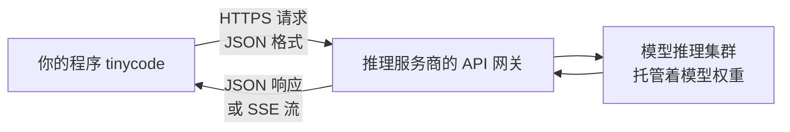

# 1.1 开发环境与第一次请求

> 本章导览：搭好最小开发环境，用原生 `fetch` 发出第一条 LLM 请求，理解 messages 数组与角色模型，并写出贯穿项目 tinycode 的第一块积木 `src/model.ts`。

一个 Coding Agent 能读代码库、改文件、跑测试，看起来充满魔法。但把任何一款 Agent 拆到底，它的核心动作只有一个：**向一个 HTTP 接口发 JSON，收 JSON（或一条流），解析，再发下一个**。Agent 开发没有任何黑魔法，这句话不是修辞，而是本书第一部分要让你亲手验证的事实。

本章做三件事：搭一个零依赖的 TypeScript 环境；用大约三十行代码发出第一条请求，把"调用大模型"彻底去神秘化；然后把这三十行代码收拢成 tinycode 项目的第一个模块 `src/model.ts`。之后的所有章节——工具调用、循环、上下文管理——都长在这个模块上。

## 环境与依赖准备

只需要两样东西：Node.js 20 以上（真实系统 ZCode CLI 用的是 Node 24），和一个能跑 TypeScript 的方式。我们用 `tsx` 直接执行 TypeScript 文件，省去编译步骤；`@types/node` 提供内置模块的类型提示。

新建项目目录 `tinycode`，写入 `package.json`：

```json
{
  "name": "tinycode",
  "type": "module",
  "scripts": {
    "hello": "tsx hello-llm.ts"
  },
  "devDependencies": {
    "tsx": "^4",
    "typescript": "^5",
    "@types/node": "^20"
  }
}
```

然后 `npm install`。整个项目只有这三个开发依赖。没有 Agent 框架、没有 SDK、没有向量库——这不是省事，而是教学决策：Agent 开发的核心难点在**机制设计**（循环怎么终止、上下文怎么管理、权限怎么收口），框架只会把这些机制藏起来。只用内置模块和原生 `fetch`，每个机制都必须亲手写出来，也就必然真正理解。

先看清楚我们要对话的东西是什么。运行你的程序时，数据是这样流动的：



模型权重在服务商的机房里，你的机器上只有 API Key。所谓"调用大模型"，就是和这个网关说一种双方约定的 JSON 方言。本章讲这种方言里最基础的两种句型：非流式和流式。

## API Key 与密钥管理

去任意一家模型服务商注册，创建一个 API Key。本书代码面向 **OpenAI 兼容 API**：请求发到 `/v1/chat/completions`，请求体和响应体遵循 OpenAI 制定的格式。这个协议已经成为事实标准——GLM、DeepSeek、Kimi 等云端模型，以及 Ollama、vLLM 等本地推理框架，都提供兼容端点。所以本书代码不锁定任何供应商，换个 `baseUrl` 就能切换到本地模型（多供应商的正式抽象见 1.3 节，本地部署见 4.4 节）。

密钥管理的底线只有一条：**Key 永远不进代码库**。把 Key 放在环境变量里，本地开发用 `.env` 文件配合 `node --env-file=.env` 加载，并把 `.env` 写进 `.gitignore`：

```bash
# .env —— 已加入 .gitignore，绝不提交
OPENAI_API_KEY=sk-xxxxxxxx
OPENAI_BASE_URL=https://api.openai.com/v1
```

真实系统把供应商端点、Key、模型选择放在配置体系里管理（见 4.4 节），但原理相同：配置与代码分离，密钥与仓库分离。

## 第一条 messages 调用

现在发第一条请求。新建 `tinycode/hello-llm.ts`：

```ts
// tinycode/hello-llm.ts —— 全书第一个程序
const apiKey = process.env.OPENAI_API_KEY;
if (!apiKey) throw new Error("请先设置 OPENAI_API_KEY");

const response = await fetch("https://api.openai.com/v1/chat/completions", {
  method: "POST",
  headers: {
    "Content-Type": "application/json",
    Authorization: `Bearer ${apiKey}`,
  },
  body: JSON.stringify({
    model: "gpt-4o-mini",
    messages: [
      { role: "system", content: "你是一个简洁的编程助手。" },
      { role: "user", content: "用一句话解释什么是递归。" },
    ],
  }),
});

if (!response.ok) {
  throw new Error(`API 返回 ${response.status}: ${await response.text()}`);
}
const data = await response.json();
console.log(data.choices[0].message.content);
```

`npm run hello`，你会看到一句关于递归的话。三十行以内，你已经完成了一件此前需要 GPU 集群才能做的事。

值得逐字理解的只有两个字段。**`messages` 是一个数组**，每个元素是一条消息，`role` 标明说话人：`system` 是幕后指令（设定身份与规则，用户"看不见"它，但模型每次都会遵守），`user` 是用户的输入，`assistant` 是模型自己说过的话。**`content` 是这条消息的正文**，本章先用纯字符串，1.2 节会扩展成更丰富的形态。

响应体的关键部分长这样：

```json
{
  "choices": [{
    "message": { "role": "assistant", "content": "递归是函数调用自己解决问题的方法。" },
    "finish_reason": "stop"
  }],
  "usage": { "prompt_tokens": 27, "completion_tokens": 15 }
}
```

`finish_reason: "stop"` 表示模型自然说完了（后面会遇到它取 `"tool_calls"` 和 `"length"` 时的不同含义）。`usage` 是计费与限额的依据：`prompt_tokens` 是输入消耗，`completion_tokens` 是输出消耗。真实系统会把这些字段归一化成统一的 `ModelUsage`（`inputTokens`/`outputTokens` 等，定义在 `packages/contracts/src/model/`），让上层不必关心各家用词差异。

多轮对话没有任何新机制：**把模型上一轮的回答作为 `assistant` 消息 push 回数组，再带着全部历史重新请求一遍**。

```ts
// 多轮对话的形态：数组只增不改，每次请求都重发全量历史
conversation.push({ role: "assistant", content: data.choices[0].message.content });
conversation.push({ role: "user", content: "换个更简单的说法" });
// 再执行一次同样的 fetch，这次 messages 里有四条
```

这暴露了 LLM API 最重要的一条工程事实：**接口是无状态的**。模型不记得你们之前聊过什么，所谓"对话"完全靠客户端每次重发历史来维持。你此刻就能预感到它的后果——对话越长，每次请求越贵、越慢，最终会撞上某个上限。这条上限就是上下文窗口，也是全书"上下文工程"主线（2.3、2.4 节）的起点。

## 够用的常识：token、上下文窗口、温度

三个词会贯穿全书，这里给出工程师视角的最小版本，1.4 节再讲机制。

**token** 是模型处理文本的最小单位，大致相当于半个到一个英文单词、或一个汉字（具体取决于分词器）。它是三件事的共同计价单位：API 计费按 token，上下文窗口按 token 数，模型生成速度按 token/秒。工程师对 token 只需建立一个直觉：**任何塞给模型的东西都要花 token，token 是稀缺资源**。

**上下文窗口（context window）** 是模型单次请求能容纳的最大 token 数，输入和输出共享这个额度。主流模型在十几万到上百万 token 的量级。超过窗口，请求会被服务端直接拒绝——这不是"效果变差"，而是硬错误。

**温度（temperature）** 控制输出的随机性：调低，模型每次倾向给出最稳妥的词，适合需要严谨格式的 Agent 场景；调高，输出更多样但更不可控。Agent 的工具参数必须是合法 JSON，所以真实系统在需要严格结构的调用里倾向低温。机制细节见 1.4 节。

## 提示工程入门：系统提示与 few-shot

`system` 消息是性价比最高的控制手段：用几十个 token 就能持续改变模型几十轮的行为。写好它只需要两条经验——**把身份、约束、规则写成明确的祈使句**，以及**示例比形容词有效**。

示例技巧有个专门的名字：few-shot（少样本提示）。做法是在 `messages` 里伪造几组 `user`/`assistant` 对话，让模型"看过示范"之后再回答真问题：

```ts
messages: [
  { role: "system", content: "把用户的描述改写成 Git commit message，只输出提交信息。" },
  { role: "user", content: "我改了登录接口的超时时间" },
  { role: "assistant", content: "fix(auth): increase login API timeout to 30s" },
  { role: "user", content: "加了缓存模块，还顺手修了个空指针" },
  // 模型会模仿上面的格式回答
]
```

对通用应用，few-shot 是提示工程的大头；但对 Coding Agent，系统提示词是一件重量级武器。看一眼真实系统：ZCode 的 stable 身份段以这样一句话开头——

> You are an interactive ZCode agent that helps users with software engineering tasks.

（`packages/core/src/context/sections/identity.ts`）它身后跟着安全声明、输出格式规范、工具使用守则等几十个段落，由 `ContextBuilder`（`packages/core/src/context/builder.ts`）按稳定度分层组装，2.3 节会拆开讲。现在只需要记住一个伏笔：**系统提示词在真实系统里不是一段话，而是一条精心排布的流水线**——这个排布方式由 1.4 节要讲的 prompt cache 决定。

## 流式响应：SSE 与逐 token 输出

非流式请求有个体验问题：模型生成二十个 token 需要几秒，用户就盯着空白终端等几秒。解法是流式：请求体加 `"stream": true`，服务端改用 **SSE（Server-Sent Events）** 把回答切碎了逐段推送，客户端收到一段就渲染一段。

SSE 的线上格式很简单：响应是 `text/event-stream` 类型，内容是若干行 `data:` 前缀的事件，每个事件是一小片 JSON，最后以一行 `data: [DONE]` 收尾。解析它的套路是"读一段、攒进缓冲区、按行切、逐行解析"，缓冲区的存在是因为网络包可能把一行 JSON 切成两半：

```ts
// tinycode/hello-stream.ts —— 流式请求：逐 token 打印
const response = await fetch("https://api.openai.com/v1/chat/completions", {
  method: "POST",
  headers: { "Content-Type": "application/json", Authorization: `Bearer ${apiKey}` },
  body: JSON.stringify({ model: "gpt-4o-mini", messages, stream: true }),
});

const reader = response.body!.getReader();
const decoder = new TextDecoder();
let buffer = "";
while (true) {
  const { done, value } = await reader.read();
  if (done) break;
  buffer += decoder.decode(value, { stream: true });
  const lines = buffer.split("\n");
  buffer = lines.pop()!;                 // 最后一段可能不完整，留给下一轮拼接
  for (const line of lines) {
    if (!line.startsWith("data:")) continue;
    const payload = line.slice(5).trim();
    if (payload === "[DONE]") break;
    const chunk = JSON.parse(payload);
    const delta = chunk.choices[0]?.delta?.content;
    if (delta) process.stdout.write(delta);
  }
}
```

注意流式响应里正文不再是 `message.content`，而是 `delta.content`——每一小片只携带**增量**，客户端自己负责拼接完整文本。"增量 + 客户端拼装"是所有流式协议的通用形状。

流式对 Agent 的意义远不止打字机效果。真实系统消费模型流时，一旦流里出现完整的工具调用就可以提前行动——只读工具甚至不等回答说完就开始执行（`packages/core/src/runtime/methods/turn-model-step.ts`）。1.3 节我们会把"流"也抽象成统一的事件序列。

> **工程细节**：真实系统对模型流还有一层 idle timeout 保护（基线 600 秒，每重试一次加 30 秒，`contracts/src/config/index.ts`），防止模型端卡死连接后客户端无限等待。教学版省略它，但写生产 Agent 时这是必备的保险丝。

## tinycode 的第一块积木：src/model.ts

裸写 `fetch` 的门槛低，但重复也多：拼 headers、处理非 200、解析响应、拼接多轮历史，每个调用点都要来一遍。现在把这些收拢成项目的第一个模块。这一版只提供非流式问答，1.2 节给它加工具调用，1.3 节把它重构成供应商无关的抽象：

```ts
// tinycode/src/model.ts —— 第一版：把"问模型一句话"收拢成一个函数
export interface ChatMessage {
  role: "system" | "user" | "assistant";
  content: string;
}

export interface ChatOptions {
  apiKey?: string;
  baseUrl?: string;   // 换成 http://localhost:11434/v1 即可使用本地模型
  model?: string;
}

export async function chat(messages: ChatMessage[], options: ChatOptions = {}): Promise<string> {
  const apiKey = options.apiKey ?? process.env.OPENAI_API_KEY ?? "";
  const baseUrl = options.baseUrl ?? "https://api.openai.com/v1";
  const model = options.model ?? "gpt-4o-mini";

  const response = await fetch(`${baseUrl}/chat/completions`, {
    method: "POST",
    headers: { "Content-Type": "application/json", Authorization: `Bearer ${apiKey}` },
    body: JSON.stringify({ model, messages }),
  });
  if (!response.ok) throw new Error(`模型 API 返回 ${response.status}`);

  const data = await response.json();
  return data.choices[0].message.content;
}
```

它小到不值一提，却是全书所有模型调用的唯一入口。第一部分结束时它会经历两次进化：学会传工具（1.2 节），学会不关心背后是哪家供应商（1.3 节）。

真实系统的对应物在 `packages/contracts/src/model/model.ts`，节选如下：

```ts
export interface Model {
  readonly providerId: ModelProviderId;
  readonly modelId: ModelId;
  readonly properties: ModelProperties;   // contextWindow 等模型元信息
  readonly optionSpecs: ModelOptionSpecs; // maxOutputTokens / reasoningLevel 的合法档位
  readonly options: ModelOptions;

  bind(options?: ModelOptions): Model;
  generateText(request: ModelRequest): Promise<ModelResult>;
  streamText(request: ModelRequest): AsyncIterable<ModelEvent>;
}
```

与我们的小函数一一对应：`generateText` 是非流式问答，`streamText` 是流式——但返回的不是字符串，而是一个**异步可迭代的事件序列**（正是 SSE 的抽象化）。`properties.contextWindow` 声明模型的窗口大小，它是 2.4 节压缩阈值的计算基础。所有业务代码只面向这个接口编程，永远不知道也不关心背后接的是哪家 API。这个接口长什么样、为什么这样设计，就是下一章之后 1.3 节的主题。

还差一块拼图：`Model` 接口本身不懂任何模型知识——不理解 token、窗口、缓存这些概念，你只能"照抄"真实系统的设计而无法判断它为什么这样设计。本章开头承诺的"够用的常识"里还欠着机制层面的债，1.4 节来还。

## 小结

本章把"调用大模型"还原成它的本来面目：一个无状态的 HTTP 接口。`messages` 数组是唯一的记忆载体，接口不记得任何事，历史全靠客户端重发；流式只是把一次大响应切成增量小片段；token 是计算、计费、窗口三件事的共同单位。tinycode 有了第一个模块 `src/model.ts`，真实系统的对应抽象是 contracts 层的 `Model` 接口。

但现在的模型只会"说话"。下一个问题立刻出现：模型怎么改文件、跑命令？它自己做不到——下一章讲 function calling，让模型从"回答问题"升级为"请求你的程序代为行动"。
