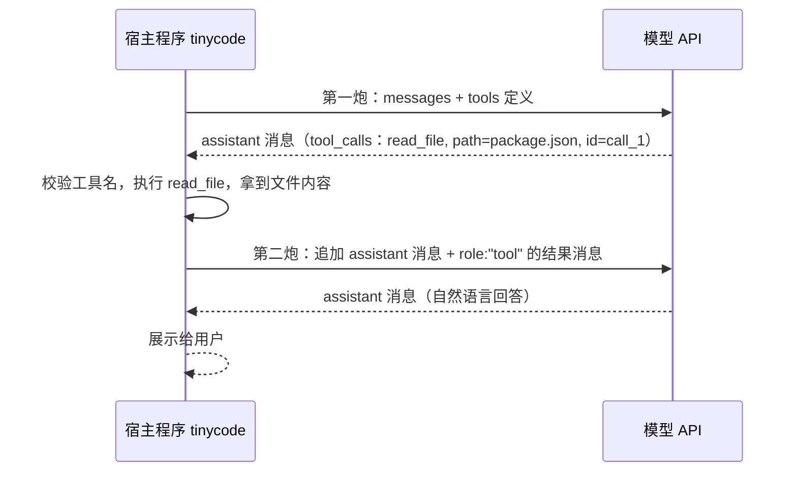

# 1.2 让 LLM 调用工具

> 本章导览：理解 function calling 的完整机制——模型如何"请求"调用工具、宿主如何执行并把结果回灌、调用 id 如何配对——并完成 tinycode 的单次工具调用往返。

上一章的模型只会聊天。你问它"package.json 里有哪些依赖"，它能背出依赖文件的常见格式，却看不到你磁盘上的那个文件；你让它"把函数名改成驼峰"，它只能给你一段代码文本，改文件的动作还是要你亲手完成。Coding Agent 与聊天机器人的分水岭就在这里：**模型必须能触发真实世界的动作**。

而模型自己做不到任何动作——它只是一个文本进文本出的函数。解法不是赋予模型能力，而是给模型一个**请求通道**：模型说"我想调用 read_file，参数是 path=package.json"，执行永远发生在宿主程序里。这个机制叫 function calling（函数调用），它是全部 Agent 行为的原子操作：2.1 节的 Agent Loop 不过是把本章的单次往返变成循环。

## 什么是 function calling

先建立正确的心智模型：**模型是决策者，不是执行者**。调用工具时模型输出的不是自然语言，而是一段结构化的"调用意向"——工具名加 JSON 参数。它不执行任何东西，也不会产生任何副作用；读文件、发请求、跑命令，全部发生在你的代码里。

这个认识直接决定了 Agent 的安全架构：既然一切副作用都发生在宿主程序里，那么权限检查（5.3 节）、沙箱（5.3 节）、参数校验都可以在模型"说"和宿主"做"之间插一道闸。模型越界最多是"说了不该说的"，执行权始终在你手上。

一次工具调用涉及两轮模型请求，先看全景：



注意"第一炮"和"第二炮"：模型要求调用工具的那次请求，并没有得到面向用户的回答；工具结果回灌之后的第二次请求，才产出真正的回答。这是初学者最容易懵的地方——**一次工具调用 = 两次模型请求**。

## 用 JSON Schema 定义工具

模型怎么知道有哪些工具可调？你在请求里附带一份 `tools` 清单。每一项用 **JSON Schema** 描述：叫什么、干什么用、参数长什么样。

```ts
// tinycode/src/types.ts —— 消息与工具的统一类型
export type Role = "system" | "user" | "assistant" | "tool";

export interface ToolCall {
  id: string;        // 模型生成的配对凭证，见下文
  name: string;
  input: unknown;    // JSON 对象，形状由工具的 inputSchema 约定
}

export interface Message {
  role: Role;
  content: string;
  toolCalls?: ToolCall[];  // assistant 消息携带：模型发起的工具调用
  toolCallId?: string;     // tool 消息携带：本条结果回应哪一次调用
  toolName?: string;
  isError?: boolean;       // 工具执行出错时置 true，错误同样要回灌
}
```

```ts
// tinycode/src/tools/read.ts 的雏形：一个工具 = 声明 + 执行
export interface Tool {
  name: string;
  description: string;
  inputSchema: {
    type: "object";
    properties: Record<string, unknown>;
    required?: string[];
  };
  execute: (input: unknown) => Promise<string>;
}

export const readTool: Tool = {
  name: "read_file",
  description: "读取工作区内一个 UTF-8 文本文件的完整内容。路径相对工作区根目录。",
  inputSchema: {
    type: "object",
    properties: {
      path: { type: "string", description: "相对工作区根的文件路径，如 src/model.ts" },
    },
    required: ["path"],
  },
  execute: async (input) => {
    const { path } = input as { path: string };
    return await readFile(join(workspaceRoot, path), "utf8");
  },
};
```

`description` 和参数的 `description` 不是给人看的注释，而是**给模型看的 API 文档**——模型全凭这些文字决定什么时候调用这个工具、参数怎么填。写得含糊，模型就会编造参数；写清楚"路径相对工作区根"，就能少一半传参错误。给工具起名也一样：`read_file` 比 `tool_1` 好得多，因为模型靠名字联想用途。

> **工程细节**：真实系统的工具契约 `ModelToolContract`（`packages/contracts/src/model/`）除了 `name`/`description`/`inputSchema`，还携带一整组执行元数据：`readOnly`（是否只读）、`destructive`（是否破坏性）、`needsApproval`（是否需要审批）、`concurrentSafe`（能否并行）、`timeoutMs`、`resultBudget` 等。这些字段不参与模型的调用决策，而是给宿主的调度器与权限系统用的——声明与执行关切分家，是工具系统的通用设计。

## 模型返回了什么：tool_calls 与调用 id

请求时把工具清单换算成 API 的 `tools` 参数一并发出。扩展 `tinycode/src/model.ts`：

```ts
// tinycode/src/model.ts —— 增加工具参数与 tool_calls 解析
export async function chatWithTools(
  messages: Message[], tools: Tool[], options: ChatOptions = {},
) {
  const response = await fetch(`${baseUrl(options)}/chat/completions`, {
    method: "POST",
    headers: { "Content-Type": "application/json", Authorization: `Bearer ${apiKey(options)}` },
    body: JSON.stringify({
      model: modelName(options),
      messages,
      tools: tools.map((t) => ({
        type: "function",
        function: { name: t.name, description: t.description, parameters: t.inputSchema },
      })),
    }),
  });
  const data = await response.json();
  const raw = data.choices[0].message;
  return {
    text: raw.content ?? "",
    toolCalls: (raw.tool_calls ?? []).map((c) => ({
      id: c.id,
      name: c.function.name,
      input: JSON.parse(c.function.arguments || "{}"),
    })),
  };
}
```

当模型决定调用工具时，返回的 assistant 消息里 `content` 可能为空，取而代之的是一个 `tool_calls` 数组。三个字段值得注意：

- **`id`**：模型为这次调用生成的唯一凭证，形如 `call_abc123`。它是配对的关键，下一节展开。
- **`arguments` 是字符串而不是对象**：协议把参数序列化成 JSON 字符串传输，你要自己 `JSON.parse`。这也解释了为什么模型偶尔会产出解析失败的参数——生成过程是逐 token 的，没有任何机制保证它是合法 JSON。
- **数组可能有多项**：模型可以在一轮里同时要求调用多个工具（比如同时读三个文件），为并行执行埋下伏笔（见 2.1 节）。

## 执行工具并回灌结果

拿到 `tool_calls` 后，宿主接管：找到对应工具、执行、把结果包装成 `role: "tool"` 的消息追加进历史，然后**再请求一次**。这是本章的核心代码——tinycode 的单次工具调用完整往返：

```ts
// tinycode/run-tool-once.ts —— 单次工具调用的完整往返
const tools = [readTool];
const messages: Message[] = [
  { role: "system", content: "你是编码助手，需要读文件时调用 read_file 工具。" },
  { role: "user", content: "看看 package.json 里声明了哪些依赖？" },
];

const first = await chatWithTools(messages, tools);
// 关键一步：先把 assistant 的调用意向原样写回历史
messages.push({ role: "assistant", content: first.text, toolCalls: first.toolCalls });

for (const call of first.toolCalls) {
  const tool = tools.find((t) => t.name === call.name);
  try {
    if (!tool) throw new Error(`未知的工具：${call.name}`);
    const result = await tool.execute(call.input);
    messages.push({ role: "tool", toolCallId: call.id, toolName: call.name, content: result });
  } catch (error) {
    messages.push({
      role: "tool", toolCallId: call.id, toolName: call.name,
      content: `工具执行失败：${String(error)}`, isError: true,
    });
  }
}

const second = await chatWithTools(messages, tools);
console.log(second.text);   // "项目声明了 3 个开发依赖：tsx、typescript……"
```

三个设计点，每一个都是 Agent 开发的通用规矩：

**第一，assistant 消息必须先写回历史。** 你要把模型"要求调用工具"的那条消息原样追加进 `messages`，然后才是 tool 结果。API 会在服务端校验配对：每条 `role: "tool"` 消息的 `toolCallId` 必须能向前找到一条携带同 id 的 `tool_calls` 的 assistant 消息；配对断裂，下一次请求直接 400。

> **踩坑**：这是所有 Coding Agent 作者都会踩的坑——中途丢弃或重排 assistant 的 tool_calls，下一轮请求就会收到配对错误。真实系统把它上升为架构不变量：assistant 先落盘、工具结果成对回灌，保证历史里 tool result 永远有配对的 tool_use（`packages/core/src/runtime/methods/turn-model-step.ts` 中"先写 assistant 再执行工具"的注释即为此）。会话冷恢复时，对被中断的工具还要合成一条结果消息补齐配对，否则恢复后的第一轮请求就失败。

**第二，`id` 配对的意义在多工具场景下才完全显现。** 一轮里若有三个 tool_calls，历史里就要有三条 tool 消息，各自用 `toolCallId` 指明"我是哪次调用的结果"。没有 id，模型无法把"文件 A 的内容"对应到它发起的第一次调用。

**第三，错误不是异常，而是数据。** 文件不存在、参数不合法、工具执行抛错——都包装成 `isError: true` 的 tool 消息回灌，而不是让程序崩溃。模型看到错误后可以换一条路走：改个路径重读、向用户澄清、或承认做不到。**把失败交给模型处置**，是 Agent 比脚本健壮的根本原因。

### 源码对照：统一工具调用形态

不同供应商的线上格式并不相同：OpenAI 系把调用放在 assistant 消息的 `tool_calls` 数组，Anthropic 把它表示为消息里的 `tool_use` 内容块。真实系统在 contracts 层定义了统一形态，把差异消化在适配层（`packages/contracts/src/model/index.ts`）：

```ts
export interface ModelToolCall {
  id: string;
  name: string;
  input: unknown;
  providerExecuted?: boolean;   // 由服务端执行的工具（如网络搜索）标记
}

export interface ModelInputMessage {
  role: ModelMessageRole;              // "system" | "user" | "assistant" | "tool"
  content: ModelMessageContent;
  toolCalls?: ModelToolCall[];         // assistant 上的调用声明
  toolCallId?: string;                 // tool 消息的配对 id
  toolName?: string;
  isError?: boolean;                   // 错误结果标记，语义与教学版一致
  // ... cacheControl / providerId / modelId 略
}
```

对比我们自己写的 `Message` 与 `ToolCall`：字段几乎一一对应。这不是巧合——tinycode 的类型就是照着"provider-neutral（供应商中立）"的目标设计的，1.3 节重构时会直接复用。Anthropic `tool_use` 块与 OpenAI `tool_calls` 的格式差异，真实系统交给 Vercel AI SDK 适配层消化（`packages/adapters/src/model/transform.ts`），业务代码自始至终只见统一形态。

## 结构化输出与 JSON 模式

工具调用其实是一种特殊的结构化输出：模型把"答案"填进你预设的参数模式里。如果想要的不是调用动作、而是**最终回答本身**遵循固定结构（比如让模型输出 `{"title": "...", "tags": [...]}` 以便程序直接解析），可以用 JSON 模式：请求里声明 `response_format`，强制模型输出合法 JSON，并可用 `json_schema` 进一步约束结构。

它与工具调用的分工是：**工具调用约束"过程中的动作"，JSON 模式约束"最终交付物"**。真实系统的 `ModelRequest` 里就有一个 `responseJsonSchema` 字段（`packages/contracts/src/model/model.ts`），供需要固定输出结构的调用使用；会话标题生成、压缩摘要这类"输出要被程序继续处理"的辅助调用（见 1.3 节）是它的典型用户。教学版暂不实现，知道这个通道存在即可。

## 从单次调用到多次调用的衔接

把 `run-tool-once.ts` 的往返再推演一步：第二次请求的响应里，模型可能**又**返回 tool_calls——比如读完 package.json 后它想再读一个源文件确认依赖用法。你只需把上面的执行与回灌逻辑再跑一遍。会循环几次？无法预知，取决于任务。那就别预知——写成 `while` 循环，直到模型某次响应不再携带 tool_calls 为止：

```ts
// 从"单次往返"到"循环"只有一步之遥（伪代码，2.1 节正式实现）
while (true) {
  const response = await chatWithTools(messages, tools);
  if (response.toolCalls.length === 0) return response.text;  // 模型交出最终回答
  // ……执行工具、回灌结果（同 run-tool-once.ts），进入下一轮
}
```

这十行就是 Agent Loop 的全部骨架。真实系统里确实存在一个约六十行的极简对照版——记忆提取子代理的循环 `packages/core/src/memory/memory-agent-loop.ts`：for 循环里请求模型，无 toolCalls 则 break，否则执行工具、回灌、再来一轮。生产级主循环（2.1 节）在此基础上补上终止条件、并发调度、权限、压缩这些"让人能睡安稳觉"的部分。

还剩两个尾巴留到后面处理。其一，本节的工具执行是串行 `for` 循环，而真实系统会根据工具的并发安全性把独立调用并行执行（2.1 节）。其二，我们假定了"未知工具名、非法参数"靠 `execute` 抛错兜底，真实系统在执行前就校验调用合法性，把校验失败也变成一条正常的错误结果回灌——原则不变：**一切失败都化作模型可读的数据**。

## 小结

Function calling 把模型从"回答者"变成"指挥你的程序干活的决策者"：请求时附带 JSON Schema 工具清单，模型返回带 id 的 tool_calls，宿主执行后以 `role: "tool"` 回灌结果、再请求一次得到面向用户的回答；assistant 意向先入历史、结果凭 id 成对配对、错误化作数据回灌，这三条是跨供应商通用的铁律。tinycode 完成了单次工具调用往返，距离 Agent Loop 只差一个 while。

不过此时的代码把 OpenAI 协议的 URL、字段名、格式焊死在了 `src/model.ts` 里。下一章把"调模型"抽象成供应商无关的接口，让同一套循环代码跑在任何模型上。
