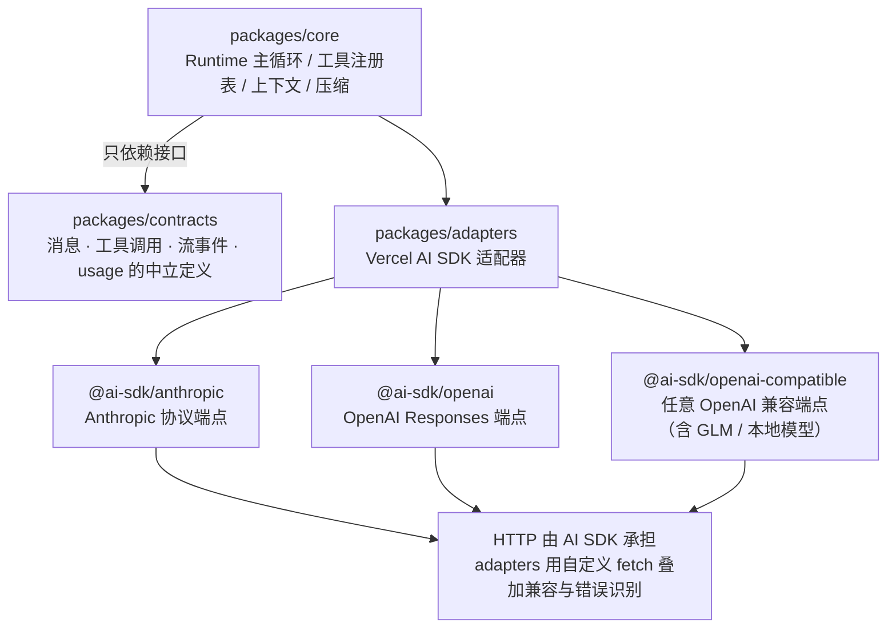

# 1.3 模型供应商抽象（Model Provider）

> 本章导览：把"调某个 LLM"重构成供应商无关的 Model 接口，统一流事件语言，并处理两件生产绕不开的事：重试与重试边界。

前两章的 tinycode 已经能完成单次工具调用往返，但 `src/model.ts` 里写死了三样东西：OpenAI 的 URL 路径、`choices[0].message` 这样的响应字段名、以及出错就抛异常的天真策略。今天用 GLM，明天想试 DeepSeek，后天公司要求接内网私有化模型——每换一家，解析代码就要重写一遍。更要命的是 2.1 节的循环：它不可能为每家供应商写一个版本。

解法是所有成熟系统的共同选择：在业务逻辑与 HTTP 细节之间插一层稳定接口。业务只面向接口编程，每接一家新供应商就实现一次接口。这一层，真实系统叫 **adapters**，教学版叫 Provider 抽象。

## 为什么需要抽象

动机有三个，重要性递增：

**多供应商切换。** 不同模型各有所长、价格差异巨大，Agent 应该让用户按任务选模型。**本地部署。** 内网代码不出域是企业场景的硬约束，Ollama、vLLM 都暴露 OpenAI 兼容端点，抽象层要能一视同仁地接入。**可测试。** 评测 Agent 时需要一个"假模型"按脚本吐出固定的文本和工具调用（见 6.2 节）——只有业务不直接碰 HTTP，假模型才插得进去。

先看真实系统的全景分层（路径相对 `apps/zcode-cli/`）：



两条设计决策值得留意。其一，`packages/contracts/` 这个包里没有任何实现，只有类型定义——它是三层之间"宪法"，谁都不许绕过它直接摸另一层的内部结构。其二，真实系统**不裸写 fetch**：HTTP 传输、重试、流解析这些脏活交给 Vercel AI SDK，adapters 只做协议翻译与加固。教学版反其道而行之，亲手写一遍这些脏活——写过才知道 AI SDK 替你扛了什么。

## Provider 接口设计

教学版把 1.1 的 `chat()` 升级成接口。目标形状直接借鉴真实系统 contracts 层的 `Model`（见 1.1 节的摘录），但因为还没有引入流事件，先给出不含 `streamText` 的讨论版，稍后补全：

```ts
// tinycode/src/model.ts —— 第二版：供应商无关的 Model 接口
export interface ModelOptions {
  maxOutputTokens?: number;
  temperature?: number;
}

export interface ModelRequest {
  messages: Message[];        // 复用 1.2 的统一消息类型
  tools?: Tool[];
  options?: ModelOptions;
  abortSignal?: AbortSignal;  // 用户按 Stop 时中断请求
}

export interface TokenUsage {
  inputTokens?: number;
  outputTokens?: number;
}

export interface ModelResult {
  text: string;
  toolCalls: ToolCall[];
  usage?: TokenUsage;
}

export interface Model {
  readonly providerId: string;   // "openai-compatible" / "anthropic" / …
  readonly modelId: string;      // 具体模型名
  readonly contextWindow: number; // 窗口大小，2.4 节压缩阈值靠它计算
  generateText(request: ModelRequest): Promise<ModelResult>;
}
```

接口形状有一条重要原则：**按业务需要的形状定义，而不是按任何一家供应商的线上格式定义**。`ModelRequest.messages` 用的是我们自己的 `Message` 类型（1.2 节），不是 OpenAI 的格式也不是 Anthropic 的格式；`ModelResult.toolCalls` 用的是统一的 `ToolCall`。供应商差异被关在实现体内部。contracts 包的注释里写着同样的意图——"provider-neutral"不是口号，是这条设计原则的名字。

然后是第一个实现。工厂函数把"哪家供应商、什么模型"作为配置收进来，产出实现了 `Model` 的对象：

```ts
// tinycode/src/model.ts —— OpenAI 兼容实现（非流式部分）
export function createOpenAICompatibleModel(config: {
  baseUrl: string; apiKey: string; modelId: string; contextWindow: number;
}): Model {
  async function post(body: Record<string, unknown>) {
    const response = await fetch(`${config.baseUrl}/chat/completions`, {
      method: "POST",
      headers: { "Content-Type": "application/json", Authorization: `Bearer ${config.apiKey}` },
      body: JSON.stringify(body),
    });
    if (!response.ok) throw new Error(`模型 API 返回 ${response.status}`);
    return await response.json();
  }

  return {
    providerId: "openai-compatible",
    modelId: config.modelId,
    contextWindow: config.contextWindow,
    async generateText(request) {
      const data = await post({
        model: config.modelId,
        messages: request.messages,
        tools: request.tools?.map(toOpenAITool),
        ...request.options,
      });
      const raw = data.choices[0].message;
      return {
        text: raw.content ?? "",
        toolCalls: (raw.tool_calls ?? []).map(fromOpenAIToolCall),
        usage: toUsage(data.usage),
      };
    },
  };
}
```

`toOpenAITool` / `fromOpenAIToolCall` / `toUsage` 是几行字段映射，1.2 节已见过原形，此处从略。用法变成：

```ts
const model = createOpenAICompatibleModel({
  baseUrl: "https://api.openai.com/v1",
  apiKey: process.env.OPENAI_API_KEY!,
  modelId: "gpt-4o-mini",
  contextWindow: 128_000,
});
// 换供应商 = 换这几行配置，循环代码一字不改
```

真实系统里这个"接口 + 多实现"的等价物是：contracts 的 `Model` 接口（1.1 节摘录过）加上 `packages/adapters/src/model/runner.ts` 的 `AiSdkModelAdapter.createModel()`——它根据供应商配置里的协议类型（`anthropic-messages` / `openai-responses` / `openai-chat-completions`）选择对应的 AI SDK 适配器，产出统一的 `Model` 对象。接口放 contracts、实现放 adapters、消费方是 core，三层各司其职。

## 统一 messages / tools / 返回：流事件归一化

供应商差异不止在请求格式，更麻烦的在**流**。上一章我们解析过 OpenAI 的 SSE：一行行 `data:` JSON、`delta.content` 携带增量。Anthropic 的流完全是另一套词汇：事件叫 `content_block_delta`、`message_stop`，分块的粒度和字段名都对不上。如果业务代码直接消费这些原始事件，抽象就白做了。

所以抽象层必须做**流事件归一化**：定义一套自己的事件语言，各实现的职责是把供应商的原始流翻译成它。真实系统 contracts 层的事件清单相当完整：`start`、`text_start/text_delta/text_end`、`reasoning_start/delta/end`、`tool_input_start/delta/end`、`tool_call`、`finish`、`error`。教学版取最小可用集——五个事件就够撑起全部后续章节：

```ts
// tinycode/src/model.ts —— 统一流事件（归一化后的语言）
export type ModelEvent =
  | { type: "text_delta"; text: string }                       // 正文增量
  | { type: "tool_call"; toolCall: ToolCall }                  // 一段完整的工具调用
  | { type: "finish"; finishReason: string; usage?: TokenUsage }
  | { type: "error"; error: unknown };

export interface Model {
  // ……同前，补上流式能力：
  streamText(request: ModelRequest): AsyncIterable<ModelEvent>;
}
```

实现侧就是把 1.1 的 SSE 解析器搬进 `streamText`，把 OpenAI 的 chunk 翻译成统一事件：`delta.content` 有值就 `yield { type: "text_delta", text }`；流结束时 `yield { type: "finish", ... }`；工具调用的增量字段在缓冲区里攒到完整后 `yield { type: "tool_call", ... }`。翻译逻辑写在适配器里，一次写完，所有上层代码受益。

业务侧消费这个流，就是一个 `switch`：

```ts
// tinycode 的调用方：消费统一事件流
for await (const event of model.streamText(request)) {
  switch (event.type) {
    case "text_delta":
      process.stdout.write(event.text);
      break;
    case "tool_call":
      console.log(`\n[调用工具] ${event.toolCall.name}`);
      break;
    case "finish":
      console.log(`\n[完成] ${event.finishReason}`);
      break;
    case "error":
      throw event.error;
  }
}
```

这段 `switch` 的形状，与真实系统主循环里消费流的代码（`packages/core/src/runtime/methods/model.ts`）几乎一致——那边多处理 reasoning 与 tool input 增量两类事件而已。归一化的收益在此刻兑现：**上层的循环、UI、持久化只需要认识一种事件语言**。

> **工程细节**：真实系统还归一化 `tool_input_delta`（工具参数的逐字符增量），并在消费侧做了增量缓冲：参数文本攒到换行或满 4096 字符才 flush 到 UI（`packages/core/src/runtime/methods/model.ts`）。高频小增量若直接逐条渲染，TUI 的重绘开销会压垮终端。usage 字段同样需要归一化：各家的 token 统计叫法不一，adapters 的 `normalizeUsage`（`packages/adapters/src/model/runner-normalization.ts`）把它们折算成统一的 `ModelUsage`。

## 重试与指数退避

天真实现的另一个隐患是失败处理。模型 API 是横跨公网的远程调用，429（限流）、5xx（服务端抖动）、连接重置都是家常便饭。这些错误**重试就能过**；而 400（参数错）、401（Key 错）重试一万次也没用，只会火上浇油。所以重试策略的第一条是**只重试值得重试的错误**。

第二条是**指数退避（exponential backoff）**：立刻重试只会撞上限流的枪口，要等一等再试，而且越挫越勇地等得更久。第三条是**抖动（jitter）**：如果一万台机器同时收到 429 又同时等 2 秒后重试，限流会立刻再次触发——每次等待时间加一个随机量，把重试的洪峰打散。

```ts
// tinycode/src/model.ts —— 指数退避 + 抖动重试
export async function fetchWithRetry(
  url: string, init: RequestInit, maxRetries = 5,
): Promise<Response> {
  let delay = 2_000;                       // 起步 2 秒，与真实系统相同
  for (let attempt = 0; ; attempt++) {
    const response = await fetch(url, init);
    const retryable = response.status === 429 || response.status >= 500;
    if (response.ok || !retryable || attempt >= maxRetries) return response;
    const jitter = delay * (0.5 + Math.random());   // 0.5x ~ 1.5x 的随机抖动
    console.warn(`第 ${attempt + 1} 次失败（${response.status}），${Math.round(jitter / 1000)}s 后重试`);
    await new Promise((resolve) => setTimeout(resolve, jitter));
    delay = Math.min(delay * 2, 60_000);            // 每次翻倍，封顶 60 秒
  }
}
```

真实系统的参数（`packages/adapters/src/model/retry-policy.ts`）值得整段抄下来当默认值：

```ts
const DEFAULT_MAX_RETRIES = 10;
const DEFAULT_RETRY_BASE_DELAY_MS = 2_000;
const DEFAULT_RETRY_BACKOFF_FACTOR = 2;
const DEFAULT_RETRY_MAX_DELAY_MS = 60_000;
const DEFAULT_RETRY_OPTIONS: ResolvedAiSdkModelRetryOptions = {
  backoffFactor: DEFAULT_RETRY_BACKOFF_FACTOR,
  baseDelayMs: DEFAULT_RETRY_BASE_DELAY_MS,
  jitter: true,
  // maxAttempts includes the first request; env/config names expose retry count.
  maxAttempts: DEFAULT_MAX_RETRIES + 1,
  maxDelayMs: DEFAULT_RETRY_MAX_DELAY_MS,
};
```

10 次重试、起步 2 秒、每次乘 2、封顶 60 秒、带抖动——合计最长要在重试上耗几分钟。为什么敢等这么久？因为对长任务的 Agent 而言，放弃一次进行到一半的回合代价远大于等待；而且这组参数全部支持用环境变量覆盖（`ZCODE_MODEL_RETRY_MAX_RETRIES` 等），不同部署环境可以按需收紧放宽。

### 重试边界：什么时候不能重试

指数退避有一条看不见的边界，理解它需要回到流式：假设模型已经吐出了两千个 token 的回答，用户屏幕上白纸黑字，这时连接断了。**此刻绝不能简单地从头重发请求**——重放会把这两千个 token 再写一遍，UI 上出现重复内容；如果已出现的工具调用被重复提交，历史里还会产生配对混乱。

真实系统的规矩是（`packages/adapters/src/model/runner-stream.ts`）：**首个真实流事件到达之前，适配器可以自由重试；一旦有任何可见输出提交，适配器层面永不重试**。那断了怎么办？交给 core 层的"断流恢复"（stream recovery，`packages/core/src/runtime/methods/streaming-recovery.ts`，重试预算 `STREAM_RECOVERY_MAX_RETRIES = 10`）：它以已落盘的 assistant 内容为锚点，把已经接受的工具调用连同其结果一并提交，从锚点重建请求续写。换言之，**不同阶段的重试由不同层负责**：无可见输出时 adapter 静默重试，有可见输出后 core 从锚点恢复，上下文真超窗了还有 reactive compact 兜底重试（见 2.4 节），输出被截断则触发续写（`finishReason` 为 `length` 时最多续写 3 次）。这套分层重试是 Agent 鲁棒性的主干，6.3 节会汇总复盘。

> **注**：教学版不实现 stream recovery，但要建立判断力——"重试"从来不是一个开关，而是"哪些错误、哪一层、从什么状态重试"的三连决策。

## 进阶用法：辅助调用与多模型（见 4.4）

抽象层还有一个容易被忽视的受益者：**主循环之外的模型调用**。除了主循环，一个成熟的 Agent 还有一堆辅助活儿——压缩时生成对话摘要（2.4 节）、会话起标题、轮次结束后提取项目记忆（2.3 节）、目标校验。这些任务用最强推理档去跑纯属烧钱，真实系统为它们准备了一组统一的降配选项（`packages/core/src/model/auxiliary-model-options.ts`，完整摘录）：

```ts
const AUXILIARY_MAX_OUTPUT_TOKENS = 5_000;

export function auxiliaryModelOptions(model: Model): Required<ModelOptions> {
  return {
    reasoningLevel: model.optionSpecs.reasoningLevel.values[0]!,   // 最低档
    maxOutputTokens: Math.min(AUXILIARY_MAX_OUTPUT_TOKENS, model.optionSpecs.maxOutputTokens.max),
  };
}
```

推理压到模型支持的最低档、输出预算封顶 5000 token——辅助调用不需要聪明，只需要便宜且够用。contracts 的 `Model.bind(options)` 方法正是为这种"固定一组选项的派生模型"准备的。这个模式值得记进你的工具箱：**凡是主循环之外的模型调用，都该走一份独立的、更便宜的选项预设**。

至于多供应商的完整接入方案——模型目录、供应商配置、密钥管理、本地端点——留在 4.4 节展开，本章的抽象已经为它铺平了道路。

## 小结

本章把"调模型"从一段焊死的 fetch 代码升级为三层结构：contracts 定义中立的消息、工具调用与流事件类型；Provider 实现负责协议翻译（OpenAI 的 chunk → 统一的 `text_delta`/`tool_call`/`finish`/`error`）；业务只面向接口编程。失败处理同样分层：指数退避加抖动对付瞬时错误（真实参数：10 次重试、起步 2s、×2、封顶 60s），而"有可见输出后不得盲目重试"的边界把重试责任推向更高层的断流恢复。辅助调用统一走低配预设控制成本。

至此"调用模型"的工程问题全部解决，但有一层窗户纸还没捅破：模型到底是什么？token 如何切分、窗口为何是硬上限、prompt cache 为什么决定了系统提示词的排布方式？下一章补齐这块原理拼图——它会让第二部分的每个设计从"规定"变成"必然"。
