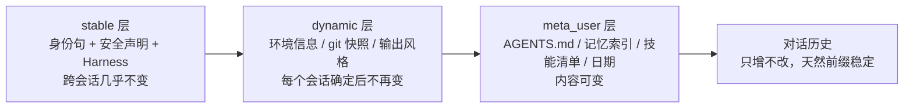

# 1.4 LLM 背后的原理

> 本章导览：全书唯一一章原理课——token、注意力、上下文窗口、采样、推理模型与 prompt cache，只讲对工程决策有用的部分，本章不写 tinycode 代码。

前三章你已经能熟练调用模型，甚至能让它调用工具。

但你一直是把模型当黑盒在用：知道接口怎么调，不知道盒子里面是什么。本章捅破这层窗户纸。

放心，这里没有数学，也不讲训练细节——只回答五个工程问题：

1. 模型看到的文本长什么样？
2. 它为什么是概率性的？
3. 上下文窗口为什么是硬约束？
4. 推理模型多了什么？
5. prompt cache 如何暗中决定了系统提示词的排布方式？

每个问题都对应后面章节的一个设计决策。读完本章，2.3 节的上下文工程和 2.4 节的压缩就不再是"要遵守的规定"，而是原理推出来的必然。

## Token 与 Transformer：模型如何读入你的代码

模型不认识字符，也不认识单词。

文本进入模型前，先被**分词器（tokenizer）**切成 **token**。最常见的分词算法 BPE 的思路是：从统计上把高频的字符组合凝固成词表条目。于是"international"可能是一个 token，"Str"可能被切成"St"+"r"，中文常用词往往一个词一个 token，生僻字则碎成几片。

切分结果完全取决于模型自家的词表——同一段文字在不同模型里的 token 数可以差出不少。

对写代码的人，这有两个直接后果。

其一，**计费、限速、窗口全部按 token 计量**。而 token 与字符数的换算只能粗估（英文大约每 4 个字符一个 token），所以 2.4 节会看到真实系统用"provider 返回的精确计数做基线 + 本地估算补增量"的混合方案。

其二，模型对字符级操作的笨拙有了物理解释。数一个单词里有几个 r、把字符串反转——这些任务的输入在模型眼里是 token 序列而不是字符序列。难度相当于让你数"某一页书里出现了几次某个部首"。

还有一条隐蔽的工程后果：**token 是按"每次请求的全部内容"计费的**。系统提示词、AGENTS.md、几十个工具的 JSON Schema 定义——这些每一轮都原样重发的"固定开销"，都要花 token。工具装得越多、提示词写得越长，每个回合的地板价就越高。第四部分讲按需加载扩展机制时，会回到这笔账。

切好的 token 进入 **Transformer** 架构——今天所有主流大模型的底座。

它的关键机制叫**注意力（attention）**：处理每个 token 时，模型会"回看"序列中它之前的所有 token，并根据相关性分配不同的权重。看到"它"时，注意力会落到前文指代的那个名词上。

整个输入序列在前向计算中**一次看全**，模型内部没有任何跨请求的状态。

这引出一条前三章反复出现的事实的深层原因：**API 无状态，不是因为服务商偷懒，而是因为 Transformer 的推理过程本来就没有"记忆"这回事**——每一次请求都是对当前 token 序列的一次独立计算。

"上下文"这个词因此有了精确含义：

> **模型知道的一切 = 本次请求里你发给它的一切。**

要它记得，就把内容放进上下文；上下文放不下，就要想办法腾（2.3、2.4 节的全部主题）。

## 预训练 / SFT / RLHF：模型为什么是概率性的

今天的模型都经历三个训练阶段。理解它们各自贡献了什么，有助于判断模型的哪些行为可期、哪些要防。

**预训练（pretraining）**：在数万亿 token 的语料上做一件事——预测下一个 token。模型由此学到语言、事实和大量代码模式。但此时的它只会"续写"，你问"1+1="，它可能续写"2+2="。

**监督微调（SFT，supervised fine-tuning）**：用人工标注的"指令 → 高质量回答"样本继续训练，模型才学会"被提问时该好好回答"。

**基于人类反馈的强化学习（RLHF，reinforcement learning from human feedback）**：让人类对多个回答排偏好顺序，模型据此调整，输出更有用、更少有害内容。

这条流水线解释了模型的几个工程性质。逐个看。

第一，**输出是采样的结果**。

模型每一步给出的不是"那个词"，而是所有候选 token 的概率分布，程序从这个分布里抽一个。`temperature` 参数控制抽取的随机程度：

- 低温：分布被"削尖"，几乎总是抽中最优候选，输出稳定、接近可复现。
- 高温：分布被"拉平"，低概率候选也有机会中选，输出更多样、更不可控。

Agent 场景的默认倾向是低温。工具参数必须合法、指令必须被严格遵守，"创意"在这里是负资产。

> **注**：即便把 temperature 设为 0，多数服务商也不承诺逐字节可复现——推理服务底层的并行与批处理会引入轻微的非确定性。评测 Agent 时要靠多次运行取统计，而不是指望单次复现（见 6.2 节）。

第二，**幻觉（hallucination）是训练目标的副产品**。

模型天然倾向生成"概率上顺滑"的续写。当知识不足时，它会自信地编一个出来，而不是说不知道。

这就是为什么 Agent 要用工具去"查证"——读文件、跑 grep——而不是靠模型背。第三部分的工具章都建立在这一点上。

第三，**系统提示词有效**。

SFT 教会了模型"扮演 system 消息设定的角色并遵守其中的指令"，1.1 节的提示工程才立得住。

## 上下文窗口与位置编码：为什么窗口是硬约束

**上下文窗口（context window）** 是模型单次请求能处理的最大 token 数。

注意一个容易忽略的事实：**输入与输出共享这个额度**。输出预留越多，留给历史的就越少。

窗口大小的物理来源与**位置编码（position encoding）**有关。注意力机制本身不知道 token 的先后顺序，需要额外注入位置信息；现代模型普遍用 RoPE（旋转位置编码）。位置编码的设计决定了模型能外推到多长的序列——窗口就是训练时定下的、模型稳定工作的序列长度上限。

窗口大小是模型的固有属性，因此它出现在 1.3 节 `Model` 接口的 `properties.contextWindow` 里——业务代码在发请求之前就能读到它，并据此做预算，而不是等超窗报错再补救。

说它是**硬约束**，是因为超窗不是"效果变差"，而是服务端直接拒绝请求。

一个 200K token 的窗口，在 Coding Agent 的真实工作里远比想象中容易满：一个包含大文件内容的工具结果动辄数千 token，几十轮工具调用下来，历史轻松逼近上限。

真实系统因此把窗口当成一个共享的池子精打细算。计算单步输出上限时用这条公式（`packages/core/src/runtime/methods/model-token-limits.ts`）：

```text
maxOutputTokens = min(模型声明上限, contextWindow − 估算输入 − 1000)
```

留出 1000 token 的安全垫，防止输出把输入挤出局。

窗口管理是 Coding Agent 与聊天机器人的分水岭，也是第二部分的主线。这里先立三块路标：

- **窗口按"每次请求"计，会话可以远长于窗口**——前提是每次请求前管理好历史（2.3 节）。
- **历史逼近上限前必须主动摘要压缩**——真实系统在 200K 窗口的模型上把自动压缩线画在 166K token（窗口减输出预留再减安全缓冲），机制见 2.4 节。
- **注意力对长上下文的利用并不均匀**——工程界普遍观察到，夹在超长上下文中部的内容，模型利用率明显低于开头和结尾（所谓 lost in the middle）。

第三条路标解释了后面很多排布决定：身份与约束放最前，最紧迫的提醒贴着最近的消息放。

## 推理模型与 reasoning tokens

有一类模型在给出回答之前，会先生成一段**推理内容（reasoning）**——相当于打草稿：拆解问题、推演方案、自我检查，然后才输出面向用户的正文。

这类推理模型在复杂任务上表现更好，代价是**推理 token 也计入输出消耗**。它们烧的是真金白银和输出预算，即使那段草稿你在界面上看不到。

工程上与推理模型打交道，有三个接口事实。

第一，推理内容是一种独立的内容类型。

真实系统的内容块联合里有专门的 `reasoning` 块，流事件里有独立的 `reasoning_delta`，与正文 `text_delta` 分开传输、分开聚合（`packages/core/src/runtime/methods/model.ts`）。UI 上"思考中…"的折叠区就是这么来的。

第二，用量统计里有 `reasoningTokens` 字段（contracts 的 `ModelUsage`），成本核算要把它算进去。

第三，**推理力度通常可以调档**。

真实系统在 `Model` 接口的 `optionSpecs` 里声明了 `reasoningLevel` 的合法档位。1.3 节的辅助调用正是把档位压到最低来省钱。

反过来说，主循环里让模型自由推理时要注意：漫长的思考会实打实挤占上下文窗口。真实系统在本地估算 token 时专门把 reasoning 块计入——这一项早期曾漏算，导致窗口余量被高估，是修过的真实估算漏洞。

选型上可以给一条直觉：**推理档位跟着任务的不可逆程度走**。改代码、执行命令这类动作代价高、返工贵，值得多花推理 token 想清楚再做；而摘要、起标题、格式转换这类可随时重来的辅助活儿，最低档足够。把档位当作用"延迟与费用"换"正确率"的旋钮，而不是越高越好的勋章。

## 涌现能力与边界

模型规模跨过某个量级后，一些没有专门训练过的能力**涌现**出来：

- 从上下文里的几个例子学会新格式（in-context learning，正是 few-shot 生效的原理）；
- 稳定地产出结构化输出；
- 可靠地选择与填参工具。

function calling 之所以工程上可用，正因为它踩在"结构化输出 + 指令遵循"这两个涌现能力上。

但"涌现"的另一面是**不稳定**：同一个模型在不同措辞、不同上下文压力下，表现会在"可靠"与"失误"之间漂移。窗口越满、指令越多，能力越容易打折——这与前文说的长上下文中部遗忘是同一件事的两副面孔。

所以 Coding Agent 从不依赖"模型通常会做对"，而是假设它偶尔会错，为每个关键环节准备校验与兜底。

但边界同样清晰，而且每一条都与 Coding Agent 的设计直接相关：

| 边界 | 工程对策 |
| --- | --- |
| 知识有截止日期，不知道你上周写的代码 | 用工具去读，别靠模型背 |
| 幻觉无法根除 | 工具查证 + 结果回灌纠正 |
| 字符级操作不可靠 | 交给正则和代码，别交给模型 |
| 长上下文中部利用不足 | 重要内容不埋在历史正中间 |

全书的立场可以一句话概括：

> **把模型当一台昂贵、聪明、会记错事的决策引擎——用上下文喂它事实，用工具替它行动，用校验兜住它的错误。**

## Prompt Cache：把重复前缀变成折扣

最后一课，回到一个前三章反复出现的事实：API 无状态，每次请求都重发全部历史。

一个跑了五十轮工具调用的回合，系统提示词、AGENTS.md、工具定义被原封不动地重发了五十遍——按原价付五十遍钱。

服务商为此提供了 **prompt cache**：把请求的公共前缀在服务端缓存下来，后续请求的前缀若与之逐字一致，命中部分按大幅折扣计价（写入缓存的部分略贵；折扣与有效期随供应商和模型而变），既省钱又显著降低首 token 延迟。

缓存按**前缀匹配**：从头开始逐字节一致的部分才可能命中，**第一个出现差异的字节之后全部作废**。

这条规则立即推出一条排布铁律：

> **越稳定的内容放越前面，越易变的内容放越后面。一个字节的变化会打爆它身后全部内容的缓存。**

真实系统的系统提示词组装（`packages/core/src/context/builder.ts`）就是这条铁律的直接应用。它把上下文切成三层，稳定性从高到低：



每一层在发给模型的消息上独立打上缓存标记 `cacheControl: { type: "ephemeral" }`（TTL 支持 5 分钟或 1 小时，定义在 `packages/contracts/src/model/` 的 `ModelCacheControl`）。

落到实际请求里，层次与消息的对应关系是：

| 层 | 典型内容 | 落点 | 变化频率 |
| --- | --- | --- | --- |
| stable | 身份句、安全声明、`# Harness` 行为规范 | 独立 system 消息，带 `cacheControl: ephemeral` | 跨会话几乎不变 |
| dynamic | 环境信息、git 快照、输出风格 | 另一条 system 消息，同样带缓存标记 | 每个会话确定后不变 |
| meta_user | AGENTS.md、MEMORY.md 索引、技能清单、当前日期 | user 角色的合成消息，排在 system 之后 | 内容可变 |

system 消息最多三条——最短的身份前缀一条、stable 身份体一条、dynamic 段一条——**各自独立携带缓存标记，互不拖累**。

为什么要分层？反例最好懂：如果整个系统提示词是一条消息、一个缓存断点，那么"当前日期"这种每天一变的内容会让全部身份指令的缓存每天作废。

拆成三层后，stable 层的缓存可以跨越所有会话持续命中。

把当前日期放进 meta_user 层（排位最靠后），则是同一逻辑的微观体现——日期一变，作废的只有它自己和它身后的对话增量，前面几十段身份与规范指令的缓存安然无恙。

对话历史本身只增不改，天然是缓存友好的追加式前缀。此外，请求投影阶段还会把缓存标记追加到最后一条非 system 消息上（`packages/core/src/runtime/methods/turn-loop.ts`），让不断增长的对话历史也能持续命中缓存。

> **注**：层内的内容也要保持字节级稳定——拼接顺序固定、避免嵌入时间戳或随机数。真实系统为此把每段的注入位置、缓存提示（stable/dynamic）、字符与 token 量做成了 section 的显式属性（`context/builder.ts`），由统一的排序函数决定最终顺序，而不是各段落随手拼。

prompt cache 是"看不见的基础设施"：用户无感知，但它实实在在决定了系统提示词为什么分层、日期为什么放最后、历史为什么只追加不修改。

当你读 2.3 节的上下文组装时，请带着本节的前缀匹配规则去审视每一个排布决定。

## 小结

本章用五个工程问题串起 LLM 的最小原理：

- 文本以 token 为单位进入模型，注意力机制一次看全整个序列——模型天然无状态，上下文即记忆；
- 预训练加 RLHF 让模型成为概率性的生成器——低温保稳定，幻觉需查证；
- 上下文窗口是输入输出共享的硬上限，超窗即失败——压缩（2.4 节）因此成为刚需；
- 推理模型的草稿计入输出预算——可调档，要核算；
- prompt cache 的前缀匹配规则决定了上下文从 stable 到对话历史的全部排布。

第一部分到此收官：你会发请求、会工具调用、有供应商抽象、懂底层原理。

第二部分把四块能力焊成一个整体——下一章进入全书的核心，Agent Loop。
