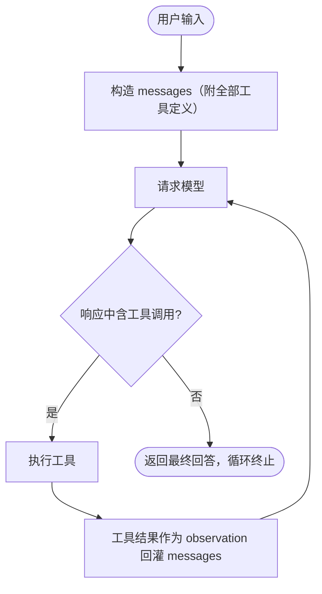
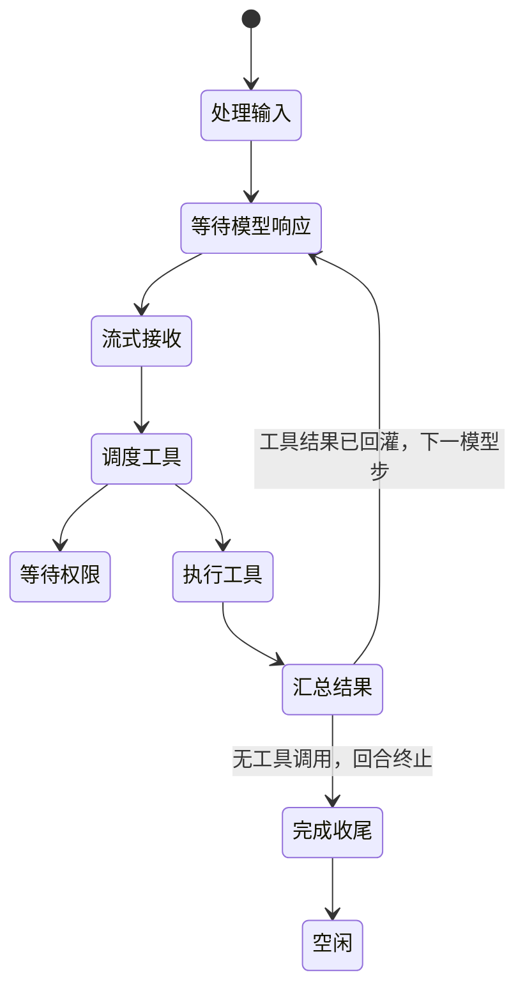

# 2.1 Tool 与 React Agent Loop

> 本章导览：把 1.2 的单次工具调用串成自驱动的"推理→行动→观察"循环。这是全书最重要的一章——此后所有机制（上下文、压缩、权限、子代理）都挂在这个循环上。

## ReAct：推理—行动循环

1.2 结束时我们留下了一个尴尬：模型能调用工具了，但调用一次之后对话就结束了。真实的编码任务没有一步完成的——"把 `src/` 下所有 `var` 改成 `const`"至少要经历搜索、逐个编辑、验证三类决策，而每一次决策都依赖上一步的观察结果。单次调用是快照，任务是一条路。

给这类系统搭骨架的想法来自 ReAct 论文（*ReAct: Synergizing Reasoning and Acting in Language Models*，Yao et al., 2022）：模型交替输出**推理（Thought）**与**行动（Action）**，环境返回**观察（Observation）**，往复直到得出答案。当年的实现靠提示词约束模型按固定格式吐出 `Thought: ... Action: ...`，再用字符串解析。

今天不需要这么麻烦。function calling（见 1.2 节）把 Action 变成了结构化的工具调用（tool call），Observation 变成了 `role: "tool"` 的消息，Thought 退化成响应里的普通文本（推理模型还会给显式的 reasoning 块）。形式变了，骨架原封不动：



这个循环有一个必须时刻成立的不变量（loop invariant），本章的每个设计都围绕它：

> **注**：**循环不变量**：消息历史里，每条 assistant 消息声明的每个工具调用，后面必然跟着一条同 `toolCallId` 的 tool 消息；反之，每条 tool 消息都对应一个已声明的调用。循环在任何一步崩溃，历史都必须保持这个形状——下一节你会看到违反它的代价。

本章为 tinycode 产出两个文件：`src/tools/registry.ts`（工具怎么建模）与 `src/loop.ts`（循环怎么转）。它们是全书的核心代码，值得逐行誊抄运行。

## 多轮工具编排与终止条件

先建立两个术语：用户的一次输入触发一个**回合（Turn）**；回合内每一次"请求模型→解析响应"是一个**模型步（model step）**。一个回合通常包含多个模型步，Agent Loop 就是在回合内驱动模型步重复的引擎。

跟着一个具体任务看消息历史怎么长大：

```text
[user]      帮我把 src/ 下所有 var 改成 const
[assistant] 我先搜一下用到 var 的位置        toolCalls: [grep]
[tool]      toolCallId=grep_1  "src/a.js:3 ... src/b.js:17 ..."
[assistant] 共 2 处，逐一修改               toolCalls: [edit(a.js), edit(b.js)]
[tool]      toolCallId=edit_1  "OK"
[tool]      toolCallId=edit_2  "OK"
[assistant] 完成，共修改 2 处               ← 无工具调用，循环在此终止
```

每一步都往数组尾部追加消息，而且顺序刻意如此：**assistant 消息连同它声明的工具调用先落盘，工具结果随后成对回灌（tool result 回灌）**。这样安排是为了在崩溃时也不破坏不变量：哪怕进程在工具执行到一半时死掉，历史里也只是留下"一个尚未兑现的声明"，形状依然合法——恢复会话时给它补一条合成结果即可。ZCode 正是这么做的：冷恢复时把被中断的工具写成固定文案 `"[Tool execution was interrupted before resume]"`（见 `packages/core/src/agent/session-history-hydrator.ts`）。

> **踩坑**：反过来做（先执行工具、之后再补 assistant 声明），或者回灌时漏掉、写错 `toolCallId`，下一次请求会被 API 直接以 400 拒绝——协议要求 tool 结果与 assistant 的 tool_use 严格配对。几乎所有自己写过 Agent 的人都踩过：本地数组看着完好，一到真实请求就报错，而且报错信息未必直指配对问题。排查方法永远是从头扫一遍历史：assistant 的 `toolCalls` 与 tool 消息的 `toolCallId` 是否一一对应、顺序是否一致。

循环什么时候停？四类终止条件：

1. **模型不再调用工具**——正常路径。模型输出纯文本回答，意味着它判断任务完成。这是唯一的"体面出口"，其余三条都是保险丝。
2. **输出被截断（stop reason 为 `length`）**——模型话说一半被最大输出 token 剪断。不能把半句话当答案，做法是注入一条 user 消息让它接着写，并限制续写次数。
3. **步数上限**——模型打转（反复搜索同一批文件）时止损。上限是保险丝，不是控制流的一部分。
4. **用户打断（abort）**——用户按下 Stop，循环在下一个检查点退出，已产生的部分输出要保留。

模型的"意图"藏在流式响应的 finish 事件里。不同供应商的命名各异，归一化后的 stop reason 语义高度一致：

| stop reason | 语义 | 循环的处理 |
| --- | --- | --- |
| `stop` | 自然说完 | 无工具调用则终止 |
| `tool-calls` | 要求调用工具 | 执行并回灌，进入下一模型步 |
| `length` | 输出被截断 | 注入续写指令，至多重试 3 次 |
| `unknown` / 空输出 | 可疑状态 | 记日志并抛错，不带病续跑 |

用户打断不需要新机制：一个标准的 `AbortSignal` 从入口一路传给模型流与工具 handler，循环每次迭代开头调用 `throwIfAborted()` 作为检查点。被取消的工具调用同样回灌一条"已取消"的结果而不是让异常炸掉回合——不变量在任何路径下都要维持。

## 一个最小可运行的 Agent Loop

先回顾 1.2 与 1.3 已经给出的类型形态，本章只用到下面这些：

```ts
// src/types.ts（1.2）与 src/model.ts（1.3）中，本章用到的形态回顾
interface ToolCall {
  id: string;
  name: string;
  input: unknown;                  // provider 层已把 JSON 字符串解析成对象
}

interface Message {
  role: "system" | "user" | "assistant" | "tool";
  content: string;
  toolCalls?: ToolCall[];   // assistant 消息携带
  toolCallId?: string;      // tool 消息携带
  toolName?: string;
  isError?: boolean;
}

type ModelEvent =
  | { type: "text_delta"; text: string }
  | { type: "tool_call"; toolCall: ToolCall }
  | { type: "finish"; finishReason: "stop" | "tool-calls" | "length" }
  | { type: "error"; error: unknown };

interface Model {
  streamText(req: { messages: Message[]; tools: ToolDef[]; signal?: AbortSignal }): AsyncIterable<ModelEvent>;
}
```

工具在 tinycode 里就是一个接口加一个注册表。除了"怎么执行"，每个工具还要声明一件对循环至关重要的事——它能不能与其他调用并行（本章第五节会消费这个声明）：

```ts
// tinycode/src/tools/registry.ts
export interface Tool {
  name: string;
  description: string;
  inputSchema: Record<string, unknown>;   // JSON Schema：模型照它生成参数
  concurrentSafe: boolean;                // 声明式并发：无副作用才允许并行
  handler: (input: unknown, ctx: { signal?: AbortSignal }) => Promise<string>;
}

export class ToolRegistry {
  private tools = new Map<string, Tool>();

  register(tool: Tool): void {
    if (this.tools.has(tool.name)) throw new Error(`tool already registered: ${tool.name}`);
    this.tools.set(tool.name, tool);
  }
  get(name: string): Tool | undefined { return this.tools.get(name); }
  list(): Tool[] { return [...this.tools.values()]; }
}
```

> **工程细节**：真实注册表（`packages/core/src/tool/registry.ts`，148 行）维护 canonical 名与别名两张 Map，`get` 先查别名再查本名；别名冲突时拒绝新别名而不是静默覆盖——源码注释的原话是：兼容 alias 若静默覆盖 canonical 或另一个 alias，会把一次工具调用路由到错误的权限和 handler。它的 `toContracts()` 把工具元数据投影成发给模型的契约，其中 `execute: undefined`——契约永远不携带可执行体。

然后是主角。先看常量与签名：

```ts
// tinycode/src/loop.ts
import type { Message, ToolCall } from "./types";
import type { Model } from "./model";
import type { Tool } from "./tools/registry";

const DEFAULT_MAX_STEPS = 40;    // 打转保险丝，正常任务远用不到
const MAX_CONTINUATIONS = 3;     // length 续写上限，与真实系统一致

export interface LoopResult {
  messages: Message[];       // 完整历史：下一回合接着用，也是持久化的原料
  finalText: string;         // 模型最后一段可见回答
  steps: number;             // 实际执行的模型步数
}
```

主循环本体——全书最重要的一段代码：

```ts
export async function runAgentLoop(options: {
  model: Model;
  tools: Tool[];
  messages: Message[];                // 初始历史，以本轮用户消息结尾
  signal?: AbortSignal;
  maxSteps?: number;
}): Promise<LoopResult> {
  const messages = [...options.messages];
  const maxSteps = options.maxSteps ?? DEFAULT_MAX_STEPS;
  let continuations = 0;
  let finalText = "";
  let step = 0;
  while (step < maxSteps) {
    options.signal?.throwIfAborted();             // 用户 Stop 的检查点
    step += 1;
    const stepOut = await consumeModelStream(options.model, messages, options.tools, options.signal);
    finalText = stepOut.text;
    // 先落盘：assistant 连同它声明的工具调用一起进入历史（"先占坑"）
    messages.push({
      role: "assistant", content: stepOut.text,
      ...(stepOut.toolCalls.length > 0 ? { toolCalls: stepOut.toolCalls } : {}),
    });
    if (stepOut.toolCalls.length > 0) {
      // 再回灌：结果与声明成对，然后进入下一个模型步
      messages.push(...(await executeToolCalls(stepOut.toolCalls, options.tools, options.signal)));
      continue;
    }
    if (stepOut.finishReason === "length" && continuations < MAX_CONTINUATIONS) {
      continuations += 1;
      messages.push({ role: "user", content: "Output token limit hit. Resume directly — no apology." });
      continue;
    }
    break;   // 无工具调用、无需续写：模型认为任务完成，循环终止
  }
  return { messages, finalText, steps: step };
}
```

循环体只有三个分支：有工具调用就执行并回灌；输出被截断就续写；否则退出。流式消费的细节都封在 `consumeModelStream` 里——一个 `for await` 加一个 `switch`，教学版只处理四种事件，与真实系统一一对应：

```ts
async function consumeModelStream(
  model: Model, messages: Message[], tools: Tool[], signal?: AbortSignal,
): Promise<{ text: string; toolCalls: ToolCall[]; finishReason: string }> {
  let text = "";
  let finishReason = "stop";
  const toolCalls: ToolCall[] = [];
  const stream = model.streamText({
    messages,
    // 只把名字、描述、schema 发给模型——handler 留在本地，永远不上云
    tools: tools.map(({ name, description, inputSchema }) => ({ name, description, inputSchema })),
    signal,
  });
  for await (const event of stream) {
    switch (event.type) {
      case "text_delta":
        text += event.text;              // 真实系统在这里同步刷新终端 UI
        break;
      case "tool_call":
        toolCalls.push(event.toolCall);
        break;
      case "finish":
        finishReason = event.finishReason;
        break;
      case "error":
        throw event.error;               // 请求级失败交给外层重试策略（见第六节）
    }
  }
  return { text, toolCalls, finishReason };
}
```

工具执行的第一版刻意从简：按声明顺序串行跑。注意 `runOneToolCall` 永远返回一条 tool 消息——错误也不例外：

```ts
async function executeToolCalls(
  calls: ToolCall[], tools: Tool[], signal?: AbortSignal,
): Promise<Message[]> {
  const results: Message[] = [];
  for (const call of calls) {
    results.push(await runOneToolCall(call, tools, signal));
  }
  return results;
}

async function runOneToolCall(
  call: ToolCall, tools: Tool[], signal?: AbortSignal,
): Promise<Message> {
  const tool = tools.find((t) => t.name === call.name);
  if (!tool) {
    // 结构性失败：名字不存在。把错误当结果回灌，让模型自己纠正
    return { role: "tool", toolCallId: call.id, content: `Error: no such tool: ${call.name}`, isError: true };
  }
  try {
    const output = await tool.handler(call.input, { signal });
    return { role: "tool", toolCallId: call.id, toolName: tool.name, content: output };
  } catch (err) {
    // 执行性失败：异常同样降级为结果，而不是让整个回合崩溃
    const message = err instanceof Error ? err.message : String(err);
    return { role: "tool", toolCallId: call.id, toolName: tool.name, content: `Error: ${message}`, isError: true };
  }
}
```

在终端入口里接上它，tinycode 就从"问答"升级成了"Agent"：

```ts
const registry = new ToolRegistry();
for (const tool of [readTool, bashTool]) registry.register(tool);   // 内置工具见第 3 部分

const result = await runAgentLoop({
  model,
  tools: registry.list(),
  messages: [{ role: "user", content: userLine }],
  signal: abortSignal,
});
console.log(result.finalText);
```

## 解析失败与格式错误的处理

先说一个好消息：function calling 时代，"模型输出非法 JSON、正则解析失败"这类经典事故已被 provider 适配层消化——`tool_call` 是结构化解出来的，参数受 schema 约束（1.2）。真正要处理的是拿到结构化调用之后的三类失败：

1. **工具名不存在**：模型幻觉出一个工具名，或该工具被当前权限模式隐藏；
2. **参数不合法**：缺必填字段、类型错误、多余字段，schema 校验不过；偶发模型把整个参数对象序列化成字符串发来；
3. **工具执行失败**：文件不存在、命令退出码非零、handler 抛出异常。

处理原则只有一句：**失败是模型的输入，不是系统的崩溃**。三类失败全部降级为 `isError: true` 的 tool 结果回灌。模型读到错误文案后，下一步通常会修正参数重试——Agent 的"自愈"能力不是玄学，就来自"错误也能被模型看见"这个朴素设计。`runOneToolCall` 里两个 return 写的就是它。

也因此，**错误文案是写给模型看的，不是写给程序员看的**。`Error: no such tool: xyz` 告诉模型换个名字；真实系统的 Read 工具找不到文件时会列出编辑距离不超过 3 的相似文件名，附一句 "Did you mean X?"——模型大概率一次就能改对。同时别忘了错误也占上下文 token（见 2.3 节），所以错误信息要短、要可行动，不要贴堆栈。

> **注**：可预期的"业务失败"与意外异常值得分开表达。真实系统里 Edit 的"old_string 未找到"不抛异常，而是返回结构化的 `ToolHandlerFailure`（含错误码与给模型的建议文案），由执行器统一包上 `<tool_use_error>` 信封再回灌（`packages/core/src/tool/executor/errors.ts`）。异常则留给真正的意外：磁盘不可写、实现有 bug。

> **工程细节**：真实系统在 Hook 与权限**之前**就做两件事（`packages/core/src/tool/input-normalization.ts`）：把字符串形式的入参兜底 `JSON.parse`，再用 schema 预检。顺序很讲究——无效调用不该白白弹一次审批窗、白跑一遍 PreToolUse hook；校验过后，Hook、权限、确认窗读到的才是同一份字节。

## 工具调度：声明式并发

第一版串行执行有一个明显的浪费：模型一口气声明"读这 5 个文件"时，5 次读取本可以同时进行（并行工具调用，parallel tool calling）。但哪些能并行？全并行是错的——两个 Edit 同时改一个文件会互相覆盖；全串行是慢的——Read 之间毫无理由排队。

真实系统的答案优雅到值得抄进任何语言：把"能否并行"变成工具的**静态声明**，调度器只做分组这一件事。tinycode 的升级版执行器：

```ts
// 升级 executeToolCalls：声明式并发调度
function groupToolCalls(calls: ToolCall[], tools: Tool[]): ToolCall[][] {
  const groups: ToolCall[][] = [];
  let parallelRun: ToolCall[] = [];
  for (const call of calls) {
    const safe = tools.find((t) => t.name === call.name)?.concurrentSafe === true;
    if (safe) {
      parallelRun.push(call);            // 连续的可并行调用进同一组
    } else {
      if (parallelRun.length > 0) groups.push(parallelRun);
      parallelRun = [];
      groups.push([call]);               // 非并发安全的调用独占一组
    }
  }
  if (parallelRun.length > 0) groups.push(parallelRun);
  return groups;
}

async function executeToolCalls(
  calls: ToolCall[], tools: Tool[], signal?: AbortSignal,
): Promise<Message[]> {
  const results: Message[] = [];
  for (const group of groupToolCalls(calls, tools)) {
    // 组内并发：Promise.all 保持元素顺序；组间串行：上一组全部完成才开始下一组
    results.push(...(await Promise.all(group.map((c) => runOneToolCall(c, tools, signal)))));
  }
  return results;
}
```

现在回看 registry 里的 `concurrentSafe` 声明：Read、Glob、Grep 这类只读工具设为 `true`，Edit、Write、Bash 设为 `false`。于是"两个 Edit 互斥"这件事**不需要任何锁**——每个 Edit 都独占一组，天然串行；多个 Read 进同一组，天然并发。没有互斥量、没有队列、没有优先级反转，并发正确性由声明保证，调度器不理解任何具体工具的语义。`Promise.all` 本身保持结果顺序，组间又按序执行，所以结果顺序永远与模型声明顺序一致——部分协议对此挑剔，照声明顺序回灌最稳妥。

> **工程细节**：真实调度器（`packages/core/src/tool/scheduler.ts`）的判定比两个布尔更细：`destructive`（破坏性）一票否决永不并行；`concurrentSafe` 显式声明为三态（`true` / `false` / 缺省）；缺省时按 `readOnly` 或 `sideEffectScope === "none"` 兜底判定。runtime 侧进一步收紧为"`readOnly` 且副作用域为 `none` 才算只读"——TodoWrite 虽然不改文件，但副作用域是 session，不会被并行。默认只读集合包括 Read、Glob、Grep、WebSearch、WebFetch、TodoRead 等；组内并发上限 `DEFAULT_MAX_CONCURRENCY = 10`，超出按 10 个一块分批 `Promise.all`（`executor/batch-runner.ts`）。

## 重试、超时与最大步数

循环里的失败分三层，各层用不同的锤子：

**第一层：单个工具调用失败**——上一节已经解决，回灌错误结果即可，循环继续。

**第二层：单次模型请求失败**——网络抖动、限流、供应商 5xx。tinycode 在 1.3 已有最简单的指数退避；真实系统的参数值得参考：最多 10 次重试、基数 2 秒、指数 ×2、封顶 60 秒、加抖动（`packages/adapters/src/model/retry-policy.ts`）。但有一条更重要的边界：**首个真实事件到达之后，请求不再原样重试**。流已经开始吐字、UI 已经渲染、历史即将推进，此时重放会让用户看到重复输出、让历史出现两份 assistant 消息。真实系统对此的解法是从"锚点"恢复：把已收到的内容连同结果提交，从断点重发上下文（`core/src/runtime/methods/streaming-recovery.ts`，预算 10 次）。上下文超窗则触发被动压缩后重试本步（见 2.4 节）。

**第三层：回合级失控**——工具打转、请求挂死、用户离场。三种保险丝：

- **工具超时**：每个工具必须有超时，否则一个挂起的命令能冻住整个回合。真实执行器有 300,000ms 的默认兜底，各工具自带预算（Read 30 秒；Bash 默认 120 秒、上限 600 秒，全表见 3.4 节）。一个精巧的细节是"可暂停的墙钟"：WebFetch 内部还要排队等小模型提炼内容，排队时间不计入工具超时——源码注释说得很准："超时守的是 provider 挂了，不是我们自己的队列长"。
- **最大步数**：tinycode 默认 40 步。打转的典型形态是 read→grep→read→grep 无限循环，每一步都"合理"，合起来烧钱。有意思的是，真实主循环**没有固定轮数上限**（下一节细讲），固定上限只给有界的辅助循环：子代理默认 4 步（见 2.5 节）、记忆提取 5 步。原则是：上限是给失控兜底的保险丝，能靠明确条件退出的，就不要靠数字。
- **用户打断**：`AbortSignal` 贯穿始终。被取消的工具生成"已取消"结果而不是抛出；用户中断时持久化已生成的部分输出，回合记为 cancelled——用户按 Stop 不该弄脏历史，也不该弄丢已有进展。

这层的各种失败模式与更多保险丝，第六部分 6.3 节会汇总成一张完整的地图。

## 真实系统对照：while(true) 与记录仪状态机

ZCode 的 agentic loop 位于 `packages/core/src/runtime/`：`turn.ts` 是回合入口，`turn-loop.ts` 是模型步循环（循环本体），`turn-model-step.ts` 负责单步"请求→解析"，`turn-tools.ts` 负责工具执行与回灌，`turn-stop.ts` 负责终止判定。主循环骨架与 tinycode 惊人地相似：

```ts
// packages/core/src/runtime/methods/turn-loop.ts（有删节）
export async function runRegularTurnLoop(this, state): Promise<void> {
  while (true) {
    throwIfTurnAborted(state.turnAbortSignal);            // 用户 Stop 检查点
    // ... microcompact / autoCompact 检查（见 2.4）
    const providerProjection = buildRuntimeProviderRequestMessages(this, {
      entries: requestEntries, applyCacheControl: true, model: state.model,
    });
    state.turnMachine = new TurnMachineImpl(
      state.turnMachine.startModelRequest(/* ... */),
    );
    const result = await runModelBackedTurnStep.call(this, state, { /* ... */ });
    if (result === "break") break;
  }
}
```

与 tinycode 对照，有三处值得停下来看的差异。

**第一，`while (true)`，没有步数上限。** 退出完全由明确条件承担：用户 abort、模型不再调用工具、工具结果携带终止指令、模型步返回 `"break"`。生产系统敢这么写，是因为失控的代价由别处兜住——上下文增长由压缩（2.4 节）拦住，用户随时可以 Stop。固定数字上限反而会杀死合法的长任务。

**第二，控制流与状态机分离。** `packages/core/src/agent/turn-machine.ts` 定义了一个 10 相位的回合状态机（Idle、ProcessingInput、AwaitingModelResponse、Streaming、SchedulingTools、AwaitingPermission、ExecutingTools、AggregatingResults、Completing、Error），但它**不是主循环的驱动器，而是"记录仪"**：每次相位推进都用 `new TurnMachineImpl(machine.xxx())` 产生一份新的不可变状态，用途是诊断、发事件、拦截非法转换；循环走不走，由模型步的返回值 `"continue" | "break"` 决定。



```ts
// packages/core/src/agent/turn-state.ts（有删节）
export function canTransitionTo(current: TurnPhase, next: TurnPhase): boolean {
  const validTransitions: Record<TurnPhase, TurnPhase[]> = {
    [TurnPhase.Idle]: [TurnPhase.ProcessingInput],
    [TurnPhase.Streaming]: [TurnPhase.SchedulingTools, TurnPhase.AggregatingResults,
                            TurnPhase.Completing, TurnPhase.Error],
    [TurnPhase.ExecutingTools]: [TurnPhase.AggregatingResults, TurnPhase.AwaitingPermission,
                                 TurnPhase.Error],
    // ...其余相位同理
  };
  return validTransitions[current]?.includes(next) ?? false;
}
```

这里有一个值得记住的教学点：**状态机图与控制流图是两张图**。状态机图回答"系统此刻处于什么相位"（给观测者看），控制流图回答"接下来执行哪段代码"（给执行者用）。把两者揉进一个巨大的 switch 是常见的设计灾难——转换逻辑散落在业务代码里，既难测试也难诊断。真实系统把转换表收拢成纯函数 `canTransitionTo`，非法转换直接抛错，于是任何 bug 都在"记录"阶段暴露，而不是污染控制流。

**第三，双历史结构与请求投影。** 内存里同时存在两份历史：跨回合持久的 `MessageHistory`（`agent/message-history.ts`），以及本回合的请求快照 `turnRequestState.entries`，每次提交双写。发出请求前才把 entry 投影成 provider 消息——附件渲染成 `<system-reminder>` 包装的 user 消息、cache-control 只落在最后一条消息上。存储形态与传输形态分离，两层各自演化互不牵连。

流式消费端还有一个 tinycode 没做的优化值得知道——真实系统在收到 `tool_call` 事件时**只读工具立即开始执行**，不等流结束：

```ts
// packages/core/src/runtime/methods/model.ts（有删节）
case "tool_call": {
  const [toolCall] = normalizeModelToolCallsForRuntime([event.toolCall]) ?? [];
  if (!toolCall || toolCallIds.has(toolCall.id)) break;   // 按 id 去重：provider 偶发重发
  toolCallIds.add(toolCall.id);
  toolCalls.push(toolCall);
  options.onStreamToolCall?.(toolCall);   // 只读工具可在此立即开始执行
  break;
}
```

读一个 1MB 文件的 IO 时间没有必要等模型把话说完。按 id 去重也是真实世界的一课：供应商实现偶发重发同一个调用，不去重就会执行两遍。

> **注**：真实代码库里还有一个绝佳的对照物——`packages/core/src/memory/memory-agent-loop.ts` 的 `runMemoryAgentLoop`，一个 60 行的完整迷你循环：`for` 循环限步、请求模型、无工具调用即 break、`Promise.all` 并行执行、结果回灌。和本章的 `runAgentLoop` 逐段对读，你会发现工业代码与教学代码的骨架是同一个。

## 小结

本章把单次工具调用串成了自驱动的循环，这几条是全书的承重墙：

- Agent Loop = `while` 循环加终止条件：模型不再调用工具是体面出口，步数上限与用户 abort 是保险丝；stop reason（`stop` / `tool-calls` / `length`）是模型意图的载体。
- 循环不变量：assistant 声明与 tool 结果成对出现，先落盘、后回灌——漏配对，下一次请求就是 400。
- 失败是模型的输入：错误降级为 `isError` 结果回灌，文案写给模型看，循环因此获得自愈能力。
- 并发靠声明不靠锁：`concurrentSafe` 的工具进 `Promise.all` 组，其余独占一组串行，"两个 Edit 互斥"由分组天然保证。
- 真实系统的三个进阶姿态：`while (true)` 无固定上限、状态机是记录仪而非驱动器、存储历史与请求投影分离。

循环会转了，但它目前"赤手空拳"：工具全是自己写的。下一章把工具的来源协议化——实现一次 MCP 客户端，让全世界的工具 server 即插即用。
