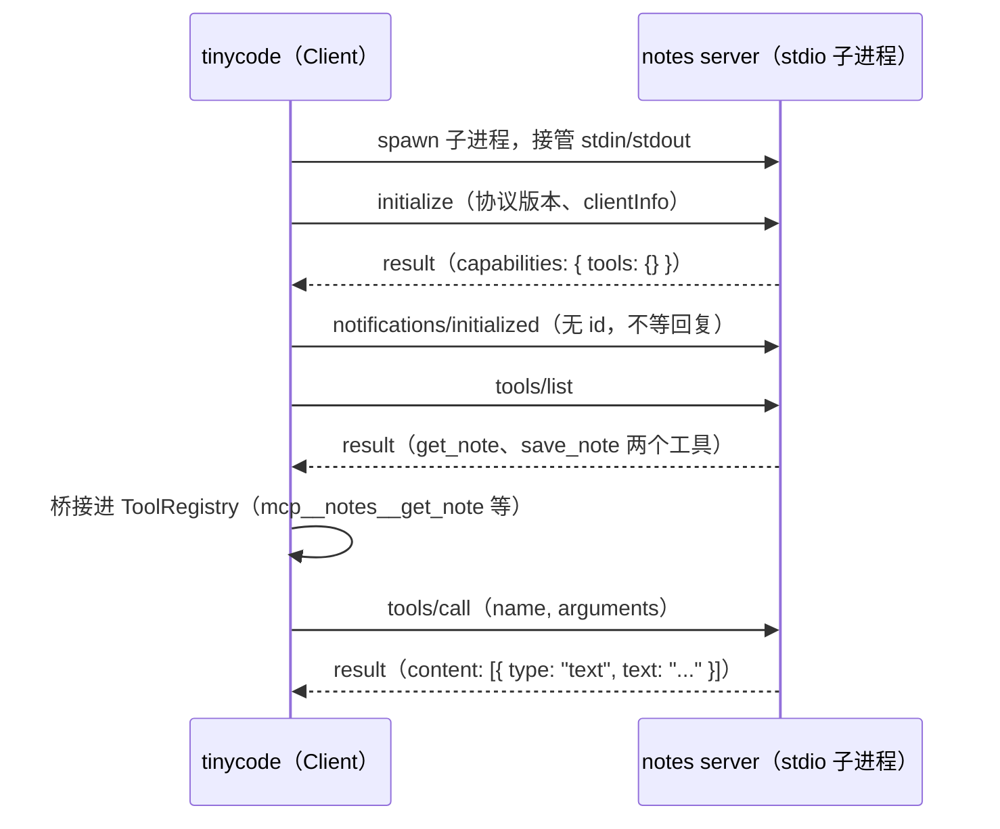
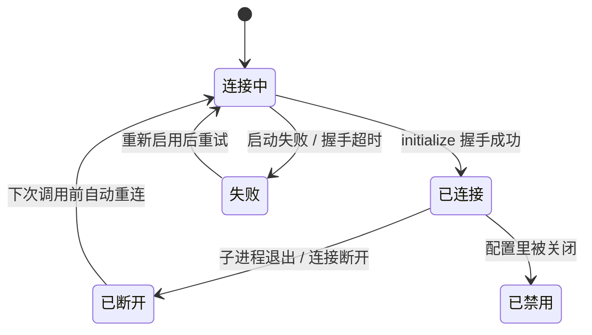

# 2.2 MCP：工具的协议化

> 本章导览：把"每个工具都自己写"换成"任何工具即插即用"——理解 MCP 协议，手写一个最小 MCP 客户端，把第三方 server 桥接进 2.1 的工具注册表。

## 为什么需要 MCP

2.1 的工具注册表里，每个工具都是进程内的一个函数：自己写 handler、自己定 schema、自己注册。给 tinycode 写 read 和 bash 没问题（第三部分就是干这个的），但能力需求是无限的：查 GitHub issue、操作浏览器、连数据库、发消息……如果每个 Agent 作者都要把这些轮子造一遍，集成问题就是 M×N 形态——M 个 Agent 应用乘以 N 种工具来源，每种组合一份胶水代码，而且每份代码都要自己处理鉴权、超时、错误格式。

MCP（Model Context Protocol，Anthropic 于 2024 年开源的协议）把 M×N 变成 M+N：工具提供方把自己的能力包成一个 **server**（协议实现一次），Agent 把自己变成一个 **client**（协议也只实现一次），此后任何 server 配任何 client 都能工作。类比 USB：设备厂商实现协议，主机留一个口，新设备上市不用改主板。

这不是纸上谈兵。ZCode 的 37 个内置工具之外，浏览器控制、图片搜索、Node 执行面板、云开发工具链，全部从 MCP 进来；宿主甚至内建了自己的 node_repl MCP server。读完本章你会发现，这些能力对 runtime 而言与内置工具毫无区别——协议化的全部意义就在这句话里。

## Server / Client 架构

MCP 有三个角色：**Host**（Agent 本体，比如 tinycode）、**Client**（Host 内部与单个 server 保持一条连接的组件）、**Server**（提供能力的进程或服务）。Host 可以同时连多个 server，每个 server 对应一个独立的 client 实例。

Client 与 Server 之间的通道叫**传输（transport）**，协议支持三种：

| 传输 | 形态 | 适合场景 |
| --- | --- | --- |
| `stdio` | Host spawn 子进程，stdin/stdout 收发消息 | 本地命令行工具，最常见 |
| `http` | Streamable HTTP，无状态请求、流式响应 | 远程托管服务（SaaS API） |
| `sse` | HTTP + Server-Sent Events（旧式，正被 `http` 取代） | 早期远程 server |

三种传输在配置上只是字段不同。下面是真实系统 `McpServerConfig` 判别联合对应的用户配置格式（用户级 `~/.zcode/cli/config.json` 或项目级 `<repo>/.zcode/config.json` 的 `mcp.servers` 键）：

```json
{
  "mcp": {
    "servers": {
      "notes": {
        "type": "stdio",
        "command": "node",
        "args": ["./mcp-server-notes.mjs"],
        "env": { "NOTES_DIR": "./.notes" }
      },
      "github": {
        "type": "http",
        "url": "https://api.githubcopilot.com/mcp/",
        "headers": { "Authorization": "Bearer <token>" }
      },
      "events": {
        "type": "sse",
        "url": "https://events.example.com/mcp/sse"
      }
    }
  }
}
```

> **工程细节**：配置来源有四级叠加，优先级从低到高：插件自带（server 名命名空间化为 `plugin:<插件名>:<原名>`，天然不冲突）、用户/项目配置、宿主内建（如 node_repl，最后覆盖以防止第三方 server 抢注宿主能力）。插件配置还支持变量插值（如 `${ZCODE_PLUGIN_ROOT}`），但有一条安全铁律：任意环境变量只允许在敏感字段（`headers`、`env`）里展开，绝不允许进入 `command`、`args`、`url`——否则一条配置就能执行任意命令。

协议本体是 JSON-RPC 2.0：请求是 `{ jsonrpc: "2.0", id, method, params }`，响应是 `{ id, result }` 或 `{ id, error }`；没有 `id` 的是通知（notification），发出后不等回复。MCP 在其上定义了一小撮方法名：`initialize`、`tools/list`、`tools/call`、`ping`。一个连接的完整生命周期：



`initialize` 握手同时是**能力协商**：server 在响应里声明自己提供哪些能力（`capabilities: { tools: {} }` 表示"我提供工具"），client 据此决定后续调用什么。协商失败或版本不兼容，连接就不该建立。

## 资源、工具与提示三类能力

MCP 协议定义了三类可协商的原语：**资源（resources）**——server 侧的只读数据；**提示（prompts）**——可复用的提示词模板；**工具（tools）**——模型可以决定调用的函数。另有一个反向能力 sampling（server 借用 Host 的模型做补全）。

一个值得学习的工程决策是：**Coding Agent 只消费 tools**。ZCode 的 MCP 实现近两千行（`packages/adapters/src/mcp/index.ts`），协议面却只有 `tools/list → tools/call` 一条路。理由不复杂：资源可以被一个"读取 MCP 数据"的工具替代，提示可以退化成普通文本注入，只有工具是 runtime 必须结构化理解的原语——模型要选它、填参数、等结果。少接一种能力，就少一类失败模式与一条测试路径。功能阉割不是偷懒，是把协议装进自己架构里的必要裁剪。

本章全程用同一个示例 server 贯穿：一个"笔记"工具集，提供 `get_note`（按 key 读取笔记，标注 `readOnlyHint: true`）与 `save_note`（写入或覆盖笔记，标注 `destructiveHint: true`）两个工具。这两个 hint 注释是 server 对风险的自报，本章后半段的风险分级会消费它们；笔记数据存在 server 进程内存里，进程一死数据全无——这个伏笔在生命周期一节回收。

## 手写最小 MCP 客户端

stdio 传输的全部机制就是三件事：spawn 子进程、按行分帧的 JSON、用 id 把响应配对回请求。tinycode 的 `src/mcp.ts` 第一段，类型与进程托管：

```ts
// tinycode/src/mcp.ts（一）：spawn 与进程托管
import { spawn, type ChildProcess } from "node:child_process";

const TIMEOUT_MS = 30_000;   // 与真实系统一致：MCP 调用固定 30s 超时

interface McpToolDescriptor {
  name: string;
  description?: string;
  inputSchema: Record<string, unknown>;
  annotations?: { readOnlyHint?: boolean; destructiveHint?: boolean };
}

interface Pending {
  resolve: (value: unknown) => void;
  reject: (err: Error) => void;
}

export class McpClient {
  private nextId = 1;
  private pending = new Map<number, Pending>();
  private buffer = "";
  private proc: ChildProcess;

  constructor(private command: string, private args: string[]) {
    this.proc = spawn(command, args, { stdio: ["pipe", "pipe", "pipe"] });
    this.proc.stdout!.setEncoding("utf8");
    this.proc.stdout!.on("data", (chunk: string) => this.onData(chunk));
    // server 的 stderr 不进模型上下文：那是写给人看的诊断信息
    this.proc.stderr!.on("data", (chunk) => console.error("[mcp:stderr]", String(chunk)));
  }

  get alive(): boolean {
    return this.proc.exitCode === null;   // exitCode 非 null 表示进程已退出
  }
```

子进程起来后，先握手、再宣告初始化完成；stdin 收到的字节流要切成一条条消息，并把每条响应送回等它的那次请求：

```ts
  // tinycode/src/mcp.ts（二）：握手与按行分帧
  async connect(): Promise<void> {
    await this.request("initialize", {
      protocolVersion: "2025-06-18",
      capabilities: {},
      clientInfo: { name: "tinycode", version: "0.1.0" },
    });
    // 握手完成的最后一拍：通知没有 id，server 不会回复
    this.notify("notifications/initialized");
  }

  // stdio 帧协议：一条消息一行 JSON，"找换行符"天然消化了粘包与半包
  private onData(chunk: string): void {
    this.buffer += chunk;
    for (let idx = this.buffer.indexOf("\n"); idx >= 0; idx = this.buffer.indexOf("\n")) {
      const line = this.buffer.slice(0, idx).trim();
      this.buffer = this.buffer.slice(idx + 1);
      if (line) this.onMessage(JSON.parse(line));
    }
  }

  private onMessage(msg: { id?: number; result?: unknown; error?: { message: string } }): void {
    const pending = msg.id === undefined ? undefined : this.pending.get(msg.id);
    if (!pending) return;               // 通知或迟到响应：忽略
    this.pending.delete(msg.id);
    if (msg.error) pending.reject(new Error(msg.error.message));
    else pending.resolve(msg.result);
  }
```

第三段，请求发出与三个协议方法：

```ts
  // tinycode/src/mcp.ts（三）：请求、tools/list、tools/call
  private request(method: string, params: object): Promise<unknown> {
    const id = this.nextId++;
    const frame = JSON.stringify({ jsonrpc: "2.0", id, method, params });
    return new Promise((resolve, reject) => {
      const timer = setTimeout(() => {
        this.pending.delete(id);
        reject(new Error(`MCP ${method} timed out after ${TIMEOUT_MS}ms`));
      }, TIMEOUT_MS);
      this.pending.set(id, {
        resolve: (value) => { clearTimeout(timer); resolve(value); },
        reject: (err) => { clearTimeout(timer); reject(err); },
      });
      this.proc.stdin!.write(frame + "\n");
    });
  }

  private notify(method: string, params: object = {}): void {
    this.proc.stdin!.write(JSON.stringify({ jsonrpc: "2.0", method, params }) + "\n");
  }

  async listTools(): Promise<McpToolDescriptor[]> {
    const result = (await this.request("tools/list", {})) as { tools: McpToolDescriptor[] };
    return result.tools;
  }

  async callTool(name: string, args: unknown): Promise<string> {
    const result = (await this.request("tools/call", { name, arguments: args })) as {
      content: { type: string; text?: string }[];
      isError?: boolean;
    };
    const text = result.content.filter((c) => c.type === "text").map((c) => c.text ?? "").join("\n");
    // 协议里"调用成功"不等于"工具成功"：业务失败靠 isError 表达
    return result.isError ? `Error: ${text}` : text;
  }

  stop(): void {
    this.proc.kill();
  }
```

两段加起来七十行出头，一个能用的 MCP 客户端就齐了。

> **踩坑**：响应配对只能靠 `id`，不要假设"先发先回"。并发调用两个工具时，两个响应乱序返回是常态，`Map<id, pending>` 是唯一正确的姿势；等下标、等顺序的写法在单工具测试时一切正常，接上第二个 server 就开始张冠李戴。另一个隐蔽的坑是通知（notification）没有 `id`——如果把它也登记进 pending 表，这条记录永远等不到响应，Map 悄悄泄漏，三十秒后超时处理器还会莫名其妙地触发。

> **注**：`TIMEOUT_MS` 用常量而非调用方传参，是刻意模仿真实系统的决定：ZCode 对 MCP 工具的超时写死 `descriptor.timeoutMs ?? 30_000`，不允许调用方覆盖（`packages/core/src/mcp/index.ts`）。内置 Bash 是唯一允许调用方改超时的工具（见 3.4 节），第三方工具没有这个待遇——你不能信任一个第三方 server 自称需要十分钟。

## 桥接进工具注册表

`listTools()` 拿到的是 server 的工具描述符，要把它变成 2.1 的 `Tool` 还差三件事：名字冲突、风险未知、执行路由。先解决名字。不同 server 可能有同名工具，内置工具也可能撞名，而模型只看到一个扁平的工具名清单——所以 MCP 工具在注册表里一律带命名空间前缀，格式是 `mcp__<server>__<tool>`。真实系统的实现（`packages/core/src/mcp/name.ts`）：

```ts
// packages/core/src/mcp/name.ts（有删节）
export function toMcpToolName(descriptor): string {
  return `mcp__${toModelVisibleMcpNamePart(descriptor.serverName)}__${toModelVisibleMcpNamePart(descriptor.toolName)}`;
}
export function toModelVisibleMcpNamePart(name: string): string {
  return name.replace(/[^a-zA-Z0-9_-]/g, "_").replace(/_+/g, "_") || "unknown";
}
```

两个细节：非法字符归一成下划线并压缩连续下划线，保证最终名字总能被模型当普通标识符念出来；空串兜底为 `"unknown"`。命名空间还带来一个管理红利——权限的允许/禁止清单可以按 `mcp__notes__*` 前缀整体操作，一键禁用一个 server。注意路由方向：模型调用 `mcp__notes__save_note`，handler 内部要翻译回 server 的原名 `save_note`，命名空间只存在于模型可见的这一侧。

风险分级则消费 server 自报的两个 hint。tinycode 先给 `Tool` 接口补两个可选声明字段（5.3 节的权限系统会消费它们）：

```ts
// src/tools/registry.ts 增补（其余字段不变）
interface Tool {
  // ...name / description / inputSchema / concurrentSafe / handler
  riskLevel?: "low" | "medium" | "high" | "critical";
  needsApproval?: boolean;   // 执行前是否要人工审批
}
```

然后是桥接函数，`src/mcp.ts` 的最后一段：

```ts
// tinycode/src/mcp.ts（三）：桥接——MCP 描述符 → 2.1 的 ToolRegistry 条目
import type { ToolRegistry } from "./tools/registry";

function sanitize(part: string): string {
  return part.replace(/[^a-zA-Z0-9_-]/g, "_").replace(/_+/g, "_") || "unknown";
}

export async function registerMcpTools(
  registry: ToolRegistry, serverName: string, client: McpClient,
): Promise<string[]> {
  const registered: string[] = [];
  for (const tool of await client.listTools()) {
    // 模型看到带命名空间的名字；执行时路由回 server 的原名
    const name = `mcp__${sanitize(serverName)}__${sanitize(tool.name)}`;
    const readOnly = tool.annotations?.readOnlyHint === true;
    const destructive = tool.annotations?.destructiveHint === true;
    registry.register({
      name,
      description: tool.description ?? "(no description)",
      inputSchema: tool.inputSchema,
      concurrentSafe: readOnly,        // server 没担保只读的，一律不参与并行
      riskLevel: destructive ? "high" : readOnly ? "low" : "medium",
      needsApproval: true,             // 第三方代码：默认全部要过人工审批
      handler: (input) => client.callTool(tool.name, input),
    });
    registered.push(name);
  }
  return registered;
}
```

接入之后，`runAgentLoop` 一行都不用改：模型在工具清单里看到 `mcp__notes__save_note`，决定调用它时走 2.1 的 `executeToolCalls`，`runOneToolCall` 在注册表里查到这个条目，handler 内部翻成一次 `tools/call`。对循环而言，MCP 工具与内置工具没有任何区别——这就是协议化的终点。

```ts
const client = new McpClient("node", ["./mcp-server-notes.mjs"]);
await client.connect();
const names = await registerMcpTools(registry, "notes", client);
// names = ["mcp__notes__get_note", "mcp__notes__save_note"]
```

真实系统桥接时的预算语义也一并给出（`packages/core/src/mcp/index.ts`）：风险分级正是 `readOnlyHint → low`、`destructiveHint → high`、否则 `medium`；所有 MCP 工具默认 `needsApproval: true`——第三方 server 是不受信任的代码，默认要人审批；结果预算为 100KB 内联、50KB 进模型上下文，超预算的大 base64 图片直接落盘为 artifact 而不是挤爆上下文。

> **工程细节**：命名空间解决了撞名，但解决不了仿冒——一个恶意 server 完全可以把自己命名为 `notes`。真实系统的态度写在注释里："server/tool 名可被第三方仿冒，名称不构成信任"。对高权限的官方 server（如内置的计算机操作工具），ZCode 用不可伪造的 authority 凭据验明正身，通过验证才允许投影到规范工具名；凭据验证不通过就 fail-closed，一切按普通第三方工具处理。

## 接入一个 MCP Server

到目前为止走的是 happy path，但 server 是独立进程，会死。死法有三种：spawn 失败（命令不存在）、握手失败（超时、协议版本不兼容）、运行中退出（崩溃或被杀）。前两种在建立连接时暴露，第三种最阴险——notes server 崩了，注册表里的工具条目还在，模型下一次调用就直接撞上"往已退出的进程 stdin 写数据"的错。

把连接的生命周期画成状态机，ZCode 的状态集是 `connecting | connected | disconnected | failed | disabled | untrusted`，tinycode 取其主干：



关键设计是**自愈时机**：不要在连接断开时立刻惊慌重连，而是把恢复推迟到下一次真正要用它的时候。真实系统的策略（`packages/adapters/src/mcp/`）：调用前发现连接已 `disconnected`，先重连再调用；调用中抛出 "Not connected"（检查与调用之间存在竞态），重连后重试一次，仍失败才向上交。tinycode 加一个最小版本：

```ts
// 在 McpClient 内补一个带自愈语义的调用入口
async callToolWithReconnect(name: string, args: unknown): Promise<string> {
  if (!this.alive) throw new Error(`Not connected: server exited (code ${this.proc.exitCode})`);
  try {
    return await this.callTool(name, args);
  } catch (err) {
    if (!this.alive) {
      // 竞态：检查时活着，调用中退出。重建进程、重新握手、重新注册，再试一次
      const fresh = new McpClient(this.command, this.args);
      await fresh.connect();
      return fresh.callTool(name, args);
    }
    throw err;
  }
}
```

这段代码也揭示了重连的代价：新进程是全新的 `notes` Map，上一进程里保存的笔记全部蒸发，模型会在下一次 `get_note` 时"发现"笔记丢了。有状态的 server 必须自己持久化（落盘或连数据库），这也是为什么生产环境的多数 server 刻意设计成无状态。宿主能帮的只有探活：长连接存在 TCP 半开（对端已死、本机不知）的经典问题，所以 ZCode 用 5 秒超时的 `pingServer` 主动探测——源码注释说 ping "是把 transport 存活性显式化的唯一手段"。MCP 协议恰好内置了 `ping` 方法，tinycode 想加只需一行：`ping() { return this.request("ping", {}); }`。

stdio 传输还有一个容易被忽视的收尾问题。我们的 notes server 只用标准库，`proc.kill()` 就能干净地杀死；但真实世界的 server 经常自己再 spawn 子进程（语言服务器、编译器守护进程），只杀直接子进程会留下一树孤儿。ZCode 为此专门写了 `ProcessTreeStdioClientTransport`（`adapters/src/mcp/stdio-transport.ts`）：在 Windows 上把子进程挂进 Job Object，断开时回收**整棵进程树**，而不是只收割自己 spawn 的那一个。

最后是失效边界的取舍：会话启动时的 MCP 初始化失败**只告警、不致命**（`initializeMcp` 失败仅 warn），Agent 照常运行，只是少了一批工具；工具注册成功后要调用 `invalidateToolCache()` 失效工具清单缓存，让下一轮请求带上新工具。连接还按 `isolation: "session" | "workspace"` 决定复用粒度——会话级各用各的，工作区级跨会话共享。

全章的示例 server 完整清单如下，二十余行，Node 原生无依赖，与上面的客户端可直接对跑：

```js
// mcp-server-notes.mjs —— 全章贯穿的最小 stdio MCP server
import { createInterface } from "node:readline";

const notes = new Map();   // 进程内存活着：重连即清空，见上一节
const schema = (props, required) => ({ type: "object", properties: props, required });
const tools = [
  { name: "get_note", description: "按 key 读取笔记", annotations: { readOnlyHint: true },
    inputSchema: schema({ key: { type: "string" } }, ["key"]) },
  { name: "save_note", description: "写入/覆盖笔记", annotations: { destructiveHint: true },
    inputSchema: schema({ key: { type: "string" }, text: { type: "string" } }, ["key", "text"]) },
];

const send = (msg) => process.stdout.write(JSON.stringify(msg) + "\n");
createInterface({ input: process.stdin }).on("line", (line) => {
  const msg = JSON.parse(line);
  if (msg.method === "initialize") {
    send({ jsonrpc: "2.0", id: msg.id, result: { protocolVersion: msg.params.protocolVersion,
      capabilities: { tools: {} }, serverInfo: { name: "notes", version: "0.1.0" } } });
  } else if (msg.method === "tools/list") {
    send({ jsonrpc: "2.0", id: msg.id, result: { tools } });
  } else if (msg.method === "tools/call") {
    const { name, arguments: a } = msg.params;
    if (name === "save_note") notes.set(a.key, a.text);
    const text = name === "save_note" ? `saved: ${a.key}` : (notes.get(a.key) ?? "(not found)");
    send({ jsonrpc: "2.0", id: msg.id, result: { content: [{ type: "text", text }] } });
  }
});
```

跑起来之后，tinycode 的对话里就可以出现这样的回合：用户说"记一条笔记，key 是 todo，内容是写完 2.2"，模型从工具清单里挑中 `mcp__notes__save_note`，填好参数发起调用，工具结果 `saved: todo` 回灌，模型向用户复述完成。写下这个 server 的你，没有改过 `runAgentLoop` 的任何一行。

## 小结

- MCP 用协议把工具集成的 M×N 压成 M+N：server 实现一次，client 实现一次，即插即用。
- 协议本体是 JSON-RPC 2.0 加少数方法：`initialize` 握手即能力协商，`tools/list` 发现工具，`tools/call` 执行；三种传输（stdio / http / sse）只是通道不同。
- 一个 70 行的手写客户端就够用：spawn、按行分帧、`Map<id, pending>` 配对、30 秒超时——但每一个都对应真实系统的一条加固（进程树回收、ping 探活、超时不可覆盖）。
- 桥接三板斧：`mcp__server__tool` 命名空间防冲突、`readOnlyHint` / `destructiveHint` 映射风险分级、默认 `needsApproval` 加人工审批；"名称不构成信任"是安全底线。
- 生命周期是一台状态机：断开不慌，调用前自愈；有状态的 server 要为进程死亡负责。
- Coding Agent 只消费 tools 能力——裁剪协议边界本身就是架构决策。

工具的来源问题解决了，但循环的历史还在无限增长：每一步的工具结果都留在上下文里。下一章讲上下文工程与记忆——历史如何被构建成模型真正需要的形态，以及哪些内容根本不该进历史。
