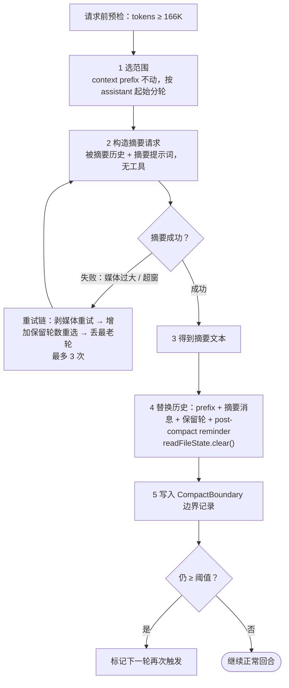

# 2.4 上下文压缩（Compact）

> 本章导览：对话历史只增不改，而窗口有限——当上下文逼近上限，把旧历史交给模型自己摘要，用几千 token 换回几十万 token 的空间。本章讲触发阈值怎么定、摘要提示词怎么写、压缩后模型看到什么，以及压缩失败时怎么保护自己。

## 为什么需要压缩：上下文窗口是硬约束

1.4 节埋过一个伏笔："真实系统在 200K 窗口的模型上把自动压缩线画在 166K token"。本章兑现它。

2.3 节的所有手段——占位符、截断、落盘——都在推迟终局，但有一个东西它们管不了：**对话历史本身**。2.1 节的循环不变量要求历史只增不改：assistant 声明与工具结果成对追加，缓存依赖这个追加式前缀，恢复会话依赖它的完整形状。长任务里，一次全文搜索返回几万字符、十次文件编辑留下几十条工具结果，历史稳定地、不可逆地膨胀。而上下文窗口是输入输出共享的硬上限：越线之后，provider 不是"帮你截断"，是直接拒绝请求。

压缩（Compact）是矛盾的最后解法：**花一次模型调用，把几十万字符的历史折叠成几千 token 的摘要，用信息损失换继续工作的空间。** 注意这个定义里的代价项——摘要有损，且损失永久。被折叠掉的原始细节（某个报错的完整堆栈、某次编辑的确切 diff）从此只存在于磁盘上的完整记录里。正因为有损，压缩必须是最后手段：占位符挡在工具结果前面，微压缩挡在历史前面，压缩排在队伍最末。这套防线在 2.3 节已经铺好，本章讲最后一道闸门怎么造。

## 触发时机：阈值、主动与被动

先回答"什么时候压"。直觉答案是"超过窗口的某个百分比就压"，真实系统的答案更机械也更精确——一条纯算术链，定义在 `packages/core/src/compact/policy.ts`：

| 常量 | 值 | 含义 |
| --- | --- | --- |
| `DEFAULT_COMPACT_CONTEXT_WINDOW` | 200,000 | 默认上下文窗口 |
| `PREFLIGHT_AUTOCOMPACT_OUTPUT_RESERVE_TOKENS` | 21,000 | 输出预留（预检用） |
| `AUTOCOMPACT_BUFFER_TOKENS` | 13,000 | 安全缓冲 |
| `MAX_OUTPUT_TOKENS_FOR_SUMMARY` | 20,000 | 摘要请求的输出上限 |
| `MAX_CONSECUTIVE_AUTOCOMPACT_FAILURES` | 3 | 连续失败熔断线（本章最后一节的主角） |

计算链只有两步：`effectiveContextWindow = contextWindow − outputReserve`，`threshold = effectiveContextWindow − buffer`。代入 200K 窗口：200,000 − 21,000 − 13,000 = **166,000 token**。

两个减法各有来历。减 21K 输出预留，是因为 1.4 节讲过窗口对输入输出**共享**：即使历史恰好塞满 200K，模型的回答也没有地方写——所以必须给"这一步的回答"留出空间。减 13K 缓冲，是因为 token 数是**估**出来的（下面马上讲），估算有误差，而且两次预检之间历史还会增长——一个模型步里模型可能发起七八个工具调用，每个都带着几 K 的结果。13K 就是给这两件事留的余量。

估算本身是个两层方案：优先用 **provider 的 usage 反推**——最近一次 assistant 响应携带的 `inputTokens` 就是官方计数，以此为基线；之后新增的消息用本地估算补增量（字符数除以经验除数）。它不需要精确，只需要在"该压了"这件事上宁早勿晚。

> **踩坑**：本地估算的第一版只数了消息正文，漏了两块：**toolCalls 里的 JSON 入参**（一次 Edit 调用的入参可以是整个文件内容）和**推理模型的 reasoning 块**。正文短、入参长的调用多了，估算就系统性偏低，等发现时已经越线。修复后的估算把两者都计入——教训是：**窗口里每一样东西都算输入，估算函数的遍历范围必须和请求构造函数完全一致。**

预检的判定结果不是布尔值，而是一个带原因的状态：`disabled`（用户关了自动压缩）→ `not_enough_messages`（不足 2 个 assistant 轮，没东西可摘要）→ `circuit_breaker`（连续失败熔断，见最后一节）→ `above_threshold` / `below_threshold`。每个否决原因都可观测，"为什么没压"和"为什么压了"一样值得记录。

预检之外还有三条触发路径，四种方式合起来覆盖"计划内"与"计划外"：

| 触发方式 | 时机 | 说明 |
| --- | --- | --- |
| Auto | 每次请求前的预检 | 估算越过 166K，先压缩再发请求 |
| Reactive | provider 真的报超窗之后 | 请求已被拒绝：压缩，然后**重试同一个请求** |
| Manual（`/compact`） | 用户显式输入 | 作为独立回合执行，可附加自定义摘要指令 |
| Partial / SessionMemory | 辅助会话 | 对侧边讨论等辅助会话做同样的压缩 |

Auto 是主力，Reactive 是安全网——估算再准也有漂移的时候，真超窗了不能让回合直接死掉。Manual 则把压缩交给用户：明知接下来是超长任务，提前压一次换空间，或附上一句"重点保留我说的性能约束"。

tinycode 的教学版只保留数字链与预检：

```ts
// tinycode/src/compact.ts
import type { ChatMessage } from "./types";

const CONTEXT_WINDOW = 200_000;   // 模型窗口，按所用模型配置
const OUTPUT_RESERVE = 21_000;    // 给"这一步的回答"预留的输出空间
const BUFFER = 13_000;            // 估算误差 + 单步增长的安全余量

export const COMPACT_THRESHOLD = CONTEXT_WINDOW - OUTPUT_RESERVE - BUFFER;  // 166_000

// 教学版 token 估算：约 4 字符一个 token。只求趋势正确，不求精确
export function estimateTokens(messages: ChatMessage[]): number {
  let chars = 0;
  for (const m of messages) {
    chars += typeof m.content === "string"
      ? m.content.length
      : JSON.stringify(m.content).length;
    if (m.toolCalls) chars += JSON.stringify(m.toolCalls).length;  // 入参也是输入
  }
  return Math.ceil(chars / 4);
}

export function shouldCompact(messages: ChatMessage[]): boolean {
  return estimateTokens(messages) >= COMPACT_THRESHOLD;
}
```

## 压缩提示词：如何让模型总结自己

触发之后，压缩本体是一次特殊的模型请求：**被摘要的历史 + 一份精心写的摘要提示词，不带任何工具**。这份提示词（`packages/core/src/compact/prompt.ts`）值得完整精读——它是"让模型总结自己"这个任务的所有经验沉淀。先看开头：

```text
CRITICAL: Respond with TEXT ONLY. Do NOT call any tools.

- Do NOT use Read, Bash, Grep, Glob, Edit, Write, or ANY other tool.
- You already have all the context you need in the conversation above.
- Tool calls will be REJECTED and will waste your only turn — you will fail the task.
- Your entire response must be plain text: an <analysis> block followed by a
  <summary> block.
```

（`compact/prompt.ts` 的 `NO_TOOLS_PREAMBLE`，全 文照录。）为什么开篇要写这么狠的一段？因为摘要请求的输入**就是一段充满工具调用的对话历史**——刚读完文件、正在跑命令的模型，接续生成工具调用的惯性极强。而这次请求不带工具定义，一次"顺手"的调用尝试就是一次失败；摘要请求没有第二次机会，它是"only turn"。所以这段前缀同时做了三件事：禁用全部工具（点名常用的那几个，比一句 "ANY tool" 更有约束力）、断绝念想（"你需要的上下文都在上面了"）、说明后果（"调用会被拒绝并浪费你唯一的机会"）。

接着是任务正文。先要求模型把分析过程包在 `<analysis>` 标签里逐条过一遍对话——按时间顺序、盯住用户的显式请求、留意"用户让我换个做法"的反馈——然后才准写 `<summary>`。先分析后成文，和我们自己写总结是一个道理。其中有一条要求特别扎眼：

```text
Note any security-relevant instructions or constraints the user stated
(e.g., sensitive files or data to avoid, operations that must not be
performed, credential or secret handling rules). These MUST be preserved
verbatim in the summary so they continue to apply after compaction.
```

安全约束（"别动 `.env`"、"密钥不许出现在日志里"）**必须逐字保留**。为什么逐字？因为意译是有损压缩——"不要碰敏感文件"被转述两轮后可能退化成"注意文件安全"，一条用户红线就在转述中失效了。压缩后模型依然拥有全部工具与权限，摘要里活下来的约束是它唯一的缰绳。

`<summary>` 的结构是固定的 9 段，每段都在回答"压缩后接手的模型最想知道什么"：

| # | 段名 | 要什么 | 为什么 |
| --- | --- | --- | --- |
| 1 | Primary Request and Intent | 用户的全部显式请求与意图 | 任务北极星，丢了必然跑偏 |
| 2 | Key Technical Concepts | 涉及的技术概念、框架 | 让后续讨论词汇一致 |
| 3 | Files and Code Sections | 查过改过的文件，**含完整代码片段** | 压缩后要接着改这些文件，片段是工作底稿 |
| 4 | Errors and fixes | 踩过的错与修法，尤其用户反馈 | 交过的学费别交第二遍 |
| 5 | Problem Solving | 已解决与进行中的排查 | 避免重复推理 |
| 6 | All user messages | 列出**全部**非工具结果的用户消息；安全约束逐字保留 | 用户原话是意图与红线的原始凭证 |
| 7 | Pending Tasks | 明确交代过、尚未完成的任务 | 待办清单 |
| 8 | Current Work | 摘要前一刻正在做什么，含文件名与代码 | 衔接面之"现在" |
| 9 | Optional Next Step | 下一步；必须与用户最近的显式请求**直接对齐**，并**引用最近对话原话** | 衔接面之"接下来" |

9 段里最重的是 8 和 9——压缩不是重开一局，是无缝续接，"现在做到哪了"和"接下来做什么"就是衔接面。第 9 段要求引用最近对话的原话，是为了防**任务漂移**：不锁定原文，摘要模型会下意识把下一步写成"更合理"的版本，几轮压缩漂移下来，任务就面目全非了。第 6 段要求列出全部用户消息，则是给"用户意图"留原始凭证——不止摘要者的转述。

提示词的尾部还有两样东西：用户通过 `/compact` 附加的自定义指令（用户最清楚这场对话里什么不能丢），以及一句与前缀呼应的收尾——`REMINDER: Do NOT call any tools…`。同一个要求首尾各说一遍，是长提示词的通用技法：模型对中间内容的注意力最弱，首尾最牢。tinycode 的对应实现：

```ts
// tinycode/src/compact.ts —— 摘要提示词：首尾禁工具，中间是 9 段结构模板
const NO_TOOLS_PREAMBLE = `CRITICAL: Respond with TEXT ONLY. Do NOT call any tools.

- Do NOT use Read, Bash, Grep, Glob, Edit, Write, or ANY other tool.
- You already have all the context you need in the conversation above.
- Tool calls will be REJECTED and will waste your only turn — you will fail the task.
- Your entire response must be plain text: an <analysis> block followed by a <summary> block.`;

const NO_TOOLS_TRAILER =
  "\n\nREMINDER: Do NOT call any tools. Respond with plain text only.";

export function buildCompactPrompt(customInstructions?: string): string {
  // BASE_SUMMARY_TEMPLATE 即上文 9 段结构 + <analysis>/<summary> 输出格式说明
  return [NO_TOOLS_PREAMBLE, BASE_SUMMARY_TEMPLATE,
    customInstructions ?? "", NO_TOOLS_TRAILER].join("\n\n");
}
```

## 压缩后保留什么：摘要 + 最近一轮原文

摘要请求本身用**当前会话的模型**执行——不换更便宜的小模型。摘要是压缩的灵魂，摘歪了后面每一轮都在错误前提上工作，这点差价不值得省。输出上限即 `MAX_OUTPUT_TOKENS_FOR_SUMMARY` 的 20,000 token，足以装下一份带完整代码片段的 9 段摘要。

全量压缩的完整流程（`runtime/methods/compact-active.ts`）分五步：



**第一步选范围**是整个流程里最见功力的决定。历史被切成两部分：**context prefix 永不参与摘要**——系统提示词、AGENTS.md、记忆索引是压缩要保护的对象而不是压缩的原料，把它们送进摘要等于让保镖和人质一起进粉碎机；其余历史**按 assistant 消息起始分轮**，切口永远落在轮与轮之间，一条 assistant 声明和它的工具结果绝不会被拆到边界两侧——否则替换出的历史直接违反 2.1 节的循环不变量。分轮之后，Auto 与 Reactive 保留**最后一轮原文**，Manual 保留 0 轮。

为什么留一轮？刚发生的最后一轮——最后那条用户消息和模型刚做完的动作——是续接最关键的上下文，也恰恰是摘要最容易失真的部分（它还没有"尘埃落定"可供总结）。一份摘要加一轮原文，是"空间收益"与"衔接保真"之间的折中：摘要负责回忆，原文负责手感。

**第三步的重试链**处理摘要请求自身的失败：媒体内容过大 → 剥掉媒体重试；还是超窗 → 增加保留轮数重新选范围；仍不行 → 丢掉最老的轮次（历史里插入一行 `[earlier conversation truncated for compaction retry]` 作为标记），最多重试 3 次。压缩器自己也不能把回合压死。

**第四步替换历史**后，模型在下一次请求里看到的消息形状是：

```text
[context prefix —— 原封不动]
[摘要 user 消息 —— 摘要 + 衔接指令]
[保留的最近一轮 —— 原文]
[post-compact reminder —— 已批准 plan 的文件引用 + Read 文件状态提示]
```

其中摘要消息的包装语逐句都有用意（`compact/prompt.ts` 的 `buildCompactSummaryMessage`，有删节）：

```text
This session is being continued from a previous conversation that ran out of
context. The summary below covers the earlier portion of the conversation.

<摘要正文>

If you need specific details from before compaction (like exact code snippets,
error messages, or content you generated), read the full transcript at:
<path/to/transcript>

Recent messages are preserved verbatim.

Continue the conversation from where it left off without asking the user any
further questions. Resume directly — do not acknowledge the summary, do not
recap what was happening, do not preface with "I'll continue" or similar.
Pick up the last task as if the break never happened.
```

开头一句向模型交代处境：这是续接，不是新任务。`transcript` 路径是 2.3 节"只留指针"原则的终极形态——整段被压缩的历史浓缩成了一条取回路径，真需要压缩前的原始代码片段时，模型可以自己去读完整记录。`Recent messages are preserved verbatim.` 告诉模型后面还有原文、不必从摘要里恢复它们。而最后那句 `Resume directly — do not acknowledge the summary` 是实测出来的必要设计：不写它，模型的下一步十有八九是"好的，我了解了之前的工作，让我继续……"——一整轮模型调用花在向摘要表态上，什么活都没干。

**第五步**写下 `CompactBoundary` 边界记录（2.6 节的持久化与 6.1 节的轨迹都靠它区分压缩前后的历史），并检查压缩效果：若仍越过阈值，标记下一轮继续触发。

替换历史之外还有一处不起眼却关键的收尾：`readFileState.clear()`。

> **工程细节**：`readFileState` 是 3.2 节的"先读后改"门——Edit 工具只允许修改已 Read 过的文件，"已读"的凭据就是历史里的 Read 结果。压缩把历史换成了摘要，模型"读过什么"的水位随之失真：摘要里说"改过 `a.ts`"，不代表模型的上下文里还有 `a.ts` 的当前内容。`readFileState.clear()` 把已读水位**整体归零**，Edit 必须重新 Read——宁可多花一次读取，不让编辑建立在已被摘要掉的旧内容上。

这一步背后是一个普适原则：**历史就是模型的记忆**。任何只存在于对话历史里的状态——读过哪些文件、调用过哪个 Skill、Skill 返回的那份指令全文、已批准的 plan——压缩时都会随历史一起被折叠。所以每次压缩都要盘点一遍"哪些状态住在历史里"：已读水位归零（clear），已批准的 plan 由 post-compact reminder 重新引用文件路径，被折叠掉的 Skill 指令则要靠模型重新调用 Skill 工具取回——门关上了，但门把手还留着。tinycode 没有这些门，但主流程已经齐了：

```ts
// tinycode/src/compact.ts —— 压缩主流程：选范围 → 摘要 → 替换历史
export async function compactHistory(options: {
  model: Model;
  messages: ChatMessage[];     // 完整历史，[0] 是 system
  keepLastRounds?: number;     // Auto 保留 1；/compact 传 0
}): Promise<ChatMessage[]> {
  const [system, ...rest] = options.messages;
  const rounds = splitByAssistantRound(rest);      // 按 assistant 消息起始分轮
  const keep = options.keepLastRounds ?? 1;
  const summarized = rounds.slice(0, rounds.length - keep).flat();
  const preserved = rounds.slice(rounds.length - keep).flat();

  const summary = await summarizeOnce(options.model, summarized);   // 无工具，见下
  return [
    { role: "system", content: system.content },   // context prefix 永不动
    { role: "user", content: buildResumeNotice(summary) },
    ...preserved,                                  // 最近一轮原封不动
  ];
}

async function summarizeOnce(model: Model, history: ChatMessage[]): Promise<string> {
  const stream = model.stream({
    messages: [...history, { role: "user", content: buildCompactPrompt() }],
    tools: [],                                     // 摘要请求不带任何工具
  });
  let text = "";
  for await (const event of stream) {
    if (event.type === "text_delta") text += event.text;
  }
  return text;
}
```

```ts
// tinycode/src/compact.ts —— 压缩后模型看到的第一条消息
function buildResumeNotice(summary: string): string {
  return "This session is being continued from a previous conversation that ran"
    + " out of context. The summary below covers the earlier portion of the"
    + ` conversation.\n\n${summary}\n\nRecent messages are preserved verbatim.\n`
    + "Continue the conversation from where it left off without asking the user"
    + " any further questions. Resume directly — do not acknowledge the summary,"
    + ' do not preface with "I\'ll continue" or similar. Pick up the last task'
    + " as if the break never happened.";
}
```

`splitByAssistantRound` 不再展开：把连续消息按 assistant 消息起点切块，本质是保证切口不落进"assistant 声明 + 工具结果"这对搭档中间。

## 微压缩（Microcompact）：不调用模型的本地瘦身

全量压缩之前，其实还有一档更便宜的手段。看两类内容的对比就明白了： assistant 的一句"我来改这个文件"没多大信息量，而它引出的 Read 结果可能占了八千 token——且早在几个模型步之前就被消费完了。这些**陈旧的 tool result** 不需要模型来摘要，直接删就行。这就是微压缩（microcompact）：**本地字符串替换，零模型调用**（`compact/microcompact.ts`）。

| 维度 | microcompact | 全量 compact |
| --- | --- | --- |
| 手段 | 本地字符串替换，**零模型调用** | 一次摘要模型请求 |
| 触发 | token 达 `min(autoThreshold × 0.9, autoThreshold − 2000)`，或空闲超过 60 分钟 | 超 autoThreshold（200K 窗口即 166K）、provider 超窗、或 `/compact` |
| 压什么 | 仅 **tool result**（Read、Bash、Grep、Glob、WebFetch、WebSearch、Edit、Write）；按轮分组，**保留最近 5 组**，更早的整组替换为 `[Old tool result content cleared]` | 整个对话历史 |
| 保护对象 | 含媒体的结果、错误结果 | context prefix 永不摘要 |
| 生效条件 | 全部替换合计**省出 ≥256 token** 才动手，否则放弃 | 至少 2 个 assistant 轮 |
| 边界事件 | `MicrocompactBoundary` | `CompactBoundary` |
| 默认状态 | 需显式开启 | 默认开启 |

几个数字值得咀嚼。"保留最近 5 组"：太老的工具结果多半已被后续动作消费，但最近几轮的观察结果还在影响下一步决策，动不得。"省 256 token 才动手"：微压缩虽然不要钱，但替换会让下一次请求的前缀在若干位置发生变化——缓存命中从此处断裂（1.4 节），省不出几行 token 的空间就不值得破坏一次缓存。"错误结果受保护"：一条报错刚出现就被清掉，模型就失去了自愈的依据（2.1 节）。

注意默认配置下 microcompact 是**关闭**的——只有全量 compact 默认生效。这不是它不好，而是它改变历史形状的方式更激进（正文被替换为占位文案），交给用户按工作负载选择。

## 压缩的副作用与防护

压缩是给循环做的手术，手术失败比不治更糟。真实系统给它配了三层防护，全部值得搬走：

**熔断**。摘要请求本身可能失败——超窗、媒体过大、provider 抖动。单次失败有重试链兜着，但若**连续失败达到 3 次**（`MAX_CONSECUTIVE_AUTOCOMPACT_FAILURES = 3`），预检进入 `circuit_breaker` 状态，停止自动压缩。道理算一下就懂：上下文已经顶着阈值，每个回合的预检都会触发压缩，压缩失败再重试三次——每回合白烧四五次模型调用，任务却寸步难行。熔断后把选择权交还用户：`/compact` 手动压缩依然可用（熔断熔的是自动路径），换个模型或开个新会话也是出路。

**rapid-refill 断路器**。另一类失败更隐蔽：压缩明明成功了，token 却在极短时间内重新冲回阈值。这说明工作集本身就比阈值大——摘要在变薄，增量在疯长，继续自动压缩只是一台烧钱的跑步机。真实系统为这种"刚压完又满"的形态设置了断路器，识别到就退出自动压缩循环，等用户介入。（具体判定是工程细节，此处不展开；记住这个失败形态即可。）

**不全压**。`not_enough_messages` 的否决前面出现过：不足 2 个 assistant 轮不压。历史里只有一轮对话时，摘要无物可摘，压了反而把唯一的上下文换成了一层转述——纯亏。

最后回到信息损失本身。压缩有损且永久，工程上的态度不是消灭损失，而是**排序**：能不进上下文的用占位符挡住（2.3 节），进了但已消费完的用 microcompact 清掉，实在满载了才全量压缩；压缩之后还留一条 transcript 取回路径兜底。每一层都在为下一层减少工作量——这正是 2.3 与 2.4 两章共享的那条主线。

## 小结

- 压缩是历史只增不改与窗口有限的最后解法：花一次模型调用，用有损摘要换工作空间——所以它必须是最后手段。
- 阈值不是百分比，是一条算术链：`阈值 = 窗口 − 输出预留 21K − 缓冲 13K`，200K 窗口即 166K；token 计数优先用 provider usage 反推，本地估算补增量，且必须覆盖 toolCalls 入参与 reasoning 块。
- 触发有四条路：Auto 预检、Reactive 超窗重试、Manual `/compact`、辅助会话压缩。
- 摘要提示词的每个字都有用意：首尾禁工具夹击、`<analysis>` 先想后写、9 段结构面向"无缝续接"、安全约束逐字保留、下一步必须引用原话防漂移。
- 压缩后 = context prefix + 摘要消息 + 最近一轮原文 + post-compact reminder；`Resume directly` 防表态轮；`readFileState.clear()` 把"已读水位"归零——历史即模型记忆，住在历史里的状态都要在压缩时盘点补偿。
- microcompact 用零模型调用的本地替换清陈旧 tool result（保留最近 5 组、省 256 token 才动手）；连续失败 3 次熔断，rapid-refill 断路器拦截"压完就满"的死循环。

压缩让历史变小，但它仍发生在同一条历史里。还有一条思路从源头上给上下文减负：把一整块任务外包给一个拥有**独立上下文**的代理——它在自己的历史里翻几十个文件，主历史里只留一份最终报告。下一章讲 SubAgent。
