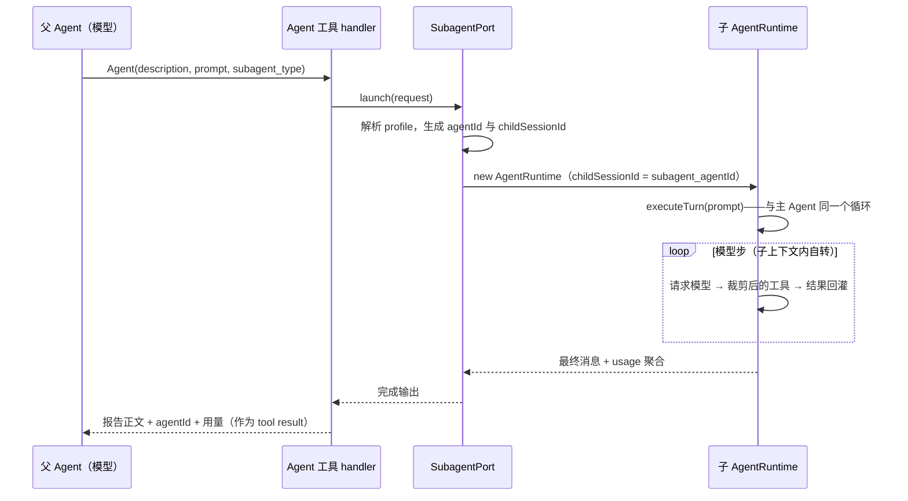

# 2.5 SubAgent

> 本章导览：让主 Agent 把整块工作委派给拥有独立上下文的子代理。本章回答四个问题：为什么需要子代理、如何用一个 Markdown 文件定义一种子代理、派生时上下文与工具如何被裁剪、前台等待与后台运行如何共存——顺带看清全书最值得学习的一个设计：子代理与主 Agent 跑的是同一个循环。

## 为什么需要子代理

用一个真实场景开场：你问 Agent"这个代码库里支付相关的逻辑在哪"。为了回答这个问题，模型可能要 grep 五轮、读十个文件、排除两处看似相关实则无关的实现——三四万 token 的中间结果涌进上下文，而最终答案只用到其中五百 token。这些探索的垃圾不会消失：它们一直占着上下文窗口（2.3 节），加速触发压缩（2.4 节），更糟的是**稀释注意力**——当上下文里塞满中间搜索结果时，模型对真正关键约束的召回质量会肉眼可见地下降。

矛盾在于：探索必须做，但探索的痕迹最好别留在主上下文里。子代理（SubAgent）就是这个矛盾的解法——把"翻箱倒柜"整体外包出去，子代理在**自己的上下文里**把十轮搜索全部烧掉，只把最终报告作为一条工具结果交回来。主上下文花出去的是几百 token 的委派成本，收回的是浓缩后的结论。

除了上下文隔离，委派还带来两个收益。**并行**：模型可以在同一条消息里发出多个 Agent 调用，三个子代理同时探查三个模块，墙钟时间约等于最慢的那个。**专业化**：每种子代理有自己的系统提示词、工具白名单、模型选择乃至步数上限——"代码审查员"可以配只读工具面加严格的报告格式，与干粗活的主 Agent 互不干扰。

按全书的定义（见约定章术语表）：**子代理是由主 Agent 通过工具派生的、拥有独立上下文的完整 Agent 实例**。这句话里的每个词都有分量，本章余下的篇幅就是在兑现它们——尤其是"完整"二字。

## 用 Markdown 定义一个子代理（Agent Profile）

ZCode 里"一种子代理"就是一个 Markdown 文件：frontmatter 声明元信息，正文整体作为该子代理的系统提示词。加载位置有三处（`bootstrap/src/subagents.ts`）：用户级 `<storageRoot>/agents/**/*.md`、项目级 `<工作目录>/.zcode/agents/**/*.md`、插件的 `<pluginRoot>/agents/<name>.md`；同名 profile 后加载者覆盖先加载者，也可以覆盖两个内置类型——`general-purpose`（通用干活）与 `Explore`（只读探查）。给子代理体系留一个"放个文件就能扩展"的口子，是插件化思路（见 4.3 节）在最小尺度上的重演。

frontmatter 支持的全部字段如下（`packages/core/src/subagent/profile-frontmatter.ts`）：

| 字段 | 说明 |
| --- | --- |
| `name` | 必填，agent 类型名，`subagent_type` 按它匹配 |
| `description` | 必填，进入 Agent 工具的描述——模型全靠它决定选谁 |
| `tools` | 工具白名单；支持 `*`（继承全部）与 `mcp__server__*`（按 server 通配） |
| `disallowedTools` | 工具黑名单，在白名单过滤之后再剔除 |
| `model` / `providerId` / `modelId` / `reasoningLevel` | 模型选择，子代理可以用与父 Agent 不同的模型 |
| `color` | UI 上的身份色 |
| `permissionMode` | `auto` 或 `plan`；出现在项目级文件中会被强制剥离（本节末尾解释） |
| `maxTurns` | 回合内模型步上限，最终默认 **4** |
| `memory` | `user` / `project` / `local`——跨会话持久记忆的根目录，启动时把 MEMORY.md 索引拼进系统提示词 |
| `background` | `true` 则该类型的子代理总是后台运行 |
| `injectAgentsMd` | 是否向子代理注入 AGENTS.md，默认 `true` |
| `skills` | 该子代理可用的技能白名单 |
| `mcpServers` | 借用父 Agent 的哪些 MCP server |

一个真实格式的例子——"代码审查员"，审查与修改分家，靠的就是工具面：

```markdown
---
name: code-reviewer
description: Reviews code for quality, security and maintainability. Use proactively after writing or modifying code.
tools: Read, Grep, Glob, Bash
disallowedTools: Write, Edit
model: glm-4.7
color: green
maxTurns: 10
memory: project
---

You are a senior code reviewer. When invoked:
1. Run git diff to see recent changes
2. Focus on the files the caller mentions
3. Report findings as: severity, file:line, description
Never modify files yourself — report only.
```

注意 `description` 的写法：它不是写给人看的注释，而是模型选型的唯一依据。"Use proactively after writing or modifying code" 这样的措辞是在直接指挥主 Agent 何时委派——写 profile 的功夫，一半花在这行字上。

## 委派与上下文隔离：子代理是一个完整 Runtime

主 Agent 看到的入口是一个普通工具：`Agent`（`Task` 是兼容别名），定义在 `packages/core/src/tool/handlers/agent.ts`：

| 参数 | 说明 |
| --- | --- |
| `description` | 3–5 个词的任务概述，显示在 UI 上 |
| `prompt` | **完整自包含的任务书**——子代理看不到你们的对话历史，任务书必须自带全部上下文 |
| `subagent_type` | 子代理类型，缺省 `general-purpose` |
| `run_in_background` | 是否立即转后台（见本章末节） |

工具描述是动态生成的：runtime 把当前全部可用 profile 的 `name` 与 `description` 内嵌进 Agent 工具的说明里，并明确告诉模型两件事——"子代理的最终消息作为 tool result 返回给你，不会直接展示给用户""同一消息里发多个 Agent 调用可并行"。前者决定了委派的输出契约，后者是对并行能力的显式授权。

接下来是本章的核心事实：**子代理不是一个简化循环，而是与主 Agent 完全相同的 `AgentRuntime` 类的另一个实例**。装配代码在 `packages/core/src/runtime/methods/subagent.ts`：

```ts
// packages/core/src/runtime/methods/subagent.ts（有删节）
const childRuntime = new AgentRuntime(
  childSessionId,                         // 形如 subagent_<agentId>，独立持久化、可 resume
  {
    workingDirectory: request.workingDirectory,
    subagentContext: { agentPrompt: agentPrompt ?? "" },
    maxTurns: request.maxTurns ?? this.config.subagents?.maxTurns ?? 4,
    parentSessionId: this.sessionId,
    taskType: "subagent_child",
    toolAllowlist: childToolAllowlist,    // 裁剪后的工具面（下一节）
    subagents: { enabled: false },        // 递归限制：子不能再生子
  },
  { /* 继承 eventStore、modelFactory、permissionService、
       mcpPort（借用）、skillPort（过滤）、eventSink（镜像事件） */ },
);
return await childRuntime.executeTurn(request.prompt, undefined, {
  abortSignal: options?.signal,
  inputSource: "subagent",                // 首轮输入来自父 Agent，而非真实用户
});
```

值得停下来想想为什么这样设计。另起炉灶写一个"轻量子循环"看似更简单，但意味着压缩、工具调度、循环不变量维护、错误降级这些 2.1 与 2.4 章的机制都要再实现一遍——而且永远与主循环存在行为漂移。复用同一个 runtime 后，主 Agent 修掉的任何一个循环 bug，子代理自动受益；压缩、并发调度、合成消息这些能力，子代理免费获得。隔离的只是上下文与工具面，机制共享到底。

教学版 `tinycode/src/subagent.ts` 把这个思想压缩到肉眼可见——直接调用 2.1 的 `runAgentLoop`：

```ts
// tinycode/src/subagent.ts（一）：profile 与加载
export interface SubagentProfile {
  name: string;
  description: string;      // 进入 Agent 工具描述，模型靠它选型
  systemPrompt: string;     // Markdown 正文，定义角色与工作方式
  tools?: string[];         // 白名单；缺省或含 "*" 表示继承父工具面
  maxTurns?: number;        // 子代理是有界任务，默认 4（与真实系统一致）
}

const DEFAULT_MAX_TURNS = 4;

export function parseProfile(source: string): SubagentProfile {
  const m = /^---\n([\s\S]*?)\n---\n([\s\S]*)$/.exec(source);
  if (!m) throw new Error("agent profile 缺少 frontmatter");
  const fields: Record<string, string> = {};
  for (const line of m[1].split("\n")) {
    const idx = line.indexOf(":");
    if (idx > 0) fields[line.slice(0, idx).trim()] = line.slice(idx + 1).trim();
  }
  if (!fields.name || !fields.description) throw new Error("name 与 description 必填");
  return {
    name: fields.name,
    description: fields.description,
    systemPrompt: m[2].trim(),
    tools: fields.tools ? fields.tools.split(",").map((s) => s.trim()) : undefined,
    maxTurns: fields.maxTurns ? Number(fields.maxTurns) : DEFAULT_MAX_TURNS,
  };
}
```

派生运行只有三步：裁剪工具面、组装自己的上下文、把 `prompt` 交给同一个循环：

```ts
// tinycode/src/subagent.ts（二）：派生——复用 2.1 的 runAgentLoop
import { runAgentLoop } from "./loop";
import type { Tool } from "./tools/registry";
import type { Model } from "./model";

export async function runSubagent(options: {
  profile: SubagentProfile;
  prompt: string;
  parentTools: Tool[];
  model: Model;
  signal?: AbortSignal;
}): Promise<string> {
  const tools = filterSubagentTools(options.parentTools, options.profile.tools);
  // 子代理的"系统提示词"不走 2.3 的完整构建流程：角色提示词 + 通用约束即全部
  const system = options.profile.systemPrompt +
    "\n\n# 约束\n路径一律用绝对路径；报告须给出文件与行号，直接给结论。";
  const result = await runAgentLoop({
    model: options.model,
    tools,
    // 教学版把 system 并入首条 user 消息；真实系统有独立的 SubagentContextBuilder
    messages: [{ role: "user", content: system + "\n\n---\n\n" + options.prompt }],
    maxSteps: options.profile.maxTurns ?? DEFAULT_MAX_TURNS,
    signal: options.signal,
  });
  return result.finalText;          // 最终消息就是交付物
}
```

真实系统对"子代理的上下文"有一套独立的构建器（`subagent/context-builder.ts`），段顺序固定：CLI 前缀 → agent prompt（profile 的系统提示词）→ Subagent Notes（绝对路径、cwd 等通用约束）→ Subagent Environment（cwd、git 状态、平台、模型身份）；再往后是可选的 AGENTS.md、日期与 skills。两个"不继承"值得强调：**不继承父会话的消息历史**（隔离的本意），**不无条件继承 AGENTS.md**——按 profile 的 `injectAgentsMd` 决定，因为一个只跑一次 grep 的探查代理，未必需要整个项目的协作规范占掉它的窗口。

子代理 profile 解析失败的处理也体现"错误是模型的输入"原则（见 2.1 节）：类型名按精确匹配 → 归一化近似匹配（忽略连字符与下划线）→ 仍失败则报错并**列出全部可用类型**，模型下一步就能自纠。

## 工具裁剪与递归限制

子代理拿到的工具面是裁剪过的，规则有三条，每条都来自真实代码里的必然性论证。

**规则一：强制剔除 Plan 类交互工具。** `subagent/tool-policy.ts` 里的常量与注释原文：

```ts
// packages/core/src/subagent/tool-policy.ts
const SUBAGENT_CHILD_FORCED_DISALLOWED_TOOLS = [
  ENTER_PLAN_MODE_TOOL_NAME,
  EXIT_PLAN_MODE_TOOL_NAME,
];
// 子 agent 没有独立的 plan approval 恢复面，暴露 plan tools 会让
// ExitPlanMode 等待用户确认并卡住父 turn，因此所有子 agent 工具面统一剔除。
```

为什么是"必然"：Plan 工具的执行语义是"停下来等用户确认"（见 5.2 节），而子代理的回合里**没有人可等**——它的用户是父 Agent，父 Agent 又在等它返回。ExitPlanMode 一旦被调用，父子两个 turn 互相等待，形成死锁。裁掉是唯一安全的选择。

**规则二：禁自嵌套，深度恒为 1。** child runtime 配置 `subagents: { enabled: false }`，同时从工具面过滤掉 `Agent`/`Task` 本身。子代理不能再派生子代理。不做这个限制，一次委派就可能裂变成指数级的运行时与费用，取消信号的传播链也会深到无法推理——"谁取消了谁"将变成悬案。深度恒为 1 让编排结构永远一目了然：父编排子，仅此一层。

**规则三：白名单是过滤，不是新造。** `tools: "*"` 表示继承父 runtime 的可见工具面（再求交、剔除调度类工具）；写了具体清单，就从这个继承面上过滤。子代理的工具永远是其父工具面的**子集**——一个 profile 文件无论怎么写，都不能让子代理获得父 Agent 本来没有的能力。安全边界只有一层（5.3 节的权限系统），子代理不另立门户。

三条规则之外，还有一个反向操作：**强制注入** `RespondToCoordinator` 工具——子代理主动向父回话的控制通道（渲染为 `<subagent-message>` XML）。裁剪的是能力，补上的是通信。

内置的 `Explore` 子代理是白名单设计的范本（`subagent/explore-tools.ts`）：

```ts
// packages/core/src/subagent/explore-tools.ts
// 白名单刻意不含任何文件写工具（Write/Edit/ApplyPatch），因此 Bash 是唯一的
// 副作用入口，只读语义靠 Explore prompt 约束。
export const EXPLORE_AGENT_ALLOWED_TOOLS = [
  "Bash", "Glob", "Grep", "Read", "WebFetch", "WebSearch", "TodoWrite",
] as const;
```

只读语义不是靠"删光所有能写文件的工具"达成的——那既列不全（Bash 也能写），也堵死了 `git log` 这类必要操作。真实做法是：白名单收紧到探查所需的最小集，同时诚实地承认 Bash 是漏点，用提示词约束补上"不要修改文件"的软性边界。权限的硬墙（5.3 节）仍然兜底。

最后是权限模式的三个事实：内置 Explore 缺省跑在 `yolo`（独立且只读的 PermissionService，审批对只读代理没有意义）；`general-purpose` 继承父的 PermissionService；而**项目级 `.zcode/agents/*.md` 里的 `permissionMode` 会被强制剥离**（`bootstrap/src/subagents.ts` 的 `sanitizeProjectAgentProfile`）——项目里的一个 Markdown 文件是仓库内容的一部分，绝不能成为提权通道。

> **工程细节**：真实系统还会把子 runtime 的工具与权限事件**镜像**回父会话（`subagent/tool-event-mirror.ts`）：`toolCallId` 重写为 `tool_subagent_<agentId>_<childToolCallId>` 并附上父子标识，于是父会话的 UI 能展示"我的子代理正在读哪个文件"，权限弹窗也能由父界面代答。子代理的 MCP 连接是**借用**（`subagent/borrowed-mcp-port.ts`）：child 只拿到父连接的过滤视图，`close/connect/disconnect` 一律拒绝——"Subagent MCP port cannot mutate parent connection lifecycle"。教学版全部省略，但这两个设计回答了"共享机制时如何保持账目清晰"。

## 主从编排与结果回收

把一次前台委派的完整旅程画出来：



回收的输出格式是三段式：子代理最终报告正文、一行 `agentId: xxx (use SendMessage with to:'xxx' to continue this agent)`、一段 `<usage>`（token、工具调用数、时长）。中间那段最关键——它是**续聊句柄**，下一节讲。

教学版的 Agent 工具把上面整个链条收进一个 handler：

```ts
// tinycode/src/subagent.ts（三）：Agent 工具——把"派生"暴露给模型
export function createAgentTool(profiles: SubagentProfile[], parentTools: Tool[], model: Model): Tool {
  const catalog = profiles.map((p) => `- ${p.name}: ${p.description}`).join("\n");
  let launchSeq = 0;
  return {
    name: "Agent",
    description: "委派一个拥有独立上下文的子代理。可用类型：\n" + catalog +
      "\n子代理的最终消息将作为工具结果返回给你，不会直接展示给用户。" +
      "同一消息里发多个 Agent 调用可并行。",
    inputSchema: {
      type: "object",
      properties: {
        description: { type: "string", description: "3-5 个词的任务概述" },
        prompt: { type: "string", description: "完整自包含的任务书：子代理看不到你们的对话历史" },
        subagent_type: { type: "string", description: "子代理类型，缺省 general-purpose" },
      },
      required: ["description", "prompt"],
    },
    concurrentSafe: true,   // 各子代理上下文独立，天然可并行（调度见 2.1 节）
    handler: async (input, ctx) => {
      const { prompt, subagent_type } = input as { prompt: string; subagent_type?: string };
      const profile = resolveProfile(profiles, subagent_type ?? "general-purpose");
      const agentId = `agent_${++launchSeq}`;   // 每次派生一个句柄，供 SendMessage 续聊
      const report = await runSubagent({
        profile, prompt, parentTools, model, signal: ctx.signal,
      });
      return `${report}\n\nagentId: ${agentId}`;   // 报告 + 续聊句柄
    },
  };
}
```

handler 抛出的"类型不存在"异常会被 2.1 的 `runOneToolCall` 降级为 `isError` 结果回灌，错误文案里带着全部可用类型——模型读一遍就能改对参数。

**SendMessage：续聊与复活。** 一次委派返回后，子代理的会话（`subagent_<agentId>`）连同它的全部历史是持久的。`SendMessage` 工具让父 Agent 可以：对**运行中**的子代理发消息，注入其当前回合（steer，转向）；对**已终态**的子代理发消息，则用原 `childSessionId` 从事件存储恢复上下文，在后台续跑一个新回合——上一步的探查结论都还在，不必从头再来。这正是"完整 Runtime + 独立持久化"组合的红利：委派出去的不是一次性函数调用，而是一个可以随时唤醒的会话（持久化机制见 2.6 节）。

## 后台运行与完成通知

`launch` 的分派规则只有一行：`run_in_background === true` 或 profile 声明了 `background: true` → 走后台 `start()`；否则走前台 `run()`。前台的含义是"Agent 工具这个调用不返回，父回合停在这里等"。但等待不等于死等——真实系统的前台运行里藏着全书最优雅的 10 行并发代码（`subagent/runner.ts`，有删节）：

```ts
// 三路竞速：正常完成 vs 模型显式要求转后台 vs 超时自动转后台
const winner = await Promise.race([
  guardedCompletionPromise.then((completed) => ({ completed, kind: "completed" as const })),
  ...(backgroundRequestPromise ? [backgroundRequestPromise] : []),
  ...(autoBackgroundTimer ? [autoBackgroundTimer.promise] : []),
]);
if (winner.kind === "backgrounded") {
  taskAbort.detachParent();        // 切断父子取消联动：任务已独立，不陪葬父回合
  activityWatchdog.stop();
  void completionPromise
    .then((c) => finalizeBackgroundCompletion(/* ... */))
    .catch((e) => finalizeBackgroundFailure(/* ... */));
  return createAgentBackgroundedOutput(request, lifecycle);   // status: "async_launched"
}
```

竞速的语义值得咀嚼：父 Agent 调用 Agent 工具后，**完成**与**转后台**两个 Promise 同时挂着，谁先落定按谁算。模型中途通过别的通道请求转后台（或自动转后台定时器到期），前台调用立即以 `async_launched` 返回，父回合继续对话；而子代理的 completion promise **不被取消**，转进后台继续跑。这就是"前台 await 与后台任务共存"的全部机关——不需要挂起、恢复这类重量级机制，一个 `Promise.race` 加一个"取消联动开关"就够了。

转后台之后，任务完成的时刻，父会话如何知道？答案是铸造一条 XML 通知：

```xml
<task-notification>
  <task-id>agent_9f2c</task-id>
  <output-file>/tmp/zcode-agents/{parentSessionId}/{agentId}/output.txt</output-file>
  <status>completed</status>
  <summary>Agent Explore task "搜索支付逻辑" completed.</summary>
  <result>……子代理最终报告全文……</result>
  <usage>
    <subagent_tokens>52340</subagent_tokens>
    <tool_uses>17</tool_uses>
    <duration_ms>88432</duration_ms>
  </usage>
</task-notification>
```

这条文本被**同步入队**到父 runtime 的命令队列（入队函数的签名刻意返回 `void`，用类型系统禁止 async——防止"假装入了队"的竞态），在父回合的下一个可中断点渲染为一条**合成用户消息（synthetic user message）**，模型于是"收到完成通知"，可以决定是否跟进。防重复靠 `notified` 单次认领令牌：通知路径与 TaskOutput 轮询路径会争抢同一次交付，谁先认领谁交付；跨分支的迟到通知则被 `branchGeneration` 栅栏丢弃——用户回退对话十分钟后，不该收到旧时间线的"完成"幽灵。

> **注**：后台任务的完整图景——任务注册表、Bash 的后台化、TaskOutput/TaskStop、统一追踪器——在 5.6 节展开，那里还给了 tinycode 的完整后台三件套。本节只需记住子代理视角的三件事：转后台是一个 `Promise.race`，完成是一条 XML 合成消息，重复投递靠认领令牌消灭。

教学版给 `runSubagent` 包一层同样的竞速骨架，就能同时拥有前台与后台：

```ts
// tinycode/src/subagent.ts（四）：前台 await 与后台任务共存
export async function launchSubagent(options: Parameters<typeof runSubagent>[0] & {
  background?: boolean;
}): Promise<string> {
  if (options.background) {
    void runSubagent(options).then((report) => queueNotification(options.profile.name, report));
    return "status: async_launched —— 完成后会收到 <task-notification>";
  }
  const winner = await Promise.race([
    runSubagent(options).then((report) => ({ kind: "completed" as const, report })),
    backgroundRequested,                    // 外部可置位的 Promise
  ]);
  return winner.kind === "completed"
    ? winner.report
    : "status: backgrounded —— 任务已转后台继续运行";
}
```

`queueNotification` 把 XML 文本塞进主循环每次取输入前检查的队列——与 5.6 节 `drainNotifications` 的做法一致，此处不再重复。

> **工程细节**：本章省略了真实系统的若干加固：活动看门狗（子 runtime 每个事件都要上报活动续期，超时 abort——"卡死"被显式建模）、任务元数据与输出落盘（`<tmp>/zcode-agents/` 下的 metadata.json 与 output.txt，供 UI 与 TaskOutput 回读）、usage 聚合、AbortController 父子链。它们不改变本章的机制结论，但每一条都在 5.6 与 6.3 节的故事里有一席之地。

## 小结

- 子代理解决的是"探索必须做、痕迹别留下"的矛盾：隔离上下文、可并行、可专业化，最终报告作为一条工具结果回到主上下文。
- 一种子代理 = 一个 Markdown 文件：frontmatter 十余个字段里，`description` 决定模型何时选它，`tools` 决定它能做什么，正文是它的系统提示词。
- 核心设计：**子代理是一个完整的 AgentRuntime 实例**，与主 Agent 共用同一个循环——隔离的是上下文与工具面，共享的是全部机制；tinycode 用十行直接复用 `runAgentLoop` 兑现了这一点。
- 工具裁剪三条铁律：剔除 Plan 类交互工具（否则卡死父 turn）、禁自嵌套（深度恒 1）、白名单只做继承面的过滤（子集，不新造）；Explore 白名单展示了"收紧 + 诚实承认 Bash 漏点"的只读范式。
- 前台与后台由一个三路 `Promise.race` 打通：完成、显式转后台、自动转后台谁先到算谁，转后台时切断取消联动；完成以 `<task-notification>` 合成消息回到对话，`notified` 令牌防重复投递。
- `SendMessage` 让委派物超越一次性调用：运行中可转向，已结束可复活——因为子代理的会话是持久化的。

会话能持久化，正是 SendMessage 复活子代理的前提。下一章把视角拉回主会话本身：对话如何落进数据库、崩溃之后如何从原地爬起来、以及 rewind 与 fork 如何给时间装上分支——会话持久化与恢复。
