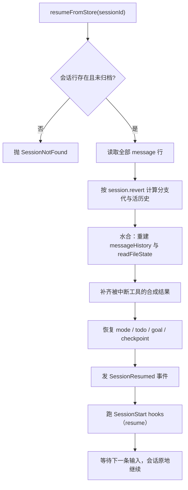

# 2.6 会话持久化与恢复

> 本章导览：把会话写进数据库，让 Agent 关机之后能从原地继续。本章讲清三件事：为什么持久化要选 SQLite、五张表各自存什么、恢复时如何从磁盘行重建整个内存运行态——顺便收获两个副产品：rewind（回退）与 fork（分支）。

## 为什么持久化是一等公民

很多 Agent 教程把"保存对话"当成收尾时的一个附带功能：`JSON.stringify(messages)` 写进文件，完事。ZCode 的做法相反：持久化是 runtime 的**一等公民**，先建库、后干活——启动装配线的早期步骤就是"打开 SQLite session store（含版本化迁移）"（`bootstrap/src/app/create-app.ts`），此后每一个回合的每一条消息都实时落库。为什么给持久化这么高的地位？因为它同时是四个功能的基座：

- **长任务**：一次跨越数小时的重构，中间要经历无数回合。会话不落盘，进程一死全部归零；
- **崩溃恢复**：`--resume <会话 id>` 从任意历史会话原地继续；`--continue` 更进一步，按工作目录自动找最近的一个（`cli/src/resume.ts` 的 `resolveLatestSession`）；
- **rewind 与 fork**：想撤回最后三轮重来？想把当前对话复制一份去试另一个方案？这两个操作的本质都是对持久化历史的查询与复制（本章末节）；
- **多会话**：TUI 可以同时持有多个会话，2.5 节的每个子代理也有自己的 `subagent_<agentId>` 会话——`SendMessage` 之所以能"复活"一个已结束的子代理，就是因为它从存储里恢复了那个 child session。

一句话：**内存是易失的执行态，磁盘是权威的事实源**。本章的所有设计都围绕这句话展开。

## 存储选型：SQLite 而不是 JSONL

最朴素的持久化是 JSONL：一行一条 JSON，追加写，永不改历史。写起来确实舒服，但把 Agent 会话的真实访问模式列出来，它立刻露馅：

| 访问模式 | JSONL 的处境 |
| --- | --- |
| 读某会话最近 N 条消息 | 全文件扫描，按时间排序，再截尾 |
| fork：复制"开头到某条消息为止"的前缀 | 扫描 + 截断 + 写新文件，中途崩溃就是半个新会话 |
| rewind：回退三轮，但旧消息留着以备再回来 | 追加格式里没有"标记某段不活"的位置 |
| 更新一条消息的元数据（标题、状态） | 追加格式不能改写，只能"追加一条修正"再读时合并 |
| 多会话并存 | 一个文件一个会话，跨会话查询（如"该目录最近的会话"）要遍历所有文件 |

这些需求的公共分母是：**查询、事务、部分更新**。这正是关系型数据库的主场，而 Agent 是单机桌面程序，需要一个"零运维、单文件、嵌入进程"的数据库——SQLite 是唯一合理的答案。ZCode 的实现：默认路径 `~/.zcode/cli/db/db.sqlite`，存储层 `packages/adapters/src/storage/session-store/sqlite-session-store.ts`（约 1000 行），加上 `migrations.ts`（约 900 行）的**版本化迁移**——表结构会演进，每个版本对应一个迁移步骤，启动时按序补跑，老库无痛升级。

> **注**：教学版 tinycode 的存储就是一个 JSON 文件（每轮重写，见下一节），因为教学会话短、单会话、无 fork。本节的选型论证会在你把 tinycode 推向真实使用时生效——需求清单里的每一条，JSON 文件同样一条条露馅。

## 教学版：tinycode 的会话文件

tinycode 的 `src/session.ts` 用一个 JSON 文件存一个会话：文件头是元信息，正文是消息数组，**每个回合结束时整体写一次**：

```ts
// tinycode/src/session.ts（一）：会话文件与读写
import { readFile, writeFile } from "node:fs/promises";
import type { ChatMessage } from "./types";

interface SessionMeta {
  id: string;
  title: string;         // 取自首条用户输入，控制台标题即恢复入口的线索
  cwd: string;           // --continue 按"同目录最近会话"匹配的就是它
  mode: string;          // 权限模式，恢复时读回（见 5.3 节）
  createdAt: number;
  updatedAt: number;
}

interface SessionFile {
  meta: SessionMeta;
  messages: ChatMessage[];   // 每轮追加：user / assistant / tool 全量历史
}

export class SessionStore {
  private file: SessionFile | undefined;

  constructor(private path: string) {}

  get messages(): ChatMessage[] { return this.file?.messages ?? []; }

  async load(): Promise<boolean> {
    try {
      this.file = JSON.parse(await readFile(this.path, "utf8")) as SessionFile;
      return true;
    } catch {
      return false;              // 首次运行：还没有会话文件
    }
  }

  async append(messages: ChatMessage[]): Promise<void> {
    if (!this.file) throw new Error("session not loaded");
    this.file.messages.push(...messages);
    this.file.meta.updatedAt = Date.now();
    await writeFile(this.path, JSON.stringify(this.file, null, 2));
  }
}
```

接入只需要在终端入口的两处各加一行：启动时 `load`，有历史就把 `store.messages` 作为 `runAgentLoop` 的初始 `messages`（恢复即续聊）；回合结束后 `append` 把本轮新增的消息落盘。循环本身一行都不用改——持久化在循环之外，这与其"机制无关、只是状态管理"的身份相符。

但有一类状态**必须**在循环之内处理：进程可能在回合中间死掉。2.1 节说过，历史按"assistant 连同工具调用先落盘、结果随后成对回灌"的顺序维护，所以崩溃最多留下"有声明、无结果"的半回合——历史形状依然合法，恢复时补一条合成结果即可。这个伏笔在恢复函数里兑现：

```ts
// tinycode/src/session.ts（二）：恢复时修复被中断的回合
const INTERRUPTED = "[Tool execution was interrupted before resume]";

export function repairInterrupted(messages: ChatMessage[]): ChatMessage[] {
  const pending = new Set<string>();             // 已声明、尚未回灌的 toolCallId
  for (const msg of messages) {
    if (msg.role === "assistant") {
      for (const call of msg.toolCalls ?? []) pending.add(call.id);
    } else if (msg.role === "tool") {
      pending.delete(msg.toolCallId);            // 结果到了，声明兑现
    }
  }
  // 剩下的就是中断现场：逐个补一条合成结果，恢复 2.1 的循环不变量
  return [...messages,
    ...[...pending].map((id) => ({
      role: "tool" as const, toolCallId: id, content: INTERRUPTED, isError: true,
    })),
  ];
}
```

`load` 之后、续聊之前调用一次 `repairInterrupted`，被中断的回合就变成了一个"合法的、诚实的"历史切片——模型看得到"那个工具没跑完"，而不是面对一段莫名断裂的对话。

## 会话库的表结构

现在打开真实系统的库。`0001_base_session_store` 迁移定义了核心五张表（`packages/adapters/src/storage/session-store/migrations.ts`，有删节）。先是会话本身：

```sql
create table if not exists session (
  id text primary key,
  project_id text not null,
  parent_id text,          -- fork 链：子会话指向父会话
  slug text not null,
  directory text not null, -- 工作目录：--continue 的匹配依据
  title text not null,
  revert text,             -- rewind / 分支切割（JSON），本章末节的中心
  permission text,
  time_created integer not null,
  time_updated integer not null,
  time_compacting integer, -- 压缩发生的时间点（见 2.4 节）
  time_archived integer    -- 归档时间：非空则会话不可 resume
);
```

然后是消息、部件、会话条目与 todo：

```sql
create table if not exists message (
  id text primary key,
  session_id text not null references session(id) on delete cascade,
  time_created integer not null,
  time_updated integer not null,
  data text not null       -- 整条消息的 JSON（含全部内容块）
);
create table if not exists part (
  id text primary key,
  message_id text not null,
  session_id text not null,
  data text not null       -- 消息部件：文本段 / 工具调用 / 时间线事件……
);
create table if not exists session_entry (
  id text primary key,
  session_id text not null references session(id) on delete cascade,
  type text not null,      -- 模型选择 / 执行状态 / goal 校验……
  data text not null
);
create table if not exists todo (
  session_id text not null references session(id) on delete cascade,
  content text not null,
  status text not null,
  priority text not null,
  position integer not null,
  primary key(session_id, position)
);
```

四个设计决策值得逐个看。**其一，`message.data` 存整条消息 JSON**——不做列拆分。消息的形状由模型协议决定（2.1 节的类型），协议演进频繁，整条存储让存储层与协议层解耦：加一个内容块类型，存储层零改动。**其二，`part` 表是消息的"展开视图"**：一条 assistant 消息被拆成文本段、每个工具调用、时间线事件等部件分别成行，流式 UI 的每次增量刷新只 UPDATE 一个 part 行，而不是重写整条消息——这就是"为什么不在 message.data 里改字节"的答案。**其三，`session.revert` 与 `parent_id` 是时间操作的两个挂载点**：同会话内的回退写 `revert`，跨会话的分支写 `parent_id`，本节末节展开。**其四，非消息状态进 `session_entry`**：按 `type` 区分的键值行——模型选择、执行状态（权限模式 `{mode, planEnabled}` 就存这里，恢复时读回）、goal 校验状态（见 5.4 节）。todo 单独成表，因为它是小行、多行、按位置排序的清单，行式存储天然合适（见 5.1 节）。

最后回答一个概念问题：**"会话对象"在哪里？** 答案是没有独立的 Session 类——**runtime 即会话**。同一个会话存在两种形态：

| 内存形态（runtime 字段） | 磁盘形态（表行） |
| --- | --- |
| `messageHistory` | `message` / `part` 行 |
| `readFileState`（已读水位） | 不直接落盘，恢复时从历史重建 |
| 权限模式 `{mode, planEnabled}` | `session_entry`（type = 执行状态） |
| todo 清单 | `todo` 表 |
| 分支切割状态 | `session.revert` |
| 标题、目录、归档与否 | `session` 行本身 |

内存态是执行用的，磁盘态是事实源，两侧实时同步。生命周期是惰性的：runtime 构造后不落库，首条输入才首次持久化——空会话不值得占一行。

## 恢复（Resume）：从数据库重建内存状态

恢复的目标可以一句话说清：**把磁盘行重新变成内存运行态，让下一个回合与崩溃前无缝衔接**。核心在 `packages/core/src/runtime/methods/resume.ts`：

```ts
// packages/core/src/runtime/methods/resume.ts（有删节）
export async function resumeFromStore(this, options) {
  const session = await this.sessionStore.getSession(this.sessionId);
  if (!session || session.time.archived !== undefined) {
    throw createCoreError(CoreErrorType.SessionNotFound, `Session not found: ${this.sessionId}`);
  }
  const messages = await this.sessionStore.messages({ sessionID: this.sessionId });
  // session.revert 的分支切割决定哪些历史行是"活"的
  this.branchGeneration = session.revert?.branchGeneration ?? 0;
  this.workingDirectory = session.directory;
  this.messageHistory = new MessageHistoryImpl();
  this.contextBuilder = null;
  this.contextInitialized = false;
  // hydrateMessageHistoryFromSession / hydrateReadFileStateFromSession 重建内存态
  // ……恢复 checkpoint、mode、todo、goal
  // 发 SessionResumed 事件 + 跑 SessionStart hooks（原因 "resume"）
}
```

完整流程画出来是这样：



三个步骤值得细看。**水合历史**（`agent/session-history-hydrator.ts`）：把消息行还原为内存历史，期间执行上一节 `repairInterrupted` 的真实版——被中断的工具调用补上固定文案 `"[Tool execution was interrupted before resume]"`。2.1 节埋下的伏笔在此完全兑现：正因为写入侧坚持"声明与结果成对"，恢复侧才能机械地找到所有破口并一一缝上，循环不变量在崩溃这种最极端的路径下依然成立。

**重建已读水位**（`agent/read-file-state-hydrator.ts`）：`readFileState` 记录"这个文件我在什么时候读到过什么版本"，编辑工具靠它强制"先读后改"（见 3.2 节）。它不直接落盘，而是恢复时**从历史重算**——扫一遍历史里的 Read 结果与文件时间戳，把水位重建到崩溃前的样子。这避免了每读一个文件就写一行状态的高频落盘，代价只是恢复时多一次历史扫描。

**恢复执行状态**：权限模式从 `session_entry` 读回。这里有一个真实注释记录的坑：

> **踩坑**：恢复权限模式时，不能"只要历史里存在任意 mode 事件就拿来用"——部分历史事件不携带 mode，盲目 reduce 会用默认值 `build` 覆盖掉 headless 场景的 `yolo`（`runtime/methods/resume.ts`）。规则是：只有权威 mode 事件能恢复历史值，而本次启动的显式指定仍保持最高优先级。状态的恢复要看清"哪些记录才有资格说话"，否则默认值会悄悄吃掉用户的显式选择。

收尾的两步让恢复成为一次"事件"而不是静默偷换：发出 `SessionResumed` 事件（UI、遥测都靠它感知会话已切换），然后以 `"resume"` 为原因跑一遍 SessionStart hooks（见 4.1 节）——hook 的语义是"会话开始了"，恢复也是一种开始。

> **工程细节**：ZCode 用一套"影子重放"来为恢复质量兜底（`scripts/shadow-replay.mjs`）：把真实库里的全部历史会话喂给冷恢复管线，输出守恒对账报告——崩溃数、助手文本缺失、用户输入不匹配——源码注释写明上线门槛是"全量重放无崩溃、无静默丢弃"。持久化的正确性不靠测试用例覆盖，靠对真实数据全量回放来证明。

## Rewind 与 Fork：时间的分支

有了完整的持久化历史，"改时间"成了两个纯数据操作。

**Rewind（同会话回退）**：用户想撤回最后几轮重来。ZCode 的做法出人意料地保守——**不删除、不移动任何历史行**，而是把一个"分支切割"（branch cut）写进 `session.revert` 字段（JSON 四元组，附带分支代 `branchGeneration`）。此后的读取按切割点过滤：切割点之前的历史是"活"的，之后的一律隐身。旧消息仍在库里，随时可以再切回去。这样做的红利：回退是 O(1) 的一行 UPDATE，且审计轨迹完整；代价是每次读历史都要按切割点过滤——用读侧的一点复杂度，换写侧的永不破坏。分支代还在别处站岗：2.5 节的后台通知带着旧分支代就会被丢弃，"旧时间线的任务完成了"这类幽灵消息过不了闸。

**Fork（分支出新会话）**：想把当前对话复制一份去试另一个方案，就得真造一个新会话。`createForkedSession`（`runtime/methods/session-fork.ts`）的流程：新建 child 会话行（`parent_id = 父会话 id`）→ 复制活历史范围内的消息行 → 返回新旧消息 id 的映射 → 在新会话里补一条 fork notice 时间线 part。关键约束是**原子性**：这套复制由 `commitForkBundle` 在**一个事务**里完成——子会话行、全部复制消息、session_entry 同生共死。没有事务，中途崩溃会留下"有会话行但没有消息"或反之的畸形会话；有了事务，fork 要么完整存在，要么从未发生。

fork 有四种入口，覆盖不同的分支动机：

| fork 方法 | 分支点 | 用途 |
| --- | --- | --- |
| `forkWorkspaceFromCheckpoint` | workspace 检查点 | 连文件状态一起回滚：代码与对话同步回退 |
| `forkStableConversationAtMessage` | 某条消息处 | 从这条消息之后分叉，复制其前的历史 |
| `forkConversationBeforeMessage` | 某条消息之前 | 不想要这条消息，从它之前分叉 |
| `createSelectionSideConversation` | 编辑器划选内容 | 划词副屏小会话：只带选中的片段去问 |

前三者都走 `commitForkBundle` 原子提交；第四种是刻意"轻"的——只带一段选中文本起个小会话，不背历史包袱。

rewind 与 fork 的分工一句话说清：**在同一段历史里反悔，用 rewind（写 `revert`，不造新会话）；要带着历史去平行世界，用 fork（写 `parent_id`，新会话）**。前者是时间上的撤销，后者是空间上的分身。

## 小结

- 持久化是四个功能的基座：长任务、崩溃恢复（`--resume` / `--continue`）、rewind 与 fork、多会话与子代理续聊；内存是执行态，磁盘是事实源。
- 会话的访问模式需要查询、事务、部分更新——JSONL 全部露馅，SQLite（单文件、嵌入、版本化迁移）是桌面 Agent 的唯一合理解。
- 五张表各司其职：`message.data` 整条存（与协议解耦）、`part` 存部件（流式 UI 的增量写）、`session_entry` 存非消息执行状态、`todo` 存清单；`session.revert` 挂回退，`parent_id` 挂分支。
- runtime 即会话：内存态是 runtime 字段，磁盘态是表行，构造惰性、落库实时。
- 恢复是把磁盘行重新水合成内存态：重建历史、补中断工具的合成结果 `"[Tool execution was interrupted before resume]"`、从历史重算已读水位、恢复 mode/todo/goal，最后以 SessionResumed 事件与 SessionStart hooks 宣告"会话开始了"。
- rewind 写分支切割（旧历史不删，只是不再算"活"），fork 靠 `commitForkBundle` 原子造新会话——撤销与分身，都是对持久化历史的纯数据操作。

至此，Agent Runtime 的四梁八柱全部立起来了：会转的循环、协议化的工具、被经营的上下文、可压缩的历史、能委派的子代理、丢不了的会话。但这个 runtime 还"赤手空拳"——它没有一个真正能读写代码的工具。下一部分从最基础的开始：文件系统工具。
