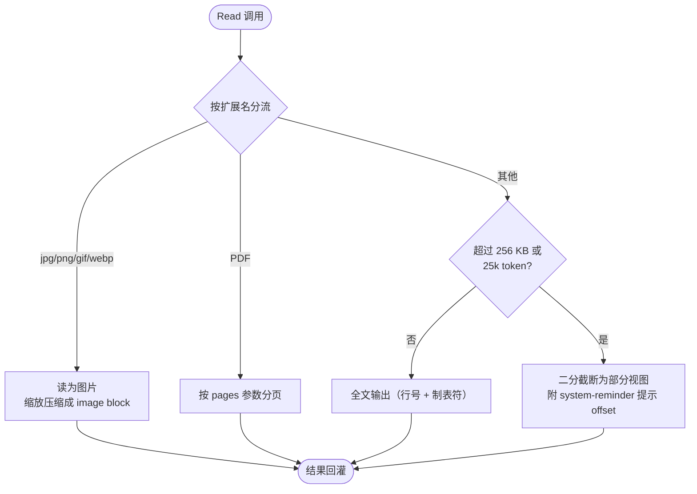

# 3.1 文件系统工具

> 本章导览：文件读写是 Agent 与代码库交互的第一层。本章拆解 Read、Write、Glob 三个工具为什么长成现在这个样子——它们不是 `fs.readFile` 的薄包装，而是为"模型如何有效观察世界"专门设计的接口。

2.1 节把 Agent Loop 立起来之后，循环里跑的是什么就成了下一个问题。对 Coding Agent 而言答案是明确的：**文件系统就是 Agent 的眼睛和手**。模型没有工作目录、没有光标、甚至没有"当前打开的文件"的概念——它对代码库的全部认知，都来自工具结果回灌的那段文本。这意味着文件工具的设计质量直接决定模型的行为质量：读出来的东西太大会挤爆上下文（见 2.4 节），太小会诱导模型瞎猜；写入没有前置校验，模型就会凭想象盲改。

于是"文件系统工具"这个听起来最平庸的题目，实际上是一整套**面向模型的 I/O 设计**：怎么读、读到多少算够、怎么写、写到哪算越界。本章用 tinycode 的三个文件——`src/tools/read.ts`、`src/tools/write.ts`、`src/tools/glob.ts`——把它们逐一实现，并随时对照真实系统 ZCode 的做法。

## 读 / 写 / 创建 / 移动 / 删除

先盘点工具清单。直觉上文件系统工具应该是一套对称的 CRUD：读、写、创建、移动、删除。真实系统 ZCode 的内置工具表里却是另一幅图景——只有 Read、Write、Edit 三个直接操作文件的工具（Edit 见 3.2 节），**没有删除、没有移动、没有重命名**。

这不是遗漏，而是一个刻意的安全决策。删除和移动属于"一次调用、难以挽回"的破坏性操作，而 Agent 的调用方是一个概率系统——它可能猜错路径、可能误解意图。把这些操作收编到 Bash 里（`rm`、`mv`），就自动落入 Bash 的权限体系：每条命令都要经过只读语义分析与审批（见 3.4 节与 5.3 节），破坏性命令天然要过人在回路这一关。工具越少、越可预测，权限模型就越简单。

Write 一个工具同时承担"创建"与"覆盖"两个语义——文件存在与否决定它是 create 还是 update，输出里会明确告诉模型这一次是哪种。至于"读"，它比想象中复杂得多，值得单独一节。

## 大文件与分页读取

Read 的参数面非常朴素：`file_path`（要求绝对路径）、`offset`（起始行）、`limit`（行数），外加 PDF 场景的 `pages`。真正的设计全部藏在输出侧。

第一件事是**输出形态**。Read 返回的是 `cat -n` 风格的文本：每行前面是行号加制表符。

```text
1\timport { readFile } from "node:fs/promises";
2\t
3\texport async function loadConfig() {
```

给行号不是装饰。模型接下来要用 Edit 修改这个文件时，old_string 的定位、对修改点的引用，全靠这些行号建立坐标系——这和你在终端里 `cat -n` 之后跟同事说"第 37 行有问题"是同一个道理。

第二件事是**预算**。上下文窗口是稀缺资源（2.3、2.4 两章反复强调过），一次 Read 最多能吃掉多少，必须有硬上限。ZCode 的 Read（`packages/core/src/tool/handlers/read.ts`，526 行）规定：不传 `limit` 时最多读 256 KB；同时做 token 估算，超过 25,000 token 就生成**部分视图（partial view）**——用二分查找找出"放得进预算的最大前缀行数"，目标是预算的 85%（约 21,250 token），留一点余量给格式开销。

关键在于截断之后发生什么。Read 不是默默掐断，而是在结果末尾附上一条提示，明确告诉模型这是个部分视图、从哪里继续：

```text
<system-reminder>
File content was truncated (showing lines 1-412 of 1833).
Use offset=412 to continue reading.
</system-reminder>
```

这是一条写给模型的指令。模型读到它，就会带着 `offset` 再调一次 Read——分页读取不是靠模型自觉，而是靠工具结果里的"路标"。



第三件事是**多模态分流**。图片（jpg/png/gif/webp）不走文本通道：ZCode 会把图片读进内存、缩放压缩（base64 输入上限 5 MB、最长边 2000 px、token 预算 25,000），然后作为 image block 直接交给多模态模型"看"。模型不需要你写一段话描述截图——它真的能看见。视频与 PDF 各有独立分支。一个工具接口，三种感知通道，按扩展名路由。

> **工程细节**：还有一条容易被忽略的规则——**重复读去重**。模型有时会焦虑地反复读同一个文件。ZCode 记录每个文件的读取状态，同样的 `(path, offset, limit)` 再次读取、且文件 mtime 和大小都没变时，不再回灌全文，而是返回一行 stub：`Wasted call — file unchanged since your last Read. Refer to that earlier tool_result instead.`（`handlers/read.ts`）。这既是省 token，也是在温和地纠正模型行为。

第四件事是**报错体验**。文件不存在时，Read 不是甩一个 ENOENT 完事，而是列出同目录下的文件名，找出与目标编辑距离 ≤ 3 的候选，附加一句 `Did you mean src/tool/handlers/reader.ts?`。模型经常只是把路径拼错了一两个字母，这条提示能让它在下一次调用里自我纠正，而不用再烧一个回合去 `ls` 目录。

现在写 tinycode 的版本。工具定义部分：

```ts
// tinycode/src/tools/read.ts
import { readFile, stat } from "node:fs/promises";
import { extname } from "node:path";

const MAX_BYTES = 256 * 1024;    // 单次读取字节上限，与真实系统一致
const MAX_TOKENS = 25_000;       // 回灌模型的 token 预算
const IMAGE_EXTS = new Set([".png", ".jpg", ".jpeg", ".gif", ".webp"]);

export const readTool = {
  name: "Read",
  description: "读取文件。大文件会截断，并在结果末尾提示续读的 offset。",
  inputSchema: {
    type: "object",
    properties: {
      file_path: { type: "string", description: "文件绝对路径" },
      offset: { type: "number", description: "起始行号（从 1 起）" },
      limit: { type: "number", description: "最多读取行数" },
    },
    required: ["file_path"],
  },
};
```

处理逻辑分两段。先按扩展名分流，再做行号排版：

```ts
export async function readHandler(input, ctx) {
  const abs = resolveWorkspacePath(input.file_path, ctx.workingDirectory);
  const info = await stat(abs);
  if (IMAGE_EXTS.has(extname(abs))) {
    return imageBlock(abs);        // 多模态分支：base64 图片块直接交给模型"看"，此处从略
  }

  let text = await readFile(abs, "utf8");
  if (Buffer.byteLength(text) > MAX_BYTES) {
    text = text.slice(0, MAX_BYTES);   // 真实系统还会对齐字符边界，此处省略
  }
  const lines = text.split("\n");
  const start = input.offset ?? 1;
  let kept = lines.slice(start - 1, start - 1 + (input.limit ?? lines.length));

  // 超预算时收缩行数。真实系统用二分找最大前缀，教学版按 90% 逐步收缩，
  // 语义一致：宁可少读一点，也不挤爆上下文。
  while (estimateTokens(kept) > MAX_TOKENS && kept.length > 1) {
    kept = kept.slice(0, Math.floor(kept.length * 0.9));
  }
  const body = kept.map((l, i) => `${start + i}\t${l}`).join("\n");

  ctx.readFileState.set(abs, { mtimeMs: info.mtimeMs, isPartialView: /* 见 3.2 */ kept.length < lines.length });
  if (kept.length < lines.length) {
    return `${body}\n\n<system-reminder>File is truncated. Use offset=${start + kept.length} to continue.</system-reminder>`;
  }
  return body;
}
```

注意最后那个 `ctx.readFileState.set(...)`：读取这个动作在会话状态表里登记了一笔，它是 3.2 节"read-before-edit"机制的基石。这里先记住：**Read 的副作用不是没有，而是记下来供别的工具用**。

## Write：整文件覆盖与状态闭环

Write 的参数只有两个：`file_path` 和 `content`，语义是**整文件覆盖**——不追加、不局部替换，content 就是文件的最终形态。创建新文件和改写旧文件走同一条路，靠"文件是否存在"区分 create 与 update，输出里会带上这个类型让模型知道发生了什么。

覆盖一个已存在的文件是危险动作：如果模型没读过这个文件，它写出的 content 很可能把别人的代码整个抹掉。所以 ZCode 的 Write（`handlers/write.ts`，377 行）有硬性前置条件：

1. **read-before-write**：目标文件必须在会话里被 Read 过，否则返回 `FILE_NOT_READ` 错误，文案是 `File has not been read yet. Read it first before writing to it.`——又是一句写给模型的话，直接告诉它下一步该做什么。
2. **freshness 校验**：Read 之后文件被改过（用户手动改的、linter 格式化的），再写就是基于过期认知的覆盖。检测到 mtime 变化则返回 `STALE_FILE`，要求重新 Read。
3. **原子写入 + 乐观并发**：真实写入调用形如 `writeTextFile({ atomic: true, createParents: true, expectedRevision })`。`atomic` 保证磁盘上不会出现半个文件；`expectedRevision` 记录 Read 时的版本，若这期间文件被第三方改动，写入直接失败——校验和写入之间没有竞态窗口。

输出同样经过设计。Write 成功后，模型可见内容是一句话，末尾固定带一个括号注记：

```text
The file /path/to/config.ts has been updated. (file state is current in your context — no need to Read it back)
```

这个括号注记大有用意。模型有个顽固的习惯：写完文件立刻再 Read 一遍"确认"。在人类工作流里这叫谨慎，在 Agent 里这是纯粹的 token 浪费——Write 的结果已经保证了上下文里的认知与磁盘一致。这句话直接掐灭了这个冲动，同时把新内容登记进已读状态表，让后续 Edit 也不必重新 Read。省下的不是一次调用，而是每次验证循环里几千 token 的重灌。

> **工程细节**：Write 的输出预算是 maxOutputBytes 1MB、模型可见内容上限 100KB（`handlers/write.ts` 的 resultBudget）。写一个大文件时，diff 与确认信息本身也可能撑爆预算——任何工具的输出都要过预算关，没有例外。

tinycode 的 `src/tools/write.ts`：

```ts
// tinycode/src/tools/write.ts
import { mkdir, rename, stat, writeFile } from "node:fs/promises";
import { dirname } from "node:path";

export async function writeHandler(input, ctx) {
  const abs = resolveWorkspacePath(input.file_path, ctx.workingDirectory);
  const existed = await exists(abs);

  if (existed) {
    const failure = checkEditableReadState(ctx.readFileState, abs);
    if (failure) return failure;       // FILE_NOT_READ / STALE_FILE，见 3.2 的实现
  }

  // 原子写：先写临时文件再改名，磁盘上永远看不到"半个文件"
  await mkdir(dirname(abs), { recursive: true });
  const tmp = `${abs}.tmp-${process.pid}`;
  await writeFile(tmp, input.content);
  await rename(tmp, abs);

  const mtimeMs = (await stat(abs)).mtimeMs;
  ctx.readFileState.set(abs, { mtimeMs, isPartialView: false });
  const verb = existed ? "updated" : "created";
  return `The file ${abs} has been ${verb}. ` +
    "(file state is current in your context — no need to Read it back)";
}
```

教学版用"写临时文件 + rename"复刻原子语义，省略了 `expectedRevision` 的版本比对——它会留到 3.2 节 read-file-state 里以 mtime 比对的形式讲清楚。

## Glob：按文件名定位

第三个工具 Glob 解决一个更粗粒度的问题：**我不知道文件在哪，但知道它叫什么**。参数是 `pattern`（如 `**/*.ts`）和可选的 `path`（搜索根目录）。

它的输出策略体现了和 Read 一致的克制：最多返回 100 条，**按修改时间排序**（最近改动的优先），超过限额时在末尾附 `(Results are truncated...)`。按 mtime 排序是关键决策——在大型仓库里 `**/*.test.ts` 可能命中上千个文件，而模型通常关心的是"最近在动的那些"。上限 100 条、总量 100 KB（`handlers/glob.ts`）保证 Glob 永远不会成为挤爆上下文的那根稻草。

tinycode 的 `src/tools/glob.ts`，模式匹配手写一个极简转换器：

```ts
// tinycode/src/tools/glob.ts
import { readdir, stat } from "node:fs/promises";
import { join, relative, sep } from "node:path";

const MAX_RESULTS = 100;   // 与真实系统一致

function patternToRegExp(pattern: string): RegExp {
  const esc = pattern
    .replace(/[.+^${}()|[\]\\]/g, "\\$&")  // 先转义正则元字符
    .replace(/\*\*/g, "\0")                // ** 占位，避免被下一行吃掉
    .replace(/\*/g, "[^/]*")               // * 不跨目录
    .replace(/\0/g, ".*")
    .replace(/\?/g, "[^/]");
  return new RegExp(`^${esc}$`);
}

export async function searchFiles(root: string, pattern: string): Promise<string[]> {
  const re = patternToRegExp(pattern);
  const hits: { path: string; mtimeMs: number }[] = [];
  async function walk(dir: string) {
    for (const e of await readdir(dir, { withFileTypes: true })) {
      if (e.name === "node_modules" || e.name.startsWith(".")) continue;
      const p = join(dir, e.name);
      if (e.isDirectory()) await walk(p);
      else if (re.test(relative(root, p).split(sep).join("/"))) {
        hits.push({ path: p, mtimeMs: (await stat(p)).mtimeMs });
      }
    }
  }
  await walk(root);
  return hits
    .sort((a, b) => b.mtimeMs - a.mtimeMs)   // 最近修改优先
    .slice(0, MAX_RESULTS)
    .map((h) => h.path);
}
```

工具外壳只是把这个函数的结果 join 成多行文本返回，此处不再展开。

## 路径安全与越界防护

三个工具都要回答同一个问题：模型给的路径，以哪里为基准解析？

规则很简单：**绝对路径直接归一化使用；相对路径以工作目录（`workingDirectory`）为基准 resolve 成绝对路径**。注意基准不是"仓库根目录"而是工作目录——它是跨调用持久的会话状态，Bash 里 `cd` 过之后，后续文件工具的相对路径也跟着走（见 3.4 节）。tinycode 把这条规则单独放进 `src/tools/path.ts`：

```ts
// tinycode/src/tools/path.ts
import { isAbsolute, normalize, resolve } from "node:path";

export function resolveWorkspacePath(inputPath: string, workingDirectory: string): string {
  return isAbsolute(inputPath)
    ? normalize(inputPath)
    : resolve(workingDirectory, inputPath);
}
```

那么下一个问题顺理成章：解析出的路径落在工作区之外怎么办？要不要硬阻断？

真实系统的答案写在了源码注释里，坦白得罕见（`packages/core/src/tool/path-policy.ts`）：

```ts
const resolvedPath = isAbsolute(requestedPath)
  ? normalize(requestedPath)
  : resolve(workingDirectory, requestedPath);

// Current release intentionally does not hard-block paths outside workspaceRoot.
// Cause: subagents may need to inspect user-requested sibling repos or external files
// before the filesystem permission adapter grows explicit ask/deny rules for them.
return resolvedPath;
```

翻译过来：**当前版本有意不对工作区外的路径做硬阻断**。原因是子代理（见 2.5 节）可能需要检查用户点名要求的兄弟仓库或外部文件——比如"帮我看看隔壁那个项目的构建脚本"。如果路径策略一刀切，这类合法任务直接做不了。

这是安全设计里典型的权衡：**硬阻断简单可靠但误伤合法任务；放行则把安全责任移交给下游**。ZCode 选择了后者——路径层只做解析，写操作的安全由权限层兜底（Write/Edit 属于需审批的写操作，读取基本放行，详见 5.3 节）。教学版与真实系统保持同一立场：不做路径黑名单，把安全留给权限系统，这比在工具里私设一道一拍脑袋的围墙更诚实。

> **注**：不做硬阻断不等于不设防。ZCode 的沙箱一章（report 结论）明确当前没有 OS 级沙箱，真实边界是"权限规则 + 命令语义分析 + 零散护栏"的组合。工具层、权限层、审批 UI 各管一段，谁也不假装自己能包办安全。

## 权限边界

最后把三个工具放进权限的坐标系里。2.1 节讲过，每个工具在注册时携带一份元数据声明（`ToolMetadata`），文件三件套的声明是这样的：

| 工具 | readOnly | concurrentSafe | 超时 | plan 模式可用 |
| --- | --- | --- | --- | --- |
| Read | 是 | 是 | 30s | 是 |
| Glob | 是 | 是 | 30s | 是 |
| Write | 否 | 否 | 30s | 否 |

这份元数据不是文档，是行为：

- `readOnly: true` 让 Read/Glob 进入调度器的只读集合（2.1 节的 `READ_ONLY_TOOLS`），彼此可以并行执行，且在 plan 模式（只读规划，见 5.2 节）下可用；
- Write 的 `readOnly: false` 意味着它在 build 模式下要过审批（或被"自动接受编辑"的配置豁免），在 plan 模式下直接不可用；
- 30 秒超时对本地文件操作绰绰有余，真正的长尾在 Bash——那是 3.4 节的故事。

> **注**：Edit 的元数据与 Write 同类（写操作、不可并行），但它在调度上还有个特殊身份：`concurrentSafe: false` 让每次 Edit 独占执行组，两个 Edit 永远串行，见 2.1 节调度器的分析。

回到开头的"移动/删除"：现在可以完整地回答了。文件工具族刻意停留在"读、覆盖、局部改"三个原语上，凡是不可逆的操作一律下沉到 Bash 命令层，让权限系统按命令逐一评估。**工具面越窄，安全面越清晰**——这个原则会在第 5 部分反复出现。

## 小结

本章实现了 tinycode 的文件三件套：`read.ts` 负责观察——行号排版、字节与 token 双预算、部分视图加续读路标、图片走多模态分流、重复读去重；`write.ts` 负责改写——整文件覆盖、read-before-write 前置校验、原子写入，以及那句"file state is current"省掉模型无效的确认循环；`glob.ts` 负责按文件名定位，100 条上限加 mtime 排序。路径层只做解析不做围墙，安全交给权限系统。

贯穿三节的是同一条设计哲学：**工具结果是写给模型看的接口**。行号、续读提示、"Did you mean"、"no need to Read it back"，全都是在替模型省 token、省回合、省犯错机会。

下一章处理这三个工具留下的悬案：模型要改的是文件里的一小段，而不是整个文件——Edit 怎么在不重写全文的前提下做到精确替换，以及那张 `readFileState` 表究竟如何工作。
