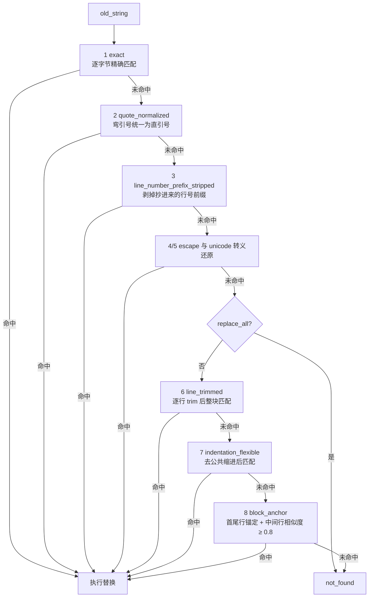
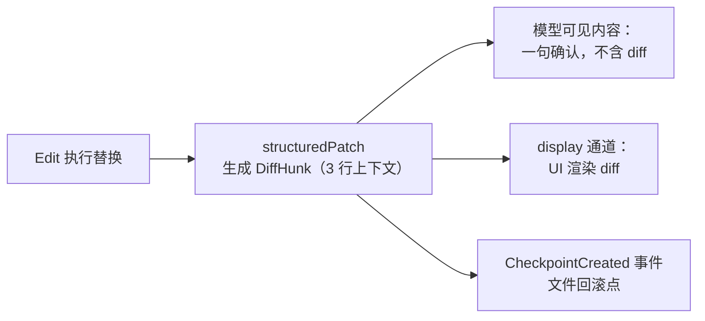

# 3.2 代码编辑策略

> 本章导览：改代码是 Coding Agent 最高频、也最危险的动作。本章回答三个问题：为什么不让模型输出整个文件、字符串替换怎么做到"容错但不失控"、以及那张已读文件状态表如何把编辑建立在真实内容之上。

3.1 节的 Write 能改文件，但它是整文件覆盖。对一个几千行的源文件做三行修改，让模型重吐全文，既昂贵又危险——本章从这个问题出发，造出 Coding Agent 真正的主力编辑工具：Edit。

## 整文件重写

先把"让模型输出整个文件"这条路线认真推敲一遍，因为它并非全无道理：接口最简单（`file_path` + `content`），语义最明确（写完即最终态），实现零难度。1.2 节的最小示例里我们就是这么干的。

它在大文件面前崩溃，原因有二。

**第一是 token 经济**。改 3 行却要重写 800 行，输入端模型要重新生成这 800 行，输出端的 token 计费与生成延迟全按 800 行算。对 Agent 这种一个回合可能编辑几十次的场景，成本按数量级放大。

**第二是漂移（drift）**，比成本更致命。模型"重写"文件时并不是逐字节誊抄未修改部分——它是凭对文件的记忆重新生成。记忆有损：某行缩进变了、一个不相关的函数被顺手"清理"了、一段看似冗余的代码消失了。这些静默改动不报错，只在代码评审时被人发现。**模型输出越长，与原文漂移的概率越大**；而代码文件恰恰要求未修改部分零漂移。

所以工程结论是：整文件覆盖只适合两个场景——创建新文件，以及改写模型自己刚生成的短文件。其余编辑一律走精确替换。

## 精确 patch / search-replace

Edit 的参数只有四个核心项：`file_path`、`old_string`（要被替换的原文）、`new_string`（替换后的文本）、`replace_all`（是否替换全部出现）。模型的工作方式是：从它读过的文件里**逐字复制**一段原文，修改后作为新文本交回。未提及的部分物理上不可能被动到——漂移问题从接口层面被消灭。

剩下的问题是工程上最有趣的部分：**模型抄的 old_string 经常和文件里的真实字节对不上**。缩进抄错、把 Read 输出的行号也抄进去、中文弯引号当直引号用——直接 `indexOf` 查不到，编辑就失败。失败太多，模型会开始绕路（整文件重写），前功尽弃。

ZCode 的解法（`packages/core/src/tool/edit-matchers.ts`）是一套**八级字符串匹配策略链**：从严格到宽松逐级降级，第一级命中即停。



八级策略各自对症一种真实的模型失误：

| 级别 | 策略 | 治什么病 |
| --- | --- | --- |
| 1 | `exact` | 理想情况，逐字节相等 |
| 2 | `quote_normalized` | 模型把代码里的 `'` `"` 写成弯引号 `‘’“”` |
| 3 | `line_number_prefix_stripped` | 模型把 Read 输出的 `12:\t` 行号一起抄进 old_string |
| 4 | `escape_normalized` | 模型输出 `\n` `\t` 等可见转义而非真字符 |
| 5 | `unicode_escape_normalized` | `\uXXXX` 形式的转义还原 |
| 6 | `line_trimmed` | 每行首尾空白不一致（最常见：缩进抄错） |
| 7 | `indentation_flexible` | 整块缩进错了层级——去公共缩进后匹配 |
| 8 | `block_anchor` | 中间内容有细微出入：首尾行锚定，中间行 Levenshtein 相似度 ≥ 0.8 |

真实系统的核心循环值得完整看一次：

```ts
// packages/core/src/tool/edit-matchers.ts（有删节）
export function findEditMatch(input: { content; search; replaceAll }): EditMatchResult {
  const exact = collectExactCandidates(input.content, input.search);
  if (exact.length > 0) return toMatchResult("exact", exact);

  const strategies: EditMatchStrategy[] = [
    "quote_normalized",
    "line_number_prefix_stripped",
    "escape_normalized",
    "unicode_escape_normalized",
    "line_trimmed",
    "indentation_flexible",
    "block_anchor",
  ];
  for (const strategy of strategies) {
    if (input.replaceAll && BROAD_MATCHERS.has(strategy)) continue;  // 宽松策略禁用于全局替换
    const candidates = collectCandidates(strategy, input.content, input.search);
    if (candidates.length === 0) continue;
    return toMatchResult(strategy, candidates);
  }
  return { status: "not_found" };
}
```

三条配套原则让这条链"容错但不失控"：

**其一，宽松策略在 `replace_all` 时被禁用**。`BROAD_MATCHERS`（`line_trimmed`、`indentation_flexible`、`block_anchor` 三种）在全局替换模式下直接跳过。道理很直白：replace_all 的语义是"把所有匹配都换掉"，用宽松匹配找出的一批"长得差不多"的块，很可能包含不该动的代码——模糊匹配配全局替换等于大面积误伤。

**其二，命中必须唯一**。`replace_all: false` 而匹配出现多次时，Edit 不猜，直接返回业务失败 `AMBIGUOUS_REPLACE`，文案引导模型自救："匹配到 N 处，请在 old_string 中纳入更多上下文行使匹配唯一，或使用 replace_all"。注意这是**可预期业务失败**而不是系统异常——2.1 节说过工具失败也是回灌给模型的观察，这里的观察内容是"你怎么改参数才能成功"。

**其三，匹配有回写补偿**。宽松策略匹配成功后，替换文本要做对称的变换：escape 匹配命中的，new_string 也要做同样的转义还原；文件里是弯引号、按直引号匹配上的，替换文本回填弯引号。不补偿的话，"修一处引用"会顺手把全文件的引号风格改了——又是一种隐性漂移。

> **踩坑**：替换本身也有陷阱。JavaScript 的 `String.replace` 若第二个参数是**字符串**，`$&`、`$$`、`$1` 会被解释为特殊 token——模型往代码里写正则或模板字符串时，`"$&"` 很常见，替换结果会被静默改写，且极难排查。所以必须用函数形式：`content.replace(search, () => replacement)`，函数返回值不做任何解释。这个坑写在真实系统的实现里，本书作者也在自己的实现里原样踩过一次。

tinycode 的 `src/tools/edit.ts` 只实现两级——exact 与 line_trimmed——但三原则一条不少：

```ts
// tinycode/src/tools/edit.ts
type MatchStrategy = "exact" | "line_trimmed";

export function applyEdit(content: string, search: string, replacement: string, replaceAll: boolean) {
  for (const strategy of ["exact", "line_trimmed"] as const) {
    const hits = findAll(content, search, strategy);
    if (hits.length === 0) continue;
    if (hits.length > 1 && !replaceAll) {
      return {
        ok: false,
        code: "AMBIGUOUS_REPLACE",
        message: `Found ${hits.length} occurrences of old_string. ` +
          "Include more surrounding lines to make it unique, or set replace_all: true.",
      };
    }
    return { ok: true, strategy, content: swap(content, hits, search, replacement, strategy, replaceAll) };
  }
  return {
    ok: false,
    code: "OLD_STRING_NOT_FOUND",
    message: "old_string not found in file. Read the file again and copy the text exactly, including indentation.",
  };
}
```

匹配与替换分成两个函数。`findAll` 返回命中位置（exact 返回字符偏移，line_trimmed 返回起始行号）：

```ts
function findAll(content: string, search: string, strategy: MatchStrategy): number[] {
  if (strategy === "exact") {
    const hits: number[] = [];
    let at = content.indexOf(search);
    while (at !== -1) { hits.push(at); at = content.indexOf(search, at + 1); }
    return hits;
  }
  // line_trimmed：文件行与 search 行各自 trim 后逐行比较
  const lines = content.split("\n");
  const wanted = search.split("\n").map((l) => l.trim());
  const hits: number[] = [];
  for (let i = 0; i + wanted.length <= lines.length; i++) {
    const window = lines.slice(i, i + wanted.length).map((l) => l.trim());
    if (window.join("\n") === wanted.join("\n")) hits.push(i);
  }
  return hits;
}
```

`swap` 按策略执行替换，关键处就是上面踩坑框说的函数形式：

```ts
function swap(content, hits, search, replacement, strategy, replaceAll) {
  if (strategy === "exact") {
    const once = () => content.replace(search, () => replacement);   // 函数形式：$& 不被解释
    return replaceAll ? content.replaceAll(search, () => replacement) : once();
  }
  const lines = content.split("\n");
  const incoming = replacement.split("\n");
  // 从后往前替换，避免行号位移。真实系统还会把原行的缩进回填到新行，
  // 教学版直接使用 replacement 的原样文本。
  for (let k = hits.length - 1; k >= 0; k--) {
    lines.splice(hits[k], search.split("\n").length, ...incoming);
  }
  return lines.join("\n");
}
```

> **工程细节**：真实系统在删除场景还有个贴心处理——`new_string` 为空且 `old_string` 不以换行结尾时，把行尾换行一并删掉，否则会留下一个空行。这类"替模型收拾边角"的细节在生产代码里很多，都是被真实的糟糕编辑结果逼出来的。

## 已读状态：编辑的资格与时效

现在揭开 3.1 节埋的伏笔：`ctx.readFileState` 这张表（真实系统为 `ReadFileStateMap`，见 `packages/core/src/tool/read-file-state.ts`）到底是什么，为什么 Edit 和 Write 都要查它。

表里每个路径一条记录，记载**模型对这份文件的最新认知**：

```ts
// tinycode/src/tools/read-file-state.ts
export interface ReadFileStateEntry {
  content: string;        // 上次读到（或写入）时的完整文本
  mtimeMs?: number;       // 那一刻磁盘文件的修改时间
  isPartialView: boolean; // 模型看到的是被截断的部分视图吗
  readAt: number;
}

export type ReadFileStateMap = Map<string, ReadFileStateEntry>;
```

一个 Map 背着三个安全目的。

**第一，强制 read-before-edit**。表里没有这个路径，Edit 直接拒绝，返回 `FILE_NOT_READ`。这不是官僚流程：模型若不读就改，old_string 只能来自它的想象——上一版训练数据里的同名函数、别的项目的相似代码。盲改的产出必然失败，而且失败得毫无信息量。先读后改把编辑建立在真实字节上。

**第二，stale 检测**。Read 之后文件可能被别人动了：用户手动改了、linter 跑了格式化、另一个终端 `git checkout` 了旧版本。此时模型认知里的内容和磁盘不一致，基于过期内容做替换轻则 not found，重则制造语义冲突。mtime 变了就返回 `STALE_FILE`，要求重读。真实系统还有一层双保险：即使 mtime 变了，只要那次读取是严格整读且内容逐字节仍相同，也放行——mtime 是个粗糙的信号，内容比对才是终审（`handlers/edit.ts`）：

```ts
// packages/core/src/tool/handlers/edit.ts（有删节）
function getEditableReadStateFailure(filePath, currentRead, readFileState) {
  const lastRead = findEditableReadFileState(readFileState, filePath); // 该路径最新一条已读记录
  if (!lastRead || lastRead.isPartialView) {
    return editFailure(EditErrorCode.FILE_NOT_READ, EDIT_NOT_READ_MESSAGE);
  }
  if (!hasReadStateChanged(lastRead, currentRead)) return undefined;
  // 双保险：严格整读且内容逐字节相同，即使 mtime 变了也放行
  if (isStrictFullRead(lastRead) && lastRead.content === currentRead.content) return undefined;
  return editFailure(EditErrorCode.STALE_FILE, EDIT_STALE_MESSAGE);
}
```

**第三，拒绝编辑部分视图**。`isPartialView: true` 意味着模型只见过文件的某个片段（3.1 节的 token 截断产物）。拿着半份地图导航，撞墙概率极高——所以部分视图直接丧失编辑资格，必须重新完整读取。

tinycode 的校验函数把三件事收拢在一处：

```ts
// tinycode/src/tools/read-file-state.ts（续）
export function checkEditableReadState(
  state: ReadFileStateMap,
  path: string,
  current: { content: string; mtimeMs?: number },
) {
  const last = state.get(path);
  if (!last) {
    return fail("FILE_NOT_READ", "File has not been read yet. Read it first before editing it.");
  }
  if (last.isPartialView) {
    return fail("FILE_NOT_READ",
      "Your previous Read of this file was truncated. Read the full file before editing.");
  }
  if (current.mtimeMs !== undefined && current.mtimeMs !== last.mtimeMs
      && current.content !== last.content) {
    return fail("STALE_FILE",
      "File has been modified since it was last read (by the user, a linter, or another process). Read it again before editing.");
  }
  return undefined;   // null 表示放行
}
```

这张表还有一个让体验质变的细节：**Edit 成功后立即回写状态**。替换完成的那一刻，`readFileState` 里这份文件的 entry 被更新为新内容的完整记录（真实系统的 `sourceTool` 字段会标成 `"Edit"`）。效果是连续多次编辑同一文件不需要重新 Read——模型第一轮 Edit 完，第二轮直接Edit 同一文件的另一处，资格依然有效。没有这条闭环，每次编辑后都要白白多一次 Read。

> **工程细节**：真实系统里这张表还向 Bash 开放。模型用 `cat`/`head`/`grep` 看文件且输出未截断、文件不超过 10MB 时，会自动回填已读状态；反过来，Bash 命令命中 formatter 特征（`--write`、`--fix`、`black`、`rustfmt` 等）后，结果里会提示 `[This command modified N files you've previously read: ... Call Read before editing.]`——最多列 5 个文件。整张表是全工具共享的"模型认知账本"，而不只是 Read/Edit 的私产。

## diff 与补丁

Edit 成功后，输出给模型的只是一句确认（外加 3.1 节说过的"file state is current"注记）。但 UI 上用户看到的是一段带颜色的 diff。两者从哪里来？

答案在 `packages/core/src/tool/diff.ts`：Edit 执行替换的同时，用 diff 库的 `structuredPatch` 生成结构化的补丁——默认 3 行上下文、5 秒生成超时，产出 `DiffHunk[]` 挂在工具结果上。关键的设计切分是：**diff 只给 UI，不给模型**。

为什么不给模型？因为 diff 对模型没有增量信息——它刚提供了 old_string 和 new_string，改动内容它自己最清楚。回灌一段 diff 纯属重复计费。而 UI 没有模型的"先验"，必须靠 diff 展示"刚才那一下改了什么"。同一份数据，两个消费者，各取所需：



第三个消费者在图的最右边：runtime 拿着这份 structuredPatch 生成 `CheckpointCreated` 事件——每次文件变更都留一个回滚点，用户可以 rewind 到任意一次编辑之前。它就是 3.5 节 Git 快照之外、Agent 自己的"git stash"，素材正是 Edit/Write 输出里的 `filePath`、`structuredPatch` 与原文（`runtime/helpers/rewind.ts` 的 `getFileMutationCheckpointCandidate` 会校验并挑出这些字段）。

> **注**：如果模型主动想看 diff——比如"确认一下我改对没有"——它应该调 Bash 跑 `git diff`。工具结果里塞不塞 diff，和模型能不能拿到 diff，是两回事。

## 如何权衡：token、正确性、冲突

把本章的取舍收拢成一张对照表：

| 维度 | 整文件重写（Write） | search-replace（Edit） |
| --- | --- | --- |
| token 成本 | 与文件大小成正比 | 与改动大小成正比 |
| 未修改部分漂移风险 | 存在（模型凭记忆重生成） | 结构上不可能 |
| 接口复杂度 | 一个参数 | 匹配策略链 + 唯一性校验 |
| 失败模式 | 无（总能写进去） | not found / ambiguous（但可引导自救） |
| 适用场景 | 新文件、短文件 | 一切对既有代码的修改 |

三条权衡原则，按重要性排列：

**正确性优先于成功率**。八级匹配链听起来激进，但它的每一级都在"更宽容"与"更模糊"之间画了线：唯一性校验兜底、replace_all 禁用宽松匹配、匹配补偿防止引号漂移。宁可让模型收到一条可自救的错误，也不让一次模糊匹配悄悄改错代码。

**错误信息是写给模型看的 API**。回头看本章出现过的错误文案：`FILE_NOT_READ` 附"Read it first"、`STALE_FILE` 附"Read it again"、`AMBIGUOUS_REPLACE` 附"add more surrounding lines"。真实系统给每个错误编了号（`NO_CHANGE:1`、`FILE_NOT_EXIST:4`、`FILE_NOT_READ:6`、`STALE_FILE:7`、`OLD_STRING_NOT_FOUND:8`、`AMBIGUOUS_REPLACE:9`、`FILE_TOO_LARGE:10`——可编辑文件上限 1GB——等等），编号让模型能在连续失败中稳定地引用与区分错误。设计工具错误时问自己一句：**读到这条消息的下一步行动是什么？** 答案应该就在文案里。

**状态在工具间流动，而不是各管一摊**。Read 登记、Edit 校验、Edit 回写、Bash 参与回填——已读状态表把孤立的工具调用织成一个有记忆的系统。很多自研 Agent 的编辑工具"能用但难用"，差的往往不是匹配算法，而是这张表。

## 小结

本章实现了 tinycode 的 `src/tools/edit.ts` 与 `src/tools/read-file-state.ts`。Edit 用 old_string/new_string 的精确替换替代整文件重写，从接口层面消灭漂移；八级匹配策略链（教学版两级）在容错与失控之间画线，replace_all 禁用宽松匹配、命中必须唯一、`replace(search, () => replacement)` 防住 `$&` 陷阱；已读状态表用一张 Map 实现了强制先读、过期检测、部分视图拒编辑三重防线，Edit 成功后回写让连续编辑免于重读；diff 生成给 UI 与回滚点用，模型可见内容只有一句确认。

工具的错误码、错误文案、括号注记，全是写给模型看的——这个视角会贯穿下一章：搜索工具的输出格式，同样决定着模型在陌生代码库里能不能找到北。
