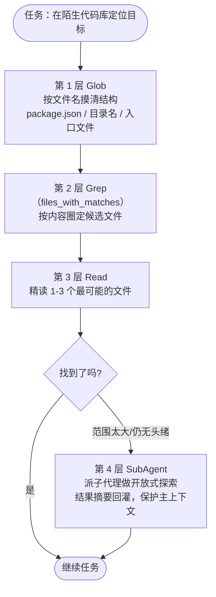

# 3.3 代码搜索与代码库导航

> 本章导览：Agent 接到的任务往往发生在它从未见过的代码库里。本章讲 Grep 与 Glob 怎么分工、为什么专用搜索工具优于 Bash grep、以及"找文件名→搜内容→精读→派子代理"这套层层递进的探索策略。

前两章解决了"读一个文件"和"改一个文件"，但现实任务的第一步从来不是读——是**找**。"修复登录超时的 bug"意味着先要在几十万行代码里定位 `login` 相关的模块；"升级这个废弃 API 的用法"意味着先要找出所有调用点。搜索工具的输出质量，直接决定 Agent 在陌生代码库里是精准导航还是漫无目的地打转。

## 关键词搜索：grep / glob

搜索由两个工具分担，按"找什么"划分：

- **Glob**（3.1 节已实现）：按**文件名模式**找，`**/*.test.ts`、`**/package.json`。适合"配置文件在哪"、"这个模块有哪些测试"这类问题。
- **Grep**：按**文件内容**找，"哪个函数调用了 `legacyLogin`"。这是本章的主角。

Grep 的参数表面看是 ripgrep 的镜像：`pattern`（正则）、`path`（搜索范围）、`glob`/`type`（按文件名或类型过滤）、`output_mode`、`-A/-B/-C`（上下文行）、`-i`（忽略大小写）、`multiline`（跨行匹配）、`head_limit`/`offset`（分页）。底层就是调用 ripgrep——没有自己造正则引擎，站在十余年打磨的性能与语义兼容之上。

真正值得学的是 **`output_mode` 的三档设计**，它控制回灌给模型的信息密度：

| 模式 | 输出形态 | 适用场景 |
| --- | --- | --- |
| `files_with_matches`（默认） | 只列命中的文件路径 | 第一步侦察："哪些文件涉及登录" |
| `content` | `path:line:text` 逐行命中 | 精确定位："调用点具体长什么样" |
| `count` | 每个文件的命中次数 | 评估规模："这个 API 有多少处引用" |

默认是 `files_with_matches` 而不是 `content`，这个默认值本身就是教学：**先广后深**。第一步只要文件清单——便宜、不挤上下文；拿到清单后再对目标文件发 `content` 模式的二次搜索或直接 Read。反过来若默认吐全文命中行，一次宽泛的搜索就能灌回几万 token。

输出还有硬预算：模型可见内容上限 20 KB、超时 30 秒（`packages/core/src/tool/handlers/grep.ts`）。超预算就截断——一份失控的搜索结果和一份失控的文件读取同样致命。

### 为什么不直接用 Bash grep

模型完全有能力调 `Bash` 执行 `grep -rn pattern src/`，事实上效果也差不多。那为什么还要一个专用 Grep 工具？两个理由，都不在"搜索能力"本身。

**第一是权限集成**。Bash 的权限判定要走命令语义分析：每条命令都要解析 argv、查只读白名单（3.4 节详述），判定不了就弹审批窗。而 Grep 工具在元数据里声明了 `readOnly: true`，权限系统直接放行——plan 模式下可用、无弹窗、可并行。用户不需要为"模型搜了个代码"点一次确认。

**第二是 UI 集成**。`content` 模式的 `path:line:text` 是结构化约定，客户端能把它渲染成可点击的文件链接，用户一点就跳到对应行。Bash 的自由文本输出做不到这一点。工具输出的结构化程度，决定了它能不能成为产品体验的一部分。

> **注**：真实系统还有一个特性门控：当嵌入检索（见下文"语义检索"一节）开启时，Glob 和 Grep 会被隐藏出工具清单，由 Bash 的 `find`/`grep` 接管基础搜索。这提醒我们工具清单不是圣旨——同一套权限与预算机制下，搜索能力可以换引擎。

tinycode 的 `src/tools/grep.ts` 用纯正则逐行扫目录，完整展示机制：

```ts
// tinycode/src/tools/grep.ts
import { readFile, readdir, stat } from "node:fs/promises";
import { join, relative, sep } from "node:path";

const MAX_OUTPUT_BYTES = 20 * 1024;   // 与真实系统一致的模型侧上限
const BINARY_RE = /\u0000/;           // 出现 NUL 字节视为二进制文件，跳过

export interface GrepOptions {
  pattern: string;
  path?: string;                        // 搜索根目录，默认工作目录
  include?: string;                     // 文件名 glob，如 "*.ts"
  outputMode?: "content" | "files_with_matches" | "count";
  caseInsensitive?: boolean;
}

export async function grep(options: GrepOptions, cwd: string): Promise<string> {
  const root = options.path ? resolve(cwd, options.path) : cwd;
  const flags = options.caseInsensitive ? "i" : "";
  const re = new RegExp(options.pattern, flags);
  const files: string[] = [];
  await walk(root, options.include, files);          // 复用 3.1 glob.ts 的目录遍历思路

  const matched = new Map<string, { lineNo: number; text: string }[]>();
  for (const file of files) {
    const text = await readIfText(file);             // 二进制与超大文件跳过
    if (text === undefined) continue;
    const hits = scanLines(text, re);
    if (hits.length > 0) matched.set(file, hits);
  }
  return render(matched, root, options.outputMode ?? "files_with_matches");
}
```

其中 `scanLines` 与 `render` 是机制的骨架：

```ts
function scanLines(text: string, re: RegExp) {
  const hits: { lineNo: number; text: string }[] = [];
  text.split("\n").forEach((line, i) => {
    if (re.test(line)) hits.push({ lineNo: i + 1, text: line.slice(0, 300) });
  });
  return hits;
}

function render(matched, root: string, mode: string): string {
  const lines: string[] = [];
  for (const [file, hits] of matched) {
    const rel = relative(root, file).split(sep).join("/");
    if (mode === "count") lines.push(`${rel}:${hits.length}`);
    else if (mode === "files_with_matches") lines.push(rel);
    else for (const h of hits) lines.push(`${rel}:${h.lineNo}:${h.text}`);
    // 真实系统在此检查字节预算，超 20KB 即截断并注明
  }
  return lines.join("\n") || "No matches found.";
}
```

配套的两个小函数决定了搜索的"体面程度"——哪些文件根本不该进入扫描：

```ts
async function walk(dir: string, include: string | undefined, out: string[]) {
  const nameRe = include ? globToRegExp(include) : undefined;
  for (const e of await readdir(dir, { withFileTypes: true })) {
    if (e.name === "node_modules" || e.name.startsWith(".")) continue; // 依赖与隐藏目录不扫
    const p = join(dir, e.name);
    if (e.isDirectory()) await walk(p, include, out);
    else if (!nameRe || nameRe.test(e.name)) out.push(p);
  }
}

async function readIfText(path: string): Promise<string | undefined> {
  const info = await stat(path);
  if (info.size > 1024 * 1024) return undefined;       // 超大文件跳过
  const text = await readFile(path, "utf8");
  if (BINARY_RE.test(text.slice(0, 8000))) return undefined; // 二进制内容只会制造乱码噪音
  return text;
}
```

跳过 `node_modules` 与二进制文件不是性能优化，而是**结果质量优化**：前者能把一次 `grep "export"` 的命中数放大四个数量级，全部是第三方代码的噪音；后者产出不可读的字节串，回灌纯属浪费预算。真实系统把这类判断交给 ripgrep 的内建启发式（`.gitignore`、二进制检测、大小上限），思路一致。

注意 `render` 输出里的 `path:line:text` 三段式——与真实系统一致。这不是随手的格式，它是 UI 文件链接和模型二次定位共用的坐标系。

剩下几个参数虽然在教学版里缺席，但真实系统对它们的处理各有一层用意，值得点名：

- **`glob` / `type`**：把搜索范围收窄到某类文件（`glob: "*.ts"` 或 `type: "py"`）。它防的是最常见的搜索污染——编译产物、锁文件、生成代码里同样藏着关键词。ripgrep 本身就尊重 `.gitignore`，这层过滤是默认白捡的。
- **`-A` / `-B` / `-C`**：`content` 模式下附带命中行的前/后/前后若干行上下文。代码的可读性离不开上下文——命中一行函数签名不如连同函数体前三行一起拿。
- **`head_limit` / `offset`**：对结果分页。搜索命中过多时，与其截断后让模型盲目重搜，不如让它翻页——和 Read 的 `offset` 是同一个思想：**预算不够时给路标，不给死胡同**。

### 一次搜索的完整走查

把参数串成真实交互。任务："修复登录超时的 bug"，模型的第一组动作大概长这样：

```text
[assistant] toolCalls: [Glob(pattern: "**/package.json")]
[tool]      package.json  packages/cli/package.json  packages/core/package.json

[assistant] toolCalls: [Grep(pattern: "login", output_mode: "files_with_matches", type: "ts")]
[tool]      packages/core/src/auth/session.ts
            packages/core/src/auth/timeout.ts
            packages/cli/src/commands/login.ts

[assistant] toolCalls: [Read(file_path: "packages/core/src/auth/timeout.ts")]
[tool]      1  import { Session } from "./session.js";
            2  ...
```

三步之内，模型从"什么都不知道"到"打开了最可疑的文件"。注意每一步的选择都依赖上一步观察的**结构**：Glob 的文件清单让它认出了 monorepo 布局，Grep 的文件命中让它圈定了 auth 模块，`path:line:text` 的格式让它在换 `content` 模式时能直接引用行号。搜索工具链是一个整体——环环相扣的格式约定比任何单个工具的参数都重要。

## 符号查找：LSP

"找 `UserService` 类的定义"和"找谁调用了 `getUserById`"是比文本搜索更高级的需求：要理解语言语法，要区分定义与注释里的同名单词，要跨文件解析引用。这些正是语言服务器协议（Language Server Protocol，LSP）的看家本领——IDE 里"跳转到定义"的背后就是它。

那么 Coding Agent 要不要集成 LSP？真实系统 ZCode 的选择是：**不内置**。符号查找靠 Grep + Read 组合完成，模型用 `class UserService`、`getUserById\s*\(` 这类正则近似符号查询，再靠 Read 精读确认。对大多数准确度要求，这个组合够用，而且免去了语言服务器的启动开销与语言覆盖问题（一个仓库三种语言，要挂几个 LSP？）。

这不妨碍我们想清楚 LSP 路线的价值与代价。它的收益在**精度**：`textDocument/definition` 与 `textDocument/references` 给出的是经过语义分析的准确答案，对动态调用（方法名存在变量里、被装饰器注册）只有语义分析能追到。代价在**工程复杂度**：每种语言一个服务器进程、初始化握手、增量同步文件状态、处理服务器崩溃。对一个要跨语言、跨平台稳定运行的 CLI 工具，这笔开销在当前阶段不划算。

> **注**：更务实的折中是 MCP（见 2.2 节）：社区已有把 LSP 能力包装成 MCP 服务器的项目，需要语义精度的团队可以给 Agent 外挂，核心保持零依赖。扩展机制存在的意义，就是让这类"要不要"的问题留给用户。

在 LSP 缺席的前提下，正则近似符号查询有一组被验证有效的经验模式，值得写进你自己的系统提示词：

| 目标 | 正则思路 |
| --- | --- |
| 类/接口定义 | `\b(class|interface|struct)\s+UserService\b` |
| 函数定义 | `\bfunction\s+getUserById\b` 或 `(export\s+)?(async\s+)?function` |
| 调用点 | `getUserById\s*\(`——括号排除注释与纯文本提及 |
| 导入来源 | `from\s+["'].*session["']`——顺着 import 语句重建模块依赖 |
| 所有引用（含字符串） | 先 `\bgetUserById\b` 拉全量，再人工（或让模型）剔除噪音 |

这组模式的共同点是**宁可多召回，靠下一层精读排除**——它们服务的是"圈定候选"而非"给出终审"。终审永远在 Read。

## 语义检索

文本搜索的根本局限是**必须知道关键词**。搜"登录超时"找不到 `session_expire_handler`——除非你恰好知道这个词。语义检索（把代码块向量化、按查询的语义相似度召回）理论上解决了这个鸿沟，也是"AI 代码搜索"创业公司竞逐的方向。

真实系统的做法值得细品：ZCode 支持**嵌入检索作为可选能力**（embedded search），开启后行为是**隐藏 Glob/Grep，由 Bash 的 `find`/`grep` 接管基础搜索**——而不是简单地加一个新工具。这个权衡背后是对成本的清醒认识：

- 嵌入检索需要**索引基础设施**：建索引、存向量、随文件变更增量更新，都是常驻成本；Grep 每次现场扫，零维护。
- 召回质量不稳定：语义相似 ≠ 代码相关，同名模式、测试夹具、示例代码都会混进来，模型还需要二次甄别。
- 对中型代码库，ripgrep 的速度让"先 Grep 看结果"几乎没有等待感。

所以结论不是"语义检索没用"，而是**它属于索引型能力，应该由用户显式开启**——大仓库、关键词确实难命中的场景才值得开。这也是 3.5 节要重复的主题：能力按需组装，默认配置保持简单。

两条路线的分野可以收成一张表，供你给自己的 Agent 做选型：

| 维度 | 文本搜索（Grep/Glob） | 语义检索（嵌入） |
| --- | --- | --- |
| 前置成本 | 零 | 建索引 + 增量更新 |
| 查询延迟 | 毫秒级现场扫 | 检索快，但依赖索引新鲜度 |
| 召回依据 | 字面匹配，可解释 | 向量相似度，难解释 |
| 典型失败 | 不知道关键词就找不到 | 召回"语义近"但"代码无关"的内容 |
| 适合仓库 | 中小到大型 | 超大、跨语言、概念型查询 |

## 探索陌生代码库的策略

工具齐了，怎么用是另一门学问。模型面对陌生代码库时，系统提示词会给它一套搜索纪律，核心是**由廉价到昂贵的漏斗**：



四层各有分工，关键在**信息密度递增、上下文成本递增**，所以要按这个顺序花预算：

1. **Glob 找文件名**。看 `package.json` 的依赖与 scripts、目录命名约定，几毛钱成本建立全库心理地图。
2. **Grep 找内容**。从任务关键词出发（错误信息字符串、API 名、配置键），先用默认的 `files_with_matches` 圈地，再对少数候选换 `content` 模式。
3. **Read 精读**。只有进入这一层才真正加载文件内容，且配合 3.1 节的 partial view 机制防止大文件失控。
4. **SubAgent 大规模探索**。"把整个鉴权模块梳理一遍"这类任务会灌掉主代理几十次工具调用。2.5 节的子代理有独立上下文——派它去翻，只把结论摘要带回来。主上下文是工作台，不是仓库。

漏斗的执行纪律同样重要，两条最常见的反面模式：

- **跳层**。模型嫌麻烦直接 `Grep(pattern: ".", output_mode: "content")`——等效于把整个仓库灌进上下文。预算机制会截断它，但被截断的搜索结果质量不可控，模型拿着半份噪音继续推理。对策写在工具描述里：先窄化范围再取内容。
- **空转**。同一个 pattern 改大小写反复重搜，第五次和第一次的结果不会有区别。搜索是确定性计算，**重复搜索不会产生新信息**——无果时的正确动作是换词源（错误信息字符串、文件名约定）或升级到 SubAgent/提问。

> **工程细节**：真实系统还给了模型一条软性纪律：连续多次搜索无果时，应该停下来向用户提问，而不是换着关键词无限重试。搜索工具的描述里会写这类行为建议（`modelInstructions`）——工具接口不仅能描述"怎么调"，还能建议"什么时候别调"。

这套策略对工具设计还有个反向要求：**每个工具的失败输出也要可行动**。"No matches found" 比 grep 原生的空输出多一层确认（搜索确实执行了、模式没有写错到永远匹配不上）；Glob 截断时注明"(Results are truncated...)"并暗示收窄 pattern。模型是靠观察结果修正策略的，观察里每一点模糊都是它打转的借口。

## 小结

本章实现了 tinycode 的 `src/tools/grep.ts`：ripgrep 语义的简化复刻——三档 `output_mode` 控制信息密度、`path:line:text` 结构化输出、20KB 模型侧预算。Grep 不用 Bash grep 代替，为的是只读免审批的权限集成与可点击的 UI 集成；LSP 语义精度高但工程代价大，真实系统选择 Grep + Read 组合、语义检索作为 opt-in 能力，默认保持零索引的轻量；探索策略按 Glob→Grep→Read→SubAgent 的漏斗花上下文预算，先广后深。

搜索找到了目标，改完了代码，下一步是**跑起来验证**——命令怎么执行、超时怎么处理、几十万行的测试日志怎么安全地回到模型眼前，是下一章的主题。
