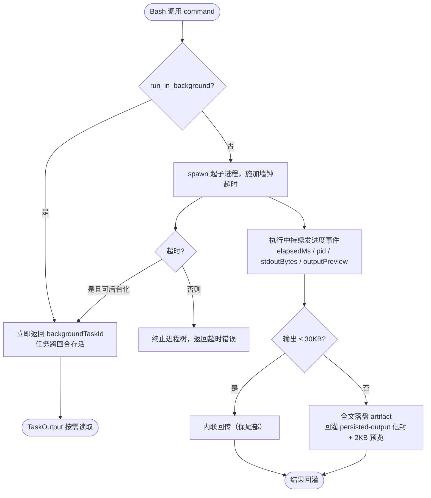

# 3.4 代码执行与测试

> 本章导览：能跑命令，Agent 才从"读代码的"变成"干活的"。本章拆解 Bash 工具的三件难事——超时怎么定、输出怎么安全回灌、失控任务怎么处理——再讲一个常被低估的工具：Node REPL。

前一章的搜索策略终点是"改"，而改完的验证只有一条路：**执行**。跑测试、起构建、装依赖、查 git 状态，全靠 Bash 工具。它是 ZCode 37 个内置工具里最强大也最危险的一个——一个工具同时是"眼睛"（看测试输出）和"手"（删库跑路也是它）。本章讲 tinycode 怎么把这件事做对，真实系统又在哪些地方加固。

## 运行命令与脚本

Bash 工具的参数面很小：`command`（要执行的命令）、`timeout`（毫秒，可选）、`run_in_background`（可选）。一个小工具扛住所有复杂度的秘诀在参数之外——超时策略、输出策略、后台策略、权限策略四根支柱。

### 超时：默认、上限与豁免

第一根支柱是超时。真实系统的策略文件（`packages/core/src/tool/bash-timeout-policy.ts`）开篇就是两个常量：

```ts
export const DEFAULT_BASH_TIMEOUT_MS = 120_000;    // 默认 2 分钟
export const DEFAULT_BASH_MAX_TIMEOUT_MS = 600_000; // 单次上限 10 分钟
```

三个规则：模型不传 `timeout` 就用默认 2 分钟；模型可以指定更长的超时，但不得超过 10 分钟上限；用户可以用环境变量 `BASH_DEFAULT_TIMEOUT_MS` / `BASH_MAX_TIMEOUT_MS` 整体覆盖，且覆盖时强制 max ≥ default。

Bash 是**唯一**允许模型在调用级别覆盖超时的内置工具（`timeout.allowCallOverride: true`）。这个特权有充分的理由：命令的耗时天差地别——`ls` 一毫秒，全量测试十分钟，模型对"这条命令要跑多久"的判断往往比固定默认值准。而其他工具（Read、Edit）的耗时上界是可预知的，没有豁免的必要。执行器实际施加的墙钟还要加上 `cleanupGraceMs: 6000`——超时后给进程树 6 秒做优雅清理（收尾日志、子进程退出），而不是一秒掐死。

> **工程细节**：执行器里的 `ToolDeadline` 是一个**可暂停的墙钟**。工具执行途中可能发起模型请求（比如 WebFetch 的小模型提炼），这类请求在进程级准入闸门排队的时间不计入工具超时。源码注释说得精辟：超时守的是"provider 挂了"，不是"我们自己的队列长"。

### 输出：截断保尾与落盘

第二根支柱是输出处理。命令输出是 Agent 上下文里最难预测的东西——`npm install` 轻松刷出几万行。真实系统的策略分两层（`handlers/bash.ts`）：

第一层，**内联截断，保尾部**。stdout 与 stderr 各自最多回传 30,000 字节：

```ts
const MAX_INLINE_OUTPUT_BYTES = 30_000;       // 内联回传上限
const MAX_RUNTIME_PERSISTED_OUTPUT_BYTES = 5_368_709_120; // 落盘上限 5GB
```

"保尾部"（tail）是个方向性决策：构建与测试的**结论在末尾**。`npm test` 的前一万行是逐个用例的过程，最后几行才是 `Tests: 42 passed` 或失败摘要。头部截断会把结论剪掉，只留过程——这是初学者实现最容易犯的方向性错误。

第二层，**超限落盘**。整个输出超过预算时，全文写入磁盘的 artifact 文件，回灌给模型的变成一个信封（`tool/result-persistence-format.ts`）：

```text
<persisted-output>
Output too large (1.2 MB). Full output saved to: /path/to/artifact-8f3.log

Preview (first 2 KB):
…（按换行对齐截取的 2000 字符预览）…
</persisted-output>
```

模型拿到的是：全局事实（多大、存在哪）、一段开头预览、以及一条隐含指令——需要细节时用别的手段（如 `grep`/`tail` 那个文件）去查，而不是再跑一遍命令。落盘上限 5GB，预览 2,000 字符。落盘失败时静默回退为截断——"artifact 写入失败不应让一次成功的工具调用变成失败"。



### 后台：超时转后台，而不是杀死

第三根支柱处理失控的长任务。模型说"跑一下这个基准测试"，预估 2 分钟，实际跑了 20 分钟——粗暴的实现是超时杀进程，模型一无所获，用户白等。

真实系统的做法聪明得多：**非后台任务超时后不立即杀死，而是转入后台**。返回值变成 `{status: "backgrounded", backgroundTaskId, rawOutputPath}`，进程继续活着，输出持续写到文件，模型可以随后用 TaskOutput 工具按 `backgroundTaskId` 读取。命令真正退出时，系统另起一轮通知模型"你之前启动的任务结束了"。

有一个豁免：**首 token 是 `sleep` 的命令没有转后台资格**（`handlers/bash-background-policy.ts` 一行代码：`return firstToken !== "sleep"`）。原因值得咀嚼：模型写 `sleep 30` 的**目的就是等待**——等服务起来、等缓存过期。把"等"转成后台，等于取消等待本身，模型的下一步会建立在"已等完"的错误前提上。判定规则尊重的是命令的**意图**，不是它的形式。

### 只读命令识别：同一个工具，两种待遇

第四根支柱把 Bash 接进权限系统。如果所有 Bash 调用都要人工审批，Agent 的效率会崩掉——模型一天要跑几百条命令，其中绝大多数是无害的只读操作。真实系统为此建了一套**命令语义分析**：`bash-readonly-policy*.ts` 系列约 20 个文件，对命令的 argv 做白名单分析。命中白名单的调用被动态改写为 `readOnly: true, needsApproval: false`。

这就是同一个 Bash 工具呈现出的两副面孔：

- `git status`、`git log`、`ls src/`、`cat package.json` → 识别为只读，免审批，plan 模式下可用；
- `rm -rf dist`、`git push --force`、`npm publish` → 需要人工审批。

白名单分析做到了 flag 级：`git log --oneline` 放行，`git log --patch` 会被重新审视（输出可能巨大且携带补丁内容）；`git stash list` 放行而 `git stash drop` 不会出现在白名单里。3.5 节会专门展开 git 部分的清单。这套机制的本质是：**把"这条命令干什么"的判断从模型嘴里挪到确定性代码里**——模型的自我声明（"这只是一条只读命令"）不可信，argv 解析才是事实。

### 跨平台细节：路径归一化

Windows 上还有一类看似琐碎、实际高频的问题：Git Bash 里模型会写出 `/c/Users/foo` 风格的路径，而 Node 眼中的合法路径是 `C:\Users\foo`。ZCode 的 `path-normalization.ts` 提供统一的 `normalizeToolPathForComparison`：`/c/foo` 归一为 `C:\foo`、盘符统一大写、剥掉 `\\?\` 前缀、Unicode NFC 归一。所有涉及路径比较的逻辑（cwd 越界检查、已读状态表键值）都走这个函数。教训是：**路径在参与比较之前必须先归一化**，否则同一个文件在状态表里会出现两个身份。

## 跑测试套件

测试没有专门的工具——它就是 Bash 的一种用法。但值得单独立节，因为测试输出集中体现了前述机制的必要性：

**超时要舍得给**。全量测试超过默认 2 分钟太正常了，模型应该学会为测试类命令指定更长的 `timeout`（上限内的 10 分钟），或者直接 `run_in_background` 转后台轮询。工具描述里可以提示这类用法。

**输出保尾部是测试可用性的命门**。几千个用例的输出内联 30KB 保尾，意味着模型看到的正是失败摘要与失败用例列表——恰恰是修复所需的全部信息。如果当初选了保头部，模型看到的是前 N 个通过用例的日志，然后只能再跑一次 `| tail`，多烧一个回合。

**退出码是第一信号**。命令结束后，执行器把退出码翻译成语义解释附在结果里：非零退出码意味着失败，模型先看退出码再读输出。这条链路（退出码 → 输出 → 失败用例名 → Read 对应源文件）就是 Agent 修测试的完整闭环，每一段都依赖本章的输出机制。

## REPL 与交互式执行

Bash 每次调用都是独立进程：变量、安装的依赖、打开的连接，调用结束即蒸发。模型想"装个包，试用一下，再换一个版本试试"，用 Bash 就得每次重来。**REPL 工具**（Node REPL，参数名 `js`）补上这块：在一个持久的 Node 虚拟机上下文里执行 JavaScript，变量跨调用存活——本质上是给模型一个可以反复使用的草稿纸。

ZCode 的实现（`packages/core/src/repl/`）有三个值得逐个讲的技术点。

**第一，上下文持久化靠 `vm.createContext`**。每次调用把代码丢进同一个 context 执行，上一次定义的变量、函数、对象在下次调用里直接可用。

**第二，作用域要靠 instrument 补**。这里有个隐蔽的坑：为了让模型能写顶层 `await`（REPL 代码里 `await fetch(...)` 太常见了），代码会被包进一个 async IIFE 执行——但 `const`、`function` 这些声明在 IIFE 里就成了局部变量，出了这层作用域就没了，"持久上下文"形同虚设。解法是 instrument：解析代码，在**每条顶层声明语句后注入 `globalThis.<name> = <name>;`**，把绑定抄送到 globalThis；同时把最后一条表达式语句改写成 `return (...)`，让本次求值结果回传给模型：

```ts
// packages/core/src/repl/instrument.ts（有删节）
export function instrumentForContextPersistence(code: string, ast: ESTree.Program): string {
  // 解析出顶层声明，在每条声明语句后注入 globalThis.<name> = <name>;，
  // 把绑定复制到持久 context，使下次 js 调用里裸名字能经作用域链解析到 globalThis。
  const assigns = names.map((name) => `globalThis.${name}=${name};`).join("");
  // ... 最后一条 ExpressionStatement 改写为 return，使结果回传
}
```

**第三，也是最有洞察的一点：死循环怎么打断**。异步超时方案（`Promise.race([run(), timeout()])`）对 REPL **无效**，源码注释把原因写得明明白白：

```ts
// packages/core/src/repl/executors.ts（有删节）
// Promise race 只能取消已经把控制权交回 event loop 的异步代码；`while(true){}`
// 会把 agent 线程永久占住，使外层 timeout/AbortSignal 的 timer 根本没有机会执行。
// vm 自身的同步执行预算由 V8 interrupt 检查实现，能真正打断同步死循环。
return runInContext(wrapped, context, { timeout: Math.max(1, Math.trunc(syncTimeoutMs)) });
```

`Promise.race` 的取消机制依赖 timer 有机会触发，而 `while(true){}` 把事件循环永久占住——timer 排不上队，"超时"永远不会到来。`vm.runInContext` 的 `timeout` 参数则不同：它由 **V8 的 interrupt 检查**实现，虚拟机在执行字节码的过程中周期性检查预算，同步代码也会被打断。一个 API 参数背后的机制差异，决定了方案的真伪。

> **踩坑**：最后必须原样声明：**vm 不是安全沙箱**。Node 官方文档明确警告，`vm` 模块不提供安全机制——它能隔离作用域、能打断死循环，但恶意代码可以通过原型链等多种途径逃逸到宿主进程。REPL 工具的定位是"防意外，不防恶意"：防模型写出死循环卡死自己，不防蓄意攻击。真要执行不可信代码，需要独立进程甚至独立容器的隔离，那是另一层工程。

tinycode 的 `src/tools/repl.ts` 复刻这条骨架：

```ts
// tinycode/src/tools/repl.ts
import vm from "node:vm";

const SYNC_BUDGET_MS = 1_000;   // V8 同步执行预算

export class ReplSession {
  private context = vm.createContext({ console });   // 持久上下文：变量跨调用存活

  run(code: string): unknown {
    return vm.runInContext(instrument(code), this.context, {
      timeout: SYNC_BUDGET_MS,   // 由 V8 interrupt 实现，能打断 while(true)
    });
  }
}
```

instrument 的教学版用正则近似真实系统的 AST 改写：

```ts
function instrument(code: string): string {
  // 顶层声明抄送到 globalThis，否则包进 IIFE 后它们出不了作用域
  const declares = [...code.matchAll(/^(?:const|let|var|function|class)\s+([A-Za-z_$][\w$]*)/gm)]
    .map((m) => `  globalThis.${m[1]} = ${m[1]};`)
    .join("\n");
  return `(async () => {\n${code}\n${declares}\n})()`;
}
```

调用侧 `await session.run(code)` 拿到 IIFE 的 Promise，求值结果序列化后回灌模型。正则版对边角语法（模板字符串里的 `const` 等）会误判，真实系统用 AST 是正确性的必然，机制上二者等价。

## 超时、产物回收与错误解析

最后把 Bash 的完整教学版拼出来——`src/tools/bash.ts`，spawn 加超时加输出截断，三个机制一个文件：

```ts
// tinycode/src/tools/bash.ts
import { spawn } from "node:child_process";

const DEFAULT_TIMEOUT_MS = 120_000;   // 与真实系统一致：默认 2 分钟
const MAX_TIMEOUT_MS = 600_000;       // 上限 10 分钟
const MAX_OUTPUT_BYTES = 30_000;      // 内联回传上限，保尾部

export async function runCommand(command: string, opts: { timeout?: number; cwd?: string }) {
  const timeout = Math.min(Math.max(1, opts.timeout ?? DEFAULT_TIMEOUT_MS), MAX_TIMEOUT_MS);
  const child = spawn(command, { shell: true, cwd: opts.cwd });

  let stdout = "";
  let stderr = "";
  child.stdout.on("data", (chunk) => { stdout += chunk; });
  child.stderr.on("data", (chunk) => { stderr += chunk; });

  const code = await new Promise((resolve, reject) => {
    const timer = setTimeout(() => {
      child.kill();
      reject(new Error(`Command timed out after ${timeout}ms. ` +
        "Consider a longer timeout or run_in_background."));
    }, timeout);
    child.on("close", (exitCode) => { clearTimeout(timer); resolve(exitCode); });
    child.on("error", reject);
  });

  return {
    exitCode: code,
    output: clipTail(stdout, MAX_OUTPUT_BYTES) + clipTail(stderr, MAX_OUTPUT_BYTES),
  };
}
```

保尾部截断是点睛的几行：

```ts
function clipTail(text: string, budget: number): string {
  const buf = Buffer.from(text);
  if (buf.length <= budget) return text;
  const kept = buf.subarray(buf.length - budget).toString("utf8");
  const dropped = buf.length - budget;
  return `[...${dropped} bytes dropped from the start; conclusions are usually at the end...]\n${kept}`;
}
```

教学版到此为止，与真实系统的差距正好是本节的"产物回收"清单：超时转后台（教学版直接杀进程）、`<persisted-output>` 落盘信封、执行中的持续进度事件（`ToolCallProgress`：已耗时、pid、累计输出字节、输出预览——UI 靠它渲染"命令还在跑，已经吐了 12KB"）、以及结果后处理链（cwd 越界就重置回工作区、图片输出检测——stdout 是 PNG 时转成 image block 回灌，3.1 节的多模态通道在这里复用）。

错误解析的原则在 3.2 节已经立过：错误信息写给模型看。Bash 的超时错误末尾带着"consider a longer timeout or run_in_background"——模型读到失败的同时读到两条出路。失败不是终点，是导航。

## 小结

本章实现了 tinycode 的 `src/tools/bash.ts` 与 `src/tools/repl.ts`。Bash 用四根支柱扛起执行职责：超时策略（默认 120 秒、上限 600 秒、环境变量覆盖、唯一允许调用级豁免的工具）；输出策略（30KB 内联保尾部——结论在末尾；超限落盘给 2KB 预览的信封）；后台策略（`run_in_background` 跨回合存活，超时自动转后台而非杀死，`sleep` 命令因意图就是等待而被豁免）；权限策略（argv 白名单分析让同一个工具对 `git status` 免审批、对 `rm -rf` 弹窗）。REPL 工具用 `vm.createContext` 持久上下文加 instrument 注入补 IIFE 作用域，用 V8 同步执行预算而非 Promise race 打断死循环，并诚实声明 vm 不是安全沙箱。

权限策略那一根支柱只掀开了一角：argv 白名单里最大的一族正是 git 只读命令。下一章就以 Git 为透镜，看一个"没有专用工具"的能力如何靠 Bash 加白名单加权限做到工程化极致。
