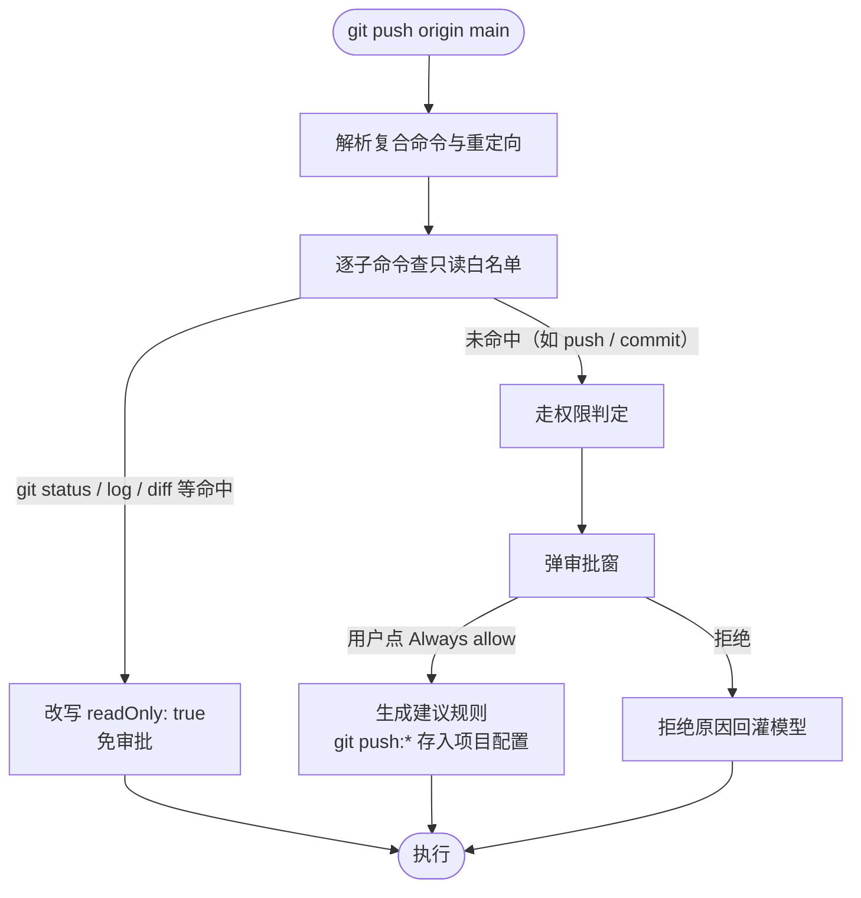

# 3.5 版本控制（Git）

> 本章导览：ZCode 没有独立的 Git 工具——Git 全程通过 Bash 使用。但围绕 Git 的工程化做到了极致：只读子命令白名单、权限建议规则、系统提示词快照、文件回滚点。本章讲这套"没有工具的工具"是怎么工作的，以及为什么独立 Git 工具反而不必要。

第三部分的最后一章讲一个"反高潮"的结论。翻开 ZCode 的 37 个内置工具清单，你找不到 Git 工具——没有 `GitCommit`，没有 `GitDiff`，更没有 `GitMerge`。Git 操作全部通过 Bash 执行：`git status` 就是模型发出的一条 Bash 命令。

但"没有工具"不等于"没有工程"。恰恰因为 Git 是 Agent 最常触碰的外部系统——也是唯一一个**直接改写不可变历史**的系统——围绕它的安全保障反而最深：只读白名单精确到 flag、权限规则生成回避高危命令、会话启动时注入仓库快照、每次文件编辑自动留回滚点。本章逐层拆开这套组合，最后回答标题里那半句话：为什么独立 Git 工具反而不必要。

## diff / commit

先看系统提示词。会话开始时，如果当前目录是 git 仓库，ZCode 会在系统提示词里注入一段环境快照（`packages/core/src/context/sections/env-info.ts`）：当前分支、主分支（标注"你通常用它发 PR"）、git 用户、工作区状态（clean/dirty）、最近若干条 commit。注入后的形态大致是这样：

```text
gitStatus: This is the git status at the start of the conversation. Note that
this status is a snapshot in time, and will not update during the conversation.
Current branch: feat/session-timeout
Main branch (you will usually use this for PRs): main
Git user: your-name
Status: (dirty)
Recent commits:
  a1b2c3d fix: correct token refresh retry loop
  9e8f7a6 feat: add session timeout metric
  ...
```

开头的固定声明是精心设计的措辞。它一次性给了模型关键上下文（在哪个分支、工作区干不干净），同时**明确告知时效**——模型要最新状态就得自己跑 `git status`。不给快照，模型每个任务开头都要烧一次调用来探测环境；给了快照又不说时效，模型会把三小时前的旧状态当事实。一个句子同时解决了"缺信息"和"错信息"两个风险。

注意最后一个字段给了模型一条现成的写作参照：最近提交的措辞风格（语言、时态、前缀习惯）就在眼前，模型生成的提交信息会自然向它对齐——这也是一种"上下文养成"。

> **工程细节**：快照的取值也有讲究：工作区状态只有 `(clean)`、`(dirty)`、`(unknown)` 三个枚举值，而不是塞进完整的 `git status --porcelain` 输出——系统提示词的每个字符都是所有回合的固定开销（2.3 节），明细留给模型按需查询。

真正体现功力的是**权限层怎么对待 git 命令**。3.4 节说过，Bash 命令要经过只读语义分析，命中白名单才免审批。git 是白名单里最厚的一族，分析精确到子命令加 flag（`packages/core/src/tool/handlers/bash-readonly-policy-git-subcommands-core.ts` 与 `-history.ts`）：

- `git status`、`git log`、`git diff`、`git show`、`git blame`、`git branch`、`git ls-files`、`git rev-parse`、`git stash list` 等约二十个只读子命令在册；
- 每个子命令还挂着 **flag 级安全表**：`git log --oneline` 放行，`git log --patch` 这类改变输出性质（携带补丁内容）或危险性的 flag 要单独评估；
- 部分子命令配有**回调复核**：`git reflog` 表面上是只读历史查询，但 `git reflog delete --updateref` 能改历史——回调发现这类参数就把判定翻转回"需要审批"。



图里"用户点 Always allow"之后的一步是本节的正题：**权限规则的建议与生成**。用户不可能为每条 git 命令点一次确认，也不该无脑全放——折中方案是"批准这一次"时顺手生成一条**前缀规则**（如 `git push:*`），今后所有 `git push` 开头的命令免审批。

> **工程细节**：复合命令的规则判定还有一条"全有或全无"的语义。`git add . && git commit -m x` 会被解析成两段子命令，allow 判定要求**每一段**都被已有规则覆盖——只要有一段漏网就弹窗。deny/ask 方向则相反：任一段命中即算。放行从严、拦截从宽，方向不能反。（`handlers/bash-command-rule-evaluator.ts`）

规则生成分三步（`handlers/bash-command-permission-policy.ts`）：

**第一步，剥包装找稳定前缀**。命令外面常包着一层"无关执行的外壳"：`sudo git push`、`env VAR=x git push`、`nohup git push`。解析器剥掉 `sudo`/`env`/`nohup`/`command`/`time` 等包装（连同它们的参数），露出真正的可执行体——但最多剥两层，防无限递归。于是 `sudo git push origin main` 产出的建议是 `git push:*` 而不是 `sudo:*`。

**第二步，高危命令不生成前缀**。一个高危命令集合在生成器入口就把路堵死：

```ts
// packages/core/src/tool/handlers/bash-command-permission-policy.ts（有删节）
const HIGH_RISK_ROOT_COMMANDS = new Set([
  "bash", "chgrp", "chmod", "chown", "cmd", "dd", "fish", "mkfs",
  "mount", "powershell", "pwsh", "rm", "rmdir", "sh", "umount", "zsh",
]);
// …命中集合的命令永远不生成 `cmd:*` 形式的前缀规则
```

`bash`、`sh`、`zsh`、`powershell` 都在名单上——它们不是"删除工具"，而是**任意代码的入口**：`bash:*` 规则等于把 shell 整个交给模型。`rm`、`dd`、`mkfs` 同理，`rm:*` 一旦放行，`rm -rf /` 也在合法范围内。这条防线的本质是：**"永远建议放行"清单里不允许出现图灵完备的工具**。

**第三步，限额**。一次审批最多建议 5 条规则（`MAX_SUGGESTED_RULES = 5`），超限退回整条命令原文的精确匹配——宁可让用户下次再批，也不生成一屏看不完的授权清单。

`git commit` 走的正是这条流水线：不在只读白名单（它会改写仓库状态），审批通过后生成 `git commit:*` 建议，之后常规提交免审批。diff 与 commit 的权限待遇就这样被同一个机制干净地分开：**读历史自由，写历史要人点头**。

审批被拒绝时，回灌给模型的拒绝文案也值得一看——它不是中性的"操作被拒绝"，而是明确的行动指令：

```text
The user doesn't want to proceed with this command. STOP what you are doing
and wait for the user to tell you how to proceed.
```

若用户拒绝时附了意见（"别动 main 分支"），文案会追加一段"用户说：……"。**权限拒绝是强信号，系统提示词层面的用词（大写的 STOP）就是在防止模型换个说法再试一次**——对权限系统而言，"宁可拒绝也不放行"是贯穿始终的取向，5.3 节会看到它在应答映射上的进一步体现。

把这套白名单的判定逻辑浓缩成一张速查表：

| 命令示例 | 判定 | 依据 |
| --- | --- | --- |
| `git status` / `git log` / `git diff` | 免审批 | 只读子命令白名单 |
| `git log --oneline -20` | 免审批 | 子命令与 flag 均在安全表内 |
| `git reflog delete xxx` | 需审批 | 回调复核发现改历史参数 |
| `git commit -m "fix"` | 需审批，通过后建议 `git commit:*` | 非只读，走前缀规则生成 |
| `sudo git push` | 需审批，建议规则剥壳为 `git push:*` | 稳定前缀解析 |
| `rm -rf dist` | 需审批，永不建议 `rm:*` | `HIGH_RISK_ROOT_COMMANDS` |

## 分支与切换

`git checkout`、`git switch`、`git restore` 都不在只读白名单上，这是对的——它们批量改写工作区文件，比单文件编辑危险得多。但"每次切分支都要人点确认"仍然太重，真实系统给了一条内建的退路：**文件变更 checkpoint**。

3.2 节末尾出现过它：Edit/Write 每次成功都通过 `structuredPatch` 触发一个 `CheckpointCreated` 事件，把变更前的文件内容连同 diff 存为回滚点（`runtime/helpers/rewind.ts`，产物类型标注为 `application/vnd.zcode.workspace-checkpoint+json`）。用户随时可以把工作区 rewind 到任意一次编辑之前。

这条机制改变了切分支的风险模型。checkout 覆盖掉未提交修改？rewind 回来。stash 丢东西？回滚点里还有。它相当于给 Agent 的每次写操作上了"git stash"级别保险，而且粒度到单次编辑——比 `git stash` 的手动粒度细得多。**当不可逆操作有了廉价的撤销机制，权限审批的压力就小了**：安全设计不是一味加锁，而是先让"后悔"变得便宜。

把 checkpoint 的生命周期串成一条线：Edit/Write 成功 → 工具输出携带 `filePath`、`structuredPatch`、原文 → runtime 的 `getFileMutationCheckpointCandidate` 校验并挑出这些字段 → 序列化为 checkpoint artifact 并发 `CheckpointCreated` 事件 → 会话存储落盘 → 用户（或模型）发起 rewind 时按 artifact 回放恢复。整条链不依赖 git 的任何对象存储，它是 Agent 层自己的时间机器。

> **注**：checkpoint 存的是**内容**与 diff，不是 git 对象——它独立于仓库的 git 状态工作，连"尚未 git init 的目录"也能回滚。这是它和 `git reflog` 互补而非重复的原因。

对模型而言，切分支的正确姿势也因这套机制而明确：系统提示词里的状态快照是会话起点的，**动手前必须现查**——先跑一次免审批的 `git status` 确认工作区干净，再决定是 `git switch` 还是请用户处理未提交的修改。快照负责"让我有背景"，现查负责"让我不踩人"。

> **工程细节**：checkpoint artifact 有自己的内容类型标识（`application/vnd.zcode.workspace-checkpoint+json`，见 `runtime/helpers/rewind.ts`），作为会话工件随会话存储落盘。契约层单独有一个 rewind 模块（`packages/contracts/src/rewind/`）定义回滚的载荷与校验——回滚是被当成一等能力设计的，不是调试用的后门。

## 冲突处理

merge 冲突是 Agent 遇到的典型"半结构化故障"：git 会告诉你哪些文件冲突（退出码非零 + `CONFLICT` 字样），冲突文件里插入了 `<<<<<<<` / `=======` / `>>>>>>>` 标记——但解决冲突本身是语义工作，只有读懂两边代码才能做。

Agent 的处理流程恰好是前几章工具的组合拳：Bash 跑 `git merge` 拿到冲突文件清单（3.4 节的退出码语义与保尾输出在这里生效）→ Grep 按 `<<<<<<<` 标记定位冲突块 → Read 读取双方上下文 → Edit 精确替换冲突块（3.2 节的 old/new 替换）→ Bash 再跑 `git add` 与测试验证。没有一个环节需要"Git 工具"，需要的只是把 Bash 的观察通道、文件工具的编辑通道接起来。

这个流程还揭示了一个分工事实：**git 负责把问题暴露成文件系统上的文本，Agent 用文件工具消化文本**。git 的设计者把冲突物化成带标记的文件内容，等于天然为"非交互式解决者"留了接口——Agent 只是这个接口的又一个消费者。

把这个物化结果具体看一眼。`git merge feature` 冲突后，`src/auth/session.ts` 里会出现：

```text
<<<<<<< HEAD
  const ttl = config.sessionTtlMs;
=======
  const ttl = config.sessionTtlMs ?? DEFAULT_TTL;
>>>>>>> feature
```

模型的解法就是一次 Edit：old_string 覆盖从 `<<<<<<<` 到 `>>>>>>>` 的整块，new_string 写融合后的版本（比如保留 fallback 又采用主分支的配置来源），随后 `git add` 该文件并跑测试。注意 Edit 在这里再次展示了 3.2 节的价值——冲突标记块是文件里唯一的一段，精确替换不会有歧义；而如果让模型整文件重写，反而可能把临近的无辜代码卷进来。

冲突处理的另一半在**预防**：让 Agent 少制造需要处理的问题。真实手段是 AGENTS.md（2.3 节讲过它的注入机制）里的团队约定。ZCode 仓库自己的 AGENTS.md 就是一个活例子——里面写着 spec 先行、测试佐证、bugfix 要留注释等规矩。放到 git 场景，你可以在项目 AGENTS.md 里写下这样的段落：

```markdown
## Git 约定

- 提交信息遵循 Conventional Commits：`feat: ...` / `fix: ...` / `chore: ...`。
- 提交前跑 `pnpm lint && pnpm test`，红了不要提交。
- 永远不要执行 `git push --force`，也不要修改已推送的历史。
- 改动跨多个模块时拆成多个小提交，每个提交只说一件事。
```

**团队 git 约定最好的载体不是口头传承，而是会被注入模型上下文的指令文件**——人读的规范经常过期没人看，agent 读的规范每次会话都生效。这段 markdown 会随系统提示词进入模型视野，之后模型自己跑的 `git commit -m "fix: handle session timeout"` 就自动长成了团队的形状。约定不是靠工具强制的，是靠上下文养成的——这也是本书反复出现的主题：提示词是 Agent 的第一层"配置"。

## PR 与远程协作

远程操作（`git push`、`git pull`、`git fetch`）在权限坐标系里属于"出墙"的一类：影响远端、可能不可逆、需要网络。它们都走 3.4 节的标准审批流，其中 `gh` CLI（GitHub 官方命令行）的只读查询还有专门的白名单（`bash-readonly-policy-multiword-gh.ts`）：`gh pr list`、`gh pr view`、`gh pr checks`、`gh pr diff`、`gh pr status` 免审批——查 PR 状态是高频只读操作；而 `gh pr merge`、`gh release create` 自然不在册。

用 `gh` 而不是自己实现 PR API，与"用 ripgrep 而不是自己写搜索引擎"是同一个决策：CLI 已经把认证、分页、错误处理磨平了，Bash 工具天然能调用一切 CLI——**Agent 的能力边界不是内置工具清单，而是这台机器上装了什么**。

把一个 PR 工作流完整过一遍，可以看到全书的机制如何接力：模型在功能分支上完成修改（3.1/3.2 的文件工具）→ 跑测试（3.4 的 Bash）→ `git add`/`git commit`（审批一次，建议规则 `git commit:*`）→ `git push -u origin feat/session-timeout`（审批）→ `gh pr create --fill`（审批）→ 之后每轮 review 修改重复前两步，`gh pr checks` 与 `gh pr diff` 免审批随时查看。四次人工点击换来一个完整的 PR 循环——这就是白名单与建议规则合作的实际效果。

## 为什么没有 Git 工具

现在回答本章开头的问题。假设我们给 ZCode 加一个原生 Git 工具，参数覆盖 `commit`/`push`/`merge`/`rebase`……会发生什么？

**第一，参数面爆炸而收益有限**。git 有 150+ 子命令、上千个 flag，工具 schema 只能挑常用子集；挑出来的子集很快被真实任务击穿（"用 `git worktree` 建个工作树"），模型退回 Bash——最终维护着两套并行的 Git 入口。而 Bash 路线里，git 的全部能力天生可用，一个新版本发布的子命令当天就能用，不需要等工具升级。

**第二，白名单机制已经精确到了工具实现达不到的粒度**。3.4 与本章看到的只读判定是 **flag 级**的：`git log --oneline` 与 `git log --patch` 待遇不同，`git reflog` 带删除参数时判定翻转。一个原生 Git 工具的权限模型要复刻这些，等于把 bash-readonly-policy 那 20 个文件在工具层重写一遍。而白名单做在 Bash 层，**所有命令行工具自动受益**——`gh`、`npm`、`pnpm`、`kubectl` 全都"免费"获得了同款待遇。

**第三，权限的组合表达力**。"允许 `git status` 但审批 `git push`"、"批准一次后建议 `git commit:*`"、"`bash:*` 永不生成"——这些策略在命令文本层面自然表达。换成结构化工具，权限模型要为每个工具的每个参数组合重新设计语义，而工具参数的可枚举空间远比命令文本难以穷尽。

所以最终形态是分工：**Bash 提供执行面，只读白名单提供免审批面，权限规则提供记忆面，系统提示词快照提供认知面，checkpoint 提供后悔药**。五个面各司其职，没有一个叫"Git 工具"。这个案例值得记住的泛化结论是：**当一个领域能力已经以 CLI 形式存在且观察/审批可以在命令文本层完成时，为它造原生工具往往是负资产**。工具箱里应该放的是 Bash 给不了的东西——结构化输出（Grep 的 `path:line:text`）、多模态通道（Read 的 image block）、进程外持久状态（REPL 的上下文）。

tinycode 以一个薄封装收尾（`src/tools/git.ts`），把"快照生成"与"白名单判断"两件事收拢进一个文件。

快照生成对应真实系统 `env-info.ts` 的职责：会话开始时跑几条只读命令，拼出注入系统提示词的那段文本：

```ts
// tinycode/src/tools/git.ts（一）：会话起点的 git 快照
import { runCommand } from "./bash.js";

export async function buildGitSnapshot(cwd: string): Promise<string | null> {
  if ((await runCommand("git rev-parse --is-inside-work-tree", { cwd })).exitCode !== 0) {
    return null;                                    // 不是 git 仓库，注入环节跳过
  }
  const run = async (cmd: string) => (await runCommand(cmd, { cwd })).output.trim();
  const branch = await run("git branch --show-current");
  const dirty = (await run("git status --porcelain")) !== "" ? "(dirty)" : "(clean)";

  return [
    "gitStatus: This is the git status at the start of the conversation.",
    "Note that this status is a snapshot in time, and will not update during the conversation.",
    `Current branch: ${branch}`,
    `Status: ${dirty}`,
    `Recent commits:`,
    await run("git log --oneline -5"),
  ].join("\n");
}
```

白名单判断是第二个职责——把"这条命令该享受什么待遇"集中到一个可测试的函数：

```ts
// tinycode/src/tools/git.ts（二）：只读判定
// 真实系统的版本精确到 flag 并带回调复核，教学版到子命令为止
const READONLY_SUBCOMMANDS = new Set([
  "status", "log", "diff", "show", "blame", "branch", "ls-files", "rev-parse",
]);

export function isReadonlyGitCommand(args: string[]): boolean {
  return args.length > 0 && READONLY_SUBCOMMANDS.has(args[0]);
}

export async function git(args: string[], cwd: string) {
  const result = await runCommand(`git ${args.join(" ")}`, { cwd });
  return {
    readonly: isReadonlyGitCommand(args),   // 权限层据此决定免审批或弹窗
    ...result,
  };
}
```

调用形如 `git(["diff", "--stat"], repoRoot)`。快照函数没有新增能力——三条只读命令 `runCommand` 本来就跑得了；白名单函数也没有放行任何东西——它只是把判断集中、把待遇显式化。真实系统没有这个文件，因为这两件事住在更恰当的位置：快照在上下文构建层，白名单在权限层。教学版把它们放进 `git.ts`，是替读者把"Git 相关的关注点"归档到一个门口。

## 小结

本章是第三部分的收官，讲的却是一个"没有工具"的章节。ZCode 用五层组合替代了原生 Git 工具：系统提示词注入会话起点的分支/状态/commit 快照并明示不更新；只读子命令白名单（精确到 flag 与回调复核）让 `git status`/`log`/`diff` 免审批；权限建议规则生成时剥 sudo/env 包装、回避 `HIGH_RISK_ROOT_COMMANDS`（`bash:*`、`rm:*` 永不出现）、上限 5 条；文件变更 checkpoint 为每次 Edit/Write 留回滚点，把切分支等危险操作的"后悔成本"降到接近零；AGENTS.md 承载团队的提交规范。结论是：CLI 已存在、审批可在命令文本层完成时，原生工具是负资产——Bash 加白名单加权限的组合更灵活，也更普适。

至此，Coding Agent 的核心工具——读文件、改代码、搜索、执行、版本控制——全部讲完。第四部分转向另一个方向：这些工具与机制如何被外部扩展——Hook、Skill 与 Plugin 登场。
