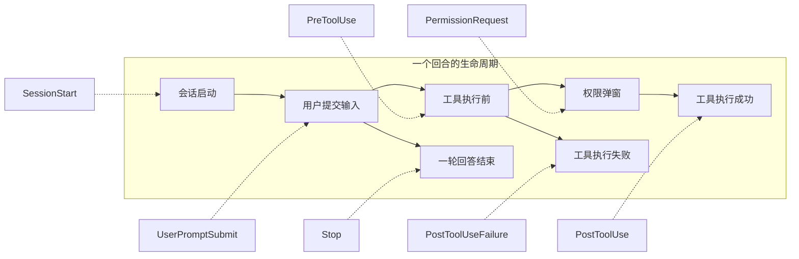
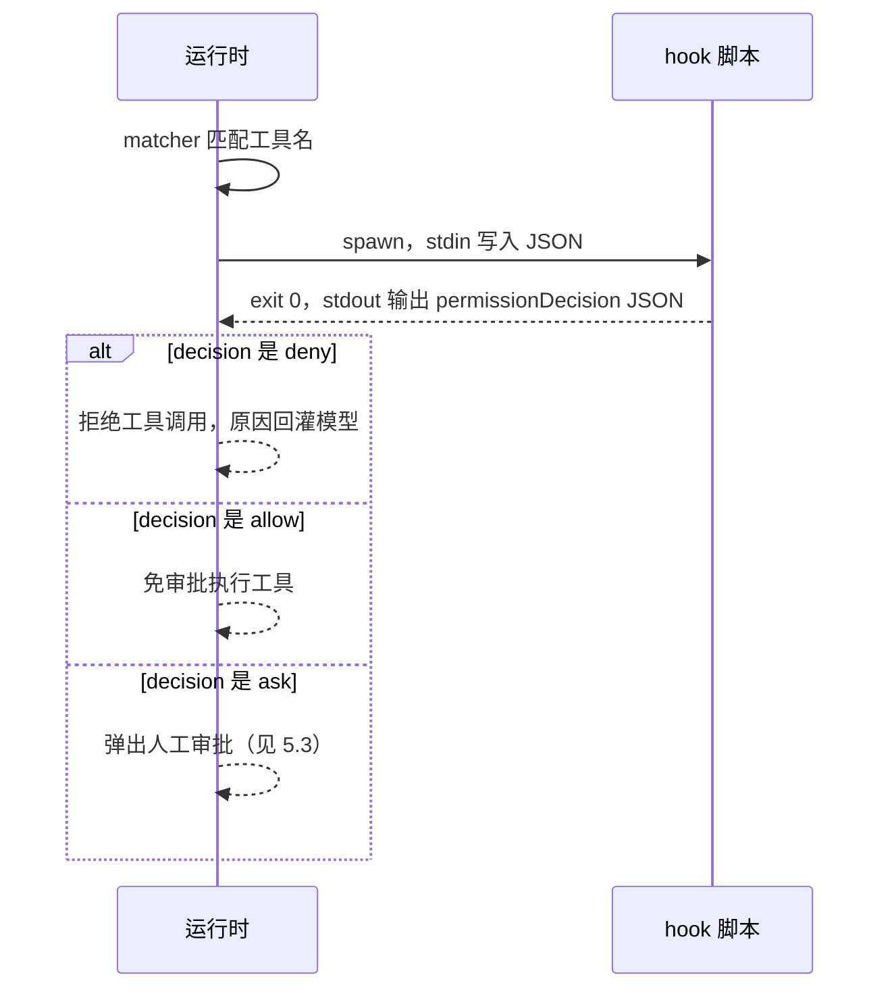
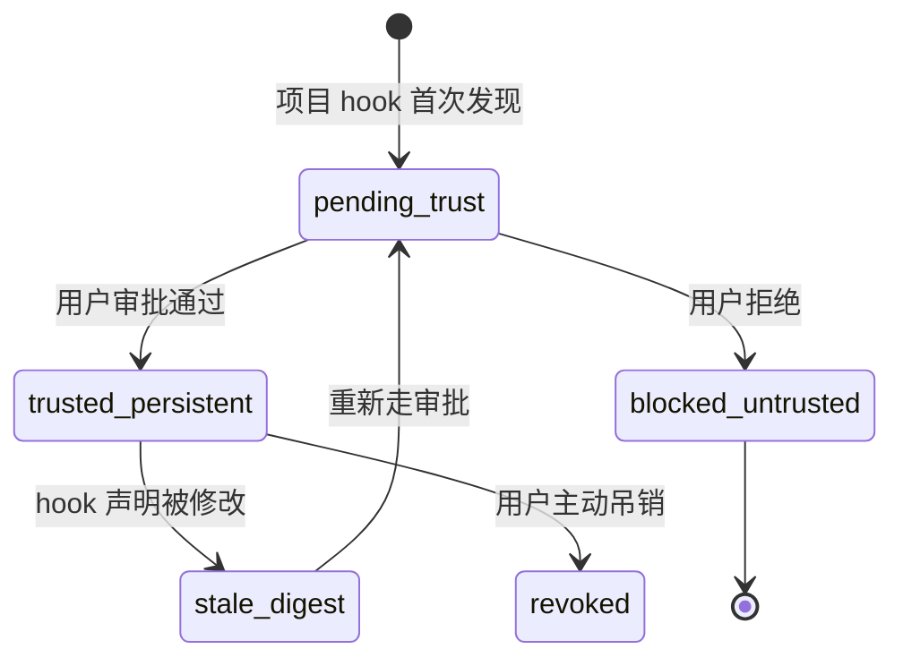

# 4.1 Hooks：生命周期拦截

> 本章导览：Hook 是挂在 Agent 生命周期固定时刻的用户命令——工具执行前可以拦下它，工具执行后可以做清理，一轮回答结束时甚至可以逼模型继续。本章讲清 Hook 的事件模型、配置格式、stdin/stdout/退出码协议，以及"克隆一个仓库会不会等于执行任意代码"这个安全问题。

## 问题：Agent 需要被"外挂"

到这里为止，本书讲的扩展手段都在"喂内容"：系统提示词、AGENTS.md（见 2.3 节）、MCP 工具（见 2.2 节）。但有些需求不是"多给模型看点什么"，而是"在某个时刻替我做点事，甚至改变主流程的走向"：

- 每次 Edit 工具改完文件，自动跑一遍格式化，失败就把错误回给模型；
- 模型试图读取 `.env` 或 `.aws/credentials` 时，直接拒绝这个工具调用；
- 一轮回答结束时检查"测试跑了吗"，没跑就注入一条消息让模型接着跑。

这些逻辑的共同点是：它们要**嵌入 Agent 生命周期的固定时刻**，而且往往以外部进程的形式存在——你可能想用 Python 写、用 shell 写，甚至调用公司内部的安全扫描器。把它们塞进 Agent 的 TypeScript 源码里显然不现实。

这就是钩子（Hook）：**在 Agent 生命周期的固定时刻执行用户命令的外部扩展机制**。它和 4.2 节的 Skill 是两类完全不同的扩展轴：Skill 是"markdown 进 prompt"——文件内容最终变成模型能读的文字；Hook 是"代码进进程"——配置里的 JSON 声明最终变成一次真实的进程启动。前者影响模型想什么，后者影响运行时做什么。



## 七个生命周期事件

ZCode 的 Hook 事件恰好有 7 个，覆盖一个回合从头到尾的每个关键点。下表是完整清单——触发时机、matcher 匹配哪个值、这个事件独有的输入字段、以及它独有的输出能力（来源：`packages/contracts/src/hooks/index.ts` 的事件定义）：

| 事件 | 触发时机 | matcher 匹配值 | 专属输入字段 | 专属输出能力 |
| --- | --- | --- | --- | --- |
| `SessionStart` | 会话启动/恢复/清空/压缩后 | `source`（startup/resume/clear/compact） | `model`、`source` | `additionalContext` |
| `UserPromptSubmit` | 用户提交输入后、发给模型前 | prompt 全文 | `prompt` | `additionalContext` |
| `PreToolUse` | 每次工具执行前 | 工具名 | `toolName`、`toolInput`、`riskLevel`、`sideEffectScope` | `permissionDecision`（allow/ask/deny）、`updatedInput`、`additionalContext` |
| `PermissionRequest` | 权限弹窗出现时 | 工具名 | `requestId`、`reason`（外加 PreToolUse 的字段） | `decision: { behavior: allow/deny }`——可以代替用户应答 |
| `PostToolUse` | 工具成功返回后 | 工具名 | `toolResponse`、`toolResultPreview` | `additionalContext` |
| `PostToolUseFailure` | 工具失败后 | 工具名 | `error: { message, type }` | `additionalContext` |
| `Stop` | 一轮回答结束时 | response 预览 | `responseText`、`stopHookActive`、`toolCallCount` | `additionalContext`；`decision: "block"` 可逼模型继续 |

三个观察：

**第一，输入字段的粒度是"够用就好"。** PreToolUse 给模型将要使用的完整参数（`toolInput`），但 PostToolUse 只给结果预览（`toolResultPreview`）——Hook 脚本不是工具结果的备份存储，预览足够判断"成功与否、要不要处理"。

**第二，输出能力沿着时间轴递减再反弹。** 只有执行前的两个事件（PreToolUse、PermissionRequest）能改变工具的命运；中间三个事件只能追加上下文；而 Stop 反弹了回来——它能决定"这轮不许结束"。

**第三，UserPromptSubmit 和 Stop 是回合边界的两个开关。** 前者能在用户输入进入模型前把它拦下或补充内容，后者能在模型宣布结束后强行续命。5.4 节的 Goal（长程任务）就大量依赖"回合结束时检查目标是否达成，没达成就继续"这个语义。

所有事件共享的输出能力是 `additionalContext`：Hook 把一段文字交还给运行时，运行时把它包装成上下文消息给模型看。这是 Hook 影响"模型想什么"的唯一通道，也是它与"代码进进程"定位的唯一交集。

## 配置格式：一段 JSON 声明

Hook 在配置文件里声明，位置有两级：用户级 `~/.zcode/cli/config.json`，项目级 `<repo>/.zcode/config.json`。格式是三层嵌套：`events` 按事件名分组 → 每组是一串 matcher → 每个 matcher 下挂若干命令：

```json
{
  "hooks": {
    "enabled": true,
    "timeoutMs": 60000,
    "maxOutputBytes": 32768,
    "events": {
      "PreToolUse": [
        {
          "matcher": "Bash|PowerShell",
          "hooks": [
            { "type": "command", "command": "./scripts/check-cmd.sh", "timeout": 10 }
          ]
        }
      ],
      "PostToolUse": [
        {
          "matcher": "Edit|Write",
          "hooks": [
            { "type": "command", "command": "./scripts/auto-format.sh" }
          ]
        }
      ]
    }
  }
}
```

四个值得注意的字段语义：

- **`enabled` 默认关闭**。配置文件里的 Hook 涉及执行任意命令，ZCode 要求显式写 `true` 才生效。这不是保守，而是本章末尾信任模型的第一道闸。
- **`timeoutMs` 是全局默认**（60000 毫秒），单条 hook 的 `timeout` 可以覆盖它——注意单位是秒。双轨单位是真实系统里留下的毛边，`timeoutMs` 存在时优先。
- **`maxOutputBytes`（32768）** 限制 Hook 输出的读取量，防止一个失控脚本向 stdout 灌几 GB 数据。
- **两种 hook 类型**：`type: "command"` 是 shell 字符串，由 shell 解释；`type: "process"` 是可执行文件加参数数组（`"command": "python", "args": ["check.py"]`），argv 直接 spawn，不经过 shell，是最可移植的写法。

## matcher：三种写法与一个坑

matcher 决定"这条 hook 关心哪些工具/哪些值"。ZCode 的实现只有十行，但支撑了三种语法（`packages/core/src/hooks/output.ts`，有删节）：

```ts
export function matchesHookMatcher(
  matchValue: string | undefined,
  matcher: string | undefined,
): boolean {
  if (!matcher || matcher === "*") return true;
  if (!matchValue) return false;
  if (/^[a-zA-Z0-9_|]+$/u.test(matcher)) {
    return matcher.split("|").includes(matchValue);   // 纯字母数字和竖线 → 当枚举
  }
  try {
    return new RegExp(matcher).test(matchValue);      // 否则当正则
  } catch {
    return false;                                     // 非法正则：静默不匹配
  }
}
```

三种语法依次是：

1. **省略或 `*`**：匹配一切。PostToolUse 自动格式化通常就省略 matcher。
2. **`A|B` 枚举**：`"Bash|PowerShell"` 表示两个工具名之一。判定规则很聪明——只要 matcher 里除字母数字外只有竖线，就按枚举处理，所以 `Edit` 不会被误当正则。
3. **正则**：含其他字符时按 JavaScript 正则解释，如 `"mcp__.*"` 匹配所有 MCP 工具。

> **踩坑**：非法正则**静默永不匹配**。如果你写了 `Edit(.*` 这样没闭合的正则，`new RegExp` 抛出的异常被 `catch` 吞掉，返回 `false`——hook 永远不触发，也没有任何报错。写复杂 matcher 后务必先手动验证一次。另外匹配是**大小写敏感**的，工具事件还有别名归一（例如 `Task` 与 `Agent` 视为同一工具）。

matcher 在运行时的判定对象由事件决定：PreToolUse/PostToolUse 等传工具名，SessionStart 传 `source`，Stop 传回答文本预览。同一事件下配多条 matcher 时**顺序执行、不并行**——hook 之间可能有依赖（先审计、再脱敏），并行会让顺序不可预测。

## 执行协议：stdin 进、stdout 出、退出码说话

Hook 的运行时协议可以概括成一句话：**JSON 从 stdin 进，退出码表态，stdout 可选地补充细节**。

**输入**：运行时把整个 `HookInput` 对象序列化成 JSON（末尾加换行）写进子进程的 stdin。主契约是 camelCase（`hookEventName`、`sessionId`、`toolInput`），但同时补了一份 snake_case 兼容别名（`hook_event_name`、`tool_name`、`tool_input`……），让为 Claude Code 写的 hook 脚本可以直接复用。环境变量注入 `ZCODE_PROJECT_DIR`、`ZCODE_SESSION_ID`（以及 `CLAUDE_*` 兼容名），脚本不用解析 stdin 就知道工作目录。一个 PreToolUse 的真实输入长这样：

```json
{
  "hookEventName": "PreToolUse",
  "sessionId": "sess_01J...",
  "cwd": "/home/me/project",
  "toolName": "Bash",
  "toolCallId": "call_01H...",
  "toolInput": { "command": "rm -rf build/", "description": "清理构建产物" },
  "hook_event_name": "PreToolUse",
  "tool_name": "Bash",
  "tool_input": { "command": "rm -rf build/", "description": "清理构建产物" }
}
```

**输出与退出码**分三档：

| 退出码 | 语义 | stdout 的处理 |
| --- | --- | --- |
| `0` | 正常结束 | 若以 `{` 开头则按 JSON 解析并严格校验 schema；否则当作诊断文本忽略 |
| `2` | **阻断** | stderr 作为阻断原因（blockReason） |
| 其他/超时 | 记录 Failed/TimedOut | **不阻断主流程**，仅发诊断事件 |

exit 0 时 stdout JSON 可携带的键包括：`additionalContext`（注入上下文）、`continue`、`decision: "approve" | "block"`、`reason`、`systemMessage`，以及按事件判别的 `hookSpecificOutput`。其中最重要的两个事件级协议：

- **PreToolUse 的 `permissionDecision`**：取值 `allow`（免审批放行）、`ask`（强制走人工审批）、`deny`（拒绝执行），搭配 `permissionDecisionReason` 解释原因，还可以用 `updatedInput` **原地改写工具参数**——比如强制给 Bash 命令追加 `--dry-run`。多个 hook 都给决策时按最严合并：任一 `deny` 就是 `deny`，其次 `ask`，最后才是 `allow`。
- **Stop 的 `decision: "block"`**：把"已结束"的回合拉回来，`reason` 作为新的上下文交给模型。注意真实系统对 Stop hook 的续命有次数限制——没有限制的话，一个写错的 Stop hook 会造成死循环。

exit 2 是"小写阻止"：脚本不需要构造 JSON，往 stderr 写一句人话、退出码给 2 就够了。对 PreToolUse 它等价于 `permissionDecision: "deny"`，对 Stop 等价于 `decision: "block"`，对其他事件等价于 `continue: false`。



> **工程细节**：退出码非 0 非 2 时 ZCode 不阻断主流程——格式化脚本崩溃不应该让一次文件编辑失败。但每次 hook 运行都会发出 `HookRunStarted/Completed/Failed/Blocked` 会话事件（stdout/stderr 各带 4000 字符预览），所以"静默失败"在事件流里可见。教学版可以省略这套诊断事件，但不该省略"失败不阻断"的语义。

## 典型用例

**自动格式化**（PostToolUse + `additionalContext`）：Edit/Write 成功后跑 `prettier --write`，退出码 0、不输出 JSON——模型甚至不知道格式化发生过；格式化失败时输出 `{"additionalContext": "格式化失败: ..."}`，模型在下一步看到并自行修复。

**阻止改敏感文件**（PreToolUse + exit 2）：matcher `Read|Edit|Write`，脚本读 stdin 里的 `tool_input.file_path`，命中 `.env`、`*.pem`、`.aws/` 等模式就 `echo "禁止访问敏感文件" >&2 && exit 2`。这是比权限规则（5.3 节）更强的企业级兜底——权限规则管"要不要问人"，hook 可以管"问了也不许"。

**Stop hook 逼模型继续**：一轮结束时检查"这轮调用过测试工具吗"，没有就输出 `{"decision": "block", "reason": "你还没有运行测试，请先运行相关测试再结束。"}`。它把"完成定义"从模型的自觉变成运行时的强制——这也是 Goal 功能（5.4 节）的最小雏形。

## 安全专栏：workspace hook 的"clone 即 RCE"问题

现在回答本章最尖锐的问题：项目级 hook 写在 `<repo>/.zcode/config.json` 里，而这个文件**随仓库一起被克隆**。如果 hook 声明被直接执行，那么 `git clone` 一个恶意仓库 + 在里面启动 ZCode，就等于交出了 shell——教科书级的"clone 即 RCE"。

ZCode 的对策是一套显式的信任模型（`packages/contracts/src/hooks/workspace-hook-trust.ts`、`packages/core/src/hooks/workspace-hook-*.ts`），核心是三件事：

**第一，给每条 hook 发"指纹"。** 每条 hook 声明计算 sha256 得到 `hookDeclarationDigest`，配置里所有条目再合成一个 `bundleDigest`。命令哪怕改一个字符，digest 就变。

**第二，digest 变了就要重新审批。** 信任状态是一个七态状态机：



`stale_digest` 是关键设计：攻击者在审批之后偷改 `.zcode/config.json` 里的命令，digest 对不上，hook 立即失效，等用户重新确认。

**第三，授权绝不缓存到"进程启动时"。** 真实系统在每个 hook 实际 dispatch 前都重新评估一次准入（admission）——前一个 hook 运行的几百毫秒里如果发生了吊销，后一个 hook 立即被拦下。更防御性的一笔是准入闸门自身抛异常时的处理（`packages/core/src/hooks/runner-helpers.ts`）：

```ts
try {
  return hook.admission(input);
} catch (error) {
  // 安全 gate 自身异常时不能继续创建进程或后台任务。
  logger?.warn("Hook admission gate failed closed", { /* ... */ });
  return { allowed: false, reasonCode: "workspace_hooks_blocked_untrusted" };
}
```

闸门坏了不是"放行保可用"，而是**fail closed**——宁可全部拦下。安全组件的异常处理方向和普通组件相反，这条原则值得单独记住。

> **工程细节**：真实系统还为这套模型定义了约 20 个原因码（`WorkspaceHookReasonCode`），每个拦截决定都能回答"为什么"。扩展机制的可诊断性和机制本身同等重要——4.3 节的插件系统延续了这一风格。

## 教学版：src/hooks.ts

tinycode 的 `src/hooks.ts` 实现同样的核心语义：事件声明、matcher 匹配、spawn 执行、退出码裁决。先定义类型与 matcher——和真实系统逐字对应的判定逻辑：

```ts
// tinycode/src/hooks.ts
import { spawn } from "node:child_process";

export type HookEvent =
  | "SessionStart"
  | "UserPromptSubmit"
  | "PreToolUse"
  | "PermissionRequest"
  | "PostToolUse"
  | "PostToolUseFailure"
  | "Stop";

export interface HookCommand {
  type: "command";
  command: string;
  timeout?: number; // 秒；与真实系统一致保留双轨毛边
}
export interface HookMatcher {
  matcher?: string;
  hooks: HookCommand[];
}
export interface HooksConfig {
  events: Partial<Record<HookEvent, HookMatcher[]>>;
}

export function matchesMatcher(matchValue: string, matcher?: string): boolean {
  if (!matcher || matcher === "*") return true;
  // 只有字母数字和竖线时按枚举处理，避免 "Bash|PowerShell" 被误当正则
  if (/^[a-zA-Z0-9_|]+$/.test(matcher)) return matcher.split("|").includes(matchValue);
  try {
    return new RegExp(matcher).test(matchValue);
  } catch {
    return false; // 非法正则静默不匹配：真实系统同样的坑
  }
}
```

然后是执行器。三段式退出码语义浓缩在 `runHooks` 的尾部：

```ts
export interface HookRunOutcome {
  blocked: boolean;
  blockReason?: string;
  outputs: Record<string, unknown>[]; // exit 0 时解析出的 JSON
}

export async function runHooks(
  config: HooksConfig,
  event: HookEvent,
  matchValue: string | undefined,
  input: Record<string, unknown>,
): Promise<HookRunOutcome> {
  const outcome: HookRunOutcome = { blocked: false, outputs: [] };
  const matchers = config.events[event] ?? [];
  for (const entry of matchers) {
    if (matchValue !== undefined && !matchesMatcher(matchValue, entry.matcher)) continue;
    for (const hook of entry.hooks) {
      const result = await spawnHook(hook, { ...input, hookEventName: event });
      if (result.exitCode === 2) {
        // exit 2：阻断语义，stderr 即原因
        outcome.blocked = true;
        outcome.blockReason = result.stderr.trim();
        return outcome;
      }
      if (result.exitCode === 0 && result.stdout.trim().startsWith("{")) {
        outcome.outputs.push(JSON.parse(result.stdout));
      }
      // 其他退出码：记录后继续，不阻断主流程
    }
  }
  return outcome;
}
```

底层是普通的进程启动：stdin 喂 JSON、按超时杀进程、收集两个输出流。教学版不做并行、不做诊断事件，只把退出码原样交给上面的裁决逻辑：

```ts
function spawnHook(
  hook: HookCommand,
  input: Record<string, unknown>,
): Promise<{ exitCode: number; stdout: string; stderr: string }> {
  return new Promise((resolve) => {
    const child = spawn(hook.command, { shell: true });
    child.stdin.end(`${JSON.stringify(input)}\n`);
    let stdout = "";
    let stderr = "";
    child.stdout.on("data", (chunk) => (stdout += chunk));
    child.stderr.on("data", (chunk) => (stderr += chunk));
    const timer = setTimeout(() => child.kill(), (hook.timeout ?? 60) * 1000);
    child.on("close", (code) => {
      clearTimeout(timer);
      resolve({ exitCode: code ?? -1, stdout, stderr });
    });
  });
}
```

在 `src/loop.ts`（见 2.1 节）里接入只需要两个点：工具执行前调用 `runHooks(config, "PreToolUse", call.name, { toolName: call.name, toolInput: call.input })`，`blocked` 为真就把 `blockReason` 作为错误工具结果回灌；回合终止判定前调用 `"Stop"` 事件，`outputs` 里出现 `decision: "block"` 就 `continue` 而不是 `break`。教学版省略了 snake_case 别名、`updatedInput`、workspace 信任状态机与诊断事件——它们是工程加固，不改变协议形状。

## 小结

Hook 把"在固定时刻执行用户命令"变成一段 JSON 声明加一个进程协议：7 个生命周期事件覆盖回合全程，matcher 三种写法过滤目标，stdin 进 JSON、退出码表态（0 正常、2 阻断、其余不阻断）、stdout 可选补充决策。PreToolUse 能放行/审批/拒绝/改写工具调用，Stop 能逼模型继续。而项目级 hook 带来的"clone 即 RCE"风险，由 digest 指纹、信任状态机、"授权绝不缓存、闸门 fail closed"三件套兜住。

Hook 解决"在生命周期上做手脚"，但它的配置散落在各个 config.json 里，难以作为整体分享。下一章讲另一种扩展：把领域知识写成 markdown 指令包，让模型在需要时自己取用——Skill 与自定义命令。
