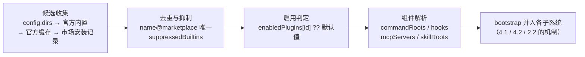

# 4.3 Plugins：可安装扩展包

> 本章导览：技能、命令、hooks、MCP 服务器各自都能扩展 Agent，但它们分散在不同目录和配置文件里，分享起来要逐项拷贝。Plugin 把它们装进一个带清单的目录，再配上一层 marketplace 分发机制，让扩展变成"一条命令安装"。本章讲清单格式、变量插值的安全设计、发现与启用流水线，以及市场结构。

## 问题：扩展需要一个发行单元

前两章的扩展机制已经覆盖了"改 prompt"（Skill、命令）与"拦进程"（hooks），加上 2.2 节的 MCP，ZCode 的扩展面共有四五种。但想象你要把团队积累的"内部部署技能 + 审查命令 + 安全检查 hook + 私有 MCP 服务器"分享给同事：技能要拷到 `~/.zcode/skills`，命令要拷到 `~/.zcode/commands`，hook 要往 config.json 里贴 JSON，MCP 服务器要另外配置——四份载体、四种格式、四个升级点，没有版本号，没有卸载。

**插件（Plugin）就是这一切的发行单元**：一个目录，里面放一个清单文件声明"我提供哪些组件"，其余组件各归其位。装一个插件，等于同时装上它的全部技能、命令、hooks、MCP 服务器与子代理配置；卸载则全部消失。清单之外，再配一个 marketplace 层解决"从哪下载、装到哪、开关在哪"。

ZCode 的六边形架构在这里再次显形（见报告开篇的整体结构）：contracts 定义插件契约，adapters 负责发现与装载，core 运行时根本不知道插件的存在——它只看到"技能根目录多了一个、hooks 列表多了一条"。**插件不是运行时特性，而是装配期特性。**

## plugin.json：清单即契约

清单放在插件根目录的 `.zcode-plugin/plugin.json`（兼容 `.claude-plugin/` 目录名）。**必需字段只有一个 `name`**，且必须匹配 `/^[a-z0-9][a-z0-9._-]{0,127}$/`——小写字母数字开头，总长不超过 128。其余字段全部可选（`packages/adapters/src/plugins/index.ts`）：

```json
{
  "name": "ios-simulator",
  "version": "1.0.0",
  "description": "Drive the iOS simulator from the agent",
  "author": { "name": "Example Corp" },
  "commands": "commands",
  "skills": "skills",
  "hooks": "hooks/hooks.json",
  "mcpServers": {
    "ios-simulator": {
      "type": "stdio",
      "command": "node",
      "args": ["${CLAUDE_PLUGIN_ROOT}/dist/mcp/server.js"],
      "cwd": "${CLAUDE_PROJECT_DIR}",
      "env": { "IOS_SIM_DEFAULT_DEVICE": "${user_config.default_device}" }
    }
  },
  "agents": "agents",
  "userConfig": {
    "default_device": {
      "type": "string",
      "description": "Default simulator device name"
    }
  }
}
```

组件字段的取值形态很宽松：`commands`、`skills`、`agents` 接受目录名（相对插件根）、路径数组；`hooks` 接受 JSON 文件路径、内联对象或数组；`mcpServers` 接受内联对象或 `.mcp.json` 文件路径。这让极简插件只需一行字段，而复杂插件可以把内容拆成子目录管理。

`userConfig` 是最值得注意的字段：它声明**用户可为这个插件配置什么**。安装后用户填写的值通过 `${user_config.<key>}` 插值进组件配置（上面的 `IOS_SIM_DEFAULT_DEVICE`），插件由此获得"带参数的安装"能力——比如指向本机的 SDK 路径、默认设备名。

插件在系统里的稳定标识是 `"<name>@<marketplace>"`——同名插件可以来自不同市场而不冲突。

## 变量插值与安全设计

组件配置里的 `${...}` 占位符在装载时展开，规则（`packages/adapters/src/plugins/mcp.ts`，有删节）：

```ts
switch (name) {
  case "CLAUDE_PLUGIN_ROOT":
  case "ZCODE_PLUGIN_ROOT":
    return context.loaded.rootPath;
  case "CLAUDE_PROJECT_DIR":
  case "ZCODE_PROJECT_DIR":
    return context.workingDirectory;
  case "CLAUDE_SKILL_DIR":
  case "ZCODE_SKILL_DIR":
    throw new PluginVariableError(`Plugin variable requires a skill context: ${name}`);
  // ...
}

if (name.startsWith("user_config.")) {
  const key = name.slice("user_config.".length);
  if (
    context.loaded.manifest.userConfig?.[key]?.sensitive === true &&
    !options.allowSensitive
  ) {
    throw new PluginVariableError(
      `Sensitive plugin user_config value cannot be used in this field: ${key}`,
    );
  }
  // ...
}
if (options.allowSensitive && ENVIRONMENT_VARIABLE_NAME_PATTERN.test(name)) {
  // token。只在敏感 sink 解析，避免 secret 被展开到 args、URL 或其它可见字段。
  return context.env[name];
}
```

三条安全设计，每条都值得单独记：

**第一，`CLAUDE_PLUGIN_ROOT` 与 `ZCODE_PLUGIN_ROOT` 并存。** ZCode 大量存在这种"原生 + Claude Code 兼容"的双名设计（hooks 的 snake_case 字段、`.agents/` 目录同理），让存量 Claude Code 插件几乎零成本迁移，原生名优先。兼容层是采纳策略，不是技术妥协。

**第二，变量按上下文可用性报错，而不是展开成空串。** `${ZCODE_SKILL_DIR}` 在插件装载期没有"当前技能"语义，直接抛错——如果静默替换成空字符串，路径会悄悄变成 `/dist/mcp/server.js` 这类损坏值，错误被推迟到运行深处。**让缺失的上下文尽早爆炸**是配置系统的重要纪律。

**第三，环境变量只能进"敏感 sink"。** 任意环境变量（API key、token）只允许在 `headers`、`env` 这类敏感 sink 字段里展开，**绝不**允许展开进 `command`、`args`、`url`——后者会进日志、进 UI 展示、进模型可见的错误消息。`userConfig` 里标记 `sensitive: true` 的键同样受此约束。一个插件的 `args` 里出现 `${MY_API_TOKEN}` 会被原样保留（不报错也不展开），密钥根本没有机会泄漏到可见字段。

## 发现与启用：从候选到组件

插件从磁盘上的目录变成"技能清单里的一行、hooks 列表里的一条"，要经过一条四步流水线：



**候选收集**：配置 `dirs` 内联的目录优先，随后是随应用分发的官方内置插件根、官方插件缓存、市场安装记录。**去重与抑制**：`<name>@<marketplace>` 重复出现时告警并取其一；"卸载"一个官方内置插件不是删文件，而是在用户配置写 `suppressedBuiltins`——内置的还在磁盘上，只是被点名沉默。**启用判定**：用户配置 `enabledPlugins` 以插件 ID 为键存布尔开关，没写就用默认值。

**组件解析**是流水线的出口：把清单翻译成 `{ commandRoots, hooks, mcpServers, skillRoots }` 四类组件，bootstrap 把它们分别并入各子系统——技能根目录追加给 4.2 节的发现器，hooks 追加给 4.1 节的运行器，MCP 配置并入 2.2 节的服务器池（插件级 MCP 服务器名会命名空间化为 `plugin:<插件名>:<原名>`，天然不与用户配置冲突）。运行时各机制对"组件来自插件"无感知。

安全上还有两道锁：

> **工程细节**：**路径防逃逸**。清单里声明的每个组件路径都过 `resolveInside(pluginRoot, path)` 检查——相对路径解析后必须仍落在插件根目录内，绝对路径直接拒绝。没有它，一个恶意清单可以用 `"skills": "../../../etc"` 把任意目录注册成技能来源。这与 4.2 节"插件技能不跟随 symlink"是同一威胁模型的两个入口。

> **工程细节**：**`ZCODE_PLUGIN_ID` 不可伪造**。插件 hooks 运行时，环境变量 `ZCODE_PLUGIN_ID`/`ZCODE_PLUGIN_ROOT` 由解析器从装载结果权威写入（见 4.1 节的 `createPluginEnvOverlay`），hook 脚本可以信任它来定位插件数据目录；第三方脚本自己 `export` 一个假 ID 不可能冒充别的插件，因为装载期的 plugin 上下文不经过环境变量输入。

## Marketplace：三层分发

插件本体解决"打包"，marketplace 解决"分发"。真实系统的市场机制落在**三份持久文件**上（`packages/adapters/src/plugins/marketplace.ts`）：

1. **`known_marketplaces.json`**：记录用户已添加了哪些市场（名字、来源、更新时间）；
2. **每市场一份 `marketplace.json`**：市场清单，形如 `{ "name": "zcode-plugins-official", "plugins": [{ "name": "browser-use", "source": "...", "version": "0.5.1" }, ...] }`——**市场只列目录，不装内容**；
3. **`installed_plugins.json`**：本机装了哪些插件、装到了缓存目录的哪里。

`source` 字段描述插件包从哪来，支持五种：`url`（zip 包直链）、`github`（仓库简写）、`git`（任意 git 地址）、`npm`（npm 包）、`file`/`directory`（本地路径，开发插件时用）。安装一个插件 = 按 source 拉取内容 → 放进本地缓存目录 → 在 `installed_plugins.json` 记账。

两个工程加固让这套机制可靠：

> **工程细节**：**原子目录激活**。安装不是"直接往缓存目录里解压"——半路崩溃会留下残缺插件。真实系统的做法是先在临时目录构建完整内容，再用一次 `rename` 切换到位，配合事务 ID 记录，崩溃后下次启动可恢复。这与 1.3 节"配置写入要原子"是同一原则在目录粒度的重演。

> **工程细节**：**官方市场 seed**。`zcode-plugins-official` 市场的插件随应用一起分发，bootstrap 启动时把它们 seed 进本地缓存——用 sha256 清单校验内容完整性、原子落盘。用户开箱即有 browser-use、文档技能等官方插件，又可以在配置里 `suppressedBuiltins` 关掉任何一个。

版本字段贯穿三层：清单有 `version`，市场条目声明 `version`，更新时做版本比较决定是否重新拉取。ZCode 没有实现 npm 式的依赖解析——插件之间不互相依赖，版本只用于自身升级，这是刻意的简化：分发单元越独立，市场机制越简单。

## 真实插件解剖

看两个官方插件的清单，感受插件形态的光谱。

**browser-use：技能插件**。整个清单没有一个组件目录之外的机制：

```json
{
  "name": "browser-use",
  "version": "0.5.1",
  "description": "Built-in browser automation runtime and guidance ...",
  "author": { "name": "Z.ai" },
  "license": "MIT",
  "skills": "skills"
}
```

（`packages/browser-use-plugin/.zcode-plugin/plugin.json`，有删节。）

它的 `skills/` 目录里放着浏览器自动化的操作指南——纯内容，没有可执行组件。这展示了插件的最低形态：**一个带名字的知识包**。对比 4.2 节手工拷贝技能目录，插件化的增量仅仅是"多了一个清单 + 一条安装命令"。

**zcode-guide：内容型组合**。它携带多个诊断技能（命令、hooks、MCP、插件的排查指南）与命令，定位是"插件 = 命令 + 技能 + 提示词工程"的示范——把一组**成套的方法论**打包，教会 Agent 排查自身配置问题。

**ios-simulator：完整形态**。stdio MCP 服务器 + `${user_config}` 插值 + hooks 文件，是本章清单示例的原型——当扩展需要真实进程（模拟器控制）与用户环境参数（默认设备）时，插件提供了全部插槽。

三个实例排成一列，恰好是插件的三档复杂度：纯技能 → 技能加命令 → 全组件。写插件时从第一档起步，需要时再升档。

## 教学版：src/plugins.ts

tinycode 的 `src/plugins.ts` 只做两件事：读清单、合并组件，用约 50 行讲清插件的概念内核。

```ts
// tinycode/src/plugins.ts
import { readFile } from "node:fs/promises";
import { isAbsolute, join, relative, resolve } from "node:path";

export interface PluginManifest {
  name: string;
  version?: string;
  commands?: string;   // 目录名，与真实系统一致：也可扩展为数组/内联
  skills?: string;
  hooks?: string;      // hooks JSON 文件的相对路径
  mcpServers?: Record<string, unknown>;
}

export interface LoadedPlugin {
  rootPath: string;
  manifest: PluginManifest;
  commandRoots: string[];
  skillRoots: string[];
  hooksFiles: string[];
  mcpServers: Record<string, unknown>;
}

// 所有组件路径必须落在插件根目录内，绝对路径直接拒绝
function resolveInside(rootPath: string, rawPath: string): string | null {
  if (isAbsolute(rawPath)) return null;
  const resolved = resolve(rootPath, rawPath);
  const rel = relative(rootPath, resolved);
  return rel === "" || (!rel.startsWith("..") && !rel.includes(".."))
    ? resolved
    : null;
}
```

装载就是"读清单 + 逐字段过防逃逸检查"：

```ts
export async function loadPlugin(rootPath: string): Promise<LoadedPlugin> {
  const manifestFile = join(rootPath, ".zcode-plugin", "plugin.json");
  const manifest = JSON.parse(await readFile(manifestFile, "utf8")) as PluginManifest;
  // 必需字段只有 name；格式与真实系统同一正则
  if (!/^[a-z0-9][a-z0-9._-]{0,127}$/.test(manifest.name)) {
    throw new Error(`非法插件名: ${manifest.name}`);
  }
  const dir = (field?: string): string | undefined => {
    if (!field) return undefined;
    const inside = resolveInside(rootPath, field);
    if (!inside) throw new Error(`插件 ${manifest.name} 的路径越界: ${field}`);
    return inside;
  };
  return {
    rootPath,
    manifest,
    commandRoots: dir(manifest.commands) ? [dir(manifest.commands)!] : [],
    skillRoots: dir(manifest.skills) ? [dir(manifest.skills)!] : [],
    hooksFiles: dir(manifest.hooks) ? [dir(manifest.hooks)!] : [],
    mcpServers: manifest.mcpServers ?? {},
  };
}
```

第二步是装配：把多个插件的组件归并成四类，交给前面各章的机制——这一步就是真实系统 bootstrap 的"组件解析"的缩样：

```ts
export function collectComponents(plugins: LoadedPlugin[]) {
  return {
    // 技能根目录交给 src/skills.ts 的扫描器（4.2）
    skillRoots: plugins.flatMap((p) => p.skillRoots),
    // 命令根目录交给命令扫描（4.2）
    commandRoots: plugins.flatMap((p) => p.commandRoots),
    // hooks 声明交给 src/hooks.ts 的配置合并（4.1）
    hooksFiles: plugins.flatMap((p) => p.hooksFiles),
    // MCP 配置并入服务器池（2.2），服务器名建议加 plugin:<名>: 前缀
    mcpServers: Object.assign({}, ...plugins.map((p) => p.mcpServers)),
  };
}
```

在 tinycode 主程序里接入是三行：扫描插件目录逐个 `loadPlugin`，`collectComponents` 归并，把四类组件分别喂给 4.2 节的 `scanSkills`、4.1 节的 hooks 配置、2.2 节的 `src/mcp.ts`。教学版省略了 marketplace 三层、`userConfig` 插值与 `suppressedBuiltins`——分发是包装，清单加合并才是内核。

## 小结

Plugin 把四散的扩展机制收进一个发行单元：`.zcode-plugin/plugin.json` 清单只必需一个 `name`，其余字段按需声明技能、命令、hooks、MCP 服务器与子代理；`userConfig` 让插件带参数安装。安全设计有三条主线——组件路径必须 `resolveInside` 防逃逸、变量缺失尽早报错而非展开成空串、环境变量只能进敏感 sink；发现与启用是一条"候选收集 → 去重抑制 → 开关判定 → 组件归并"的装配期流水线，运行时对此无感知。marketplace 用三份持久文件（市场目录、市场清单、安装记录）加原子激活实现分发。

至此第四部分讲完了三种进程内的扩展机制。还剩最后一根轴：Agent 的"大脑"本身——怎么让同一套循环跑在不同模型上，包括本地部署的开源模型，这是下一章的主题。
