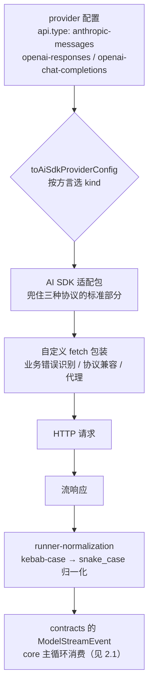

# 4.4 多模型与本地部署

> 本章导览：Agent 循环不该绑死在某一家模型上。本章把 tinycode 的模型层重构成 Provider 抽象加 OpenAI 兼容实现——`baseUrl` 指向哪里，大脑就在哪里，包括本机的 Ollama/vLLM；再看真实系统如何用三种协议适配器、流事件归一化与分层重试，把"换模型"变成一行配置。

## 问题：为什么不能只有一家模型

前面所有章节里，模型一直是"那个 API"。现实中的选型是四个压力的平衡：

- **成本**：主循环一个回合可能请求模型几十次，旗舰模型跑全程一天烧掉一顿饭钱；多数辅助调用（压缩摘要、起标题）用便宜模型绰绰有余。
- **能力**：不同模型在长上下文、工具调用可靠性、代码能力上各有所长，理想状态是按任务换大脑。
- **隐私与合规**：有些代码库一行都不能出内网——模型必须能部署在自己机房。
- **本地部署**：开源权重加消费级显卡，让"没有 API Key 也能完整跑通一个 Agent"成为可能。

这四条压力指向同一个工程结论：**模型必须是可插拔的**。1.3 节我们已经在 tinycode 里建立了 Provider 抽象的雏形，本章把它补完整：一个 Provider 接口、一个 OpenAI 兼容实现，以及真实系统里那套"三种方言、统一事件、分层重试"的适配层工程。

## Provider 接口：一行配置换一个大脑

tinycode 的 `src/model.ts` 在 1.3 节的抽象上扩展成最终形态。核心只有两个类型：

```ts
// tinycode/src/model.ts（4.4 扩展后）
export interface Provider {
  readonly id: string;
  chat(request: ChatRequest): AsyncIterable<StreamEvent>;
}

export interface ProviderConfig {
  id: string;
  baseUrl: string;   // 指向哪家端点：云端 API、企业网关或本机服务
  apiKey?: string;   // 本地部署通常不需要
  model: string;     // 模型名，由端点自行解释
}
```

`Provider` 的全部承诺是一个 `chat` 方法：吃进消息与工具定义，吐出归一化的流事件（1.2 节定义的 `text_delta`、`tool_input_delta`、`finish` 等）。循环（2.1 节的 `src/loop.ts`）只依赖这个承诺，对端点是云是本地毫无感知。

最常见的接入形态是 **OpenAI 兼容协议**（`/chat/completions`）：它已经成为事实标准，云端网关、开源推理框架几乎都提供这个接口。实现就是一个 SSE 解析器：

```ts
export function createOpenAICompatible(config: ProviderConfig): Provider {
  return {
    id: config.id,
    async *chat(request) {
      const res = await fetch(`${config.baseUrl}/chat/completions`, {
        method: "POST",
        headers: {
          "content-type": "application/json",
          ...(config.apiKey ? { authorization: `Bearer ${config.apiKey}` } : {}),
        },
        body: JSON.stringify({
          model: config.model,
          stream: true,
          messages: toWireMessages(request.messages),
          tools: toWireTools(request.tools),
        }),
        signal: request.signal,
      });
      if (!res.ok) throw await toRequestError(res); // 429/5xx 可重试，业务错误不可重试
      for await (const payload of parseSse(res.body!)) {
        yield* mapChunkToEvents(JSON.parse(payload));
      }
    },
  };
}
```

`mapChunkToEvents` 把方言响应块翻译成统一事件——`delta.content` 变 `text_delta`，`delta.tool_calls` 变 `tool_input_delta`，`finish_reason` 与 `usage` 合成 `finish`。这就是模型层的全部职责边界：**方言进来，统一事件出去**。

**本地部署演示**是这个设计最好的验收测试。装好 Ollama 后 `ollama serve`（默认监听 11434 端口，提供 `/v1` 兼容层），tinycode 的配置只改三个字段：

```json
{
  "provider": {
    "id": "local-qwen",
    "baseUrl": "http://localhost:11434/v1",
    "model": "qwen3-coder"
  }
}
```

换 vLLM 只需把 `baseUrl` 指到 `http://localhost:8000/v1`。没有 SDK、没有新依赖——`fetch` 本来就能访问 `localhost`。跑起来后，2.1 节构建的循环、3.x 节的工具、4.1–4.3 节的扩展全部原样工作：**本地模型与云端模型在架构上没有区别，区别只是 `baseUrl`**。

> **注**：本地小模型跑 Agent 的现实预期要摆正——工具调用的 JSON 可靠性是第一道坎，参数格式错、漏字段会频繁出现。2.2 节的 MCP 工具与严格 schema 校验能挡掉一部分，但"换本地模型"首先是架构验证，其次是降级方案，不是性能平替。

## 三种 API 方言与统一策略

tinycode 只实现了 OpenAI 兼容一种方言，真实系统则要同时伺候三种（`packages/adapters/src/model/model-execution.ts`，有删节）：

```ts
switch (config.api.type) {
  case "anthropic-messages":
    return { kind: "anthropic", ...common };        // Anthropic messages 协议
  case "openai-responses":
    return { kind: "openai", ...common };           // OpenAI Responses 协议
  case "openai-chat-completions":
    return { kind: "openai-compatible", name: providerId, ...common }; // OpenAI 兼容
}
```

三种方言的差异在表层就能看到：Anthropic 用 `x-api-key` 头、消息结构里工具结果有独立角色；OpenAI Responses 是新一代有状态接口；chat completions 是最普及的无状态接口。深层差异更多——思考块的携带方式、缓存控制的语义、`tool_use` 块与 `tool_calls` 数组的结构区别。

真实系统的统一策略分两层：

**第一层，用 Vercel AI SDK 兜住方言。** 三种 `kind` 分别映射到 `@ai-sdk/anthropic`、`@ai-sdk/openai`、`@ai-sdk/openai-compatible` 三个适配包，HTTP 层由 AI SDK 发起，`tool_use` 与 `tool_calls` 的结构差异由它消化。adapters 包里没有一行裸写 HTTP 的模型请求代码——方言的"标准部分"交给成熟库，自己只写"非标部分"。

**第二层，自定义 fetch 包装修补现实。** 生产端点不会照文档出牌：网关返回的的业务错误码各家不同（配额耗尽、内容审查、余额不足），流式响应有协议兼容问题，还有代理注入。adapters 用一层自定义 fetch 叠加在这些 SDK 之上做**业务错误识别**（把"配额耗尽"从可重试的 429 里摘出来）与**协议兼容**（修平各家端点的偏差）。这个两层结构可以直接抄：**库管协议，自己管现实**。



## 流事件归一化

方言的最后一公里是事件名与统计口径。AI SDK 吐出 kebab-case 的事件（`text-delta`、`tool-call`），contracts 的 `ModelStreamEvent` 是 snake_case（`text_delta`、`tool_call`），中间由 `runner-normalization.ts` 做归一化。看起来只是改名，但 `normalizeUsage` 展示了真正的深水区：

```ts
export function normalizeUsage(usage?: Partial<LanguageModelUsage>): ModelUsage {
  return {
    inputTokens: usage?.inputTokens,
    outputTokens: usage?.outputTokens,
    totalTokens: usage?.totalTokens,
    cacheReadTokens: usage?.inputTokenDetails?.cacheReadTokens,
    cacheWriteTokens: usage?.inputTokenDetails?.cacheWriteTokens,
    reasoningTokens: usage?.outputTokenDetails?.reasoningTokens,
    // ...服务端工具用量（联网搜索等）单独归口
  };
}
```

> **踩坑**：真实源码注释里点名了一个统计陷阱——AI SDK v6 的 Anthropic 适配器返回的 `inputTokens` **已经包含** cache read/write 的 token，做总 token 口径时不能把三者再叠加一遍，否则缓存命中越多、账算得越离谱。跨供应商的统计归一化，难的不是字段映射，而是**各家对同一个字段的口径差异**。

归一化的价值在消费端兑现：core 的主循环（2.1 节）与压缩、子代理等所有模型消费方，只面对一种事件流。换模型、加供应商，下游零改动——这正是 4.3 节"装配期特性，运行时无感知"的又一次出现。

## 重试：策略、服务端提示与预算

网络请求会失败，模型请求失败得尤其有特色（限流、过载、长连接中断）。真实系统的重试策略在 `packages/adapters/src/model/retry-policy.ts`，默认值一目了然：

| 参数 | 默认值 | 含义 |
| --- | --- | --- |
| `maxAttempts` | 10 + 1 | 首次请求加 10 次重试 |
| `baseDelayMs` | 2000 | 首次退避 2 秒 |
| `backoffFactor` | 2 | 指数退避，每次翻倍 |
| `maxDelayMs` | 60000 | 单次退避封顶 1 分钟 |
| `jitter` | true | 加随机抖动，防止重试齐步走 |

全部参数可用环境变量覆盖（`ZCODE_MODEL_RETRY_MAX_RETRIES` 等）。教学版的核心逻辑二十行：

```ts
// tinycode/src/model.ts 的重试包装
const MAX_ATTEMPTS = 11; // 首次请求 + 10 次重试，与真实系统一致
const BASE_MS = 2_000;
const MAX_DELAY_MS = 60_000;

export async function withModelRetry<T>(fn: () => Promise<T>): Promise<T> {
  for (let attempt = 1; ; attempt++) {
    try {
      return await fn();
    } catch (error) {
      if (attempt >= MAX_ATTEMPTS || !isRetryable(error)) throw error;
      const backoff = Math.min(MAX_DELAY_MS, BASE_MS * 2 ** (attempt - 1));
      const hinted = retryAfterMs(error) ?? backoff;    // 服务端明确提示优先
      const jitter = Math.random() * backoff * 0.1;
      await sleep(hinted + jitter);
    }
  }
}
```

三个超出"教科书指数退避"的现实细节：

**第一，服务端提示优先于本地策略。** 限流响应常带 `retry-after`（秒）或 `retry-after-ms` 头，服务端比你自己算的退避更知道什么时候有容量。但有一个反直觉的坑（`packages/adapters/src/model/failure-inspection.ts` 的注释）：部分 provider 会**同时**返回 `retry-after` 和 `x-should-retry: false`——此时 `retry-after` 只能当诊断信息，绝不能驱动等待。头部要组合着读，不能见 `retry-after` 就睡。

**第二，业务错误终止重试。** `failure-provider-business-codes.ts` 的注释记录了一次真实事故：`insufficient_quota`（配额耗尽）曾被归入通用 429 走重试——结果每次都等一个注定徒劳的 `Retry-After`。修复后的语义是：业务错误码直接终止重试并上抛，**重试只属于瞬时故障**。

**第三，预算可以无界，但要显式选择。** `retry-budget.ts` 定义了 `ModelRetryBudget.Unbounded`：退避封顶 60 秒后无限探测。它服务于"用户在等结果、服务在缓慢恢复"的场景——放弃了快速失败，换"最终连上"。预算是产品决策，不该是默认值。

## 重试的边界：可见输出之后不再重试

本章最重要的工程判断藏在一个不起眼的文件里（`packages/adapters/src/model/stream-retry-boundary.ts`，有删节）：

```ts
// 非空 reasoning_delta 是用户感知的首个输出 token，不能等待正文或工具边界才释放。
const RETRY_SAFE_PRELUDE_STREAM_EVENT_TYPES = new Set<ModelStreamEvent["type"]>([
  "start", "text_start", "text_end",
  "reasoning_start", "reasoning_end",
  "tool_input_start", "tool_input_delta", "tool_input_end",
]);

export function isRetrySafePreludeStreamEvent(event: ModelStreamEvent): boolean {
  if (event.type === "reasoning_delta" || event.type === "text_delta") {
    return event.text.length === 0;   // 非空 delta = 已有用户可见输出
  }
  return RETRY_SAFE_PRELUDE_STREAM_EVENT_TYPES.has(event.type);
}
```

规则一句话：**adapter 级重试只发生在首个真实事件之前**。流刚开始时的 `start`、空 delta 都可以安全丢弃重来；但第一个非空 `text_delta` 一旦发出，UI 已经渲染、历史已经开始积累——此时底层网络断了，再在 adapter 里重发请求，用户会看到重复输出，历史会出现重复内容。

那之后网络断了怎么办？交棒。可见输出已经提交的失败由 core 层的**断流恢复（stream recovery）**接管：从持久化的锚点把已接受的工具调用连同结果提交，重开请求续写，而不是从头重放。这条"adapter 内重试（无可见输出）→ core 断流恢复（有输出后从锚点续）→ 响应式压缩（上下文超窗）→ 输出续写（截断续传）"的分层接力，6.3 节会作为失败处理的骨架完整展开——这里只需要记住分界线：**重试边界画在"用户是否看见了输出"上，而不是画在 HTTP 层**。

另一个一句带过的闸门：每次模型请求在发出前还要过**进程级并发准入**（`request-admission.ts`，tryAcquire 快路径、排队 acquire、幂等 release）——并发上限保护的是本机资源和供应商的礼貌，与重试正交。

## 成本工程：辅助模型

多模型的价值不止"换主模型"。真实系统把主循环之外的模型调用单独归了一类——**辅助调用**：压缩摘要（2.4 节）、会话标题、项目记忆提取（2.3 节）、goal 校验（5.4 节）。它们的共同点是：**对推理深度的要求远低于主循环，但调用频次不低**。

处理方式是一个 14 行的函数（`packages/core/src/model/auxiliary-model-options.ts`，全量）：

```ts
const AUXILIARY_MAX_OUTPUT_TOKENS = 5_000;

export function auxiliaryModelOptions(model: Model): Required<ModelOptions> {
  return {
    reasoningLevel: model.optionSpecs.reasoningLevel.values[0]!,   // 最低档
    maxOutputTokens: Math.min(AUXILIARY_MAX_OUTPUT_TOKENS, model.optionSpecs.maxOutputTokens.max),
  };
}
```

两个选择都值得注意：推理档位取 `values[0]`——**公开档位里的最低项**，源码注释特意说明不能靠猜模型名（disabled/off 之类）来推断协议行为，档位顺序由模型配置声明；输出预算封顶 5000 token，摘要和标题本来就不需要长篇。所有辅助调用点统一走这一个函数——**成本策略收口在一处**，未来想给辅助调用换更便宜的模型，改一个函数就够。

这是"多模型"叙事里容易被忽略的一半：不是只有"主模型 A 换成主模型 B"才叫多模型，**同一个模型的不同档位组合**也是多模型，而且往往是成本收益比最高的一档。

## 模型选择与会话绑定

最后一个机制问题：用户 `/model` 切换了模型，正在进行的多步工具调用怎么办？

真实系统的答案是把绑定粒度定在**会话（session）与回合的边界上**：模型选择持久化在 session 上，回合开始时（`packages/core/src/runtime/methods/turn.ts`）在第一个 await 之前读取当前选择并**冻结本轮事实**——整个回合从模型步到工具执行都用这一个模型；配置或切换只影响下一轮。

选择这样设计的理由：一个回合内的上下文（缓存前缀、消息投影、用量统计）都是围绕"同一个模型"组织的，回合中途换模型意味着缓存全部作废、统计口径断裂；而跨回合切换无损——新回合从新模型的历史投影开始。**"配置变化只影响下一轮"是所有有状态的运行时都该抄的默认策略**：立即生效听起来好，但对进行中的工作而言，一致性比新鲜度值钱。

## 小结

模型层的扩展性由三个抽象层层递进：`Provider` 接口让循环与端点解耦——`baseUrl` 指向 Ollama、vLLM 或云端只是配置差异；三种 API 方言由"AI SDK 兜协议 + 自定义 fetch 修现实"统一，流事件经归一化层变成单一形态供主循环消费；重试则以"首个真实事件"为界分为两段——之前 adapter 指数退避（10 次、2 秒起步、封顶 60 秒、尊重服务端提示、业务错误终止），之后交棒给 core 的断流恢复。成本侧，辅助调用统一压到最低推理档加 5000 token 预算，模型选择绑定会话、变更只影响下一轮。

至此，第四部分走完了扩展性的全部四根轴：hooks 拦截生命周期、Skill 按需注入指令、plugin 打包分发、Provider 更换大脑。下一部分我们回到 Agent 本身，看一个个具体的功能范式——从 Todo 列表到定时任务——是如何在这套底座上生长出来的。
