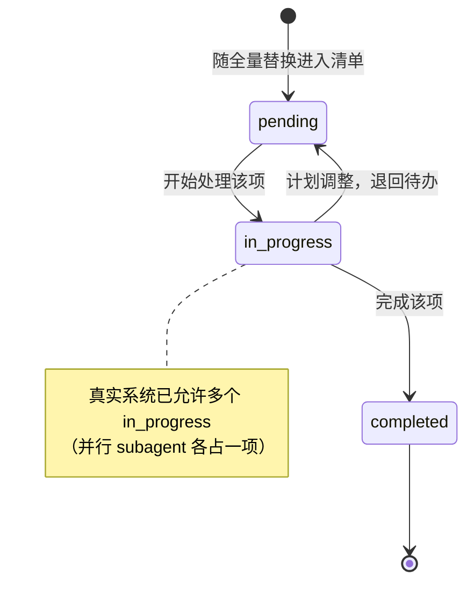

# 5.1 Todo：任务列表跟踪

> 本章导览：模型没有工作记忆，长任务做到一半就会"忘了最初要干什么"。本章讲 Todo 机制如何把任务清单外部化：一个每次全量替换的最小状态机，加上一套让模型"想起来看清单"的惰性提醒。

第五部分的前三章是一组"对齐"机制：Todo 让模型能自我追踪进度（本章），Plan Mode 让方案在动工前先与你对齐（见 5.2 节），权限系统把不可逆动作的裁决权交还给人类（见 5.3 节）。它们回答的问题层层递进：模型知不知道自己在干什么？你们是不是想做同一件事？它可不可以这么做？

## 为什么需要 Todo

先看没有 Todo 时会发生什么。你让 Agent"把这个模块从 REST 迁移到 GraphQL"，它痛快地答应，改了两个文件，然后顺势修起一个相关的类型错误——二十个工具调用之后，上下文里已经没有一行字提醒它"我原本要做什么、做到哪一步了"。

这不是模型的"品质问题"，而是结构问题。模型的工作记忆就是上下文窗口，而上下文是稀缺资源（见 2.3 节）：它一边干活一边被新的工具结果填充，旧内容要被压缩（见 2.4 节）。压缩摘要保留的是"对话轮廓"，最先被牺牲掉的恰恰是第三轮那句详细的任务分解。换句话说，**任务目标是上下文里最脆弱的信息**——它出现得最早，于是被摘要掉的概率最大。

Todo 把这件事翻转过来：任务分解不再住在上下文里，而是住在一个独立的存储里，上下文中只留一个指针，需要时把清单重新注回。这一翻转带来三个收益：

1. **对抗遗忘**。清单可以在任意时刻完整恢复，压缩丢不掉它。
2. **给用户可见的进度**。工具调用流对人类是噪音，而一张"3/7 已完成"的清单是仪表盘。ZCode 把 TodoWrite 的结果直接渲染为用户界面上的一份"工作计划"。
3. **强制 plan-then-execute**。更新清单的动作本身迫使模型在动手前列出步骤——写清单就是一次轻量的计划，只是不需要审批。

## 任务的结构化表示

ZCode 提供两个工具：TodoRead 与 TodoWrite（`packages/core/src/tool/handlers/todo.ts`）。数据结构定义在契约层（`packages/contracts/src/tools/todo.ts`）：

```ts
export const TodoItemSchema = z.object({
  content: z.string().min(1).describe("Brief description of the task"),
  status: z.enum(["pending", "in_progress", "completed"]),
  priority: z.enum(["high", "medium", "low"]),
});
```

三个字段，到此为止。没有 id，没有依赖关系，没有截止时间。这是刻意的：清单的读者是模型和用户，不是数据库——模型靠 content 的文字指代任务，结构越简单，模型写错的概率越低。

真正值得停下来想的是写入语义。TodoWrite 不是"添加一条"或"更新第 N 条"，而是**全量替换**：每次调用必须发送完整列表，上一次的清单整体作废。工具描述里写得很直白："Send the full list each call; it replaces the previous one."

为什么不做增量 patch？三个理由：

1. **模型友好**。增量更新要求模型维护"第 3 条的 id 是什么"这类簿记状态，而全量替换只需要它复述自己脑中的清单——模型最擅长输出"当前全貌"，最不擅长输出 diff。
2. **幂等**。同样的列表发两次，结果一样。网络重试、结果丢失后的重发都无害。
3. **易恢复**。列表本身就是完整状态，不存在"应用了一半的补丁"。持久化、恢复、注回，都只需读写一个值。

> **踩坑**：旧版 schema 硬性约束"最多一个 in_progress"（单一主线任务的假设）。这个校验后来被整段注释掉、原样保留在源码里（`packages/contracts/src/tools/todo.ts`）——多个 subagent 并行时天然存在多个进行中的条目，硬校验会让 TodoWrite 直接失败，连带跳过后续调度。教训：对模型的结构约束，要么真的强制（schema 校验），要么干脆别写；"违规即崩溃"却又能被注释掉，是最差的组合。有意思的是工具描述至今仍保留"Keep one item in_progress at a time"的建议——这条约束从 schema 硬拦截降级成了描述里的软引导。

## 进度更新与对齐

### 返回值：结果即确认

TodoWrite 的返回值携带三样东西（`packages/core/src/tool/handlers/todo.ts`，有删节）：

```ts
const oldTodos = await context.sessionStore.readTodos({ sessionID: context.sessionId });
await context.sessionStore.updateTodos({ sessionID: context.sessionId, todos });
return {
  oldTodos,
  todos,
  summary: summarizeTodos(todos), // { total, pending, inProgress, completed }
} satisfies TodoWriteOutput;
```

这个设计省掉了确认回路。模型写完清单不需要再调 TodoRead 核对——返回值里的 `todos` 就是系统认可的当前状态，`oldTodos` 提供前后对比，`summary` 直接给出统计。**让写操作返回"写成了什么"，而不是一句 ok**，这条原则适用于所有状态类工具：它把"确认"从一次额外的往返，变成结果自带的属性。

### 权限豁免：会话内状态不弹窗

TodoWrite 明明是个写工具，却从不触发权限弹窗。玄机在能力声明里（`packages/core/src/tool/handlers/todo.ts`，有删节）：

```ts
permission: {
  permission: "todo.write",
  riskLevel: "low",
  sideEffectScope: "session", // 副作用只到会话边界
  needsApproval: false,
}
```

`sideEffectScope: "session"` 的含义是：这个工具动的只是会话内的状态，不触碰文件系统、不发起网络请求。于是它在 build 模式下命中"低风险会话状态直通"分支（`mode.build.sessionState`），在 plan 模式下因为 metadata.readOnly 为 true 而命中只读直通——对，TodoWrite 的 metadata.readOnly 是 true：它对外部世界只读，只是会话内可写。完整的判定优先级见 5.3 节。

这条豁免划出了一条清晰的线：**权限系统保护的是模型之外的世界的完整性，不是会话自己的记账本**。模型给自己记进度不需要人类批准，正如没人需要审批你往便签上写字。

### 存储：一张单表，事务内推倒重写

真实系统把清单存进 SQLite 的 todo 表（session_id, content, status, priority, position, time_created, time_updated），更新方式与写入语义严格同构——事务里先删光、再按数组顺序重插（`packages/adapters/src/storage/session-store/repositories/todos.ts`，有删节）：

```ts
db.exec("begin immediate");
try {
  db.prepare("delete from todo where session_id = ?").run(input.sessionID);
  // position 记录数组原始次序，恢复时保持模型给的顺序
  for (const [position, todo] of input.todos.entries()) {
    insert.run(input.sessionID, todo.content, todo.status, todo.priority, position, now, now);
  }
  db.exec("commit");
} catch (error) {
  db.exec("rollback");
  throw error;
}
```

全量替换语义让存储可以简单到近乎粗暴：不需要 upsert，不需要 diff，不需要担心删除遗留。"列表 = 一个值"的设计，存储端只需保证一件事——换值是原子的。

> **工程细节**：TodoWrite 的结果有 100_000 字节的模型可见上限（`MAX_TODO_MODEL_BYTES`，`packages/core/src/tool/handlers/todo.ts`），超限截断。清单本身也会膨胀，上限防止一次失控的写入吃掉上下文预算。

## 与 Agent Loop 的结合

Todo 的机制本体只有两个工具加一张表，剩下的问题都在循环里：**怎么让模型在该用的时候用，在不该忘的时候不忘。**

### 工具描述即引导

第一个答案藏在工具描述里（`packages/core/src/tool/handlers/todo.ts`）：

```text
Create and update a task list for the current session.
The list is rendered to the user as your working plan.

- Each todo has `content`, `status` ("pending" | "in_progress" | "completed"),
  and `priority` ("high" | "medium" | "low").
- Send the full list each call; it replaces the previous one.
- Keep one item `in_progress` at a time and mark it `completed` when done.
```

"rendered to the user as your working plan" 这半句话是写给模型的动机：它知道清单会被用户看到，写清单就不是无意义的官僚动作，而是一份对用户的可见承诺。工具描述是唯一在每个会话都必然进入上下文的"使用说明书"（见 2.3 节）——使用时机、格式约定、常见误用都写在这里，比在系统提示词里单开一节更贴近调用点。

### todo reminder：模型也会忘记待办

但描述只能引导第一次。多轮之后，清单早已沉到上下文深处，模型的注意力被当前的工具结果占据——**模型也会忘记待办**。ZCode 的解法是惰性注回：不主动、不定期，而是当两个条件同时满足时，把提醒作为一条合成消息（见 2.3 节）塞进对话：

- 距上次 TodoWrite ≥ 10 个 assistant turn；
- 距上次 todo reminder ≥ 10 个 turn。

两个阈值都定义在 `TODO_REMINDER_CONFIG`（`TURNS_SINCE_WRITE: 10`、`TURNS_BETWEEN_REMINDERS: 10`，`packages/core/src/runtime/helpers/runtime-reminders.ts`）。第一个条件筛出"很久没碰清单"的场景，第二个条件防止提醒自身刷屏。提醒的正文出言谨慎：

```text
The TodoWrite tool hasn't been used recently. If you're working on tasks that would
benefit from tracking progress, consider using the TodoWrite tool to track progress.
Also consider cleaning up the todo list if has become stale and no longer matches
what you are working on. This is just a gentle reminder - ignore if not applicable.

Here are the existing contents of your todo list:
1. [completed] 调研现有 REST 路由
2. [in_progress] 搭建 GraphQL schema 骨架
```

注意它附上了现有清单。这一步是"注回"的关键：提醒不只是"你该看看清单"，而是直接把清单带回上下文——模型读完这条消息就完成了状态恢复，不需要先调一次 TodoRead。"忘了就补发全量状态"与 TodoWrite 的全量替换，是同一个哲学的两面。

### 教学版：src/features/todo.ts

tinycode 的实现把"JSON 文件 + 全量替换 + 提醒判定"收进一个文件：

```ts
// tinycode/src/features/todo.ts
import { readFile, writeFile, mkdir } from "node:fs/promises";
import { dirname } from "node:path";

export type TodoStatus = "pending" | "in_progress" | "completed";
export type TodoPriority = "high" | "medium" | "low";

export interface TodoItem {
  content: string;
  status: TodoStatus;
  priority: TodoPriority;
}

export class TodoStore {
  constructor(private filePath: string) {}

  async read(): Promise<TodoItem[]> {
    try {
      return JSON.parse(await readFile(this.filePath, "utf8"));
    } catch {
      return []; // 首次使用，文件还不存在
    }
  }

  // 全量替换：调用方每次给完整列表，不做增量 patch
  async write(todos: TodoItem[]) {
    const oldTodos = await this.read();
    await mkdir(dirname(this.filePath), { recursive: true });
    await writeFile(this.filePath, JSON.stringify(todos, null, 2));
    return { oldTodos, todos };
  }
}

export function summarize(todos: TodoItem[]) {
  const count = (status: TodoStatus) => todos.filter((t) => t.status === status).length;
  return {
    total: todos.length,
    pending: count("pending"),
    inProgress: count("in_progress"),
    completed: count("completed"),
  };
}
```

提醒判定同样只有几行，阈值与真实系统一致：

```ts
// tinycode/src/features/todo.ts（续）
const TURNS_SINCE_WRITE = 10;
const TURNS_BETWEEN_REMINDERS = 10;

export function shouldRemindTodo(counts: {
  turnsSinceLastTodoWrite: number;
  turnsSinceLastReminder: number;
}): boolean {
  return (
    counts.turnsSinceLastTodoWrite >= TURNS_SINCE_WRITE &&
    counts.turnsSinceLastReminder >= TURNS_BETWEEN_REMINDERS
  );
}
```

Agent Loop（见 2.1 节）在每回合结束时维护这两个计数器——TodoWrite 执行归零第一个，提醒注入归零第二个——`shouldRemindTodo` 为真时，把清单文本包进 `<system-reminder>` 标签生成提醒消息，插进历史。

最后用一张状态机收束本章。单个条目的生命周期只有三态，全部迁移都由下一次 TodoWrite 的全量替换完成：



## 小结

Todo 解决的是"模型的工作记忆就是上下文，而上下文靠不住"的矛盾。它的设计可以压缩成三句话：数据结构最小化（content/status/priority，无 id 无依赖）；写入语义全量替换（模型友好、幂等、易恢复，存储端一张单表在事务里推倒重写）；权限上会话内状态豁免弹窗（`sideEffectScope: "session"`，完整判定见 5.3 节）。循环侧的两个配合——工具描述里 "rendered to the user as your working plan" 的动机注入，与 10-turn 阈值的惰性 reminder 注回——让清单在长任务里始终保持"模型知道、用户看得见"。

不过，清单能追踪进度，不能保证方向正确：模型可能兴致勃勃地执行一份分解错了的任务清单。如果任务足够大、动作不可逆，更好的做法是先让方案本身接受人类审批——这就是下一章 Plan Mode 的工作。
