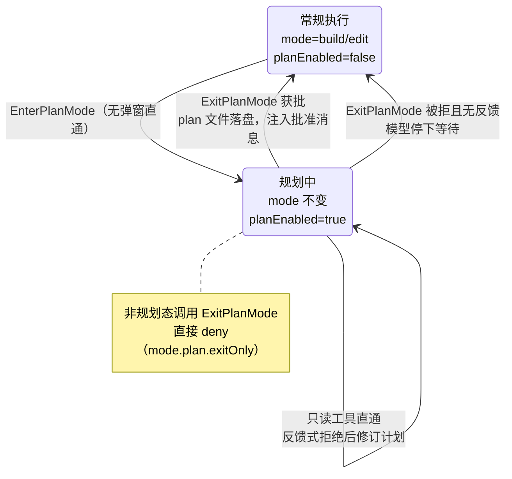

# 5.2 Plan Mode 与 Plan-Executor

> 本章导览：改错的代价随动作的不可逆程度上涨。本章讲 Plan Mode 如何在动工前插入一道人工审批：规则把模型锁死为只读，提示词引导出一份四阶段的调研-设计流程，计划批准前落盘成文件，批准与"带反馈的拒绝"都成为回灌给模型的精确信号。

## Plan Mode 的动机

"先斩后奏、错了再道歉"对程序员是坏习惯，对正在生产环境执行命令的程序更坏。Agent 最大的风险窗口不是"做错了"，而是"在错误的方向上高效地做"：读了一堆文件、改了十处代码、跑了测试，最后你发现它理解的需求从一开始就偏了。此时要挽回的不是几个文件，而是整段时间与注意力的沉没成本。

Plan Mode 的做法是在"理解完成"与"动手执行"之间插入一个人工检查点：模型先在**只读**状态下调研、设计，产出一份计划交给你审批；批准之前，它没有任何能力改动系统。审一份计划只要两分钟，回滚一次错误的执行可能要两小时——这是整个机制的经济学。

ZCode 用两个工具支撑这套流程（`packages/core/src/tool/handlers/plan-mode.ts`）：

- **EnterPlanMode**：进入规划状态。永远放行，无弹窗——进入"只想想"没有任何风险。
- **ExitPlanMode**：提交计划、请求批准。输入是 `{ plan, allowedPrompts? }`，plan 上限 20,000 字符（`PLAN_MODE_MAX_PLAN_CHARS = 20_000`，`packages/contracts/src/tools/plan-mode.ts`）。它只能在规划状态下调用，否则直接 deny（ruleId: `mode.plan.exitOnly`，reason: "ExitPlanMode can only be used while plan mode is active"，`packages/core/src/permission/plan-mode-policy.ts`）。

`allowedPrompts` 是一个容易被忽略的字段：模型可以在计划里附上"批准后我需要的权限"（如 `git commit:*`）。规划阶段就得想清楚执行阶段要什么——权限申请也被纳入了计划本身。

进入规划态后，模型收到的工具结果同样不是一句"ok"，而是一份行为清单（`formatEnterPlanModeModelContent`）：

```text
In plan mode, you should:
1. Thoroughly explore the codebase to understand existing patterns
2. Identify similar features and architectural approaches
3. Consider multiple approaches and their trade-offs
4. Use AskUserQuestion if you need to clarify the approach
5. Design a concrete implementation strategy
6. When ready, use ExitPlanMode to present your plan for approval

Remember: DO NOT write or edit any files yet.
This is a read-only exploration and planning phase.
```

清单的末句是模式切换的"肌肉记忆"：模型在长对话里经常忘记自己处于哪个状态，每次状态转移都在工具结果里重申约束，比指望它记住系统提示词更可靠。退出规划态后也有对应的 `PLAN_MODE_EXIT_REMINDER`（"You have exited plan mode. You can now make edits, run tools, and take actions."）注入——状态机的每次迁移都伴随一条向模型通报的合成消息。

## plan 是 flag，而非第四种模式

一个直观的设计是把 plan 做成第四种权限模式：mode 从 build 切到 plan，退出再切回来。ZCode 没这么做。进入规划态改的不是 mode，而是一个独立的布尔量：

```text
enterPlanMode() → applyRuntimeExecutionState({ planEnabled: true })   // mode 保持原值
exitPlanMode()  → applyRuntimeExecutionState({ planEnabled: false })  // 回到原 mode
```

（`packages/core/src/tool/handlers/plan-mode.ts`，有删节。转移的返回值同时携带 mode/previousMode 与 planEnabled/previousPlanEnabled，模型能明确知道自己从哪里来、回到了哪里。）

差别看起来只是实现细节，实际决定了两件事：

1. **退出时回到哪里**。如果 plan 是模式，进入前必须记住"用户原来在 build 还是 edit"，退出时恢复——状态多了一份，崩溃恢复、反复切换都是新的边界情况。flag 语义下 mode 从未变过，退出天然回到原模式，不需要任何"恢复"逻辑。
2. **判定代码的形状**。权限判定要同时回答两个正交的问题："现在能不能写"由模式回答，"现在是不是在规划"由 flag 回答。一个在 yolo 模式下进入规划的用户，依然期待规划态是只读的——plan 作为独立检查点挂在所有模式判定之前（见 5.3 节判定流程第 9 步），而不是在每个模式分支里都掺一条 `if mode === "plan"`。

判定入口的写法是 `context.planEnabled ?? context.mode === "plan"`（`packages/core/src/permission/service.ts`）——flag 优先，mode 兜底，兼容只传 mode 的旧调用路径。

> **注**：5.4 节的 Goal 续跑候选条件里有一条"非 plan 模式不自动续跑"，判的也是这个 flag。规划态与自主续跑天然冲突——一个要求人类批准后才能动工，一个没人批准也要开工。

## 计划的生成与审批

### 规则先于提示词

规划态的保障是双层的。第一层是硬规则：`checkPlanMode`（`packages/core/src/permission/service.ts`）在判定链的规划分支里执行——

- 只读且非破坏的工具 → 放行（`mode.plan.readOnly`）；
- MCP 工具且非破坏 → 放行（`mode.plan.mcp`）；
- 显式声明 allowedInPlanMode、副作用仅限会话内、无独立审批要求 → 放行（`mode.plan.explicitSessionCapability`）——5.1 节的 TodoWrite 在规划态可用的原因就在这条；
- **其余一律 deny，且不给弹窗机会**。

最后半句是关键。deny 而不是 ask，意味着规划态下模型连"请求一次写权限"的通道都没有——用户不会被弹窗轰炸，模型也不会形成"多试几次也许就放行了"的行为习惯。读代码的方式不受限（Read、Grep、Glob 全部直通），唯一的例外是 Bash：它是读写两用的万能工具，放行与否不能靠工具级声明，只能逐命令分析。ZCode 为此维护了约 20 个文件的 Bash 只读语义分析（`bash-readonly-policy*.ts`，`packages/core/src/tool/handlers/`），逐子命令白名单判定"这条命令是否只读"。plan 模式的 Bash 放行完全依赖这套分析。

第二层是软引导。只靠规则能保证"不越界"，不能保证"产出好计划"——模型可能在规划态里闲逛十轮，然后交一份两行的计划。于是每隔 5 个人类 turn，runtime 注入一份 `PLAN_MODE_FULL_REMINDER`（`packages/core/src/runtime/helpers/runtime-reminders.ts`），给出明确的四阶段工作流：

1. **Phase 1: Initial Understanding**——只许用 Explore 型子代理（见 2.5 节）并行探码，最多 3 个（`planResearchAgentCount = 3`），各自认领一块搜索焦点；
2. **Phase 2: Design**——基于调研产出足够具体、可执行的实施计划，按任务类型权衡（新功能：简单性 vs 性能 vs 可维护性；修 bug：根因 vs 绕过 vs 预防）；
3. **Phase 3: Review**——重读关键文件，核对计划与用户原始诉求一致，用 AskUserQuestion 澄清剩余疑问；
4. **Phase 4: ExitPlanMode**——回合只允许以 AskUserQuestion 或 ExitPlanMode 结束。

reminder 里还有一条斩钉截铁的禁令，值得原文照录：不许用文本问"这个计划行不行"，不许用 AskUserQuestion 问批准——批准只有 ExitPlanMode 一个出口，"Is this plan okay?" 之类的措辞被逐一点名禁止。否则模型会用一句随口的提问绕过结构化的审批界面，计划的落盘与反馈升级（见下文）全部失效。

规则先拦住"做了不该做的"，提示词再引导"做该做的"——硬规则管下限，软引导保上限，两层缺一不可。

### 批准前的落盘

ExitPlanMode 被调起后，第一件事不是弹窗，而是**把计划原子写入磁盘**（`packages/core/src/runtime/helpers/plan-file-continuity.ts`）：

```text
<workspaceRoot>/.zcode/plans/plan-<sessionId>.md    // writeTextFile({ atomic: true })
```

批准**前**落盘，意味着"计划文件存在"这个事实独立于审批结果：待审的、被拒的、已批准的计划都在磁盘上，崩溃、会话中断都不会丢。空计划会被拒绝写入（"ExitPlanMode plan cannot be empty"）——不存在"批准了一份空计划"的状态。

落盘还有一道量的护栏：plan 字段被 schema 钉在 20,000 字符以内。上限太松，模型会交出一份没人读完的计划——审批的质量取决于人真的读了它；上限太紧，又装不下一个大型重构的步骤。20,000 字符大约是十几页文档，恰好是"认真读一遍"的成本边界。

### 批准交互：不对称的两条路

ExitPlanMode 声明了 `requiresUserInteraction: true`，权限系统因此必走 ask 路径（见 5.3 节），协议层把这次询问渲染成一张单题问卷：批准，或者给出文字反馈。两条路的处理完全不对称，这是整个设计最精巧的地方：

- **批准** → broker 决策 allow → exitPlanMode() 执行，flag 落回 false；
- **输入反馈（freeText）** → broker 决策是 **deny，但 reason 带专用来源标记 `reasonSource: "plan_approval_feedback"`**（`packages/bootstrap/src/zcode-protocol/interaction-broker.ts`；该类型定义在 `packages/contracts/src/interfaces/permission.port.ts`）。

为什么一个"拒绝"要专门立一个来源类型？因为普通的权限拒绝只会回灌一句"用户拒绝了这次工具调用"，模型只知道"不行"；而带这个标记的 deny+reason 有资格被升级为一条**真实的用户消息**注入对话。对模型来说，那不是"系统通知我被拒了"，而是"用户对我说了这段话"。一字之差，行为天壤之别：前者让模型小心翼翼地重试或放弃，后者让它像收到同事的 review 意见一样去修订计划。这就是"反馈式拒绝"——拒绝的不是计划本身，而是"以当前形态通过"。

## Plan-Executor 分离

批准之后，模型收到的不是普通工具结果，而是一段精心措辞的交接文（`packages/core/src/tool/handlers/plan-mode.ts` 的 `formatExitPlanModeModelContent`）：

```text
User has approved your plan. You can now start coding. Start with updating your
todo list if applicable.

## Approved Plan:
<计划全文>
```

这段话完成了三个交接。第一，**解除约束**："You can now start coding" 明确宣告只读期结束。第二，**指定第一步**："Start with updating your todo list" 把计划翻译成 5.1 节的 Todo 清单——批准的计划是冻结的全文（谁也不该在执行中悄悄改它），而执行进度属于灵活的 Todo 状态机。计划与进度就此分工：plan 是"要做什么"的不可变快照，todo 是"做到哪了"的活动账本。第三，**锚定上下文**：计划全文随消息重灌一次，确保执行从批准时的文本出发，而不是从规划期间的记忆出发。

规划与执行的分离还有一个跨时间的维度：plan 文件在**新会话**里会被重新发现。只要 workspace 下存在 `plan-<sessionId>.md`，runtime 就以 system-reminder（source: `plan_file_reference`）把计划注回新会话（`packages/core/src/runtime/helpers/plan-file-continuity.ts`）。用户今晚批准计划、明早开个新会话说"按昨晚的计划继续"，模型依然有据可依。plan 文件因此是一份**跨会话记忆**：它不靠上下文存活，靠文件系统存活。

教学版把这份记忆落成一个原子写文件的函数，加进 `src/features/plan.ts`：

```ts
// tinycode/src/features/plan.ts（续）——批准前落盘
import { mkdir, rename, writeFile } from "node:fs/promises";
import { join } from "node:path";

export async function writePlanFile(
  workspaceRoot: string,
  sessionId: string,
  plan: string,
): Promise<string> {
  const trimmed = plan.trim();
  if (!trimmed) throw new Error("ExitPlanMode plan cannot be empty");
  const dir = join(workspaceRoot, ".zcode", "plans");
  const path = join(dir, `plan-${sessionId}.md`);
  await mkdir(dir, { recursive: true });
  // 原子写：先写临时文件再改名，磁盘上永远只有完整计划
  const tmp = path + ".tmp";
  await writeFile(tmp, trimmed, "utf8");
  await rename(tmp, path);
  return path;
}
```

这份文件在后续任何一次会话启动时被探测到，就作为 `plan_file_reference` 注回——教学版只需在会话初始化时读一次这个约定路径。

值得一提的是，"分离"在规划阶段内部也发生过一次：四阶段工作流的第一阶段强制用 Explore 型子代理探码（见 2.5 节）。调研是并行的、可丢弃的——子代理读完几万个 token 的代码，只把结论带回主对话；设计却必须在主对话里做，因为那里才有用户的完整意图。调研外包、设计亲力，这是规划阶段的"执行者分离"。

教学版把机制收进 `src/features/plan.ts`，核心是三段：状态转移、工具过滤、审批交互。

```ts
// tinycode/src/features/plan.ts
export type Mode = "build" | "edit";

export interface PlanState {
  mode: Mode;
  planEnabled: boolean; // plan 是 flag，不是第四种模式
}

export function enterPlanMode(state: PlanState): PlanState {
  // mode 不动，只立 flag——退出时天然回到原模式
  return { ...state, planEnabled: true };
}

export function exitPlanMode(state: PlanState): PlanState {
  if (!state.planEnabled) {
    throw new Error("ExitPlanMode can only be used while plan mode is active");
  }
  return { ...state, planEnabled: false };
}

// 规划态的工具过滤：只读直通，其余一律拒绝，不给弹窗机会
export function planModeAllows(tool: { readOnly: boolean; destructive: boolean }): boolean {
  return tool.readOnly && !tool.destructive;
}
```

审批交互把"批准/反馈"翻译成两种不同的回灌信号：

```ts
// tinycode/src/features/plan.ts（续）
export interface Approval {
  decision: "allow" | "deny";
  modelMessage?: string;
  reasonSource?: "plan_approval_feedback";
  feedback?: string;
}

export async function requestPlanApproval(
  plan: string,
  ask: () => Promise<{ approved: boolean; feedback?: string }>,
): Promise<Approval> {
  const answer = await ask();
  if (answer.approved) {
    return {
      decision: "allow",
      modelMessage:
        "User has approved your plan. You can now start coding. " +
        "Start with updating your todo list if applicable.\n\n## Approved Plan:\n" + plan,
    };
  }
  // 反馈式拒绝：决策是 deny，但带专用来源，可升级为真实用户消息
  return { decision: "deny", reasonSource: "plan_approval_feedback", feedback: answer.feedback };
}
```

整个流转画成状态机只有三个节点：



## 计划的修订与回滚

传统工作流里"修订计划"意味着重新走一遍审批，于是很多团队干脆省掉审批。这套设计里，修订是审批的内建环节：**拒绝即修订请求**。反馈式拒绝把用户的意见送回规划态，模型改完计划重新 ExitPlanMode，循环直到批准或用户放弃。审批从"一次性关卡"变成了"循环里的收敛条件"。

回滚则便宜得近乎免费，这是 flag 语义的红利：

- 拒绝后模型仍在规划态，什么都没发生，无需回滚；
- 批准后发现方向错了？重新 EnterPlanMode 即可——mode 从未离开过原位；
- plan 文件按 sessionId 命名，下一次批准原子覆盖，不存在新旧计划的混合态。

> **注**：被拒的计划不会留下半份状态——落盘发生在 ExitPlanMode 调起时，拒绝只影响"是否退出规划态"，不改文件内容；下一份计划获批时整体覆盖。

## 小结

Plan Mode 的全部设计围绕一句话：**在不可逆之前对齐**。两个工具（EnterPlanMode 无条件放行，ExitPlanMode 只能在规划态调用，`mode.plan.exitOnly` 兜底）；一个核心解耦（planEnabled 是 flag 而非第四种模式，退出即回原位）；双层保障（checkPlanMode 的 deny 硬拦 + 每 5 turn 注入的四阶段工作流 reminder 软引导）；一份落盘文件（批准前原子写入 `.zcode/plans/`，跨会话以 `plan_file_reference` 注回）；一次不对称的交互（批准 = allow 加交接文，反馈 = 带专用来源的 deny，可升级为真实用户消息）。批准后的接力棒——"Start with updating your todo list"——把它与上一章的 Todo 缝成完整工作流：计划审批定方向，任务清单管进度。

方向对齐了，动作也该受控了。下一章讲这套系统最重的一道防线：权限模型与沙箱——什么能直接做、什么要问人，以及诚实地讨论哪些防线其实并不存在。
