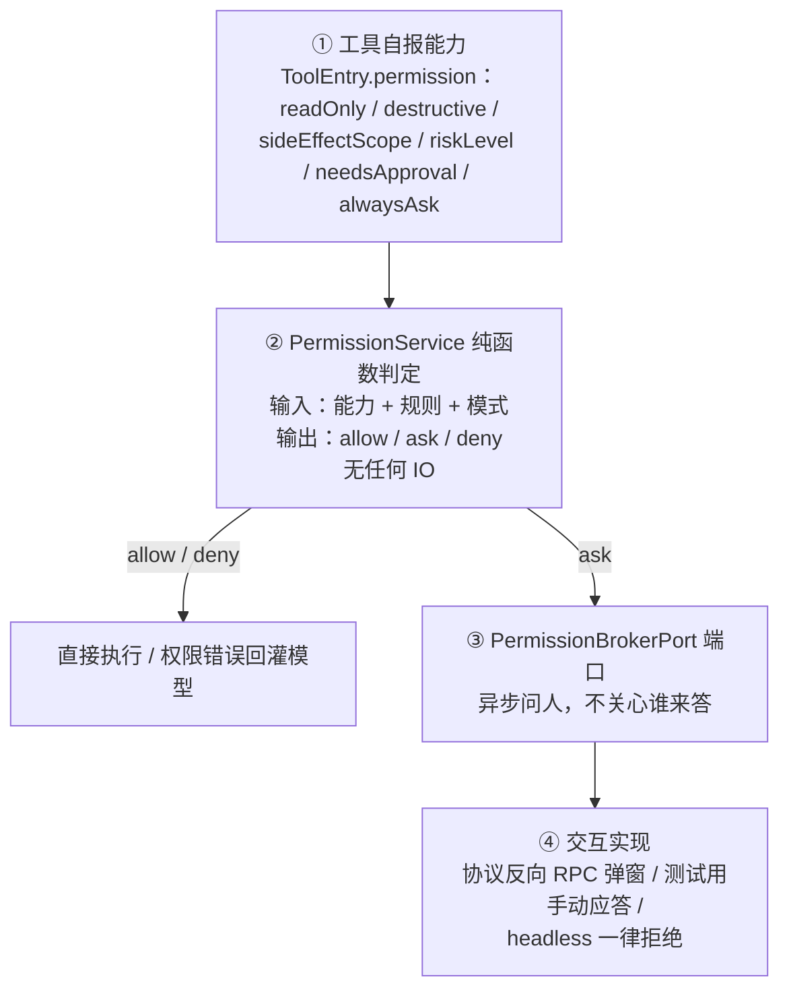
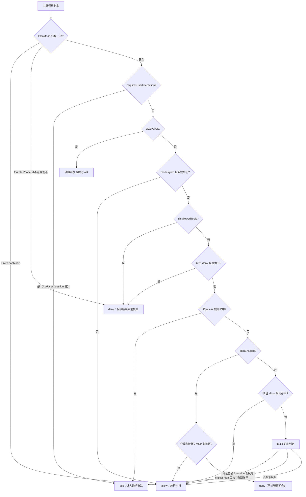

# 5.3 权限模型与沙箱：人在回路的安全边界

> 本章导览：Agent 拿着你的文件系统和终端，你凭什么放心？本章拆解 ZCode 的权限系统：一条十余步的判定流水线决定每个工具调用是"直接做、问一句、还是拒绝"，一条异步链路把"问一句"变成真正的弹窗协议，最后诚实地看一眼沙箱——合同里有、参数里有、实现里没有的那部分。

## 为什么需要权限系统

给模型装上工具，等于把三样东西交给一位"大部分时候靠谱"的实习生：文件系统、终端、网络。权限系统要对付三种风险，严重程度递增：

1. **模型会犯错**。它会把路径拼错、会把测试脚本当成生产脚本、会在错误的仓库里执行 `git reset --hard`。单次错误率很低，但乘以每天成百上千次工具调用，就不是小概率事件。
2. **上下文里藏着敌人**。Prompt injection 不需要模型"变坏"：一份带恶意指令的 README、一个 issue 里的"请运行此命令修复"，模型读到什么就可能信什么。工具调用的输入可能来自任何被读取过的文本。
3. **最小权限原则**。就算以上都不发生，一个"能做一切"的 Agent 也不该被允许做一切——能力的边界应当由当前任务决定，而不是由安装的工具集决定。

Coding Agent 的动作空间就是它的工具集，所以权限问题的形式很纯粹：**对每一次工具调用，判定它该直接执行、该先问人、还是该直接拒绝**。这道判定每个回合要跑几十次，必须快、必须可预测、必须能被测试穷举——这三个要求决定了接下来的一切结构。

## 四层模型：判定与询问分离

ZCode 把权限系统拆成四层，每层只做一件事：



②是全书最值得学的一处结构：**判定与询问分离**。PermissionService 是个纯函数——输入工具能力、项目规则、会话规则、模式，输出三值决策。它不做任何 IO：不弹窗、不查库、不等待。所有"麻烦的部分"（什么时候问人、问完之后怎么办）都被推到端口③之后的世界。

这样拆的回报在测试上：判定优先级的每一步、规则匹配的三态语法、模式兜底的全部分支，都可以用普通单元测试穷举——构造输入、断言三值输出，没有 mock，没有异步。权限是安全边界，而安全边界的第一个要求就是"行为可穷举地验证"，纯函数是可穷举的前提。

③的端口背后有三个现成实现：嵌入式与测试环境用的 ManualPermissionBroker（pending 表加手动应答）、headless 工作流用的 DenyPermissionBroker（无人可问时一律拒绝——又是 fail-closed）、桌面/TUI 场景的 createProtocolInteractionBroker（反向 RPC 把弹窗画到真屏幕上）。同一套判定逻辑，配上不同的"问人实现"，就适配了从单元测试到桌面应用的全部环境。

## 权限模式：build、edit、plan 与 yolo

模式是规则之外的粗粒度开关，类型只有一行（`packages/contracts/src/interfaces/session.port.ts`）：

```ts
export type CollaborationMode = "plan" | "build" | "edit" | "yolo" | "auto";
```

| 模式 | 语义 | 判定入口 |
| --- | --- | --- |
| `build` | 默认。读工具直通，有副作用的要审批 | checkBuildMode |
| `edit` | 在 build 之上额外放行文件编辑（`permissionName === "edit"` 且 `sideEffectScope === "workspace"`），其余落回 build 判定 | checkEditMode → checkBuildMode |
| `plan` | 只读规划（见 5.2 节） | checkPlanMode |
| `yolo` | 跳过审批，几乎全放行 | 提前 allow |
| `auto` | 保留字段，未实现 | 一律 deny（`mode.auto.unimplemented`） |

`auto` 值得一提：类型里存在、判定里存在、行为是"全拒"。给未实现的模式一个安全的默认行为，好过让它静默表现得像 build。

yolo 的边缘行为比"全放行"复杂，两处值得细看：

- **yolo 压不过 alwaysAsk**。某些工具在能力声明里写了 alwaysAsk——无论什么模式都必须逐次过目。判定序列里 alwaysAsk 的检查排在 yolo 直通**之前**（见下一节流程第 3 步），且检查的第一步是先复查硬阻断：进程配置禁用（disallowedTools）、项目 deny 规则、未实现的 auto 模式，在这些面前 alwaysAsk 工具照样被 deny。一句话概括源码注释里的设计："ask 压过所有放行分支（包括 yolo 直通），但压不过硬阻断。"没有这一条，一个被项目规则禁掉的工具会在 yolo 下复活成"弹个窗、用户一点就能跑"。
- **yolo 排在 disallowedTools 之前**，即进程配置显式禁用的工具在 yolo 下也能直通——源码注释明确承认了这一点。这是个已知的取舍：yolo 的契约是"把决定权交给模型"，disallowedTools 被理解为"面向有审批世界的配置"。

还有一个"几乎 yolo"的用户动作：在弹窗里选"完全访问"。它的实现不是简单改模式，而是先把授权回执**事务写入存储**（带上所有待授权请求的 id），再改内存里的 mode 为 yolo。回执先行，崩溃后恢复时不会出现"模式已是 yolo、授权记录却缺失"的半个授权。

## 规则语法与匹配：allow / ask / deny

ZCode 没有 settings.json 式的权限文件，规则分三层：

1. **项目规则（持久）**：存 SQLite 的 local_settings 表，JSON 形状如下（`packages/contracts/src/interfaces/permission.port.ts`）；
2. **会话规则（内存）**：弹窗里选 "Always allow in this session" 时合成——只有工具名、没有内容，即整个工具在本会话内全放行。粒度理由很实际：像 Bash 这样的工具每次参数都不同，"整工具授权"是唯一说得通的会话级承诺；
3. **进程配置**：`{ allowedTools, disallowedTools, autoApproveHighRisk }`。

```json
{
  "version": 1,
  "allow": [
    { "toolName": "Bash", "ruleContent": "git status:*" },
    { "toolName": "Edit", "ruleContent": "/src/**" }
  ],
  "deny": [ { "toolName": "Bash", "ruleContent": "rm -rf:*" } ],
  "ask":  [ { "toolName": "WebFetch", "ruleContent": "domain:example.com" } ],
  "mode": "build"
}
```

单条规则的本质是二元组 `{ toolName, ruleContent? }`：省略 ruleContent 表示"该工具的任意调用"；ruleContent 的匹配只有三态（`packages/core/src/permission/service.ts` 的 `matchesRuleContent` 与 `rule-matching.ts`）：

- 以 `:*` 结尾 → **前缀规则**：subject 等于前缀，或以前缀加空白开头。`git commit:*` 匹配 `git commit` 和 `git commit -m "msg"`，不匹配 `git commitish`；
- 含 `*` → **通配符规则**：逐段转义后拼成正则；
- 其余 → **精确相等**。

```ts
export function wildcardToRegExp(pattern: string): RegExp {
  const escaped = pattern
    .split("*")
    .map((part) => part.replace(/[.*+?^${}()|[\]\\]/g, "\\$&"))
    .join(".*");
  return new RegExp(`^${escaped}$`);
}
```

（`packages/core/src/permission/rule-matching.ts`）

规则要和调用的 subject 匹配，而 subject 从工具输入里提取：输入本身是字符串就取全文；对象输入按 `command → url → file_path → path → pattern → patch_text` 的顺序取第一个字符串字段（`service.ts` 的 `ruleSubjects`）；WebFetch 特殊处理为 `domain:<hostname>`——所以 ask 表里那条规则写作 `domain:example.com`。提取顺序就是优先级：一条 Bash 调用永远拿 command 字段接受检查，不会被其他字段混淆。

> **注**：还有一条容易忽略的兼容规则：Write 调用会命中为 Edit 写的规则（`matchesRuleToolName`，`packages/core/src/permission/service.ts`）——写新文件是编辑的特例，用户"允许编辑 src"的意图理应覆盖在 src 里创建文件。

tinycode 的实现把匹配收进 `src/permission.ts`（第一部分）：

```ts
// tinycode/src/permission.ts
export type Decision = "allow" | "ask" | "deny";

export interface Rule {
  toolName: string;
  ruleContent?: string; // 省略 = 该工具任意调用
  behavior: Decision;
}

// 三态匹配：精确 / prefix:* 前缀 / * 通配
export function matchRuleContent(subject: string, ruleContent: string): boolean {
  if (ruleContent.endsWith(":*")) {
    const prefix = ruleContent.slice(0, -2);
    return subject === prefix || subject.startsWith(prefix + " ");
  }
  if (ruleContent.includes("*")) {
    const pattern = ruleContent.split("*").map(escapeRegExp).join(".*");
    return new RegExp("^" + pattern + "$").test(subject);
  }
  return subject === ruleContent;
}

function escapeRegExp(part: string): string {
  return part.replace(/[.*+?^${}()|[\]\\]/g, "\\$&");
}

// subject 提取：字段顺序与真实系统一致
function subjectOf(input: unknown): string | undefined {
  if (typeof input === "string") return input;
  if (!input || typeof input !== "object") return undefined;
  const record = input as Record<string, unknown>;
  for (const key of ["command", "url", "file_path", "path", "pattern"]) {
    if (typeof record[key] === "string") return record[key];
  }
  return undefined;
}

export function matchRule(rule: Rule, toolName: string, input: unknown): boolean {
  if (rule.toolName !== toolName) return false;
  if (!rule.ruleContent) return true;
  const subject = subjectOf(input);
  return subject !== undefined && matchRuleContent(subject, rule.ruleContent);
}
```

## 判定优先级：一条调用的完整旅程

有了能力声明、规则表和模式，判定就是一条固定的优先级流水线。`PermissionService.checkPermission`（`packages/core/src/permission/service.ts`）把十余个判定条件排成一条不许改动的顺序——顺序本身就是语义：阻断类条件必须排在放行类之前，不给弹窗机会的 plan 检查必须排在一切 ask 之前。



末尾的 build 兜底值得单独展开，它把工具能力声明翻译成五条清晰的规则（同文件 `checkBuildMode`）：

1. 只读、非破坏、无独立审批要求 → 直通（`mode.build.readOnly`）；
2. riskLevel 为 critical → 必问；为 high 且未开 autoApproveHighRisk → 必问；
3. 副作用仅限会话内、低风险、非破坏 → 直通（`mode.build.sessionState`）——5.1 节的 TodoWrite 走的就是这条；
4. 声明 needsApproval、破坏性、或副作用越出会话 → 必问；
5. 其余低风险 → 直通（`mode.build.lowRisk`）。

流水线里还散布着几个预批特例，插在项目 allow 与进程配置之间：WebFetch 的预批 URL 表、workflow 草稿的定点放行。它们的共同点是有精确的地址约束——某个 URL、某个目录下的某个文件——放行范围被钉死到点，而不是面。

AskUserQuestion 与 ExitPlanMode 也走这条流水线，而且走的是最前面：工具声明 `requiresUserInteraction: true`，第 2 步就分流为 ask。它们要"执行"的内容就是那次交互本身，所以判定阶段唯一正确的答案就是"必须问人"；答案如何回灌，是 broker 的事，见本章后文的询问链路一节。

tinycode 的判定函数（`src/permission.ts` 第二部分）保留主干顺序，省略 auto 模式与预批特例：

```ts
// tinycode/src/permission.ts（续）
export interface ToolCapability {
  name: string;
  readOnly: boolean;
  destructive: boolean;
  sideEffectScope: "none" | "session" | "workspace" | "external";
  needsApproval: boolean;
  alwaysAsk?: boolean;
}

// 纯判定 + 唯一 IO（ask 回调）。主干顺序与真实系统一致。
export async function checkPermission(input: {
  tool: ToolCapability;
  toolInput: unknown;
  mode: "build" | "edit" | "plan" | "yolo";
  planEnabled?: boolean;
  rules: Rule[];
  ask: (reason: string) => Promise<"allow" | "deny">;
}): Promise<"allow" | "deny"> {
  const { tool, toolInput, rules, ask } = input;
  const planning = input.planEnabled ?? input.mode === "plan";

  if (tool.alwaysAsk) return await ask(`${tool.name} 声明必须逐次确认`);
  if (input.mode === "yolo" && !planning) return "allow";
  if (hit(rules, "deny", tool.name, toolInput)) return "deny";
  if (hit(rules, "ask", tool.name, toolInput)) return await ask("项目规则要求确认");
  if (planning) return tool.readOnly && !tool.destructive ? "allow" : "deny";
  if (hit(rules, "allow", tool.name, toolInput)) return "allow";
  if (input.mode === "edit" && tool.name === "Edit" && tool.sideEffectScope === "workspace") {
    return "allow";
  }

  // build 兜底：只读直通 → 会话内低风险直通 → 其余问人
  if (tool.readOnly && !tool.destructive && !tool.needsApproval) return "allow";
  if (tool.sideEffectScope === "session" && !tool.destructive && !tool.needsApproval) {
    return "allow";
  }
  return await ask(`${tool.name} 有副作用，需要确认`);
}

function hit(rules: Rule[], behavior: Decision, toolName: string, input: unknown): boolean {
  return rules.some((r) => r.behavior === behavior && matchRule(r, toolName, input));
}
```

但"硬阻断先于放行、规则先于模式兜底、ask 是唯一 IO"这三条骨架，与真实系统同构。

## Bash 命令的专项分析：复合命令怎么判

普通工具的规则评估语义是 `some()`——任一规则命中即放行。这对单动作工具够用，对 Bash 是灾难：`git status && rm -rf /` 会被 `git status:*` 单条规则放行，因为"有一条子命令命中了"。所以 Bash 走独立的评估器（`packages/core/src/tool/handlers/bash-command-rule-evaluator.ts`），核心差别一句话：**allow 要 every，deny 与 ask 只要 some**——放行复合命令要求每一段都被规则覆盖，一段漏网就弹窗；判定"该不该拦"时，任一段命中即算。

```ts
export function evaluateBashRules(input: BashRuleEvaluationInput): boolean {
  if (input.rules.some((rule) => !rule.ruleContent)) return true; // 工具级规则直接命中
  if (
    input.exactCommands.some((c) => c.length > 0) &&
    input.rules.some((r) => input.exactCommands.includes(r.ruleContent ?? ""))
  ) {
    return true; // 整条命令原文精确匹配
  }
  if (!input.safe) return false; // 复杂命令只认精确匹配

  // allow 只看"非只读"的子命令组；deny/ask 看全部子命令组
  const subjectGroups =
    input.behavior === "allow" ? input.requiredSubjectGroups : input.allSubjectGroups;
  if (input.behavior !== "allow") {
    return subjectGroups.some((ss) => ss.some((s) => matchesAny(s, input.rules)));
  }
  return subjectGroups.every((ss) => ss.some((s) => matchesAny(s, input.rules)));
  //                  ^^^^^ allow 语义：每一段都必须被规则覆盖
}
```

（`packages/core/src/tool/handlers/bash-command-rule-evaluator.ts`，有删节；matchesAny 为三态匹配的封装。）

两处细节：

- **allow 只检查"非只读"的子命令组**（requiredSubjectGroups）。`git add . && git status` 里的 git status 是只读的，无需规则覆盖——放行判定关心的是"哪一段有破坏力"，不是"每一行是否都被许可过"。deny/ask 则看全部段，避免漏判。
- **`!input.safe` 时只认整条精确匹配**。safe 的判定来自上游分析：命令可解析、无重定向、无动态词（`$(...)`、变量展开）、环境变量赋值静态。任何一条不满足，前缀规则就不可信——subject 在运行前根本无法确定。此时放行只能靠整条命令原文的精确规则。

用户在弹窗里点 "Always allow" 之后，系统为 Bash 合成建议规则的过程也有一套防御（`packages/core/src/tool/handlers/bash-command-permission-policy.ts`）：先剥掉 `env/sudo/nohup/command/time` 等包装（最多两层），提取稳定前缀；**可执行名落在 HIGH_RISK_ROOT_COMMANDS 集合里的永不生成前缀规则**——这个集合包括 bash、sh、zsh、fish、cmd、powershell、pwsh、rm、rmdir、chmod、chown、chgrp、dd、mkfs、mount、umount 共 16 个名字。道理很直白：`rm:*` 等于"允许删除任何东西"，这种规则不该被建议出来。前缀建议最多 5 条（`MAX_SUGGESTED_RULES = 5`），超出就退回整条命令原文——宁可规则粗一点，也不批量发放许可证。

## 询问的交互链路：Broker 与用户决策

判定输出 ask 之后，故事才到中段。执行层接手（`packages/core/src/tool/executor/permission-flow.ts`）：先发出 PermissionRequested 事件，让 UI 把确认窗画出来，然后进入等待——等两个应答方**并发竞速**：

- **broker**：权限端口，把真实用户的弹窗选择带回来；
- **PermissionRequest hook**（见 4.1 节）：外部程序可以在等待期间程序化应答（自动审批桥、企业策略引擎）。

> **踩坑**：这里曾有一个"确认窗永久死亡"的真实事故。早期实现里 broker 要等 hook 链串行返回后才启动，而某个同步阻塞的外部审批桥卡住了 hook——此时确认窗已经渲染，但接收应答的 deferred 尚未注册，用户的每一次点击都按幂等语义被静默丢弃。窗在，应答通道没接上，用户点一百次也没用。修复是把两方改成并发竞速（`racePermissionResponders`）：先到先得，败者被 abort；并且 hook 链自身故障只让它退赛，**不替用户拒绝**——辅助通道的基础设施故障不能冒充人类的决定。

竞速可能出现第三种结果：hook 返回 modify——改写工具输入（比如把目标路径改到别处）。改写后的输入必须重新过 schema 校验，并**重跑权限判定**。这一步不是洁癖：如果不重跑，一个被 ask 拦下的调用可以借 hook 改写成另一个样子混过去——修改输入就是修改权限评估的对象。

用户的弹窗选项由协议层合成（`packages/bootstrap/src/permission-options.ts`）：

| 选项 | 效果 |
| --- | --- |
| Allow once | 本次放行 |
| Always allow in this project | 合成规则写入项目规则（SQLite 持久） |
| Always allow in this session | 会话规则入内存，重启即失效 |
| Deny | 拒绝，reason 回灌模型 |

（部分工具声明 no-always-allow 策略，隐去"总是允许"项、只留会话级——每次调用都是不同代码时，持久规则不是"记住这次决定"，而是把这道确认永久关掉。）

应答映射是 fail-closed 的：协议层收到未知 optionId、甚至缺失 optionId，一律按 deny 处理——权限语义下宁可错拒，不放行未知应答。

Deny 的回灌文案直接命令模型停下（同文件 `PERMISSION_DENIED_BY_USER_CONTENT`）：

```text
The user doesn't want to proceed with this tool use. The tool use was rejected
(eg. if it was a file edit, the new_string was NOT written to the file).
STOP what you are doing and wait for the user to tell you how to proceed.
```

用户附了反馈时追加 "To tell you how to proceed, the user said:\n..."——与 5.2 节 plan 审批的反馈式拒绝是同一手法：拒绝消息不只是状态报告，更是对模型下一步行为的指令。

最后看一个特例收尾：AskUserQuestion。它的判定在流水线第 2 步就分流为 ask（`requiresUserInteraction`），但它的"询问"不走通用弹窗，而是按工具名分流到结构化问卷（1–4 题、每题 2–4 个选项）。更特别的是答案的回灌方式——不是 allow，而是 **modify**（`packages/bootstrap/src/zcode-protocol/interaction-broker.ts`）：

```ts
return {
  decision: "modify",                      // 不是 allow，是"改写输入后放行"
  modifiedInput: { ...input, ...content }, // content = { answers: { 问题文本: 答案 } }
};
```

handler 校验 answers 必须已在输入里，本体只是把答案格式化回模型。为什么用 modify？因为用户在问卷里的选择**就是工具调用的参数**：模型发起 AskUserQuestion 时并不知道答案，"用户作答"在协议层面等价于"输入被补全"。把人的一次交互建模成对工具输入的改写，而不是对工具执行的许可——这是"问人"这件事能统一进权限协议的原因：allow / deny / modify 三种决策，足以表达人类在回路中的全部动作。

## 沙箱的负空间：合同、残留与软边界

按本章标题，到这里该讲沙箱了。诚实的答案先给出：**ZCode CLI 当前没有任何 OS 级沙箱**。全仓检索 seatbelt、sandbox-exec、Firejail、bubblewrap 零命中，命令通过 `node:child_process` 直接起 shell。

但沙箱的"化石层"清晰可辨，值得解剖——它展示了真实项目如何"拆掉一个机制、留下它的形状"：

1. **合同占位**：执行端口契约仍定义 `ExecutionSandboxPolicy { enabled, profile?, dangerouslyDisableSandbox? }`，错误类型表里还留着 `"sandbox_violation"`（`packages/contracts/src/interfaces/execution.port.ts`）；
2. **工具传参**：Bash 工具的模型可见参数里仍有 `dangerouslyDisableSandbox`，构造执行请求时仍会填 `sandbox: { enabled: !input.dangerouslyDisableSandbox }`；
3. **执行端不消费**：执行适配器里没有任何代码读取 request.sandbox。唯一的残留是一行注释——"计时器提前到准备阶段是 protected-resource sandbox 时代的行为……sandbox 撤除后准备阶段只剩 shell snapshot"（`packages/adapters/src/exec/node-execution-adapter-run.ts`）。

参数在、管道通、终点空。对模型来说，`dangerouslyDisableSandbox` 是一个可以调用但什么都不会改变的名字。这不算欺骗——合同记录了"这里曾有一道防线，以及撤除它的决定"——但它提醒我们：**合同里的字段不等于能力**，审计安全边界要顺着调用链走到真正消费参数的那一环。

> **注**：为什么撤除？OS 级沙箱与"Agent 要读写你的项目、跑你的构建、装依赖"的现实摩擦极大——沙箱里装不了依赖是常态。ZCode 的选择是把安全边界全部压在权限系统上，而不是维护一个处处漏气的沙箱。这是取舍，不是疏忽。

那么真实的安全边界是什么？一张表列全（均在 `packages/core/src/`）：

| 机制 | 位置 | 作用 |
| --- | --- | --- |
| Bash 命令解析 | tool/handlers/bash-command-parser.ts | 复合命令、重定向、注入风险解析；不可解析 → 只认精确规则 |
| 只读语义判定 | tool/handlers/bash-readonly-policy*.ts（约 20 个文件） | plan 模式下 Bash 是否放行，靠逐子命令白名单 |
| 路径策略 | tool/path-policy.ts | 解析与规范化路径（见下方摘录） |
| memory 文件特判 | tool/executor/memory-file-permission.ts | memory 根目录下 .md 的写入免确认 |
| WebFetch 出口防护 | webfetch-egress-guard.ts + 预批 URL 表 | 网络侧约束 |
| 项目 hook 信任 | workspace-hook-trust-* | 项目自带 hook 首次运行需信任确认 |

路径策略是其中最值得细读的一块——因为它公开承认自己**不**做什么（`packages/core/src/tool/path-policy.ts`）：

```ts
const resolvedPath = isAbsolute(requestedPath)
  ? normalize(requestedPath)
  : resolve(workingDirectory, requestedPath);

// Current release intentionally does not hard-block paths outside workspaceRoot.
// Cause: subagents may need to inspect user-requested sibling repos or external files
// before the filesystem permission adapter grows explicit ask/deny rules for them.
return resolvedPath;
```

工具层不做工作区硬阻断——子代理经常需要查看用户点名的外部仓库或兄弟目录，硬阻断会把合法任务卡死；等文件系统权限适配器长出细粒度的 ask/deny 规则，边界再收紧。当前的文件安全实际由权限判定与 Bash 语义分析承担。这是"软边界"的自觉：宁可让边界宽松而明确（注释写明原因），不要让边界看似坚硬而名不副实。

memory 文件的免确认是另一个软边界的样本：写 memory 根目录下的 .md 不弹窗——否则记忆机制（见 2.3 节）会被确认窗磨死。但它有前提：目标路径必须通过包含性检查，确实落在 memory 根目录内、确实是 .md 文件，且不覆盖原有的 deny 决定。免确认的半径被压到"免确认也不至于越界"的最小范围。

把本章的负空间总结成一条可迁移的判断：**安全边界要按"谁消费这个决定"来数，而不是按"谁声明了这个字段"来数**。权限规则、语义分析、包含性检查，都有人消费；sandbox 字段没有人消费，它就不是边界，只是边界的墓碑。

## 小结

权限系统把"每一次工具调用"变成一个可判定的请求：四层结构（工具自报能力 → 纯函数判定 → 异步问人端口 → 交互实现）里，判定与询问的分离让十余步优先级可以被单元测试穷举；四种模式（build/edit/plan/yolo）提供粗粒度基线，allow/ask/deny 三张规则表提供细粒度覆盖，规则语法收敛为"工具名 + 内容模式"的三态匹配；Bash 因为复合命令拿到专属评估器——allow 要 every、deny/ask 只要 some，高风险根命令永不生成前缀规则；询问链路里 broker 与 hook 竞速、修改输入后重跑判定、未知应答 fail-closed，把"人在回路"做成了一套协议而非一个弹窗。而沙箱一节是全章的诚实底线：合同与参数里的沙箱已无实现，真实边界是权限规则、语义分析与克制的软豁免——按"谁消费决定"来数边界，是本章留给你的审计方法。

到这里，第五部分的前三章完成了"对齐三件套"：Todo 追踪进度，Plan 对齐方向，权限守住动作。从下一章起，Agent 开始获得真正的自主性——Goal 机制让它在会话内围绕长目标自动续跑，而本章建好的安全边界，即将接受无人值守的考验。
