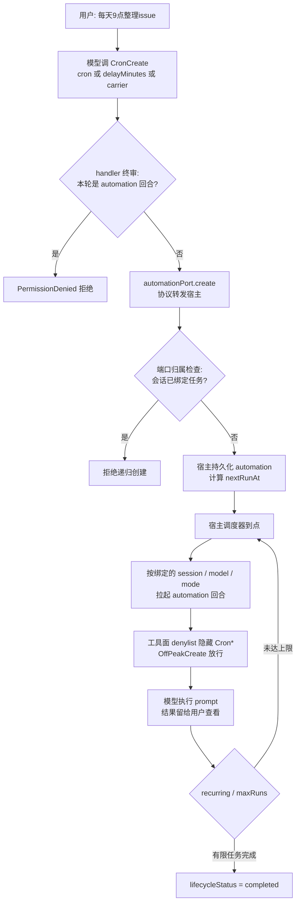

# 5.5 Loop 与定时任务

> 本章导览：5.4 的 Goal 把自主性锁在会话内，本章用 Cron 定时任务把触发权交给墙上的钟——Agent 可以在你不在场时照常开工。核心素材是三种调度表达的设计取舍，以及"定时任务轮里禁止再建定时任务"的三重防御。

## 从会话内长跑到跨会话定时

5.4 节的 Goal 有个隐含前提：会话活着。用户合上电脑，续跑引擎也就停了。但很多自动化需求的触发条件不是"上轮做完了"，而是"每天早上九点"、"每 20 分钟一次"、"8 分钟后提醒我"。这类需求把 Agent 变成了**被时钟驱动的服务**：到点拉起一个回合，执行一段预置的 prompt，把结果留给用户下次打开时查看。

ZCode 用四个工具覆盖这套需求：`CronCreate` / `CronList` / `CronUpdate` / `CronDelete`（`packages/core/src/tool/handlers/cron.ts`）。创建出来的任务叫 automation，数据模型如下（`packages/contracts/src/tools/automation.ts`，有删节）：

```json
{
  "automationId": "a_7f3k2m",
  "title": "每20分钟喝水提醒",
  "cronExpr": "*/20 * * * *",
  "prompt": "提醒用户喝水，并询问今天的进度",
  "enabled": true,
  "lifecycleStatus": "active",
  "runCount": 42,
  "recurring": true,
  "maxRuns": null,
  "modelSelection": { "providerId": "glm", "modelId": "glm-5" },
  "mode": "build",
  "scheduleRule": { "unit": "minute", "interval": 20 }
}
```

几个字段的语义要注意：`prompt` 是每次触发时发给模型的完整指令，必须自包含——触发时刻的对话上下文早已不在；`recurring: false` 加 `maxRuns` 可以表达"只跑 N 次的有限任务"；会话内创建的任务会**绑定当前 session、当时的模型选择与权限模式**（`modelSelection` / `mode`），下次触发时按绑定的配置拉起回合，而不是到时候再看情况。

## 三种调度表达：一个看似简单的问题

"定时"两个字拆开看至少有三种语义，ZCode 为它们设计了三种互斥的表达，全部在 contract 层用 refine 强约束。这一节是本章最值得细读的部分——每一条约束背后都有一次真实的翻车。

**第一种：标准 5 字段 cron。** 表达绝对时刻与周期任务，如 `0 9 * * 1-5`（工作日早九点）。两个硬性规定：按用户本地时区解释，明确"不要转成 UTC"——用户说早九点指的就是他墙上的钟；字段是 `分 时 日 月 周`，与 Linux crontab 一致。

**第二种：`delayMinutes` 相对一次性延迟（1 到 525600）。** 用户说"8 分钟后提醒我"时，模型**不得**把它换算成某个绝对时刻再写成 cron，必须传 `delayMinutes: 8`，让宿主用真实时钟锚定。为什么管得这么严？源码注释记录了一次真实事故：

> **踩坑**：早期工具指令里"一次性提醒就 pin 绝对月日时分"的措辞，覆盖了相对延迟规则。模型据此把"8 分钟后上课提醒"自算成了 `29 7 29 7 *` 这样的固定日历 cron——模型对"现在几点"的认知是陈旧的，它算出的时刻一旦刚刚过去，宿主会把它**静默滚到下一年**。修复后，任何"从现在起 N 之后"的表达（含小时、中英文）一律走 `delayMinutes`。

这条规则可以写成设计格言：**不要让模型自己算现在几点**。模型对当前时刻的认知来自上下文注入，天然滞后；凡是"相对现在"的语义，一律交给持有真实时钟的宿主。`delayMinutes` 与 cron 互斥、强制 `recurring: false`、不允许 `maxRuns`——一次性相对任务没有第二种解释空间。

**第三种：`intervalUnit` + `interval` 长周期 carrier（1 到 200）。** "每 40 天早上九点"没法用 cron 表达——cron 的日字段上限是 31，步长语法会破坏字段语义。即便没越界（如每 20 分钟），cron 的写法是"墙钟对齐"（每到整点/整分的倍数触发），与 UI 自定义重复"从保存时刻锚定"的语义也不一致。于是真实间隔由 `scheduleRule` 字段承载：

```json
{
  "title": "每40天早上9点备份数据",
  "intervalUnit": "daily",
  "interval": 40,
  "cronExpr": "0 9 * * *",
  "scheduleRule": { "unit": "daily", "interval": 40, "hour": 9, "minute": 0, "anchorAt": 1758589200000 }
}
```

注意这里的分工：`cronExpr` 只是一份"合法兼容展示"，调度以 `scheduleRule` 为权威——`intervalUnit`/`interval` 是传给宿主的 carrier，宿主把它归一化成 `scheduleRule`。contract 层用一组 refine 保证 carrier 的配对与互斥：`intervalUnit` 必须与 `interval` 成对出现、不能与 `delayMinutes` 同传（周期与一次性语义矛盾）、要求 `recurring: true` 且不带 `maxRuns`（carrier 的定义就是长周期无限循环）。

> **注**：三种表达最终都落在同一个 automation 记录上。模型的工具入参（cron / delayMinutes / intervalUnit+interval）是"怎么向模型描述"，`scheduleRule` 是"宿主怎么执行"，两者刻意不同构。

## 调度器在哪：CLI 是纯协议代理

一个容易想错的问题：cron 解析、下次触发时间计算、到点派发，这些逻辑在 CLI 进程里吗？**不在。** `packages/bootstrap/src/zcode-protocol/automation-port.ts` 是一个纯协议代理：四个工具的 handler 把输入转发给宿主（桌面端 / host），宿主负责 cron 解析、`nextRunAt` 计算、触发派发与持久化，任务随宿主存活、能扛应用重启。CLI 里能确认的只有绑定语义：automations 绑定 workspace，会话内创建的任务复用当前 session。

这个分层与 2.2 节 MCP 客户端、5.3 节权限 broker 的思路一脉相承：**CLI 核心保持"无常驻状态"**，一切需要跨进程、跨重启存活的东西都上移到宿主。教学版没有宿主，我们稍后会在单进程里实现一个极简调度器，但要知道真实系统的边界画在哪里。

## 防递归三重防御

现在看本章真正的重头戏。定时任务轮里跑的是一段预置 prompt，模型读到这段 prompt 后是完全自由的——如果它决定"为了完成任务，我再创建一个每分钟检查的定时任务"，就会形成**递归定时任务链**：任务生任务，指数爆炸。ZCode 用三重防御堵死这条路，每重防御的必要性都被注释明说。

**第一重：provider 可见性。** automation 触发的回合里，`CronCreate` / `CronUpdate` / `CronDelete` 被加进工具 denylist，模型根本看不到这三个工具。常量定义在 `packages/core/src/runtime/methods/turn-loop-state.ts`：

```ts
export const AUTOMATION_MUTATION_TOOL_NAMES =
  ["CronCreate", "CronUpdate", "CronDelete"] as const;
```

但可见性只是"通常有效"的约束——工具描述里写得很直白："自然语言不能靠关键词或正则可靠判定，automation 执行轮的 mutation tool denylist 才是阻止递归修改任务定义的权限边界"。而 denylist 本身呢？源码注释承认："provider tool denylist 只是可见性约束，旧入口或异常 provider 仍可能直接提交"。所以需要第二重。

**第二重：handler 终审。** 每个写工具的 handler 第一行就调用 `assertNotAutomationTurn`，用 executor 传入的**本轮事实**（`context.automationTurn`）做最终拒绝，并且**刻意不调用端口**——拒绝发生在任何 IO 之前，即使前两层全部失效，这里也是死路：

```ts
// packages/core/src/tool/handlers/cron.ts（有删节）
function assertNotAutomationTurn(
  context: ToolExecutionContext,
  toolName: "CronCreate" | "CronUpdate" | "CronDelete",
): void {
  if (!context.automationTurn) return;
  // provider tool denylist 只是可见性约束，旧入口或异常 provider 仍可能
  // 直接提交 automation 写工具。handler 必须以本轮事实做最终拒绝，且不能调用端口。
  throw createCoreError(CoreErrorType.PermissionDenied,
    `${toolName} is not allowed while running a scheduled automation.`);
}
```

**第三重：端口入口归属检查。** 就算模型绕过工具面、从某个旧入口直接调到协议端口，`createProtocolAutomationPort` 还有一道兜底，分两个分支：当前回合由某个 `automationId` 派发 → 直接拒绝（"Cannot create a scheduled task while running a scheduled task."）；当前会话已绑定某个 automation（= 它本身就是定时任务的会话）→ 也拒绝。第二个分支要求查询"本会话是否绑定任务"，这个查询本身失败时怎么办？注释给出了标准答案：

> **踩坑**："会话归属查询是阻止递归 CronCreate 的授权边界；未知不能等同于未绑定，否则 host / 数据库短暂故障会重新开放创建能力。查询失败必须 fail-closed。"——与 5.4 节 verifier 坏 JSON 的 fail-open 对照：同样是链路故障，权限边界出错时宁可拒绝，完成判定出错时宁可放行。

还有一个只看代码想不到的绕行路径：桌面端的交互输入直连 CLI，会绕过宿主注入的 toolDenylist——普通用户在一个已归属定时任务的会话里继续打字，就能无视前两层守卫再次创建定时任务。第三重防御正是为这种"入口路径无关"的兜底而存在。

三重防御背后是纵深防御的通用思想：**denylist 只是可见性约束，不是权限边界**。凡是安全属性，都要有一个不依赖"模型看不到"的最终判定点。

> **工程细节**：归属检查用的是专用 EXISTS 协议方法，而不是拉全量列表再过滤——任意历史任务的展示字段损坏都会让全量筛选误报"无法验证"。旧版协议没有这个方法时会返回 `-32601`（方法不存在），只有这个错误码能证明是能力差异、可以回退旧版筛选；数据库与传输错误依然 fail-closed。

## 权限与错误设计

创建、修改、删除定时任务都是 `needsApproval: true`、`riskLevel: "medium"` 的写操作（5.3 节判定序列第 14 步），build 模式下必弹窗；`CronList` 只读直通。模型创建任务时还会带上当前会话的权限模式与模型——这些来自 runtime，而不是模型可控的工具入参。

错误设计上有个精巧的细节：宿主对每个用户/工作区的 automation 数量有额度上限，超限时后端返回的错误文案里可能带有"你可以删除一些旧任务"之类的建议。如果把这串文案原样回给模型，它会把"建议删除"当成**可执行的恢复步骤**，自作主张去删用户的旧任务。于是 CLI 把这类错误映射成稳定领域错误 `AutomationCreateLimitError`（携带错误码 `AUTOMATION_CREATE_LIMIT_REACHED`，定义在 `packages/contracts/src/interfaces/automation.port.ts`），模型拿到的是结构化的"额度已满"，而不是一份充满诱惑的操作指南。**给模型的错误信息要当作 prompt 来设计**——它描述失败，但不指挥下一步。

## OffPeak：兄弟机制与"勿照抄防御方向"

ZCode 还有一对兄弟机制：闲时任务（OffPeak），在系统空闲时段自动派发工作，工具是 `OffPeakCreate` / `OffPeakList`。它同样要防"闲时任务再生闲时任务"的递归，防御清单却是另一份：闲时派发轮里隐藏的是 `OffPeakCreate`、`SendMessage`、`Workflow`——而且 **cron automation 轮明确放行 `OffPeakCreate`**，因为"定时派生闲时任务"是合法场景（比如每晚十点安排一批明天空闲时跑的任务）。

源码里两个 denylist 常量刻意不合并，注释直接警告："独立常量，绝不并入 `AUTOMATION_MUTATION_TOOL_NAMES`——cron automation turn 明确放行 OffPeakCreate，混入会让 automation turn 误 deny"。这是防御体系维护的经典教训：**两套防御长得再像，只要放行方向不同，就不能共用常量**——合并的那一刻，第二套防御的方向就被第一套劫持了。

## 触发到执行的数据流

把本章机制串成一张图：从用户一句话创建任务，到某天凌晨宿主拉起一个无人值守的回合。



## 教学版：tinycode 的定时任务

教学版没有宿主进程，我们在单进程里实现调度器：一个每分钟对齐的循环做 cron 匹配，外加 `delayMinutes` 的 `setTimeout` 一次性派发。先写数据结构与 cron 匹配：

```ts
// tinycode/src/features/cron.ts
import { setTimeout as sleep } from "node:timers/promises";

export interface Automation {
  id: string;
  title: string;
  cronExpr: string;          // 标准 5 字段：分 时 日 月 周
  prompt: string;
  recurring: boolean;
  maxRuns: number | null;
  runCount: number;
}

// 本地时区匹配；教学版支持 * 、数字、a-b 区间与逗号列表
export function matchesCron(expr: string, now: Date): boolean {
  const fields = expr.trim().split(/\s+/);
  if (fields.length !== 5) return false;
  const values = [now.getMinutes(), now.getHours(), now.getDate(),
                  now.getMonth() + 1, now.getDay()];
  return fields.every((field, i) =>
    field.split(",").some((part) => {
      const [range, step] = part.split("/");
      const [lo, hi] = range === "*" ? [0, 999] : range.split("-").map(Number);
      const v = values[i];
      return v >= lo && v <= hi && (step === undefined || (v - lo) % Number(step) === 0);
    }));
}
```

调度器每分钟醒来一次，把命中的任务交给回调。`fire` 内部就是一个普通的 `runTurn(prompt)`——定时任务在机制上与 2.1 节的回合没有区别，只是输入来源换成了时钟：

```ts
// tinycode/src/features/cron.ts（续）
export function startScheduler(
  automations: Automation[],
  fire: (a: Automation) => Promise<void>,
) {
  let stopped = false;
  (async () => {
    while (!stopped) {
      const now = new Date();
      for (const a of automations) {
        if (!matchesCron(a.cronExpr, now)) continue;
        if (a.maxRuns !== null && a.runCount >= a.maxRuns) continue;
        a.runCount += 1;
        await fire(a);                          // 触发一个普通回合
      }
      const msToNextMinute = 60_000 - (Date.now() % 60_000);
      await sleep(msToNextMinute);              // 对齐到下一个整分
    }
  })();
  return () => { stopped = true; };
}

// 相对一次性："8分钟后" → 宿主用真实时钟锚定，不让模型自算时刻
export function scheduleOnce(prompt: string, delayMinutes: number,
                             fire: (p: string) => Promise<void>): void {
  setTimeout(() => void fire(prompt), delayMinutes * 60_000);
}
```

最后补上递归防御的骨架——handler 终审与端口归属检查的简化版：

```ts
// tinycode/src/features/cron.ts（续）
export interface ToolContext { automationTurn?: boolean; boundAutomationId?: string }

// handler 终审：不依赖"模型看不到工具"，以本轮事实做最终拒绝
export function assertNotAutomationTurn(ctx: ToolContext, tool: string): void {
  if (ctx.automationTurn) {
    throw new Error(`${tool} is not allowed while running a scheduled automation.`);
  }
}

// 端口兜底：会话已绑定定时任务则拒绝再次创建；查询失败 fail-closed
export async function guardCreateInPort(
  ctx: ToolContext, isBound: () => Promise<boolean>,
): Promise<void> {
  assertNotAutomationTurn(ctx, "CronCreate");
  let bound: boolean;
  try {
    bound = await isBound();
  } catch {
    throw new Error("Cannot verify whether this session belongs to a scheduled task.");
  }
  if (bound || ctx.boundAutomationId) {
    throw new Error("Cannot create a scheduled task inside a scheduled-task session.");
  }
}
```

> **工程细节**：真实调度器要处理的边界比这多得多——错过触发点的补偿策略、触发风暴的合并、宿主休眠唤醒后的对齐。教学版的对齐循环只求语义正确：每分钟至多触发一次，`matchesCron` 不重不漏。

## 小结

定时任务把 Agent 的触发权从"回合结束"移交给"墙上的钟"：四个 Cron 工具管理 automation，三种调度表达各司其职——cron 表达墙钟周期、`delayMinutes` 表达相对一次性（"不要让模型自己算现在几点"）、`intervalUnit`+`interval` carrier 绕开 cron 字段上限。调度与持久化上移到宿主，CLI 保持纯协议代理。防递归三重防御（可见性 denylist → handler 终审 → 端口 fail-closed 归属检查）示范了纵深防御的正确分层，OffPeak 的"勿照抄防御方向"则提醒我们防御常量不可轻率合并。不过至今所有工作都在**一个回合内串行**——如果模型想同时跑三个子代理还不堵住对话，就需要下一章的后台任务。
