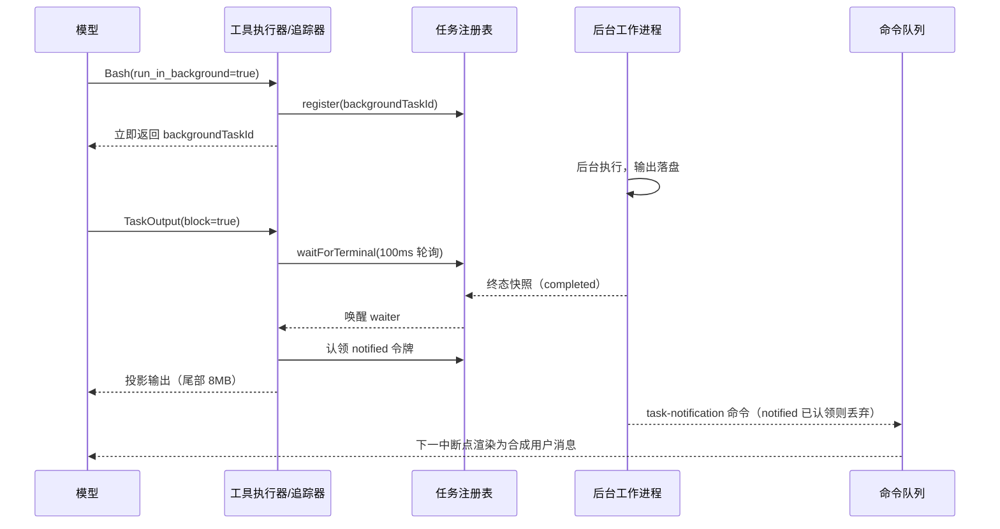

# 5.6 Background Task

> 本章导览：Goal 与定时任务解决的是"什么时候开工"，本章解决"开工之后怎么不打架"——长命令、后台子代理、工作流都能在不阻塞对话的情况下并行推进，完成时用一条通知回到模型视野。

## 为什么需要后台任务

2.1 节的 Agent Loop 有个隐含假设：工具调用是回合的一部分，回合不结束，用户就只能等。对一秒内完成的 Read 无所谓，但一个五分钟的全量测试、一个要跑十分钟的子代理，会把对话冻成单行道——用户既不能插话纠正方向，也不能让模型顺手干点别的。

ZCode 的答案是把"发起"与"完成"解耦：工具可以**立即返回一个任务句柄**（`backgroundTaskId`），实际工作转到后台继续，对话照常进行；任务完成后再通过一条通知回到模型视野。这个机制覆盖五类任务（`packages/core/src/runtime-task/registry.ts`）：

```ts
export type RuntimeTaskType =
  | "local_agent"               // 子代理（后台或前台转后台）
  | "local_bash"                // Bash run_in_background / 超时自动转后台
  | "local_workflow"            // legacy Workflow 工具（不可取消）
  | "local_dynamic_workflow"    // CreateWorkflow 发起的 run（可取消，见 5.7 节）
  | "monitor_mcp";
```

注释里有个有趣的细节：`local_workflow` 与 `local_dynamic_workflow` 刻意分开——前者是旧版 `Workflow` 工具、不可取消，后者经 `DynamicWorkflowRunPort.cancel` 可取消；"合成一个类型，取消分派就无法区分"。类型系统的细分直接服务运行时行为的分派。

Bash 是最典型的入口。3.4 节说过 Bash 有超时机制，而后台化给了它第二条路：模型显式传 `run_in_background: true` 时命令立即后台化、返回 `backgroundTaskId`；即便模型没传，**前台 Bash 超时后也会自动转后台**——不是杀掉重来，而是把已经在跑的进程"收编"为后台任务，输出继续落盘。两个行为分别实现在 `packages/core/src/tool/handlers/bash-background-lifecycle.ts` 与 `bash-background-policy.ts`。

## 任务注册表：内存里的真相之源

所有后台任务登记在同一个注册表里。`InMemoryRuntimeTaskRegistry`（同文件）本质是"内存 Map + 两组 waiter"：

```ts
export interface RuntimeTaskRegistry {
  register(task: RuntimeTaskSnapshot): void;
  update(id: string, patcher: (t: RuntimeTaskSnapshot) => RuntimeTaskSnapshot): void;
  get(id: string): RuntimeTaskSnapshot | undefined;
  requestBackground(id: string): boolean;   // 标记 isBackgrounded 并唤醒 waiter
  waitForBackgroundRequest(id: string): Promise<RuntimeTaskSnapshot | undefined>;
  waitForTerminal(id: string): Promise<RuntimeTaskSnapshot | undefined>;
  queueMessage(id: string, msg: RuntimeTaskPendingMessage): void;
  drainMessages(id: string): RuntimeTaskPendingMessage[];
}
```

三个机关值得逐个看。**其一，`requestBackground` 是"前台转后台"的实现机关**：前台子代理运行时，一边等它完成，一边用 `waitForBackgroundRequest` 挂起一个 waiter；谁调用了 `requestBackground`（比如超时策略或用户操作），waiter 立刻醒来，前台调用提前返回"已转后台"，而任务本体继续跑。注册表只是翻了个标记位，等待语义就完成了换轨。

**其二，waiter 是状态机的另一半**：`waitForTerminal` 在任务已处于终态时立即返回，否则把 waiter 挂进集合，等 `update`/`register` 把快照推进到终态时统一唤醒。终态集合包括 `completed / failed / cancelled / killed / stopped / lost`——注意 `lost` 的存在：后台任务可能因为进程崩溃而"下落不明"，注册表要能表达"不知道"，而不是永远 pending。

**其三，`branchGeneration` 是迟到通知的栅栏（fencing）**：会话可能发生分支（比如用户回退重来），注册条目在登记时盖上当前分支代的章；带着旧分支代的通知、账目，在投递前与当前代比对，不一致就丢弃。没有这个栅栏，用户撤销对话十分钟后还会收到"旧时间线的任务完成了"的幽灵通知。

> **注**：注册表是纯内存的。崩溃后后台子进程已死、任务不可恢复，所以真实系统还在 SQLite 里记了一本 durable 账本：只记"曾有个任务 admitted"，恢复会话时把残留条目收口为 `discarded(session_resumed)`——留痕，不假装任务还活着。

## 统一追踪器：每个后台工具自报三件事

注册表之上是 `BackgroundTaskTracker`（`packages/core/src/tool/executor/background-tasks.ts`）。它的触发点很统一：**任何工具的输出里出现 `status === "backgrounded"` 或 `async_launched`，tracker 就介入**，按工具名查一张 `BackgroundTaskLifecycleProvider` 表。每个想后台化的工具都要声明三件事：

1. **快照源**：约每秒轮询一次的函数，返回任务的当前状态（运行中、退出码、累计输出大小等），供事件广播与 UI 刷新；
2. **终态直等**：一个 Promise，任务进入终态时 resolve，用于铸造完成通知；
3. **可取消**：任务能否被用户停止，决定事件负载里的 `cancellable` 字段。

三件事分别分派到不同的端口：Agent 任务问 `subagentPort`，CreateWorkflow 问 `dynamicWorkflowRunPort`，Bash 问 `executionPort`。tracker 自己不认识任何具体任务——它只认"声明了这三件事的 provider"。新增一种后台任务类型，不需要改 tracker 一行代码。

> **踩坑**：tracker 源码注释里记着一条事故：某类任务的 provider 漏声明了取消方法，`cancellable` 被硬编码为 `false`，"取消入口直接死掉"——前端按钮灰了，用户只能干等。教训是：能力声明缺省值的选择本身就是行为，"漏写"会被静默解释成"不能"。

## TaskOutput 与 TaskStop：模型侧的操作面板

后台任务对模型暴露两个工具。`TaskOutput(task_id, block, timeout)` 读取任务输出：`block: true` 时以 **100ms 轮询**（`TASK_OUTPUT_POLL_INTERVAL_MS = 100`，`packages/core/src/tool/handlers/task-output.ts`）等待终态，`block: false` 时立即返回当前快照（任务未结束则返回 `not_ready`）。`TaskStop(task_id)` 请求停止，停止发起者会被记进注册条目（`"user"` 来自 GUI 后台面板，`"model"` 来自 TaskStop），供终态通知区分"谁停的"。

输出投影按任务类型分派（`task-output-projection.ts` / `task-output-bash.ts`）：

- **Bash**：读输出文件的**尾部至多 8 MiB**——长任务的早期输出对模型价值最低，且前面被截掉的部分会以 `[1234KB of earlier output omitted]` 显式标注，让模型知道这不是全部；
- **子代理**：优先读注册表里的结构化结果（最终消息、token 用量、工具调用数），读不到再回退磁盘上的 output 文件；
- **workflow run**：产物在终态时就序列化存进了注册条目（`resultText` 字段）——因为动态工作流从不写输出文件，投影只能从 registry 拿。

这里出现了一个微妙的并发问题：**完成通知与 TaskOutput 轮询会争抢同一次交付**。模型可能自己调 TaskOutput 读到了终态结果，几秒后通知又把同一结果灌进对话——重复投递不仅浪费上下文，还会让模型以为发生了两次。ZCode 的解法是注册条目上的 `notified` 标志，作为**单次认领令牌**：无论通知路径还是 TaskOutput 路径，谁先把 `notified` 置真，谁就负责这次交付，另一方看到标志就闭嘴。认领时机也有讲究——必须在投影**成功之后**才写标志，否则读取中途失败会把后续的通知也吞掉。

## 完成通知：任务如何回到对话

任务完成后发生什么？以子代理为例，完成时会铸造一段 XML 通知文本：

```xml
<task-notification>
  <task-id>agent_9f2c</task-id>
  <output-file>/tmp/zcode-agents/.../output.txt</output-file>
  <status>completed</status>
  <summary>Agent Explore task "搜索用法" completed.</summary>
  <result>……子代理最终报告全文……</result>
  <usage>
    <subagent_tokens>52340</subagent_tokens>
    <tool_uses>17</tool_uses>
    <duration_ms>88432</duration_ms>
  </usage>
</task-notification>
```

这条文本的旅程（`packages/core/src/runtime/methods/background-notifications.ts`）：先过两道防御——runtime 正在关闭则丢弃（"teardown 期间只允许任务状态收口，不能再启动模型轮次"）、分支代不符则丢弃；然后作为一条 `task-notification` 命令**同步入队**到 runtime 命令队列（函数签名刻意返回 void，用类型系统禁止 async——防止"假装入了队"的竞态），同时写入 durable 账本。队列在下一个可中断点把这条命令渲染为一条**合成用户消息（synthetic user message）**，模型于是"收到通知"，可以决定是否跟进。所有后台路径——子代理、Bash、workflow——都汇入同一个队列，模型看到的界面是统一的。

整个生命周期串起来是这样：



> **注**：图里 TaskOutput 与通知只发生了其中一次——`notified` 令牌保证同一结果至多交付一次，先到先得。

## 资源与并发管理

后台不等于放任。ZCode 对后台子代理有活动看门狗：子 runtime 每个事件都要上报活动续期，超时未上报就 abort——"卡死"被显式建模而不是靠耐心。后台 Bash 超过最大运行时长也会被追踪器主动调 `executionPort.cancelBackgroundTask` 收掉。父子取消信号通过 AbortController 链联动：用户按 Stop，正在后台跑的子任务一起取消；而**前台转后台的那一刻会切断这条链**（`detachParent()`）——任务已经独立，不该再陪葬父回合的取消。

对模型的行为引导则写在工具描述里：同一消息里发多个后台 Agent 调用即可并行；不要滥用后台让所有任务都"发射后不管"——后台任务没有对话上下文的持续注入，适合边界清晰的独立工作，需要紧密协作的步骤留在前台更稳。

## 教学版：tinycode 的后台任务

教学版实现三件事：spawn 后台进程 + 注册表 + 轮询读取。注册表用 Map 和状态字段，waiter 语义用轮询简化：

```ts
// tinycode/src/features/background.ts
import { createWriteStream } from "node:fs";
import { spawn } from "node:child_process";

export type TaskStatus = "running" | "completed" | "failed";

export interface Task {
  taskId: string;
  kind: "bash" | "agent";
  status: TaskStatus;
  command: string;
  outputFile: string;
  exitCode: number | null;
  notified: boolean;        // 单次认领令牌：通知与轮询谁先认领谁交付
}

const tasks = new Map<string, Task>();
let seq = 0;

export function getTask(id: string): Task | undefined { return tasks.get(id); }
```

spawn 立即返回句柄，进程输出重定向到文件——这就是"输出落盘"的最小实现：

```ts
// tinycode/src/features/background.ts（续）
export function spawnBackground(command: string): string {
  const taskId = `bash_${++seq}`;
  const outputFile = `/tmp/tinycode-tasks/${taskId}.log`;
  const child = spawn(command, { shell: true, stdio: ["ignore", "pipe", "pipe"] });
  const file = createWriteStream(outputFile, { flags: "a" });
  child.stdout.pipe(file);
  child.stderr.pipe(file);
  child.on("close", (code) => {
    file.end();
    const t = tasks.get(taskId);
    if (t) { t.status = code === 0 ? "completed" : "failed"; t.exitCode = code; }
  });
  tasks.set(taskId, {
    taskId, kind: "bash", status: "running", command,
    outputFile, exitCode: null, notified: false,
  });
  return taskId;              // 对话立即继续，不等待
}
```

TaskOutput 的简化版：`block: true` 时轮询等待终态，读取输出尾部并标注省略量：

```ts
// tinycode/src/features/background.ts（续）
const POLL_MS = 100;
const MAX_TAIL_BYTES = 8 * 1024 * 1024;

export async function taskOutput(taskId: string, block: boolean): Promise<string> {
  let task = tasks.get(taskId);
  if (block) {
    while (task && task.status === "running") {
      await new Promise((r) => setTimeout(r, POLL_MS));
      task = tasks.get(taskId);
    }
  }
  if (!task) return `No task found with ID: ${taskId}`;
  if (task.status === "running") return "status: running (no output yet)";
  return projectOutput(task);
}

async function projectOutput(task: Task): Promise<string> {
  const handle = await open(task.outputFile, "r");
  const size = (await handle.stat()).size;
  const bytesRead = Math.min(size, MAX_TAIL_BYTES);
  const buffer = Buffer.alloc(bytesRead);
  await handle.read(buffer, 0, bytesRead, size - bytesRead);
  await handle.close();
  const omitted = size - bytesRead;
  const prefix = omitted > 0
    ? `[${Math.round(omitted / 1024)}KB of earlier output omitted]\n` : "";
  return `status: ${task.status} exit=${task.exitCode}\n${prefix}${buffer.toString("utf8")}`;
}
```

完成通知的最小版：主循环在每轮取输入前检查有没有"尚未认领"的终态任务，有就把通知文本当作合成输入喂给模型——这就是 `notified` 令牌的用法：

```ts
// tinycode/src/features/background.ts（续）
export function drainNotifications(): string[] {
  const out: string[] = [];
  for (const t of tasks.values()) {
    if (t.status !== "running" && !t.notified) {
      t.notified = true;      // 先认领后投递：读取失败也不再重发
      out.push(`<task-notification>\n<task-id>${t.taskId}</task-id>\n` +
        `<status>${t.status}</status>\n</task-notification>`);
    }
  }
  return out;
}
```

`drainNotifications` 的返回值由主循环拼接成合成输入喂给模型。至此三件套齐了：spawn 立即返回、注册表记账、轮询读取与通知。真实系统在此基础上补齐了快照轮询、活动看门狗、分支代栅栏与 durable 账本——那是把教学版推向生产的全部增量。

> **工程细节**：教学版省略了快照轮询、活动看门狗、分支代栅栏与 durable 账本。真实系统里"崩溃后任务去哪了"是后台机制成本的大头——内存注册表 + durable 账本的组合，本质是用账本换诚实：宁可承认任务丢了（`lost` / `discarded`），也不假装它还在跑。

## 小结

后台任务把"发起"与"完成"解耦：Bash 与子代理可以立即返回 `backgroundTaskId`，工作在注册表登记后转入后台，前台 Bash 超时也能自动转后台收编。注册表的 `requestBackground` 用一个标记位实现前台转后台的换轨，`branchGeneration` 栅栏拦下跨分支的幽灵通知；统一追踪器要求每种后台工具自报快照源、终态直等、可取消三件事，新增类型零改动。模型侧用 TaskOutput（100ms 轮询、Bash 尾部 8MB 投影）与 TaskStop 操作任务；完成通知以 `notified` 单次认领令牌消灭重复投递，经命令队列渲染为合成用户消息回到对话。后台解决的是"单会话内并行"，但并行结构仍要模型在每条消息里手动安排——如果想把"先并行探查、再汇总、失败重试"这类编排结构本身交给代码，就需要最后一章：动态工作流。
