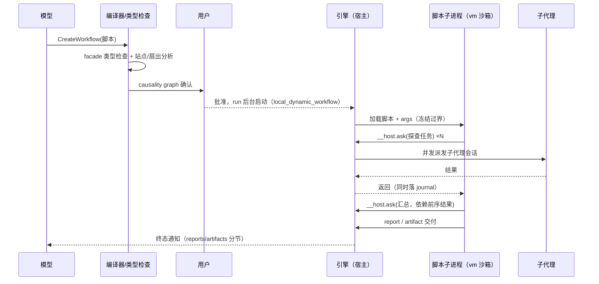

# 5.7 动态工作流：用脚本编排子代理

> 本章导览：当一个任务需要多个子代理按依赖关系协作时，让模型写一段类型安全的 TypeScript 编排脚本——并行、汇总、阶段推进交给引擎执行，脚本本身成为可确认、可重放、可续跑的工件。

## 什么时候一个子代理不够用

2.5 节的 Agent 工具解决"委派一件事"，5.6 节的后台机制解决"并行跑多件事"。但有些任务的难点不在单件事，而在**结构**：把一个仓库的三十个模块分别做迁移评估（扇出），等全部评估完再汇总冲突点（依赖），评估期间穿插一轮跑基线测试（前置步骤），最后产出一份评审报告（汇总）。模型当然可以在对话里手动安排这一切，但每一步都要它亲自在场发号施令——多轮往返、多次"现在该谁了"的判断，上下文被编排细节塞满，真正的领域内容反而没地方住。

更根本的问题是：**编排逻辑写在对话里，就不可校验、不可重放、不可恢复**。哪两个子代理能并行、哪个汇总依赖哪些结果，这些信息散落在多轮消息中；会话一崩，编排结构就散了。

动态工作流（ZCode 内部简称 dwf）的思路是把编排逻辑**物化成一段代码**：模型用 `CreateWorkflow` 工具提交一个 TypeScript 脚本，脚本声明"有哪些子任务、怎么并行、怎么汇总"，引擎负责执行。脚本经过类型检查、交给用户确认后才运行——编排从"对话中的即兴指挥"变成"可审查的工件"。

什么时候该动用工作流？三个征兆，命中越多越合适：其一，任务能分解成**同构的子任务**（三十个模块的评估本质上是一个函数的三十次调用）；其二，子任务之间存在**依赖与汇总**（评估完了才有得汇总，汇总依赖全部前序结果）；其三，控制流需要**非对话驱动**的成分（"每个模块评估完顺手跑一遍它的测试"是循环体里的固定步骤，不是需要模型临场判断的事）。反过来，如果子任务之间几乎独立、也不需要汇总，直接在一条消息里发多个并行 Agent 调用（2.5 节）就够了——工作流是为结构服务的，不是为排场服务的。

## 两代工作流：固定管线与动态脚本

ZCode 其实有两套工作流体系，对照着看更容易理解动态版的动机。

**第一代：legacy expert workflow**（`packages/core/src/workflow/`）。它把"专家级大任务"的流程固化成一条 8 阶段管线：clarify → task_analysis → arch_decompose → env_setup → meta_prompt → exec → final_critic → complete。执行器是 `WorkflowGraphScheduler`：就绪节点并发派发（受 `maxConcurrentLoops` 限制）、`Promise.race` 收割先完成的节点、连续错误熔断、死锁暂停——**每个节点启动一个独立的子代理会话去执行**。这套调度器值得记住的细节是它的失败处理：一个节点连续报错会触发熔断（防止烧钱空转），所有节点都在等、没有节点能跑时会暂停整图（防止死锁空转）。它证明了"用子代理执行 DAG 节点"这条路线可行，但 8 个阶段是写死的：不管任务是重构一个文件还是迁移整个服务，都走同一条管线。固定管线是对"任务形态"的过早收敛。

**第二代：动态脚本。** 管线不该写死在框架里，该由模型按任务现写。于是框架退到更低的位置：只提供"创建 actor、委派任务、记录产物、执行命令"这几个原语，阶段怎么划分、扇出多大、汇总给谁，全部交给脚本。两代体系的执行单元是同一种东西——**子代理会话**；区别只在谁排班：legacy 是框架排 DAG，动态版是脚本排 actor。

任务类型上的这个代际痕迹一直留到今天：5.6 节见过的 `RuntimeTaskType` 里，`local_workflow`（legacy，不可取消）与 `local_dynamic_workflow`（动态 run，可取消）是两个并列值。legacy 工具已在功能上被取代，但取消语义的差异让两者无法在类型上合并——这也是"删旧代码比加新代码难"的一个小注脚。

动态工作流有三个生命周期工具（`CreateWorkflow` / `AmendWorkflow` / `ResumeWorkflowRun`，细节见后文"工具面"一节），启动的 run 就是 5.6 节的后台任务，类型正是 `local_dynamic_workflow`。

## 工作流脚本的 API：facade 逐个讲

模型写的脚本不是任意 TypeScript。它能碰到的全部 API 是一个**类型安全的 facade**——编译器把它内嵌的 `.d.ts` 当作唯一的类型世界（`packages/dynamic-workflow/src/facade/dts.ts`），脚本 import 任何别的东西都过不了类型检查。换句话说，facade 不只是库，它是脚本与现实之间的唯一通道。逐个看：

**`agent()` 与 `ask()`：创建与委派。** `agent(name?, persona?)` 创建一个 actor——一个持久化的子代理会话，有自己的名字与人设；`ask(instructions)` 向它委派一个任务并等待结果。`ask` 返回一个 `Node<T>`，它是 thenable（可以 `await`，也可以接 `.then`/`Promise.all`），引擎靠它追踪依赖：

```ts
// 一个最小的工作流脚本：两路并行探查，结果交给汇总代理
const r1 = agent("explorer", "只读代码探查专家")
  .ask("梳理 auth 模块的公开 API 与调用方");
const r2 = agent("tester", "测试工程师")
  .ask("跑基线测试，记录失败的用例");

const report = await agent("reviewer")
  .ask(`综合以下两份材料，列出迁移风险清单：\n${await r1}\n\n${await r2}`);
log("风险评估完成");
```

`await r1` 与 `await r2` 写在 reviewer 的任务书里，依赖关系就被数据流自然表达了——脚本里没有 DAG 库，数据流向就是依赖图。同一阶段的多路 `ask` 用 `Promise.all` 扇出，引擎会并发派发。

**`log()` 与 `report()`：渐进产物。** 脚本通常要跑很久，用户不能等到最后才知道发生了什么。`log(message)` 输出一条进度；`report(item, artifactId?)` 提交一条结构化发现（会实时出现在仪表盘上）。两者都会落入 journal（下一节讲），有 256 条 / 32KB 的上限——渐进产物是给人看的摘要，不是审计日志。

**`artifact.*`：正式交付物。** `artifact.file / markdown / chart / table / metrics / board` 把脚本产出的内容注册为交付物——一段 Markdown 报告、一张指标卡、一个表格视图。run 结束后这些交付物仍然可查，是工作流的"作品"。

**`phase()`：阶段标注。** `phase("探查")` 声明进入某个阶段。编译器对它有两个硬约束：参数必须是**字面量**（不能是拼接出来的字符串，否则静态分析无法枚举阶段）；每个阶段内必须至少有一个 `ask` 或一次 `world.run`（没有实际工作的空阶段会被拒绝）。阶段标注服务于用户确认与进度展示。

**`files` / `git`：只读探查。** `files.glob / read / grep` 与 `git.status / diff / log / changedFiles` 让脚本可以自己做轻量世界探查——比如先用 `files.glob` 数一数模块数量再决定扇出几路。这些调用是只读的、由宿主执行、结果同样落 journal。注释里说得很清楚它们与子代理的分工："agents can read files with their own tools; read() and grep() are for when the world is an agent task"——探查结果要喂给委派任务时才需要它们。

**`world.run()`：命令执行。** 脚本可以直接跑命令（如基线测试），参数是固定的 argv 数组。它与 journal 的约定和探查调用相同。

**`args`：声明式参数。** 脚本里可以直接引用 `args` 对象，它是这个 run 的入参（如目标目录、关注模块），由发起方传入。`args` 在跨越子进程边界时被冻结一次——脚本运行期间它恒定不变，这是可重放性的前提之一。

把 facade 的全貌列成一张表，便于对照使用：

| API | 类别 | 语义要点 |
| --- | --- | --- |
| `agent(name?, persona?)` | 委派 | 创建持久 actor，返回带 `ask` 的对象 |
| `ask<T>(instructions)` | 委派 | 委派任务，返回 thenable 的 `Node<T>`，await 即依赖 |
| `log(msg)` / `report(item)` | 渐进产物 | 进度与结构化发现；落 journal，256 条 / 32KB 上限 |
| `artifact.file/markdown/chart/table/metrics/board` | 交付物 | 注册 run 结束后仍可查的正式产物 |
| `phase(name)` | 阶段 | 参数必须字面量；每阶段须含 ask 或 world.run |
| `files.glob/read/grep` | 只读探查 | 宿主执行，结果落 journal，glob 上限 2000 条 |
| `git.status/diff/log/changedFiles` | 只读探查 | 限定工作区范围，log 例外可见全局提交 |
| `world.run(cmd, args)` | 命令执行 | argv 数组固定，journal 化 |
| `args` | 入参 | 冻结过界一次，运行期恒定 |

## 执行模型：沙箱、NDJSON 与 journal

脚本不在 runtime 进程里跑，也不在模型脑子里跑，而在一个**独立的子进程**里：脚本被改写成 async 函数体，放进 `vm.createContext` 建立的独立 realm（`packages/dynamic-workflow-runtime/src/child-source.ts`），realm 里只注入标准内建对象和一个 `__host` 对象——脚本对世界的一切请求（ask、探查、跑命令）都变成 `__host.*` 调用，经 **NDJSON stdio** 一行一条 JSON 地传回宿主的纯引擎核心，引擎再调度子代理与工具。隔离是双向的：脚本碰不到宿主的内存，宿主也只通过协议看见脚本的请求。

为什么要这么大动干戈？因为脚本是**模型写的代码**，却要**无人值守地跑很久**。同进程执行意味着脚本的一个死循环能拖死整个 runtime、一次越权 import 能触到宿主的全部能力；而"先跑完再展示"意味着用户中途什么都看不见。子进程 + 协议桥一次解决了三件事：崩溃被限制在子进程内（runtime 不陪葬）、能力被限制在协议面上（facade 之外无世界）、每个请求途经引擎（天然的 journal 与展示管道）。注意 vm 沙箱在这里的角色与 3.4 节 REPL 不同：REPL 的隔离论断是"vm 不是安全沙箱，隔离靠上层权限"，而这里权限内嵌在协议里——脚本物理上够不到协议之外的东西，`__host` 是唯一出口。

在这个体系里，**journal 是灵魂**。脚本的每个有副作用的动作——每次 `ask` 的委派与结果、每条 `report`、每次 `world.run`——都按到达顺序落成 journal 行。有了它，三件事才成立：

- **crash recovery**：子进程崩了，`ResumeWorkflowRun` 重放 journal，已完成的 `ask` 直接取缓存结果，脚本从断点继续；
- **AmendWorkflow 的缓存导入**：改了脚本后续跑，旧脚本里已完成 actor 的成果不重算；
- **确定性约束**：正因为要重放，`Date.now()` 和 `Math.random()` 在运行期被直接禁用——源码里的说法是"belt；编译期诊断是 suspenders"（运行期禁令是腰带，编译期诊断是背带，双保险）。时间与随机数会破坏重放一致性，需要时间戳或随机性时必须通过 `__host` 向宿主请求。

运行期禁令不是文档约定，是真的替换掉了沙箱里的全局对象（`packages/dynamic-workflow-runtime/src/child-source.ts`，有删节）：

```ts
// —— 运行期禁令（belt；编译诊断是 suspenders）——
var __NativeDate = Date;
class __WorkflowDate extends __NativeDate {
  constructor() {
    if (arguments.length === 0)
      throw new Error("argless new Date() is disabled in workflows");
    super(...arguments);
  }
  static now() {
    throw new Error("Date.now() is disabled in workflows");
  }
  static parse(value) { return __NativeDate.parse(value); }
}
globalThis.Date = __WorkflowDate;
Math.random = function () {
  throw new Error("Math.random() is disabled in workflows");
};
```

注意实现的精细处：禁的是 `Date.now()` 和无参 `new Date()`（"现在的时刻"不可重放），但 `Date.parse("2026-01-01")` 这类显式给定时刻的调用仍然放行——禁令针对的是**不确定性来源**，不是时间概念本身。

协议桥上还有一个只有读过源码才懂的承重设计：`report` 与 `ask` 走同一条 NDJSON 通道，靠 **stdio 的 FIFO 顺序**保序。注释说"report 丢了是丢一条发现（父进程会把它落 journal）"——丢一条 `log` 无伤大雅，但 journal 记的就是"到达的东西"，到达顺序乱了重放就乱了。这也是为什么子进程内所有出站消息共用一个自增序号、单线程顺序写出。



用户确认环节基于编译器产出的 **causality graph**：编译器对脚本做类型检查（virtual-host）、收集 ask/actor/fan-out 站点、污点分析求不动点、时序游走，最终产出一张"这个工作流会做什么、会派几个代理、哪些动作有先后"的因果图交给用户过目——你要批准的不是一段代码文本，而是一份可读的行动计划。

## 工具面：创建、修订与恢复

模型侧共有三个工具管理 run 的生命周期。**`CreateWorkflow`** 接收脚本（可带 `args` 入参），类型检查通过并经用户确认后后台启动；**`AmendWorkflow`** 是它的"修订"形态——脚本有 bug、或范围要调整时，提交修订版并指定旧 run，新 run 把旧 run 已完成的工作作为缓存导入，只有改动部分重新花钱执行；**`ResumeWorkflowRun`** 恢复一个被停止或因故中断的 run，按 journal 重放。

三个工具是互斥的分工：新任务用 Create，改任务用 Amend，续任务用 Resume。一个已经 `errored` 的 run 不能 Resume（重放也会错在同一处，该用 Amend 修脚本）；一个被用户主动停止的 run 只在用户再次要求时才 Resume——与 5.4 节"暂停不自动复活"是同一条原则：**人的停止就是停止**。

run 运行中，`TaskStop` 可以停它（停止发起者记为 `"user"` 或 `"model"`，终态通知会区分）；run 进入终态（完成、失败、被停）后，5.6 节的完成通知机制把结果送回对话，通知文本里报告与交付物分节列出，模型可以据此向用户转述，或继续追问下一步。整个动态工作流没有发明任何新的"可见性机制"——它完全是站在 2.5 节（子代理执行）与 5.6 节（后台承载）之上的一层编排协议。

## 与 SubAgent、后台任务的关系

本章是三部曲的合流点，值得把关系说明白。**每个 `ask` 就是一个 2.5 节的子代理会话**：独立的上下文、按 persona 装配的系统提示词、跑完整的 Agent Loop；工作流没有发明新的执行单元。**run 本身是 5.6 节的后台任务**：注册、追踪、通知、TaskOutput 全部复用，动态工作流连"怎么被看见"都是借来的。它新增的只有一层：**用类型安全的脚本替代模型在对话里的即兴编排**。

一个贴切的比喻：**脚本是脑子，agent 是手脚**。子代理有执行力没全局观，脚本有全局观没执行力；facade 是两者之间的神经协议。这也解释了 facade 为什么设计得这么"窄"——不是功能贫乏，而是凡是脚本不该有的能力（写文件、自主提问、访问真实时间）都在类型世界和运行期被同时切断，编排者的权力边界被钉死在协议上。

把本章与前面两章的方案放在一起，选型的轮廓就清晰了：

| | 对话内手动并行（2.5/5.6 节） | 动态工作流（本章） |
| --- | --- | --- |
| 编排者 | 模型，在每条消息里临场安排 | 脚本，启动前已成型 |
| 结构载体 | 对话历史，不可校验 | 代码工件，可类型检查、可确认 |
| 崩溃恢复 | 无（会话崩了编排即散） | journal 重放，断点续跑 |
| 适合规模 | 两三个边界清晰的委派 | 扇出大、依赖深、需要汇总的长任务 |

记不住表格就记一句话：**编排要在对话里做一次，就在对话里做；要反复做、长期做、或结构复杂到说一遍说不清，就写成脚本。**

## 教学版：tinycode 的工作流引擎

真实系统的沙箱、编译器与 journal 远超一章的容量。教学版抓住最核心的**扇出/汇总模式**：一个阶段数组，阶段内并行 `ask`，阶段间串行，全部结果交汇总代理。它对应真实脚本里最常见的那类形状——先跑基线、并行探查、最后汇总——三十行讲完骨架：

```ts
// tinycode/src/features/workflow.ts
import { spawnSubagent } from "../subagent.js";

export interface Ask { agent: string; persona: string; prompt: string }
export interface Phase { name: string; asks: Ask[] }

// 阶段内并行、阶段间串行；transcript 充当最简 journal
export async function runWorkflow(
  title: string,
  phases: Phase[],
  aggregator: Ask,
): Promise<string> {
  const journal: string[] = [`# ${title}`];
  for (const phase of phases) {
    journal.push(`## phase: ${phase.name}`);
    // 扇出：同一阶段的委派全部并发；Promise.all 失败会中断整段，
    // 真实引擎用逐节点收割 + 熔断，教学版从简
    const results = await Promise.all(
      phase.asks.map((a) => spawnSubagent(a.agent, a.persona, a.prompt)),
    );
    phase.asks.forEach((a, i) =>
      journal.push(`### ${a.agent}\n${results[i]}`));
  }
  return spawnSubagent(                     // 汇总：依赖全部前序结果的最后一步
    aggregator.agent, aggregator.persona,
    `${aggregator.prompt}\n\n${journal.join("\n\n")}`,
  );
}
```

用法一览扇出/汇总的形状——模块迁移评估：

```ts
// tinycode/src/features/workflow.ts（用法）
const report = await runWorkflow("auth 模块迁移评估", [
  { name: "基线", asks: [
    { agent: "tester", persona: "测试工程师", prompt: "跑全量测试，记录失败用例" },
  ]},
  { name: "并行探查", asks: [
    { agent: "explorer", persona: "只读探查", prompt: "梳理 auth 的公开 API" },
    { agent: "explorer", persona: "只读探查", prompt: "找出 auth 的全部调用方" },
  ]},
], { agent: "reviewer", persona: "架构评审", prompt: "综合以上材料，输出迁移风险清单" });
```

对照真实系统，这里省掉的东西每一件都值得知道：没有沙箱与协议桥（脚本和引擎同进程）；没有 journal 与重放（崩了就重跑）；没有编译期分析与用户确认（编排结构靠代码评审而非 causality graph）；没有 AmendWorkflow 的缓存导入。但形状已经对了——**编排逻辑是数据（阶段数组），执行是复用的子代理，汇总是显式声明的依赖**。

> **注**：汇总代理的任务书同样要自包含。`journal.join("\n\n")` 把全部前序结果塞进了 prompt，但"这些材料是什么、汇总成什么格式、多长合适"仍要在 aggregator 的任务书里说清——这与 5.5 节"`prompt` 必须自包含"是同一条纪律：**凡是异步执行的东西，都别指望发起时刻的上下文还在场**。

> **注**：教学版把阶段写成了静态数组，真实脚本是图灵完备的程序——扇出数量可以由 `files.glob` 的结果决定，阶段可以放进循环，分支可以按前序结果选择。静态分析之所以必要，正因为脚本太灵活：框架必须从任意程序里提取出"会做什么"的有限描述交给用户。

> **工程细节**：AmendWorkflow 的缓存导入以 **actor 为粒度**——修订后的脚本里没变的 `ask` 站点直接命中旧 journal 的结果，改过的站点重新执行。所以改脚本时应尽量保持已完成部分的站点稳定，把改动集中在你真正想重跑的那一段，否则缓存命中率会悄悄掉光。

## 小结

动态工作流回答的是"多子代理协作的结构从哪来"：不是框架里写死的管线，也不是模型在对话里的即兴指挥，而是一段模型编写、类型检查、用户确认的 TypeScript 编排脚本。facade 把脚本的能力钉死在 ask、log/report、artifact、phase、只读探查与 world.run 这些原语上；脚本在子进程 vm 沙箱里执行，一切请求经 NDJSON 协议桥接到宿主引擎；journal 让 run 可重放、可恢复、可修订续跑，`Date.now`/`Math.random` 禁令为重放性兜底。执行单元始终是子代理会话，承载始终是后台任务——脚本是脑子，agent 是手脚。至此，第五部分把 Agent 的自主性从一轮对话扩展到了长程目标、定时触发、并行后台与多代理编排；下一部分我们换一个视角：这些机制跑起来之后，你怎么看清它、度量它、改进它——进入观测与评测。
