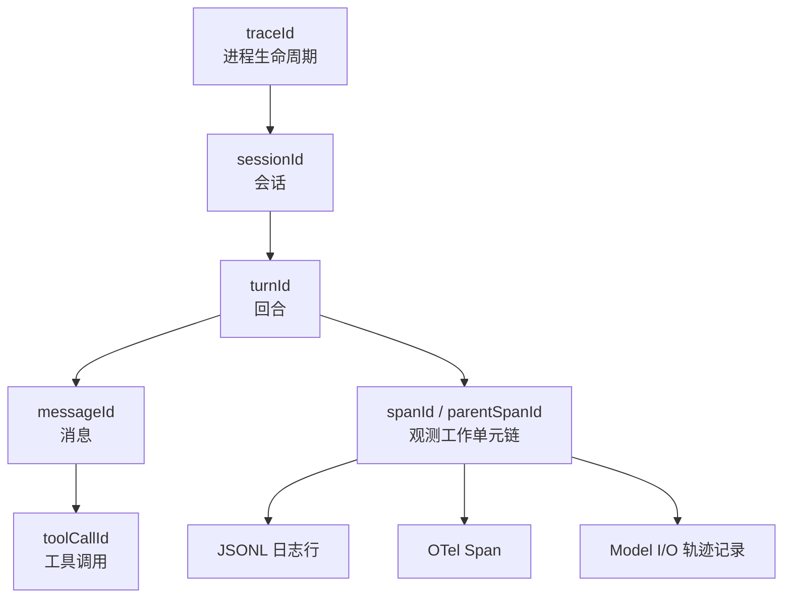

# 6.1 轨迹与可观测性

> 本章导览：Agent 是一个非确定性的多步分布式系统——同一句话两次运行走的路径可能完全不同。本章讲如何让它“可解释”：用一条 traceId 把日志、遥测 Span、模型 I/O 轨迹串起来，让“它刚才在干什么”永远有答案。

## 为什么 Agent 特别需要可观测性

传统程序出了问题，你复现一次、打断点、单步走，问题多半就现形了。Agent 不给你这个机会，原因有三个：

- **非确定性**。同样的输入，模型这次决定先 Grep 再 Read，下次可能直接 Edit。你没有“确定的执行路径”可供复现，只能看它*实际*走了哪条路。
- **多步串联**。一个回合里可能塞了十几次模型请求、几十个工具调用，还有压缩、子代理这类“回合内的回合”。错误往往在链条第三环埋下、第五环才爆炸。
- **远程依赖**。每一次模型步都是一次跨越公网的流式 HTTP 请求，超时、断流、限流是日常而非异常。

于是 Agent 开发中最频繁的问句不再是“这个函数为什么返回了错的值”，而是——**“它刚才在干什么？”** 用户看到 Agent 删了一个文件，或者卡在原地一分钟，第一反应都是这句。可观测性做得好不好，直接决定你排查一个问题是花五分钟还是花一个晚上。

传统后端的解法是分布式追踪（distributed tracing）：给每个请求发一个 traceId，让它跟着调用链走遍所有服务。ZCode 把这套思路完整搬进了 Agent，而且更进一步——它把“观测”拆成了三层，分别回答三个不同粒度的问题：

1. **结构化日志**：这一秒发生了什么事件？
2. **遥测 Span**：这一步耗时多久、失败在哪？
3. **Model I/O 轨迹**：模型到底看见和说出了什么？

第三层是 Agent 特有的。传统系统里“程序输入什么就处理什么”，而 Agent 的真正行为由“模型看见的上下文”决定——不记录模型 I/O，等于调试一个你看不到输入的函数。

## 结构化标识体系：traceId 贯穿链

一切从标识开始。ZCode 定义了一套层层嵌套的 ID 体系（`packages/contracts/src/tracing/tracer.ts`）：

```text
traceId        一次进程启动生成，贯穿整个生命周期
 ├── sessionId  一个 AgentRuntime 实例 = 一个会话
 │    └── turnId  会话内的一次回合
 │         ├── messageId  回合内的一条消息（用户输入 / assistant 响应）
 │         │    └── toolCallId  消息里的一次工具调用
 │         └── spanId  观测意义上的"工作单元"，可有 parentSpanId 构成父子
 └── queryId    某些协议查询的独立标识
```

对应的契约非常小巧：

```ts
// packages/contracts/src/tracing/tracer.ts（摘录）
export interface TraceContext {
  traceId: TraceId;
  queryId?: QueryId;
  spanId?: string;
  parentSpanId?: string;
  sessionId?: SessionId;
  turnId?: TurnId;
  attributes?: Record<string, string | number | boolean>;
}
```

关键问题是**传播**：代码里到处是异步调用，工具执行、事件分发、MCP 请求各自挂在不同的回调链上，靠传参把 traceId 带到每个角落不现实。ZCode 用 Node 的 `AsyncLocalStorage` 解决——`runWithContext(context, fn)` 把上下文绑进异步作用域，链路上任何位置调 `getCurrentTraceContext()` 都能取回当前上下文，不用改任何函数签名。

创建子上下文的规则也很简单：**traceId 永远继承，spanId 每层新生成**。这样所有层共享同一个“案件编号”，又能通过 span 链还原父子关系：

```ts
// packages/contracts/src/tracing/tracer.ts（摘录）
export function createChildTraceContext(parent: TraceContext, options = {}): TraceContext {
  return {
    traceId: parent.traceId,          // 不变：全链路一个案件编号
    spanId: generateSpanId(),          // 新工作单元
    parentSpanId: parent.spanId,       // 指回父级
    sessionId: options.sessionId ?? parent.sessionId,
    turnId: options.turnId ?? parent.turnId,
    // ...
  };
}
```

启动装配时（`bootstrap/src/app/create-app.ts`），根 TraceContext 和 sessionId 一起创建，并经 `traceContextToLogContext()` 展开注入 logger——所以每条日志天然带着完整标识。连 SQLite 里也有它一席之地：`session` 表有 `trace_id` 列（见 2.6 节的表结构）。

由此可以提炼一条值得抄进团队规范的设计军规：

> **无法关联到 traceId 的异步任务，视为不可观测行为，应避免引入。**

后台任务、定时器、子代理——任何“脱离当前调用链自己跑”的东西，创建时都必须先拿到（或派生）一个 TraceContext。做不到这一点的功能，出问题时你只能靠猜。



## 三层观测：日志、Span、Model I/O 轨迹

### 第一层：字段化 JSONL 日志

最基础的一层是按日滚动的 JSONL 文件（`packages/adapters/src/logging/index.ts`）。目录固定在 `~/.zcode/cli/log`，文件名形如 `zcode-2026-09-23.jsonl`，每行一个 JSON 对象：

```text
timestamp   事件时间
level       debug / info / warn / error
event       事件名，如 model.response.suspicious_empty
module      来源模块，如 core.runtime
message     人类可读摘要
traceId / sessionId / turnId / spanId / parentSpanId   标识体系
toolCallId / durationMs / status / context / error     领域字段
```

这一层有三个值得注意的设计决策。

第一，**每行都是自包含的结构化记录**，而不是“2026-09-23 10:12:33 INFO something happened”这种给人看的文本。日志的首要消费者是 `grep` 和 `jq`，不是人眼。

第二，**写日志失败静默吞掉**。源码里的注释原话是：“Logging must never break the agent execution path”（日志绝不能破坏 Agent 的执行路径）。磁盘满、目录权限异常，Agent 都必须照常工作。教学版为了省事常常先写日志再干活，生产系统必须反过来。

第三，**日志经过脱敏器（redactor）**。工具参数、环境上下文里可能夹带 API Key 或用户隐私，进日志前统一过一遍 `DefaultLogRedactor`，并按保留期清理旧文件。

### 第二层：OTel Span 与“惰性加载门”

日志回答“发生了什么”，Span 回答“每一步花了多久”。ZCode 选择 OpenTelemetry 作为 Span 层，但接入方式很克制（`packages/telemetry/`）：

```ts
// packages/telemetry/src/index.ts（语义摘录）
export async function prepareModelTelemetryEnv(env, options = {}) {
  if (!resolveOtlpTraceEndpoint(env) || isExplicitlyDisabled(env.ZCODE_MODEL_TELEMETRY_ENABLED)) {
    return env;                       // 未配置 OTLP endpoint → 零 SDK 加载
  }
  // 动态 import("./otlp-exporter.js")，此后才引入 OTel SDK
}
```

只有用户显式配置了 `OTEL_EXPORTER_OTLP_ENDPOINT`，OTLP exporter 才会被动态 `import` 进来。没配置？SDK 一个字节都不加载，进程照常启动。对绝大多数不开遥测的用户来说，这是一条硬性的性能承诺：**无遥测时零分支成本**。

core 侧的配套设计是 `RuntimeTelemetryFacade`：运行时只依赖一个 `SpanWriter` 端口，端口缺席时落到一整套 NOOP 实现——所有 `startTurn` / `startStep` / `startTool` 调用都进空操作。业务代码里没有一行 `if (telemetryEnabled)`。Span 属性统一放在 `zcode.execution.*` 命名空间下，避免和第三方属性冲突。

> **工程细节**：“可选拼装 + NOOP 兜底”是端口化架构（见 2.1 节）送来的红利——因为业务依赖的是端口而不是具体实现，观测实现可以整个缺席。反过来，如果代码里直接 `import OTel SDK`，“零成本关闭”就无从谈起。

### 第三层：Model I/O 轨迹（rollout）

第三层是 Agent 特有的：把每次模型请求和响应原样记录下来（`packages/adapters/src/model/runner-debug.ts`）。文件落在 `~/.zcode/cli/rollout/model-io-<session>.jsonl`，一个会话一个文件，逐请求追加。

三条关键规则：

- **增量记录**：连续请求之间，上下文前缀几乎不变。相对上一条请求只记录新增的消息，避免一个长会话把磁盘写爆。
- **reasoning 全量**：模型的思考过程完整落盘。源码注释里记着一次真实教训——早期只在非流式路径写 model-io，而桌面端默认走流式，导致轨迹里始终看不到思考过程，回放时“模型为什么这么做”成了悬案。
- **脱敏**：图片等附件的 data URL 会被替换为占位符（`sanitizeModelIODebugRecord`），文件同样有数量与大小上限，超出删最旧。

这份 rollout 文件就是 6.2 节评测与回放的原始素材——它记录的不是“系统日志”，而是**模型视角的完整世界**。

### 本地诊断台

三层产出最终汇到一个地方：`packages/debug`，一个 Hono + Vite/React 搭的只读本地查看器，能浏览 log 目录的 JSONL、直接查询 `db.sqlite`、在时间线上回放会话事件，还内置了一个 MITM 网络抓包代理（默认 `127.0.0.1:4184`），把 Agent 与模型供应商之间的明文流量也纳入观测。它不在生产链路上，是给开发者自己用的“行车记录仪回放台”。

## 教学实现：tinycode 的 observability.ts

真实系统的三层观测里，JSONL 日志 + traceId 传播是性价比最高、必须第一天就有的部分。给 tinycode 加一个 `src/observability.ts`（约 50 行）：

```ts
// tinycode/src/observability.ts
import { appendFile, mkdir } from "node:fs/promises";
import { homedir } from "node:os";
import { join } from "node:path";
import { randomUUID } from "node:crypto";

export interface TraceContext {
  traceId: string;
  sessionId: string;
  turnId?: string;
  spanId?: string;
  parentSpanId?: string;
}

export function createRootTrace(sessionId: string): TraceContext {
  return { traceId: randomUUID(), sessionId, spanId: randomUUID().slice(0, 8) };
}

// traceId 永远继承，spanId 每个工作单元新生成
export function childTrace(parent: TraceContext): TraceContext {
  return {
    ...parent,
    spanId: randomUUID().slice(0, 8),
    parentSpanId: parent.spanId,
  };
}

const LOG_DIR = join(homedir(), ".tinycode", "log");

type Level = "info" | "warn" | "error";

// 写失败静默吞掉：日志绝不能打断 Agent 主流程
export async function log(
  ctx: TraceContext,
  event: string,
  fields: Record<string, unknown> = {},
  level: Level = "info",
): Promise<void> {
  const line = JSON.stringify({
    timestamp: new Date().toISOString(),
    level, event,
    traceId: ctx.traceId,
    sessionId: ctx.sessionId,
    turnId: ctx.turnId,
    spanId: ctx.spanId,
    ...fields,
  });
  try {
    await mkdir(LOG_DIR, { recursive: true });
    const day = new Date().toISOString().slice(0, 10);
    await appendFile(join(LOG_DIR, `tinycode-${day}.jsonl`), line + "\n");
  } catch {
    /* 静默 */
  }
}
```

在 `src/loop.ts`（见 2.1 节）里接入只需要两处：回合开始时 `ctx.turnId = randomUUID()`，每个工具执行前 `const spanCtx = childTrace(ctx)`，结束后：

```ts
// tinycode/src/loop.ts（节选）
await log(spanCtx, "tool.completed", {
  toolCallId: call.id, toolName: call.name,
  durationMs: Date.now() - startedAt,
  status: result.isError ? "error" : "success",
});
```

排查问题的姿势从此定型：`grep <traceId> ~/.tinycode/log/*.jsonl`，一整次运行的时间线扑面而来。真实系统还处理了若干边界情况——按日滚动与保留期清理、日志脱敏、`AsyncLocalStorage` 全局传播——教学版暂且不表，但“结构先行”这条已经就位。

## 实战：排查一次工具失败

观察三层观测如何协作，最好的方式是完整走一遍排障。场景：用户反馈“Agent 说改好了配置，但程序还是跑不起来”。

**第一步：找到案件编号。** 用户记得大概是十点十分出的事。先按时间在会话库里定位 sessionId，或者直接翻日志：

```bash
grep -l "2026-09-23T10:1" ~/.zcode/cli/log/zcode-2026-09-23.jsonl
# 拿到 sessionId 后 grep 出这个会话的全部日志，锁定 traceId
grep "$SESSION_ID" ~/.zcode/cli/log/zcode-2026-09-23.jsonl | jq -r .traceId | sort -u
```

**第二步：按时间线读事件。** 用 traceId 过滤出全部日志行，`jq` 压缩成“时间 + 事件 + 关键字段”：

```bash
grep "$TRACE_ID" ~/.zcode/cli/log/zcode-2026-09-23.jsonl | jq -c \
  '{t:.timestamp, e:.event, tool:.toolCallId, ms:.durationMs, s:.status}'
```

时间线显示：`tool.started → tool.completed(status=error)`，失败的 `toolCallId` 指向一次 Edit，`durationMs` 只有 2ms——不是超时，是立即失败。

**第三步：回放模型视角。** 工具为什么失败？日志只说 Edit 报错，原因得看模型当时*想*干什么。打开 `~/.zcode/cli/rollout/model-io-<session>.jsonl`，找到包含该 `toolCallId` 的请求记录：模型发起的 Edit 参数里，`old_string` 用的是它三步之前*凭记忆*写的旧内容，而文件早被用户的格式化工具改过了——Edit 的“原文不匹配”失败完全正确。

**第四步：下结论。** 根因不是工具 bug，而是模型没有先 Read 就 Edit——这就从“排障”过渡到“改进”：要么在系统提示词里强化“编辑前必须读”（见 2.3 节），要么像真实系统那样用 `readFileState` 做编辑前校验（见 3.2 节），然后带着这个案例进入 6.2 节的回归测试集。

注意这条链路上**没有任何一步需要复现或打断点**。非确定性系统里，能回放的轨迹就是复现本身。

> **踩坑**：token 用量统计里有个跨供应商陷阱——AI SDK v6 的 Anthropic 适配器里，`inputTokens` 已经*包含* cache read/write token，把它和缓存字段再加一遍就双算了。ZCode 的口径是 `totalTokens ?? (inputTokens ?? cacheRead+cacheWrite) + outputTokens`。指标口径错误不会报错，只会让你的成本报表悄悄失真。

## 小结

Agent 的非确定性决定了“复现”让位于“回放”，可观测性因此是一等公民而非附属功能。ZCode 的方案分三层：一条 `traceId > sessionId > turnId > messageId/toolCallId/spanId` 的贯穿标识链，把字段化 JSONL 日志（写失败静默、内容脱敏）、惰性加载的 OTel Span（未配置时零 SDK 成本、NOOP 兜底）和 Model I/O rollout 轨迹（增量记录、reasoning 全量、data URL 脱敏）串成一条可回放的时间线。“无法关联 traceId 的异步任务视为不可观测行为”这条军规，让每一段行为都有案可查。观测解决了“它干了什么”，但下一个问题紧随而来：**它干得好不好？** 这需要一套评测体系——下一章见。