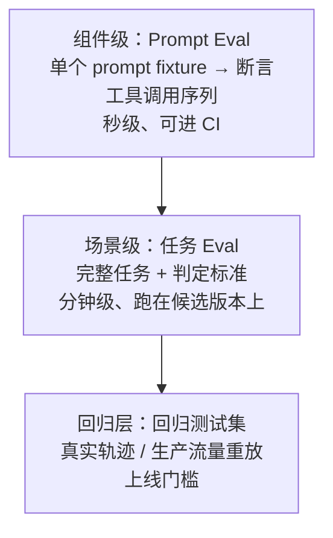
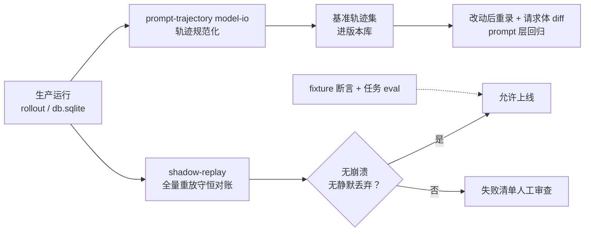

# 6.2 评测体系

> 本章导览：观测告诉你 Agent 干了什么，评测告诉你它干得好不好。本章讲评测的三个层次、ZCode 里真实存在的评测基建（以及它没有的东西），并给 tinycode 写一套最小可用的 eval 脚本。

## 评测的层次

改完一个系统提示词、升级一次模型版本、调整一处工具描述——你怎么知道 Agent 变好了还是变坏了？靠体感是不行的：Agent 的非确定性（见 6.1 节）意味着单次运行的结果毫无统计意义，而“我试了几次感觉还行”在几十个真实场景面前不值一提。评测体系的本质，是把“感觉”换成“有预算的、可重复的断言”。

换个视角看：上一章的所有观测产出——日志、Span、rollout 轨迹——都是给*人*看的解释材料；评测体系做的事，是把这些材料变成给*机器*看的验收标准。没有前者，后者无从断言；没有后者，前者只是档案。

断言的对象不同，成本与信号强度就不同。业界与本书共同的分法是三层：



- **组件级（prompt eval）**：把“给模型的输入 → 期望的行为”做成一个个 fixture，断言模型第一步或前几步的工具调用是否符合预期。它测的是*决策入口*，便宜、快、能进 CI，但覆盖不了长程行为。
- **场景级（任务 eval）**：给 Agent 一个完整任务（“修复这个失败的测试”），跑完后判定成功与否。信号最强，但慢、贵，且判定本身往往需要另一个模型——这就引出 LLM-as-judge。
- **回归层**：把历史真实流量喂给新版本，保证“以前能处理的，现在还能处理”。它是上线门槛，不是质量上限——它防退步，不证先进。

三层还隐含着一个评测哲学的分野：**评轨迹还是评结果**。prompt eval 评轨迹（工具调用序列长什么样），任务 eval 主要评结果（任务完成没有）。轨迹评测能精确定位“哪一步开始不对”，但会误伤合理的多解法；结果评测宽容多解法，但失败时不知道错在哪步。成熟的做法是双层并用：结果评测报告失败，轨迹评测辅助归因——6.1 节的 rollout 轨迹此时就是事故现场。

三层各司其职，缺一不可，下面逐层展开。

三层的分工恰好对应发现问题的三种时机：prompt eval 在提交前抓低级回归（分钟级反馈），任务 eval 在合并前评估能力变化（小时级），回归测试集在发布前守住底线。跳过任何一层，代价都会以更晚、更贵的方式出现：没有第一层，每次改提示词都心惊肉跳；没有第二层，你不知道模型升级到底带来了什么；没有第三层，你迟早把某个真实用户的日常流程弄坏而不自知。

## Prompt eval：断言决策入口

Prompt eval 的本质是把“我觉得它该这么做”变成“它必须这么做”。一个 fixture 就是三个字段：输入 prompt、可用的工具表、期望的工具调用序列。断言用**前缀匹配**而不是全等——模型多查一次文件不算错，但面对“找最大的 ts 文件”，第一步必须是 Grep 或 Glob 而不是直接 Write。

这种 eval 的价值在于**位置敏感**：它测的是请求组装出来的那一刻，模型看见的上下文是否还保持着“诱导正确行为”的形状。改动一个系统提示词的措辞、调整一个附件的注入位置、切换一次模型，都可能让原本稳定的决策翻转。而这些改动单看 diff 全都“无害”——只有跑过 fixture 才知道行为变了。

ZCode 为此专门造了一个工具：`tools/prompt-trajectory/`，它有四个子命令：

- **`record`**：从参考请求 fixture 出发，通过一个本地代理录制真实模型调用轨迹，产出 `trajectory.jsonl`（流式 delta 会被拼装成完整的 assistant 消息再落盘，保证每条记录自包含）；
- **`record-prompt`**：直接输入一句 prompt 录制，用于快速抽查；
- **`derive`**：从已录制的轨迹派生变体（投影成不同 provider 的请求体形状），扩充测试面；
- **`model-io`**：**把 6.1 节的 rollout 文件（`model-io-<session>.jsonl`）转成标准评测格式**（Anthropic 轨迹 JSON，外加 OpenAI / Anthropic 两种请求体快照）。

最后这个子命令是整个体系的黏合剂：它把“生产环境里真实发生过的请求”规范化成可比较、可重放的素材，默认只保留主回合（`querySource: "main_turn"`），剔除会话标题这类 sidecar 调用，并执行请求兼容性投影，保证生成物反映 provider 真正看到的线上形状。

有了基准轨迹，prompt 层面的回归测试就这么运作：把录制结果存进版本库，每次改动提示词组装逻辑后重录一遍，对比新旧请求体的 diff——多了一条消息？某个 `<system-reminder>` 挪了位置？工具表少了一个条目？都逃不过 diff。

> **注**：录制走的是代理模式——工具把模型配置里的 baseURL 运行时替换为本地代理 URL，请求原样转发一份、记录一份。模型侧无感知，所以录到的就是真实线上形状，而非专门为测试伪造的请求。

> **踩坑**：request body 快照别直接拿“我们内部的消息结构”当基准格式。ZCode 的做法是同时派生 OpenAI 与 Anthropic 两种 provider 请求体形状作为基准物——因为真正需要稳定的是 *provider 看到的线上形状*，内部结构怎么重构都不该惊动基准。基准格式选错层，每次内部重构都会制造一批假回归。

> **工程细节**：fixture 要挑*决策稳定*的案例做基准。模型明明每次都走对、但走法有两三种合理变体的任务，不适合做成严格断言——那样产出的失败是噪音，很快没人再信这套 eval。fixture 的另一大来源是 6.1 节实战里排查出的真实事故：每个修过的 bug 都值得沉淀成一个 fixture，这就是“回归测试集”在 prompt 层的形态。

## 任务级 eval：给 Agent 一份完整工作

任务级 eval 的骨架是三件套：**环境、任务、判定**。

- **环境**：一个隔离的临时目录，里面放好初始状态的代码库。必须快照化——每个任务从同一初始状态起跑，否则跑两次结果不同，你分不清是模型变了还是环境漂了。
- **任务**：一句自然语言任务书，和真实用户会说的话一样含糊（“这个测试为什么挂？修好它”）。含糊本身是评测的一部分：Agent 能否澄清歧义、能否自己圈定范围。
- **判定**：分两类。**可脚本判定的任务优先脚本**——测试全绿、文件确实被改、命令退出码为零，这些用 Bash 断言，零成本且完全确定；只有“解释质量”这类主观维度才交给 judge。

一个最小的任务 runner 长这样——先用模板初始化环境，再跑 Agent，最后用脚本判定：

```js
// tinycode/eval/run-task.mjs（节选）
import { cpSync, mkdtempSync } from "node:fs/promises";
import { tmpdir } from "node:os";
import { join } from "node:path";

// 1. 环境：从快照目录复制出一次性工作区
const workspace = mkdtempSync(join(tmpdir(), "eval-task-"));
cpSync(fx.snapshotDir, workspace, { recursive: true });

// 2. 任务：headless 跑完整个回合
const proc = spawnSync("node", ["dist/main.js", "-p", fx.prompt,
  "--cwd", workspace, "--output-format", "stream-json"]);

// 3. 判定：脚本断言优先（测试真的绿了吗）
const test = spawnSync("npm", ["test"], { cwd: workspace, encoding: "utf8" });
record({ name: fx.name, pass: test.status === 0,
  tokens: extractTotalTokens(proc.stdout) });
```

跑任务 eval 还有两条纪律。其一，**控制方差**：每个任务至少跑 3 次，报告通过率而非单次结果——一次通过率 100% 和三次通过率 100% 是两回事。其二，**记成本账**：同一个任务，候选版本比基线多花 3 倍 token 才换来同样的通过率，这个“改进”大概率不该上线。通过率和 token 开销要并排看，6.1 节的 usage 统计链路在这里直接复用。

> **踩坑**：任务 runner 最常见的翻车是环境残留——上一个任务留下的构建产物、`node_modules` 或 Git 状态泄进下一个任务，让“通过”变成运气。环境必须一次性：临时目录 + 快照复制 + 跑完即删，绝不复用。

> **工程细节**：ZCode 的两个 E2E 环境变量是任务 eval 思想的延伸——`ZCODE_E2E_FS_FAULTS` 存储层故障注入，等于给每个任务自动追加“磁盘坏了也能优雅降级”的隐藏用例。给自己项目的任务 eval 留一个故障注入开关，你会感谢它的。

## LLM-as-judge：正确姿势与陷阱

任务级 eval 绕不开一个问题：谁来判断“修复了失败的测试”算成功？可脚本判定的部分交给脚本，“回答是否到位”这类判定只能再请一个模型——LLM-as-judge。

5.4 节的 Goal 完成校验器（verifier）就是这套打法的生产级实现：主代理负责干活，一个独立调用的 verifier 模型负责判定“目标完成了吗”，输出结构化结论（passed / failed + nextAction），failed 且带 nextAction 时用 continuation prompt（包成 `<system-reminder>`）自动开新一轮。把它的经验提炼成四条规则：

1. **判定与执行分离**。不要让干活的模型自评“我做完了”——既当运动员又当裁判的循环必然收敛到“永远完成”。verifier 必须是独立调用、独立提示词。
2. **强制结构化输出**。自由文本判定没法被程序消费。给 verifier 一个 JSON 输出契约（结论枚举 + 理由 + 下一步建议），解析失败的记录进失败清单而不是当作通过。
3. **给评分细则（rubric），不要给“感觉”**。“这段解释好吗”不如“是否满足：a) 引用了真实存在的文件路径；b) 没有虚构函数名；c) 覆盖了用户问的每一个点”。细则越具体，判定越可复现。
4. **压低判定温度，控制次数**。judge 自己也是非确定性来源：判定温度压到最低，关键 fixture 至少评 2–3 次取多数。

还有一条成本直觉值得建立：judge 不需要是好模型。判定“测试是否全绿”级别的 rubric，一个便宜、快、支持 JSON 输出的小模型足够胜任；把旗舰模型浪费在 judge 上，是用十倍成本买不到的边际信号。反过来的原则也成立：**judge 的失败模式要人工抽检**——每月随机抽几十条 judge 判定人工复核一次错误率，错误率超标就回头打磨 rubric，而不是换更大的模型。

陷阱同样有名字。最隐蔽的一个是“礼貌性放水”——被评内容与判定请求出现在同一段连续文本里时，模型倾向于顺着已写出的内容说好；对策是把“待评内容”与“评分标准”放进结构化字段而非连续文本，并定期拿已知坏答案试探 judge 的错误率。其次是**判定的自我偏好**：用同一家模型当 judge，它会偏爱同类文风；严格场景应换不同系的模型交叉评。最后是 5.4 节埋过伏笔的 fail-open/fail-closed 选择：verifier 输出坏 JSON 时选择 **fail-open**（“避免已经交付的 goal 被格式错误卡住”），verifier 自身失败且无 nextAction 时不自动续跑（防止把内部错误变成无限迭代）。为什么同样面对“失败”，有的选 fail-open 有的选 fail-closed？6.4 节有一张汇总表给你答案。

## 回归测试集：用生产流量做评测

现在到了必须诚实的地方：**ZCode 仓库里没有 SWE-bench、Terminal-bench 那样的公开 benchmark harness。** 但它有一套更贴地的评测基建，核心思路一句话：**用生产流量做回归测试。**

### 影子重放对账

`scripts/shadow-replay.mjs`（影子重放）做这件事：把本机真实 CLI 数据库（默认 `~/.zcode/cli/db/db.sqlite`）里的**全部历史会话**，喂给新版本的冷恢复管线（transcript 合成 → 产品投影），然后输出一份**守恒对账报告**。脚本头注释写明了它的地位：

> 每阶段上线门槛 = 全量重放无崩溃、无静默丢弃、失败清单审查完毕。

“守恒”是物理学的比喻，用在这里极其精确——数据进得来，就必须出得去，一个都不能少：

- **assistant 守恒**：每条可见的 assistant 文本，必须在新管线的输出行里出现（多重集覆盖，一条不多问，一条不能少）；
- **用户输入守恒**：可见 user 输入的行数，不得少于真实 user 文本消息数的下限估计；
- **goal 校验守恒**：session entry 的生命周期键数与投影产出的 marker 行数对得上；
- **可寻址性守恒**：不能只证明“文本还在”，还要证明“还能按 id 找到”——重放不能把会话变成一堆无主孤魂。

最后一条尤其值得展开。“文本还在”只验证了数据的完整性，“可寻址”才验证了系统的可用性——用户 resume 一个会话时，靠的是 id 索引而不是全文搜索。一个把所有内容都倒进输出、却丢了 id 映射的新版本，能通过前三条守恒，会在第四条现形。对账报告设计到这个精度，说明作者真正想过“什么算丢数据”。

任何一项不守恒，都意味着新版本代码会静默丢数据。这套做法的聪明之处有三点。**零标注成本**：不需要人工出题，几万个真实会话就是题库，而且是最贴近用户真实用法分布的题库。**测的恰是最脆的东西**：存储格式迁移（见 2.6 节的版本化迁移）与恢复管线是重构最易坏、单测最难覆盖的部分。**纪律可复制**：它不依赖任何评测框架，一个脚本、一份对账报告、一条“失败清单必须人工审查完”的规矩。

> **工程细节**：影子重放对源库严格只读——先把 db 连同 `-wal`/`-shm` 复制到临时目录再打开。因为打开时可能触发 schema 迁移，绝不能让评测脚本把迁移落在用户正在用的真实库上。评测基建的第一原则：**测量的手不能污染被测物**。

### E2E 支撑与专项基准

影子重放之外，还有几块支撑设施，共同点是都长在 CLI 的输出协议与环境变量上：

- **E2E 环境变量**：`ZCODE_E2E_COVERAGE=1` 让端到端测试收集 V8 覆盖率，回答“我们的 E2E 到底盖住了多少代码”；`ZCODE_E2E_FS_FAULTS` 向存储层注入故障——专门演练“磁盘出问题时 Agent 的行为”，是 6.3 节失败恢复的直接测试手段。
- **stream-json 输出**：`--output-format stream-json` 让 CLI 逐事件输出 NDJSON。这是给外部 harness 的钩子——任何评测框架都能启动一个 ZCode 子进程、逐行读事件、在结束时断言：调用了哪些工具、最终文本是否匹配、token 花了多少、回合以什么方式结束。**Agent 的可评测性是被输出协议定义的**：没有事件流输出，外部评测无从下手；有了它，评测框架甚至不需要理解 Agent 内部。
- **`--memory-bench`**：跑一批 prompt 并等待记忆提取全部完成，作为记忆系统的基准入口（见 2.3 节的记忆写入路径）——专门给“记忆提取延迟对回合结束时间的影响”这类专项问题提供数据。

这些设施各就各位之后，一套现实的迭代节奏自然浮现：**日常改提示词/工具描述 → 跑 prompt eval（分钟级，本地）；合并前 → 跑任务 eval 的核心子集（对比基线版本）；每周或每次发布前 → 跑影子重放全量对账**。评测不是一次性的“评测日”活动，而是嵌在开发回路里的三道不同频率的门。频率越高的一道，单个用例必须越便宜——这就是三层结构存在的根本理由。
这套组合没有一个数字叫“ZCode 的 benchmark 得分”，但它回答了更实际的问题：这次改动会不会弄坏真实用户的工作？公开 benchmark 测的是模型的通用能力天花板，生产流量重放测的是*你这个产品*的回归底线——对工程团队而言，后者才是每天要用的东西。

把三层评测与素材来源放在一起看，整条数据流是闭环的——生产的产出反过来成为评测的输入：



## 教学实现：tinycode 的最小 eval 脚本

把本章的方法落到 tinycode，只需要三样东西：一个 fixture 目录、一个跑批脚本、一张结果表。不需要任何框架。

**fixtures**：每个 fixture 是一个 JSON 文件，声明输入与期望的工具调用前缀：

```json
// tinycode/eval/fixtures/fix-find-largest-file.json
{
  "name": "找最大的 ts 文件并统计行数",
  "prompt": "src 目录下哪个 ts 文件最大？给出它的行数。",
  "expectTools": ["glob", "read"]
}
```

**跑批脚本**：以 headless 模式启动 tinycode（复用 2.6 节的会话持久化），从落地的事件流里抽出工具调用序列，与期望做前缀匹配：

```js
// tinycode/eval/run-eval.mjs（节选）
import { spawnSync } from "node:child_process";
import { readdirSync, readFileSync } from "node:fs";

const fixtures = readdirSync("eval/fixtures").map((f) =>
  JSON.parse(readFileSync(`eval/fixtures/${f}`, "utf8")));

const results = [];
for (const fx of fixtures) {
  const proc = spawnSync("node", ["dist/main.js", "-p", fx.prompt,
    "--output-format", "stream-json"], { encoding: "utf8" });
  const events = proc.stdout.split("\n").filter(Boolean)
    .map((l) => JSON.parse(l));
  const actual = events
    .filter((e) => e.event === "tool.started")
    .map((e) => e.toolName);
  const pass = fx.expectTools.every((t, i) => actual[i] === t);
  results.push({ name: fx.name, pass,
    actual: actual.slice(0, fx.expectTools.length).join(" → ") });
}

console.table(results);
console.log(`通过率 ${results.filter((r) => r.pass).length}/${results.length}`);
```

**judge 脚本**：对主观维度的 fixture，把 tinycode 的最终回答和 rubric 发给一个便宜模型，强制 JSON 结论——注意待评内容与标准是分开的字段，呼应前文“防放水”的对策：

```js
// tinycode/eval/judge.mjs（节选）
const reply = await fetch(`${BASE_URL}/chat/completions`, {
  method: "POST",
  headers: { "content-type": "application/json", authorization: `Bearer ${KEY}` },
  body: JSON.stringify({
    model: JUDGE_MODEL, temperature: 0,
    response_format: { type: "json_object" },
    messages: [{
      role: "user",
      content: JSON.stringify({ rubric: fx.rubric, answer: finalText,
        instructions: "逐条对照 rubric，只输出 JSON：{pass, reasons[]}" }),
    }],
  }),
});
const verdict = JSON.parse((await reply.json()).choices[0].message.content);
```

**加进 CI 的门槛**：prompt eval 必须快，才配得上“每次提交都跑”。控制手段有二：fixture 数量从个位数起步、按需生长；命中真实 API 的用例改用录制回放——第一次真实调用并录制响应，之后一律回放。这正是 `record` / `derive` 思路的又一个用途：录制一次，断言无数次。

这套几十行的东西与 ZCode 的基建在结构上同构：fixture 对应 prompt-trajectory 的参考请求，stream-json 对应事件流输出协议，`console.table` 的通过率对应守恒对账报告。**评测的核心从来不是框架，而是三件事：有可断言的输出、有可重放的素材、有不容忍静默回归的纪律。**

最后提醒一句：评测资产本身也要版本化。fixture、基准轨迹、rubric 都进版本库，改动走 review——它们就是这套 Agent 的“测试用例集”，随代码一起演进，也随代码一起腐化，需要和代码同样的维护纪律。

## 小结

评测分三层：组件级 prompt eval 用 fixture 断言决策入口（前缀匹配、防噪音 fixture），场景级任务 eval 靠“环境 + 任务 + 判定”三件套与带结构化输出契约的 LLM-as-judge（判定与执行分离、rubric 具体化、警惕 judge 放水），回归层用生产流量守门（评结果定位失败、评轨迹辅助归因）。ZCode 的答案很务实：仓库里没有公开 benchmark，但 `prompt-trajectory` 四个子命令把 rollout 轨迹转成可重放的评测素材，`shadow-replay` 用“全量重放无崩溃、无静默丢弃”当上线门槛，stream-json 输出协议让任何外部 harness 都能驱动与断言。观测（6.1）与评测解决了“看清并衡量 Agent”，下一章处理最后一环：当它失败时——断流、超窗、截断、死循环——系统如何不塌。