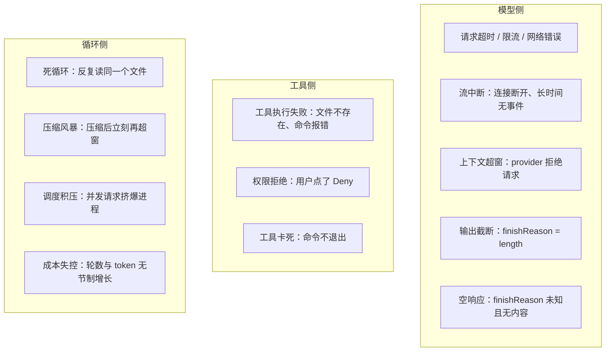
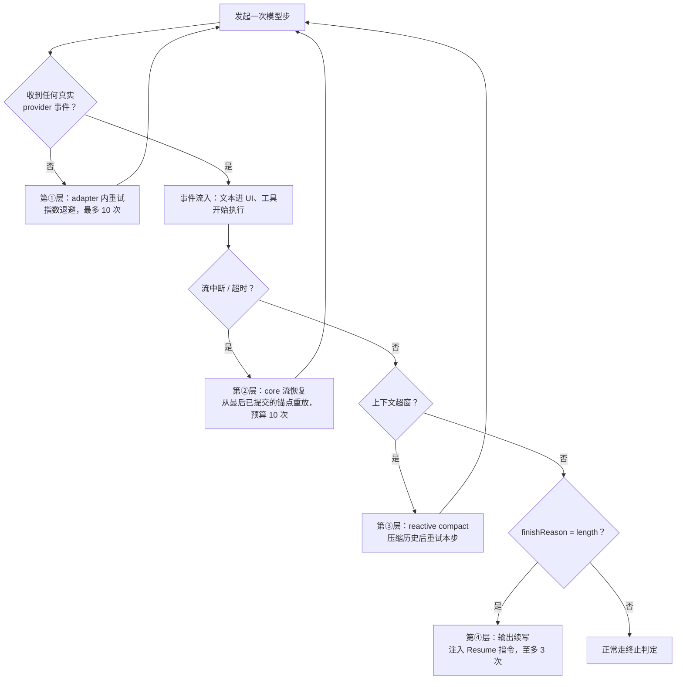

# 6.3 失败模式与鲁棒性

> 本章导览：Agent 的每一次模型步都可能超时、断流、超窗、截断；每一个工具都可能失败；循环本身还可能卡死。本章把失败域画成一张全景图，讲透 ZCode 的四层失败恢复如何分层接管，以及“错误信息是写给模型看的”这条设计哲学。

## 失败域全景图

前五章里我们已经在不同章节撞见过大大小小的失败：1.3 节给模型调用加过最朴素的重试，2.1 节的循环靠终止条件退出，2.4 节的压缩本身也可能失败。现在把它们收拢成一张完整的失败域地图——一个回合从生到死，可能在这里面的任何一格翻车：



好消息是：这张图上每一格，ZCode 都有对应的治理手段，而且这些手段不是散装的补丁，而是一条**按失败位置分层接管**的恢复链。先把地图和药方对上号：

- 模型侧的超时、限流、断流 → 四层失败恢复（下一节）；
- 上下文超窗 → 第③层 reactive compact + 2.4 节的主动压缩兜在前面；
- 输出截断 → 第④层续写；
- 空响应 → 可疑空检测，显式抛错；
- 工具失败与权限拒绝 → 不是故障，是回灌给模型的业务输入（本章第四节）；
- 死循环、压缩风暴、调度积压、成本失控 → 幂等去重、断路器与预算（本章第三节）。

理解这条链的分层逻辑，比记住任何一个常量都重要。

## 四层失败恢复：各管一段的重试链

Agent 与模型之间的交互可以按“输出有没有到达用户眼前”分成两个世界：**第一个真实流事件到达之前**，什么都没发生，怎么重试都安全；**第一个事件到达之后**，文本已经流进了 UI、工具调用可能已经执行，任何“从头再来”都会造成重复。四层恢复正是沿着这条边界展开的：

为什么不是一个大 `try/catch` 包住一切？因为不同失败需要不同的恢复动作，而恢复动作的正确性取决于*恢复者知道多少状态*。一个知道“哪些工具已提交、历史长什么样”的恢复者才能安全重放；不知道的，重试就是赌博。四层结构就是把状态知识匹配到恢复责任的映射表。



**第①层：adapter 内重试**（`adapters/src/model/retry-policy.ts`）。请求发出去了但什么都没回来——超时、429 限流、网络错误。这一层的重试策略是标准的指数退避：默认最多重试 10 次（`maxAttempts = 11`，即 1 次首发 + 10 次重试），基准间隔 2 秒、因子 2、封顶 60 秒、附加抖动，环境变量可覆盖。限流类错误还要尊重服务端给出的 `Retry-After`——供应商明确告诉你“X 秒后再来”，执意按自己的节奏撞墙没有意义。配套的还有一个流 idle 超时：基线 600 秒，每重试一次加 30 秒，防止“连接挂着但一个事件都不来”的假死。

**第②层：core 流恢复**（`core/src/runtime/methods/streaming-recovery.ts`）。第一个事件已经到达、adapter 的重试边界已经关闭，这时流断了怎么办？答案不是重发请求，而是**从锚点重放**：把“最后已提交的工具结果”作为安全锚点（每个工具结果回灌时都会发一个 `StreamRecoveryAnchor`），重开的请求从锚点之后继续——已执行的工具连同其结果一起随请求重发，模型据此接着算，而不是从头再算。预算同样是 10 次（`STREAM_RECOVERY_MAX_RETRIES = 10`）。源码注释解释了为什么不能只恢复一次：“只恢复 1 次会让连续短暂抖动直接失败，和模型默认 10 次 retry 的用户预期差距过大。”

**第③层：reactive compact**。provider 直接拒绝请求：“上下文超了”。此时唯一出路是压缩：对历史做一次压缩（2.4 节的 autoCompact），腾出空间后重试本步。它与 2.4 节讲的*主动性*压缩是一套机制的两个入口：主动压缩看的是 token 估算（PreRequest 阶段，请求发出前就该做），reactive 压缩看的是 provider 的实锤拒绝（MidTurn 阶段）——估算再准也会有失手的时候，被拒绝后的补救必须存在。这一层有个精妙的次序陷阱，稍后详述。

**第④层：输出 token 续写**（`turn-output-token-continuation.ts`）。请求成功、响应完整，但 `finishReason = length`——模型话说到一半被输出上限掐断。处理方式是注入一条续写指令：

```text
Output token limit hit. Resume directly — no apology, no recap of what
you were doing. Pick up mid-thought if that is where the cut happened.
Break remaining work into smaller pieces.
```

指令的措辞本身就是经验：“不要道歉、不要复述之前干了什么、从断点直接接着说”——否则模型会把一大半续写预算花在“抱歉，我刚才说到……”上。续写至多 3 次（`MAX_OUTPUT_TOKEN_CONTINUATIONS = 3`），耗尽则抛出明确的错误信息。还有一个前置条件：已有工具调用时不续写（`toolCallCount > 0` 直接不进入该分支）——带工具调用的截断走工具协议自然衔接，不需要人为续写。

> **注**：四层是**按序**生效的，不是并行选项。一次请求可能先在第①层烧掉几次重试、断流后进第②层、恢复成功后又因超窗进第③层——每一层的预算独立计算。分层的代价是状态管理复杂（每层各有计数器），收益是每一层的失败都有明确的责任人与明确的下一步。

### 重试边界的深意

四层之间那条“首个真实事件之后，adapter 永不重试”的边界，是本章最值得带走的设计。为什么不能让 adapter 在任何时候都放心重试？因为**重放的成本不对称**：

- 事件到达前重放，代价为零——没人看见过任何东西。
- 事件到达后重放，代价是**一致性**：文本会在 UI 上出现两遍；已经执行过的工具会再执行一遍；消息历史里会多出一份重复的 assistant 消息。这些重复不是视觉问题，是协议问题——下一次请求的历史里若有两份相同内容，模型的世界观就被污染了。

所以真实系统把它做成了硬边界：`runner-stream.ts` 里 attempt 循环注释写明“首个真实 provider 事件之后永不 adapter 级重试”，越界后的恢复一律交给 core 从锚点重放——因为只有 core 知道哪些工具已提交、锚点在哪、历史该如何拼接。**失败域分层各管一段的本质是：每一层只在自己拥有完整状态的地方重试。** adapter 只知道“请求发没发出去”，不知道工具执行了没有；core 知道一切，所以它负责一切有副作用的恢复。

> **踩坑**：这条边界曾以事故的形式存在过——在流式输出开始后做整请求重试，用户看到回答说两遍、文件被改两次。修法不是给重试加开关，而是把“重试”按副作用一分为二：无副作用的归 adapter，有副作用的归 runtime 锚点重放。

> **工程细节**：第②层的恢复点不只是“最后一个工具结果”。ZCode 的锚点带着 `previous-message-anchor` 这类标记，恢复请求会连同已接受的工具调用及其结果一起重发，模型等于拿着“现场快照”继续算——而不是被要求凭记忆续写。锚点设计的关键是**只在安全点设置**：工具结果提交、消息落盘这些原子操作完成之后才发锚点，绝不锚在半途。

## 卡死、重复与熔断：循环的自我保护

重试链解决“单步失败”，但 Agent 还有另一类失败：**每一步都“成功”，整体却在原地打转**。这类失败没有异常可捕获——循环在照章办事，账单在稳定增长，直到用户忍无可忍。治理它靠的是对“异常模式”的识别与熔断。

### 死循环与重复调用

最经典的症状是反复 Read 同一个文件：模型忘了自己读过，读，忘，再读。ZCode 的治理分协议层和提示层。协议层靠**幂等去重**：流事件里出现的重复 `tool_call` 按 id 去重（`toolCallIds.has(toolCall.id)` 直接跳过），同一工具调用不会被执行两次；重复读未变化的文件则返回一个 stub 结果——“Wasted call — file unchanged since your last Read”，不再重复灌入内容，既省 token 又给模型一个明确信号。提示层靠 2.3 节的 system-reminder 机制把 todo、计划状态定期注回上下文，对抗模型的“遗忘”。

主循环的轮数上限同样值得注意：**ZCode 的主循环没有固定轮数上限**——`while (true)` 由终止条件、用户 abort 和下面这些熔断器共同守卫。固定上限看似安全，实则会杀死长任务；真正的护栏是“发现异常模式就停”，而不是“数到 50 就掐”。

### 幻觉工具调用

另一类“重复”更隐蔽：模型调用了**不存在的工具**，或者给真实工具编造参数——工具表里明明没有 `read_file`，它调了；`Edit` 的 `old_string` 是它想象出来的原文。这不是 bug，是语言模型的本质：它在*预测*一个像工具调用的序列，而预测可能脱离事实。

协议层的防线是**入口校验**。模型吐出的每一个 tool call 都先经过归一化与校验：工具名必须在当前工具表里，参数必须通过该工具声明过的 schema（2.1 节的工具接口）。校验不过不执行、不崩溃——生成一个 `isError: true` 的工具结果回灌：“unknown tool” 或 schema 校验错误的具体字段说明。模型看到报错，绝大多数情况下下一轮就会自我纠正。这个设计和 3.2 节的“错误写给模型”一脉相承：幻觉是模型侧的失败，因此它的反馈也应该是模型能消化的。

> **注**：还有一个反向幻觉值得知道——模型*漏调*工具，直接在文本里假装“我已经修改好了文件”。这类失败没有协议信号，只能靠结果侧的验证兜底：3.2 节的 Read-file-state 校验（编辑前必须真实读过）和 5.4 节的独立 verifier 都属于此类。**凡是重要的“已完成”，都要有一个不依赖模型自述的验证点。**

### 调度积压

第三种隐性失败是流量型的：并行工具调用、子代理、辅助模型调用同时挤向模型端点，进程级并发没有闸门的话，一次复杂任务就能把自己限流到瘫痪。ZCode 在请求入口放了进程级并发准入（`request-admission.ts`）：`tryAcquire` 快路径（有空位直接进）、`acquire` 排队（满员等待）、`release` 幂等归还。积压的请求在闸门口排队而不是涌向供应商——把“被 429 拒绝后重试”变成“根本不发出去”，重试链的压力也小了一截。

### rapid-refill 断路器：防压缩风暴

压缩与长任务相遇时，有一种恶性循环：上下文逼近窗口 → 触发压缩 → 模型继续生成，很快又逼近窗口 → 再次压缩……每一轮压缩都是一次昂贵的辅助模型调用，还不断摧毁上下文连贯性。ZCode 的熔断器（`turn-loop-state.ts`）规则很具体：**压缩发生后的 3 个工具轮以内，若连续 3 次再次触发 refill（重新填满），直接终止回合**并抛出 `CompactRapidRefillError`。“3 轮内 3 次”这个模式说明问题不是“任务真的需要更多空间”，而是“这个任务在当前窗口尺寸下根本做不动”——继续自动压缩只是烧钱，应当停下来交还给人。

### 成本的硬顶

成本失控的治理思路是把预算**铺在每一个可能膨胀的维度上**，而不是只在最后设一个总闸：

- 单步输出：默认 `maxOutputTokens = 32,000`（模型未声明时），且实际取 `min(模型上限, 窗口 − 估算输入 − 1000)`；
- 续写次数：3 次（见上）；断流恢复：10 次；adapter 重试：10 次——**每一次自动行为都有显式预算**；
- 辅助调用（压缩摘要、会话标题、记忆提取、goal 校验）：统一压到最低推理档 + 最多 5,000 输出 token（`auxiliary-model-options.ts`）——“看不见的调用”最容易烧钱，所以先给它们降价；
- token 用量在每个 `ModelComplete` 事件上记账，回合结束时求和上报——没有计量就没有治理，这正是 6.1 节可观测性的直接回报。

把本章出现的预算常量收进一张表，方便读者对照——它们全部来自真实源码：

| 预算项 | 值 | 位置（相对 `packages/`） |
|---|---|---|
| adapter 模型请求重试 | 10 次（maxAttempts=11） | `adapters/src/model/retry-policy.ts` |
| 重试退避 | base 2s，×2，封顶 60s，jitter | 同上 |
| 流 idle 超时 | 600s 基线，每重试 +30s | `contracts/src/config/index.ts` |
| core 断流恢复 | `STREAM_RECOVERY_MAX_RETRIES = 10` | `core/src/runtime/methods/streaming-recovery.ts` |
| 输出续写 | `MAX_OUTPUT_TOKEN_CONTINUATIONS = 3` | `core/src/runtime/methods/turn-output-token-continuation.ts` |
| 默认请求 maxOutputTokens | 32,000（模型未声明时） | `core/src/runtime/helpers/model-token-limits.ts` |
| 辅助模型预算 | 5,000 token + 最低推理档 | `core/src/model/auxiliary-model-options.ts` |
| rapid-refill 断路器 | 3 轮 / 连续 3 次 | `core/src/runtime/methods/turn-loop-state.ts` |

## 失败的语义：写给模型的错误与用户的取消

### 业务失败 vs 系统失败

工具调用失败时，有一个决定成败的区分：**这是模型的输入，还是系统的崩溃？**

文件不存在、命令退出码非零、参数格式不对——这些是**业务失败**，正常的工作内容。它们应该被打包成 `isError: true` 的工具结果**回灌给模型**（2.1 节讲过的回灌机制），让模型看到错误、换个方式重试。错误信息是写给模型看的：`Edit` 失败时附上最接近的真实路径（“Did you mean X?”），重复读未变文件时明说“Wasted call”——3.2 节讲过的设计哲学，在失败语义这里达到顶点。

而 handler 之外的异常——运行时 bug、存储层崩溃——是**系统失败**，它们不该被伪装成工具结果继续喂给模型，而要作为异常向上传播，让回合进入错误终态。ZCode 用 `ToolHandlerFailure` 类型把前者从普通异常里显式分离出来。混用两者的系统会出现两种怪象：模型把系统崩溃当成自己的失误反复道歉重试；或者反过来，业务错误直接炸掉整个进程。判据一句话：**模型有办法纠正的，是它的输入；它无能为力的，才是你的故障。**

权限拒绝走的是同一条语义通道：用户点 Deny 后，模型收到的不是异常，而是一段明确的结果文本——“The user doesn't want to proceed... STOP what you are doing and wait for the user to tell you how to proceed”，用户附了意见就原样带上。拒绝是工作流的一部分，不是崩溃（5.3 节详述过这条链路）。

与之配套的是**空结果可疑检测**：`finishReason` 未知、响应为空、usage 为零——“成功返回了什么都没有”比显式失败更危险，静默吞掉会让上层以为一切正常。ZCode 的处理是记一条 `model.response.suspicious_empty` 告警日志，然后抛 `ModelError`，交给上层按重试链处理——宁可显式失败，不可静默成功。这里还有个次序陷阱：provider 超窗时可能返回“空内容 + zero usage”，必须**先**识别超窗、**再**判空，否则超窗会被误报成 suspicious empty，第③层的 reactive compact 就永远没有出场机会。错误分类的顺序错误，会让正确的恢复机制形同虚设。

> **工程细节**：“磁盘坏了怎么办”不需要等生产事故来验证。2.6 节提到过的 `ZCODE_E2E_FS_FAULTS` 环境变量能在端到端测试中向存储层注入故障，让“会话落盘失败时回合如何收场”成为常规测试用例。失败恢复代码最大的敌人是“从没真正跑过”——它保护的路径平时不会走到，没有注入式测试，那些 try/catch 大概率是第一次执行就在生产上执行的。

### 用户取消也是一等终态

失败恢复的清单上还有一项常被遗忘：**用户按了停止键，然后呢？**

粗糙的实现把取消当异常：直接抛出，已生成的半截文本丢掉，会话历史停在语义不完整的中间态。ZCode 把 `cancelled` 作为与 `success` 平级的一等终态来处理：流式生成中收到 abort，**已生成的部分输出被持久化**（断流恢复的锚点机制顺便保证了这部分内容与已执行工具的一致性），回合以 `TurnComplete(cancelled)` 事件正常收尾，会话历史完整可恢复；未执行的工具调用逐个生成 `ToolCancelled` 结果而不是抛异常。用户下一次回来，可以接着这个会话继续说——取消的不是“这次会话”，只是“这次回合”。一个把取消处理好的 Agent，才敢让用户放心地随时插手。

取消与恢复机制的分工在这里看得最清楚：abort 信号在循环的每个安全检查点被消费（`throwIfTurnAborted`），保证取消*及时*；锚点与持久化保证取消*干净*。二者缺一，用户面对的就是“按了没反应”或“按了之后会话坏了”。

## 教学实现：给 tinycode 的循环补上重试

tinycode 的失败恢复不必四层俱全，但**边界思想必须保留**。第一版加一个按错误类型分诊的包装（对应 1.3 节 `src/model.ts` 的扩展）：

```ts
// tinycode/src/model.ts（扩展）
export async function withRetry<T>(fn: () => Promise<T>): Promise<T> {
  const MAX_ATTEMPTS = 4;
  for (let attempt = 1; ; attempt++) {
    try {
      return await fn();
    } catch (err) {
      if (attempt >= MAX_ATTEMPTS) throw err;
      // 超时/限流可重试；参数与协议错误重试无意义
      if (!isTransientError(err)) throw err;
      const delay = Math.min(2000 * 2 ** (attempt - 1), 60_000);
      await new Promise((r) => setTimeout(r, delay));
    }
  }
}
```

第二版在 `src/loop.ts` 的模型步外套上分诊逻辑——同样的错误，按“到没到过输出”走不同的门：

```ts
// tinycode/src/loop.ts（节选）
let streamedAnything = false;
try {
  for await (const event of stream) {
    if (event.type === "text_delta" && !streamedAnything) {
      streamedAnything = true;   // 第一个真实事件：此后不得整请求重试
    }
    handle(event);
  }
} catch (err) {
  if (!streamedAnything) {
    text = await withRetry(() => requestModel(messages));  // 无副作用，可重试
  } else if (isContextExceeded(err)) {
    messages = await compactAndRebuild(messages);          // 压缩后重试本步
    text = await requestModel(messages);
  } else {
    throw err;   // 有输出后的其他失败：不静默重试，交还上层
  }
}
```

> **注**：`isTransientError` 靠错误类别判断——超时、连接错误、限流（429）归为瞬态；参数校验失败、鉴权失败（401/403）重试多少次结果都一样，直接抛出。把“可重试”建立在错误语义而不是“任何异常都试三遍”上，是重试策略不变成 bug 放大器的前提。

这段教学代码砍掉了真实系统的锚点重放（tinycode 没有“工具已部分执行”的复杂状态），但保住了三个骨架：**错误分诊（transient vs 永久 vs 超窗）、退避上限、以及那条重试边界**。生产系统在此之上叠加了第②④层与全部预算常量，机理读者已经见过。

把本章浓缩成一句话：**失败不可怕，静默的失败才可怕；重试不可怕，重复的重试才可怕。** 所有工程手段——分层、预算、断路器、显式终态——都是在把“看不见的失败”变成“看得见的终态”，把“无界的重试”变成“有预算的恢复”。

## 小结

失败治理的钥匙是分层：adapter 内重试只管“无可见输出”的失败（10 次指数退避、尊重 Retry-After），core 流恢复管“有输出后”的断流（从最后已提交的工具结果锚点重放，预算 10 次），reactive compact 管 provider 超窗（压缩后重试本步），输出续写管 `finishReason = length`（“Resume directly”指令，至多 3 次）。每一层只在自己拥有完整状态的地方重试——这条重试边界是全章的核心。循环侧靠幂等去重、Read stub、rapid-refill 断路器（3 轮内 3 次 refill 即终止）和处处铺预算来防卡死与成本失控；失败语义上，业务失败是写给模型的输入、系统异常才是崩溃，可疑空结果必须显式失败，用户取消则是一等终态。至此 Agent 已经“抗造”，但还有一个维度没有系统讨论：当失败的不是机制、而是 Agent 被**诱导**做了不该做的事时，防线在哪里？下一章讲安全与对齐。