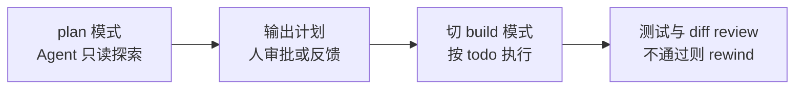

# 7.1 协作范式：人在回路与 Agent 驱动开发

> 本章导览：人与 Agent 如何分工——从"每个动作都要确认"到"只看关键节点"，四种权限模式背后是一条自主度光谱；本节讨论如何在保持责任清晰的前提下，把越来越多的执行交给 Agent。

前六章回答的是"Agent 怎么造"。从本章起换一个视角：**Agent 时代，程序员怎么工作**。这个问题并不玄虚——你在 5.3 节见过的四种权限模式，本质上不是安全配置，而是协作模式的可选项：你愿意把多少决定权交给模型，它就用多快的速度替你干活。

## 人在回路（Human-in-the-loop）

"人在回路"指关键决策保留给人类、其余执行交给自动系统的协作方式。对 Coding Agent 而言，回路里的"人"出现在三类节点上：

1. **目标节点**：任务是什么、做成什么样算完成。这是人不可让渡的部分——Goal 机制（5.4 节）中的 objective 必须由用户给出，Agent 只负责朝它跑。
2. **风险节点**：不可逆或影响面大的操作。权限系统（5.3 节）把这类操作拦下来弹窗：删除文件、执行未知命令、访问网络，默认都要问一句。
3. **验收节点**：结果对不对。Plan 模式（5.2 节）让人在动工前审批方案，评测体系（6.2 节）让人用数据验收质量。

值得体会的是 ZCode 对这三类节点的工程处理方式：它们都不靠"用户盯着屏幕"来实现，而是被做成了**协议**——权限弹窗是一次 broker 请求与应答（5.3 节），计划审批是一次带反馈的 deny（"反馈式拒绝"），完成性校验是一个独立 verifier。人在回路不必人在场，但每个回路节点都有明确的接口。这正是本书反复出现的思想：**把协作中的模糊期望变成显式契约**。

自主度也不是非黑即白的开关。回顾四种权限模式（5.3 节）：

| 模式 | 人在回路的密度 | 适合场景 |
| --- | --- | --- |
| `build` | 每个有副作用的操作都确认 | 生疏的代码库、生产环境 |
| `edit` | 文件编辑自动通过，其余确认 | 信任度提高后的日常开发 |
| `plan` | 只读探索自由，执行前整体审批 | 大改动前对齐方案 |
| `yolo` | 几乎全程自主 | 沙箱环境、可整体回滚的任务 |

一个成熟的用法是**随任务流动切换模式**：用 `plan` 模式对齐方案，批准后切 `build` 模式执行，收尾时人工 review diff。模式切换本身就是一种沟通——你用配置告诉 Agent 你的信任边界在哪。

## Agent 驱动开发

如果说人在回路解决"怎么安全地把活交给 Agent"，那么 Agent 驱动开发（Agent-Driven Development）解决的是"怎么让 Agent 成为开发流程的主干而非点缀"。它的实践形态可以概括为三句话：**描述目标而非步骤，审查结果而非过程，用规约约束而非逐句指挥**。

**描述目标而非步骤。** 传统编程把"做什么"翻译成"怎么做"；Agent 时代的第一技能是把"怎么做"从你的表达中拿掉，只留下清晰的目标与约束。5.4 节的 verifier 提示词给了一个范本：完成性由"prompt 到产物的对照清单"判定，而不是由"Agent 自称做完了"判定。你给 Agent 的任务描述也应该如此——写清楚验收标准，而不是手把手的过程指令。

**审查结果而非过程。** diff review 是 Agent 时代最重要的代码实践。Agent 可能用两百步工具调用完成一个改动，逐行跟读过程既不可能也无必要；你需要建立的是对**结果**的系统性审查：diff 是否最小、测试是否真实覆盖、有无越界改动。真实系统的 checkpoint 机制（3.5 节的文件回滚点）和 rewind/fork（2.6 节）为此提供了工程底座——审查不通过就回滚重来，而不是在错误方向上修补。

**用规约约束而非逐句指挥。** 把团队的规范写进 AGENTS.md（2.3 节），Agent 每次会话都会读到并遵守。这份文件就是你在 Agent 时代的"代码风格指南"：提交规范、目录约定、禁用操作、测试要求。ZCode 自己的仓库就是范例——它的 AGENTS.md 规定了"改动前先更新 spec""单文件不超过 400 行""所有外部 I/O 收敛到 adapter 层"这些约束，任何一个 Agent 进入这个仓库都会自动继承这套工程纪律。**给 Agent 写规约，就是在给未来的协作写代码。**

## 责任与把关

自主度提升后，一个古老的问题重新变得尖锐：出了错算谁的？

工程上的答案很清晰：**责任不可委托**。Agent 是工具，提交代码的人为结果负责——这和"编译器生成了坏代码不能怪编译器"是同一条伦理。但工具设计可以帮人负起责任：权限系统保证高风险动作至少经过一次显式确认；`build` 模式的弹窗记录让"你批过什么"可追溯；plan 文件把"你同意了什么方案"落在磁盘上。这些机制合起来构成一条**同意链**——事后可以还原每一步关键决策是谁在哪个节点做出的。

对个人开发者的提醒是把关的**颗粒度**要对：不要逐行审查 Agent 的探索过程（那是浪费人在回路的价值），但也不要只在最后扫一眼 diff（那时错误已经层层叠加）。正确的把关点正是本章开头的三类节点：开工前审方案（plan）、风险操作逐个确认（权限）、完成后审结果与测试（review + eval）。ZCode 的 Todo reminder（5.1 节）与 todo 面板之所以存在，就是为了让这个把关过程有连续的可见性。

最后是团队层面：当多个成员都和同一个 Agent 协作时，AGENTS.md 与权限规则就成了团队共识的载体。谁改了规则、为什么改，应当像代码评审一样被对待——因为那就是代码，只不过是写给 Agent 的。

## 典型工作流

把前几节收拢成三个可上手的日常模式：

**模式一：探索—规划—执行—验收（大改动）**

对应本书的机制：plan 模式（5.2）→ ExitPlanMode 审批 → TodoWrite 拆解（5.1）→ 执行 → checkpoint/rewind（2.6）兜底。

**模式二：自主长跑（定义清晰的中型任务）**

设定 Goal（5.4）+ 预算上限，`build` 或 `edit` 模式放手让 Agent 跑，verifier 判定完成性，人只处理 escalation。适合"把这个模块的测试补齐到覆盖率 80%"这类验收标准明确、路径不太敏感的任务。

**模式三：例行自动化（重复性工作）**

把重复任务写成自定义命令或 Skill（4.2），需要定时触发的用自动化任务（5.5），需要并行铺开的用 SubAgent（2.5）或动态工作流（5.7）。人的角色从执行者退到"规则维护者"。

三种模式共享同一个底层判断：**把人从回路中移除之前，先确认回路里的每个节点都有显式契约**。做不到这一点时，宁可用 `build` 模式多弹几个窗。
