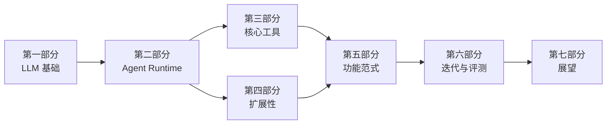

# 本书约定

> 本章导览：说明全书使用的技术栈、术语、排版约定、贯穿项目的代码布局，以及建议的阅读路径。

## 技术栈与版本

本书有两条代码线：

- **真实系统**：ZCode 的 Agent CLI（仓库内 `apps/zcode-cli/`），一个生产级 TypeScript Coding Agent。书中讲到每个机制时，都会给出它在真实系统中的实现位置与关键代码摘录。书中源码路径如 `packages/core/src/tool/registry.ts` 均相对 `apps/zcode-cli/` 目录。
- **教学版 `tinycode`**：全书从零构建的教学项目，放在仓库 `code/` 目录下随章节演进。它只用 Node.js 内置模块和原生 `fetch`，不依赖任何 Agent 框架，目标是让每一行代码都能被读者理解。

| 项 | 教学版 tinycode | 真实系统 ZCode CLI |
| --- | --- | --- |
| 语言 / 运行时 | TypeScript + Node.js ≥ 20 | TypeScript + Node.js 24 |
| 调用模型 | 原生 `fetch` 调 OpenAI 兼容 API | Vercel AI SDK + 三种协议适配器 |
| 存储 | JSON 文件 | SQLite |
| MCP | 手写最小客户端 | `@modelcontextprotocol/sdk` |
| 界面 | 终端简单问答循环 | 完整 TUI / 桌面 / Web 多端 |

教学版刻意选择"最少的依赖"，因为 Agent 开发的核心难点不在语法和框架，而在**机制设计**：循环怎么终止、上下文怎么管理、权限怎么收口。语法不是本书的主角——所有代码示例都以"读懂功能"为第一目标，TypeScript 的类型细节一律从简。

## 术语约定

全书统一使用下列术语（详见附录术语表）：

- **回合（Turn）**：用户的一次输入触发的完整处理过程，可能包含多次模型请求与工具执行。
- **模型步（Model Step）**：回合内的一次"请求模型 → 解析响应"。
- **工具调用（Tool Call）**：模型决定调用某个工具的一次请求，包含工具名与参数。
- **Agent Loop**：请求模型 → 执行工具 → 结果回灌 → 再请求模型 的循环。
- **上下文窗口（Context Window）**：模型单次请求能容纳的最大 token 数。
- **压缩（Compact）**：把旧对话历史摘要化以腾出上下文空间。
- **SubAgent（子代理）**：由主 Agent 通过工具派生的、拥有独立上下文的完整 Agent 实例。
- **权限模式**：`build`（默认，写操作要审批）、`edit`（自动接受文件编辑）、`plan`（只读规划）、`yolo`（跳过审批）。
- **Human-in-the-loop**：人在回路——关键决策由人类审批的协作方式。

## 排版与图标约定

- 行内代码用反引号：`toolCallId`、`packages/core/src/agent/`。
- 代码块标注语言：```ts、```bash、```json、```mermaid。
- 提示框统一用引用块加粗前缀：

> **注**：补充说明或容易混淆的点。

> **工程细节**：真实系统中的加固做法，教学版可以省略，但值得知道为什么存在。

> **踩坑**：开发者真实踩过的坑，通常对应源码里一条注释。

- Mermaid 图表用于架构与流程；时序用 `sequenceDiagram`，状态机用 `stateDiagram-v2`，其余用 `flowchart`。
- 文件路径斜杠统一为 `/`（Windows 读者请自行换算）。

## 贯穿项目 tinycode 的代码布局

tinycode 是一个单包 TypeScript 项目，随章节逐层生长。全书结束时它长这个样子：

| 目录 / 文件 | 引入章节 | 职责 |
| --- | --- | --- |
| `src/model.ts` | 1.1–1.3 | 调用 OpenAI 兼容 API、流式解析、重试 |
| `src/types.ts` | 1.2 | 消息、内容块、工具调用类型 |
| `src/tools/` | 2.1、3.x | 工具接口与内置工具（read/write/edit/bash…） |
| `src/loop.ts` | 2.1 | Agent Loop：调度、并发、终止 |
| `src/mcp.ts` | 2.2 | 最小 MCP 客户端与工具桥接 |
| `src/context.ts` | 2.3 | 系统提示词分节构建、AGENTS.md 注入 |
| `src/memory.ts` | 2.3 | MEMORY.md 索引 + 记忆文件读写 |
| `src/compact.ts` | 2.4 | 压缩阈值与摘要请求 |
| `src/subagent.ts` | 2.5 | 子代理 profile 与派生运行 |
| `src/session.ts` | 2.6 | 会话持久化与恢复 |
| `src/permission.ts` | 5.3 | 权限规则与询问流程 |
| `src/features/` | 5.x | todo / plan / goal / 定时任务 / 后台任务 |
| `src/observability.ts` | 6.1 | 结构化日志与轨迹 |

每个章节的代码清单都是完整文件、可直接誊抄运行；`code/` 目录提供贯穿项目核心阶段（第 1 部分、2.1 循环、3.x 核心工具）的可运行快照，后续阶段清单见对应章节正文。

## 如何阅读本书

全书按依赖关系组织为七个部分：



- **只想理解原理**：按顺序读第一、二部分即可建立完整心智模型。
- **想动手构建**：跟着 tinycode 的布局表逐章写代码；第三部分的工具实现可以按需挑读。
- **已有 Agent 开发经验**：直接跳第五、六部分，看功能范式与工程化做法。
- **想扩展 ZCode 或阅读其源码**：每章的"源码对照"内容与 `packages/` 路径就是你的地图。

## 关于代码示例的一个约定

本书代码示例优先表达**机制**而非工程完备性：省略错误处理的细节分支、省略边界情况的兜底，用注释标注省略处。真实系统的对应加固会放在"工程细节"提示框里。请勿把教学代码直接用于生产——但它足以让你理解生产代码的每一处设计。
